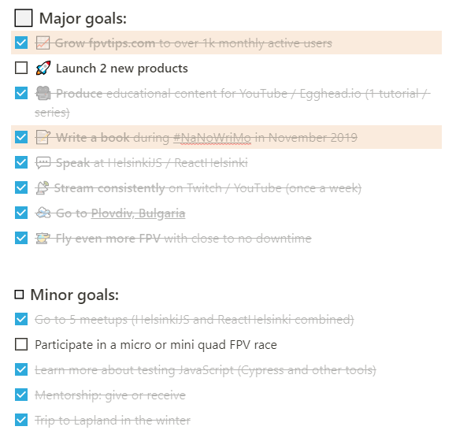

I really love these [yearly][1] [reflection][2] posts and I am really looking forward to writing them every year. Not because I want to pat myself on the back or brag over stuff, but really because **they show me in a very clear way what had happened and what had changed in the semi-long run**.
These posts uncover a lot of small details invisible to the naked eye on a daily basis, and it is very important to acknowledge what had gone well and what progress you have made in a specific area. This leads to reduced stress and anxiety levels, less feeling of failure and allows you to take a deep breath and chart out the roadmap for the next year.

I encourage you to try this out for yourself and see if it helps you realise how much you have achieved and what to focus on next. This post is structured such that topics are grouped, while still maintaining rough chronological order of how events transpired throughout the year.

Let’s do this!

> I feel very fortunate and grateful to have a good job I love, interesting hobbies and side business that seems to be doing well. But the single most important thing is my family - my wife and son. They mean everything to me and are the sole inspiring of everything I do. This blog post is dedicated to you Sofi and Anton.

## 🔭 Quick overview

When I think of 2019, these immediatelly come to mind as the main topics:

- **🛫 The trip to my hometown - Plovdiv, Bulgaria** - for the first time in 5 years and for the first time ever with my son 💙
- **📈 Growth of the blog, collaboration opportunities** - it has been amazing to have had the chance to produce so much high quality content and to help people out with their FPV racing and freestyle drone questions.
- **📝 Writing a book** - wrote 13 chapters, **14 000 words**, kept refining the story, killed ideas, brought in new ideas, but ultimately stuck to the main setting and plot.
- **🎥 Starting 2 YouTube channels** - over **334** raw flight test videos of test flights of different drones and equipment on my footage dump channel and **80** subscribers and **20** high quality videos on my main FPVTIPS channel
- **💻 Career growth** - I gave [two talks][3] at tech meet ups, delivered a bunch of workshops at my now previous job, and oh yeah, changed jobs. I also created 2 open source libraries, a lot of closed source stuff, shipped a bunch of projects and learnt many new things.

I also read more books this year, learned a lot about video editing and production, audio quality, had an amazing summer family vacation in Finland and grabbed an opportunity when one presented itself.

But how does that overview hold up against the goals I set for myself last year?

## 🚢 Taking ownership and making stuff happen.

So in the beginning of the year, because winter in Finland is long and brutal, it’s a great opportunity to do indoors stuff and focus on one’s coding career 😉. I was streaming live coding on Twitch while working on some personal hobby projects, and decided I’d give my first talk at a local JavaScript meet up. I ended up giving two talks. Worked hard on my slides for nearly 2 months (in my free time) and thanks to the topics being closely related to the work we were doing, got a lot of support and great feedback from my manager which really helped me nail this! Thanks, Marine.

My single advice to everyone this year is on pro-activity. You have the power to shape your career in many different ways. It might take some time, but with consistency and effort you can do it. In my case, I’m talking about my career as a software engineer and in particular the example of my work at F-Secure as a web developer.

I started at the company as a summer trainee and went through a few steps and contract extensions to end up spending a total time of 4 years and 3 months of my life there. I loved it for the better part! This year, on September 13th was my last at F-Secure.

I could easily (and probably will) write an entire separate blog post on lessons learned from my job at F-Secure, so instead, I’ll focus here mostly on the straight to the point conclusions. During my time at F-Secure I was fortunate enough to have had the support of my direct managers, which helped me to drive initiatives close to my heart that were business impacting. I’ve been involved in a number of projects I’m very happy to have been a part of, which gave me the opportunity to learn more, improve my skills and ship products.

My last “Hail Mary” at the job was the migration of our campaign web pages to a modern Gatsby + Netlify stack, the development of 2 React open source libraries of shared componets and icons, and shipping a few Progressive Web Apps. All within less than half a year.

## 👩‍🎓 Never stop learning

I have been approached by many recruiters over the past few years. Some I had decent conversations with, some not so much. Some that knew what they were talking about and some that didn't. Mostly and main I've been discarding offers and actively saying I wasn't looking for a new job at the time.

But eventually a time comes to move on to new challenges, learning something new and experiencing something different. And one decent recruiter who I've been talking to for a while about different companies, eventually called me and told me of this one particular drone company called [Sharper Shape][4]. Even at a glance there seemed to be a lot of intersecting interests and areas between them and me and where I wanted to go in the future, so after a few interview rounds it happened - I finally decided I'd move on, and they ended up hiring me.

And as a software engineering professional with a drone related hobby, **I feel very fortunate to work with and learn much more about data, AI, drones, images, metadata, processing, development, maps, sensors, lidar, trajectories, design and architecture of services, apps and utilities**.

And while my specialty is in front end development, I have to admit I enjoy doing some back end development and even working with a well designed dev ops setup. I'm dedicated, giving it my all and really trying to utilise all learning opportunities while developing something useful and meaningful. Very excited for the times ahead!

And no, it's not always easy and I have no intention of painting a fake picture - changing jobs can and will be hard, you will be staring at new code bases for hours, slowly trying to make sense of things, you could even go through many crappy interviews with different companies, but in the end, it's always worth it, and **if you are stuck in a rut, I advise you to take the plunge and move on**, it will be hard but once you get past it, you will thank yourself. Either that, or if it really sucks, you will have learnt something and can bail on it fast and still move on.

TODO: Continue from here

## 📖 My book writing adventure

So I’ve been [preparing for my book][5] writing adventure during this year’s [NaNoWriMo][] and I … failed. Let me elaborate. The goal is simple - write 50 000 words during the month of November. And I failed because I didn’t write 50 000 words. I wrote 4 000 and stopped. Now I can go on to explain that I got sick, on top of doing extra hours at a new job (which is a cognitive demand on another level in and of itself), but the fact is that had I wanted to, I could have pushed and done it.

**I made a conscious decision to stop.** Not because I was lazy, not because I couldn’t have done, but because I believe that it’s ok to drop things when you decide it’s good for you in the long term, and to prioritize other things over.

**You can’t plan everything in life and this year for me was a perfect example why.** And that’s ok. In fact, that makes things a bit more fun too. I love planning and having a rough idea of where I wanna go, but how I get there and what I go through, I want that to be partially a surprise, an adventure.

**Stay mentally sane and don’t push yourselves over the limit. It’s ok to drop things and re-prioritize as you go along.**

If you’re wondering what’s next for my book writing project, I’m happy to say I haven’t shelved it or dropped it completely. I will continue working on it, write weekly a small target, but consistently. I love how the stories and characters are really taking shape in my head now that I’ve kept thinking about the main plot, setting and characters for roughly a year. I’m

[Where it went well and where it’s ok to drop things]

Software engineering and web development
TODO:
This year has been truly interesting. From giving talks and implementing Gatsby and Netlify at scale during my time at F-Secure, to producing a [component library][], an [icon library][] and more…. I did a lot of React and I loved it. I also did a lot of architecting, which was nice.
Then about new job

Health is important and has to be one of my next focus areas
....

[0]: Linkslist
[1]: /learning/goal-review-of-2018-and-goals-for-2019/
[2]: /learning/recap-of-2017-and-goals-for-2018/
[3]: /learning/jamstack-with-gatsby-and-netlify/
[4]: https://sharpershape.com/
[5]: /learning/writing-a-book/
