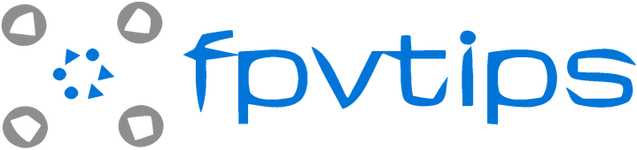
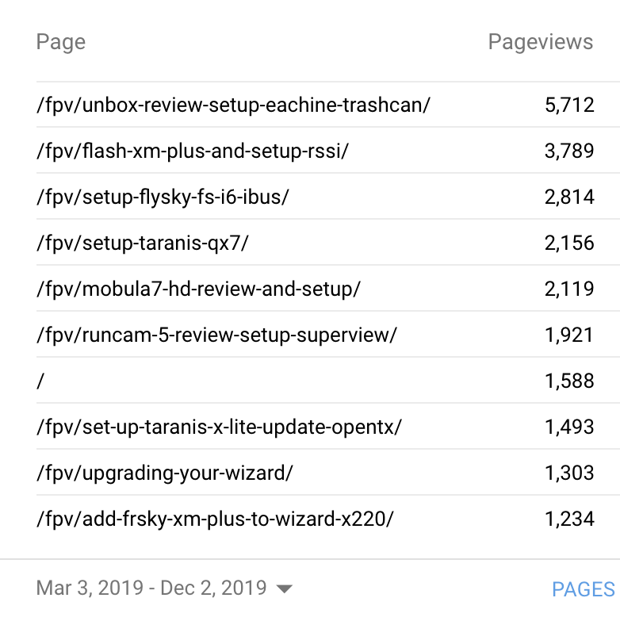
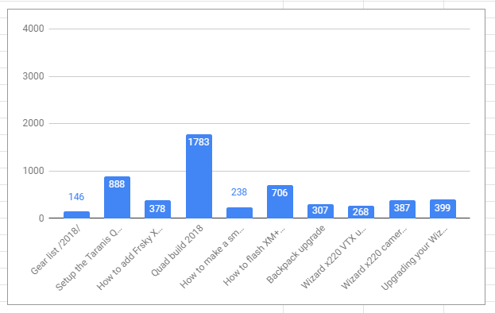
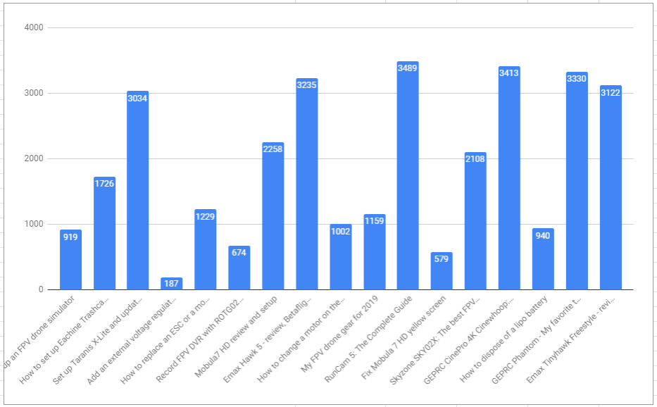
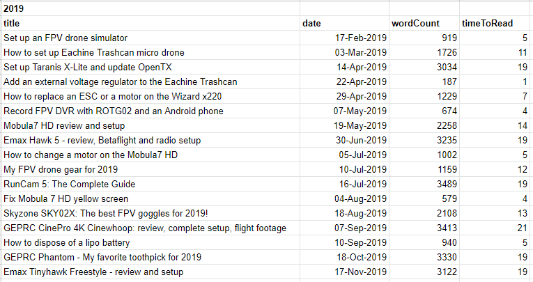
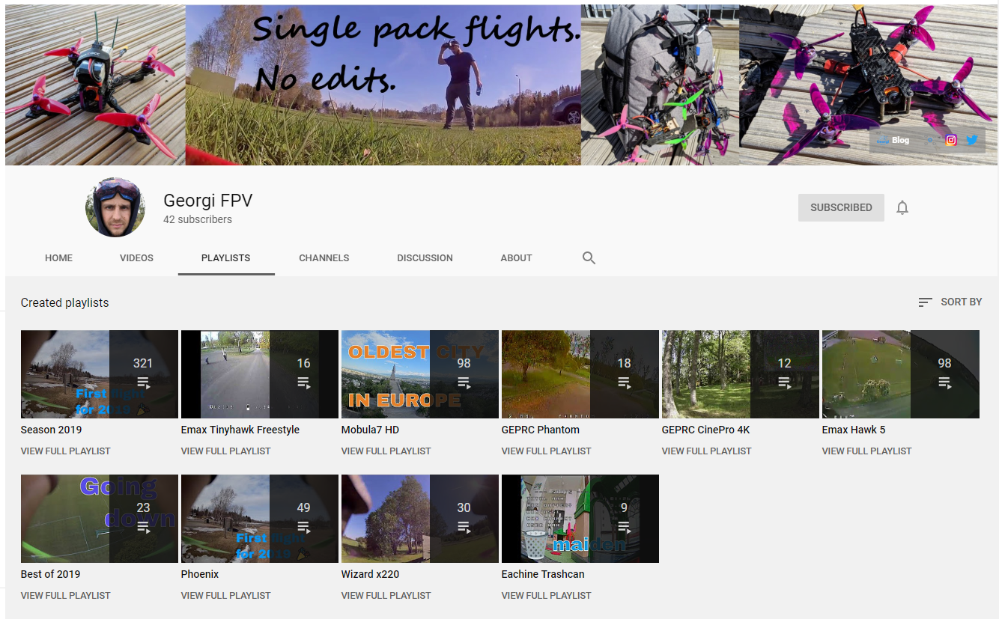
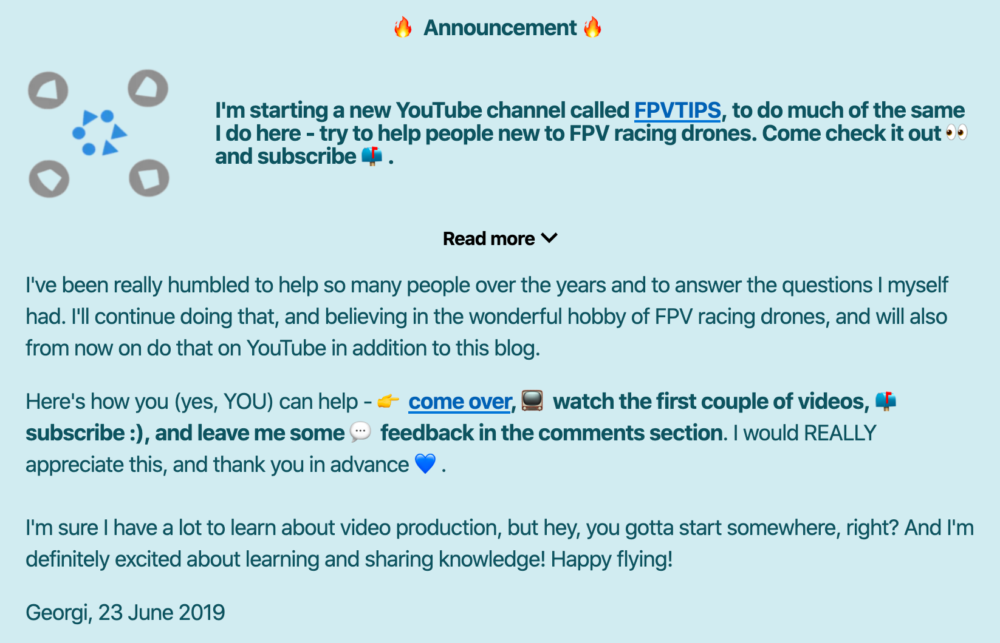
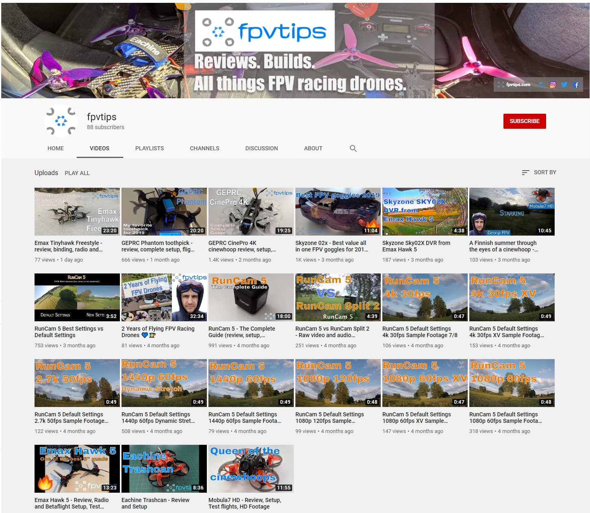
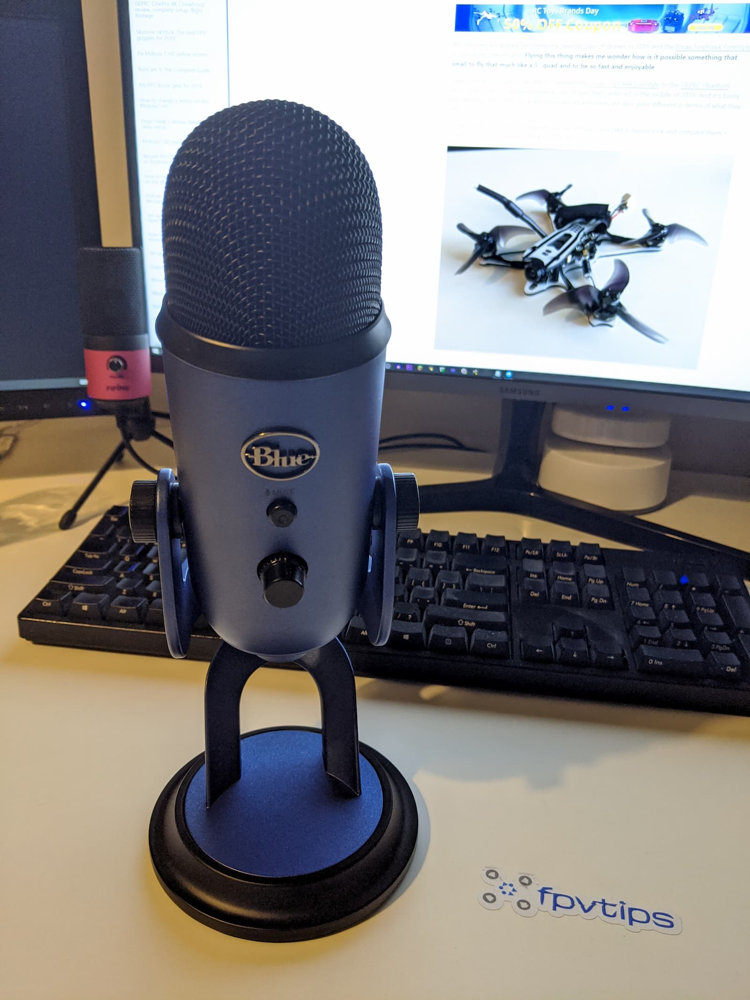

I really love these [yearly][1] [reflection][2] posts and I am really looking forward to writing them every year. Not because I want to pat myself on the back or brag over stuff, but really because **they show me in a very clear way what had happened and what had changed in the semi-long run**.
These posts uncover a lot of small details invisible to the naked eye on a daily basis, and it is very important to acknowledge what had gone well and what progress you have made in a specific area. This leads to reduced stress and anxiety levels, less feeling of failure and allows you to take a deep breath and chart out the roadmap for the next year.

**I encourage you to try this out for yourself and see if it helps you realise how much you have achieved and what to focus on next**. This post is structured such that topics are grouped, while still maintaining rough chronological order of how events transpired throughout the year.

Let’s do this!

> _I feel very fortunate and grateful to have a good job I love, interesting hobbies and side business that seems to be doing well. But the single most important thing is my family - my wife and son. They mean everything to me and are the sole inspiration for everything I do. This blog post is dedicated to you - Sofi and Anton._

## 🔭 Quick overview

When I think of 2019, these immediatelly come to mind as the main topics:

- **🛫 The trip to my hometown - Plovdiv, Bulgaria** - for the first time in 5 years and for the first time ever with my son 💙
- **📈 Growth of the blog, collaboration opportunities** - it has been amazing to have had the chance to produce so much high quality content and to help people out with their FPV racing and freestyle drone questions.
- **📝 Writing a book** - wrote 13 chapters, **14 000 words**, kept refining the story, killed ideas, brought in new ideas, but ultimately stuck to the main setting and plot.
- **🎥 Starting 2 YouTube channels** - over **334** raw flight test videos of test flights of different drones and equipment on my footage dump channel and **80** subscribers and **20** high quality videos on my main FPVTIPS channel
- **💻 Career growth** - I gave [two talks][3] at tech meet ups, delivered a bunch of workshops at my now previous job, and oh yeah, changed jobs. I also created 2 open source libraries, a lot of closed source stuff, shipped a bunch of projects and learnt many new things.

I also read more books this year, learned a lot about video editing and production, audio quality, had an amazing summer family vacation in Finland and grabbed an opportunity when one presented itself.

But how does that overview hold up against the goals I set for myself last year?

## 🚢 Shipping products, teaching and moving on

So in the beginning of the year, because winter in Finland is long and brutal, it’s a great opportunity to do indoors stuff and focus on one’s coding career 😉. I was streaming live coding on Twitch while working on some personal hobby projects, and decided I’d give my first talk at a local JavaScript meet up. **I ended up giving [two talks][3]**. Worked hard on my slides for nearly 2 months (in my free time) and thanks to the topics being closely related to the work we were doing, got a lot of support and great feedback from my manager at the time - Marine, and she really helped me to nail this! Thanks, Marine, I really appreciated the help!

My single advice to everyone this year is on pro-activity. You have the power to shape your career in many different ways. It might take some time, but with consistency and effort you can do it. In my case, I’m talking about my career as a software engineer and in particular the example of my work at F-Secure as a web developer.

I started at the company as a summer trainee and went through a few steps and contract extensions to end up spending a total time of 4 years and 3 months of my life there. I loved it, learnt a lot and thaught a lot! This year, on September 13th was my last at F-Secure.

I could easily (and probably will) write an entire separate blog post on lessons learned from my job at F-Secure, so instead, I’ll focus here mostly on the straight to the point conclusions. During my time at F-Secure I was fortunate enough to have had the support of my direct managers (some more so than others), which helped me to drive initiatives close to my heart that were business impacting. I’ve been involved in a number of projects I’m very happy to have been a part of, which gave me the opportunity to learn more, improve my skills and ship products.

My last “Hail Mary” at the job was the migration of our campaign web pages to a modern Gatsby + Netlify stack, the development of 2 React open source libraries of [shared componets][17] and [icons][18], and shipping [a][15] [few][16] Progressive Web App (PWA) projects. All within less than half a year.

## 👩‍🎓 Never stop learning and the next chapter

I have been approached by many recruiters over the past few years. Some I had decent conversations with, some not so much. Some that knew what they were talking about and some that didn't. Mostly and mainly I've been discarding offers and actively saying I wasn't looking for a new job at the time.

But eventually a time comes to move on to new challenges, learning something new and experiencing something different. And one decent recruiter who I've been talking to for a while about different companies, eventually called me and told me of this one particular drone company called [Sharper Shape][4]. Even at a glance there seemed to be a lot of intersecting interests and areas between them and me, and where I wanted to go in the future, so after a few interview rounds it happened - I finally decided I'd move on, and they ended up hiring me.

And as a software engineering professional with a drone related hobby, **I feel very fortunate to work with and learn much more about data, AI, drones, images, metadata, processing, development, maps, sensors, lidar, trajectories, design and architecture of services, apps and utilities**.

And while my specialty is in front end development (for now), I have to admit I enjoy doing some back end development and even working with a well designed dev ops setup. I'm dedicated, giving it my all and really trying to utilise all learning opportunities while developing something useful and meaningful. Very excited for the times ahead!

And no, it's not always easy and I have no intention of painting a fake picture - changing jobs can and will be hard, you will be staring at new code bases for hours, slowly trying to make sense of things, you could even go through many crappy interviews with different companies, but in the end, it's always worth it, and **if you are stuck in a rut, I advise you to take the plunge and move on**, it will be hard but once you get past it, you will thank yourself.

Finally, I'm happy to share I ticked off my goal of going to at least 5 tech meet ups this year, and not only did I do, but I also spoke at 2 of those. Those are always fun, insightful and inspirational.

## 🛌 Downtime and focus shift is important too

Whether we're talking about getting good amounts of high quality sleep or spending time away from work, both are equally important for you to succeed in your professional life. I can not say I'm doing very good on the sleeping front - I average 6.5 to 7 hours a night, and probably could do a bit better. I have also noticed that I function best at 7 - 7.5 hours of sleep per night and I really don't need or want to do more than that.

**But one thing I'm very happy about is that we had pretty high quality vacations**. Both the trip to Plovdiv, Bulgaria in May and the Finnish summer vacation in July. We visited a lot of places, had a ton of fun and enjoyed the time off as best as we could. It was also nice to have some good food, meet friends and relax.

Lastly but for sure not least, I did manage to keep my **promise of flying much more this year than in 2018**. I did uphold that and I enjoyed it thoroughly. I went many times flying on my own, as well as with my buddy, testing different quads and gear, just ripping packs! There's nothing quite like FPV 🚁 💙!

A thing I had no idea would be happening but somehow did and was quite fun and amazing, started from Anton watching a YouTube video with a Mickey Mouse game we ended up buying and playing ourselves. This lead to us getting a few more platformers, such as Crash Bandicoot remastered on Steam and a few others. We also played The Curse of Monkey Island and World of Warcraft Classic together (or rather explored) and **hanging out together playing some games had been of such great help during my first month at the new job, when it's easy to feel overwhelmed with new information, technology and codebases**.

And before you start coming at me with the pitchforks, no we don't only play games all the time, we also build a lot of Legos and work on other projects too :)

## 📖 My book writing adventure

So I’ve been [preparing for my book][5] writing adventure during this year’s [NaNoWriMo][6] and **I … failed? Or did I?** Let me elaborate. The goal of the event is simple - write 50 000 words during the month of November. And I failed because I didn’t write 50 000 words. I wrote 4 000 and stopped. Now I can go on to explain that I got sick, on top of doing extra hours at a new job (which is a cognitive demand on another level in and of itself), but the fact is that had I wanted to, I could have pushed through and done it.

**I made a conscious decision to stop.** Not because I was lazy, not because I couldn’t have done it, but because **I believe that it’s ok to drop things when you decide it’s good for you in the long term, and to prioritize other things**.

**You can’t plan everything in life and this year for me was a perfect example why.** And that’s ok. In fact, that makes things a bit more fun too. **I love planning and having a rough idea of where I wanna go, but how I get there and what I go through, I want that to be partially a surprise, an adventure**.

Stay mentally sane and don’t push yourselves over the limit. It’s ok to drop things and re-prioritize as you go along.

If you’re wondering what’s next for my book writing project, **I’m happy to say I haven’t dropped it at all**. I will continue working on it, write weekly and go at a slower pace but consistently. I love how the stories and characters are really taking shape in my head now that I’ve kept thinking about the main plot, setting and characters for roughly a year.

The whole project so far has been a big learning opportunity on its own. Learning how to be ok to remove characters, plot ideas that would not make sense in the big picture, no matter how cool on their own. Learning from Brandon Sanderson's writing class, the amazing Writing Excuses podcast!
I also read more books this year as a function of wanting to write one. In particular, I really enjoyed [Logic's Supermarket][7] because he's a hip hop artist and this was his first book. It was so interesting to analyze and see how he had tackled different parts of the story. Enjoyable as a read and enjoyable to learn from.

I think I was aware I would not become a writer in a year, not even in two years, but I have started the journey and I'm enjoying myself and looking forward to writing more.

## 🚁 FPVTIPS. Growth, drones, blog, YouTube

This has been one of the things that had made me the happiest this year! It's something I'm very passionate about that had been growing both organically and supported by me in many ways. I also think I took the right decisions when they came up.

So, looking at last year's list, it seems I wanted to go participate in a drone race (I actually had the chance but was not able to this summer), fly more FPV drones (definitely did that!) and grow fpvtips.com (**I did that too in a different, better and unexpected way**).

I started this blog in August 2017 and published my [first FPV drones related article][8] shortly after on September 18th 2017. Please don't judge it too much, as I have learned a lot about producing content since and have improved the quality and quantity of my posts by a mile. I've gone from casually sharing a thought or two, to writing posts with a reading time of 18-24 minutes, in depth guides and tips with a lot of (and better) pictures, YouTube videos and more.

I've really loved and enjoyed putting together all of these posts and sharing what I know with the community. And this brings us to one of the most impactful things that happened to the blog - in January this year I got an email from Banggood about a potential collaboration.

> _Banggood is a huge Chineese online shop that also has a fairly popular drones and FPV gear line up. I would assume the 2 biggest reasons for many people to purchase from there are: low prices and free shipping. Especially when you are building a drone from scratch and when learning, it's a very good option, as your initial investment will be quite low. The downsides are that shipping could take anywhere from 2-3 weeks to over a month in some cases (although they are mitigating this by opening warehouses in the US and Europe) and that depending on your experience customer service satisfaction can vary. I have never had any issues with customer service, or with getting refunds for poor quality items, but I have heard of people who have had a bad experience and in the spirit of full disclosure, as always, I call things for what they are. But indeed, I personally have not had any issues._

And so it began - in February they sent me the first review model and in March I [published my first review of the Eachine Trashcan micro drone][9] as a fruit of that collaboration. **These types of collaborations are really a win, win, win situation for the business, the blog and the readers**. The business gets customers they otherwise wouldn't, the blog gets to produce helpful content, the users get to learn more about the products before buying. This additional committment also makes it harder for me to procrastinate and not publish content, which is a well received extra motivator.

And that particular article had done very well; in fact, it easily is one of the biggest reasons for the blog's growth this year with over 5.7k page views for the past 9 months, and a whopping 2k more than the next most popular article. I call those unicorns 🦄.

To illustrate better the kind of content explosion I'm talking about, let's briefly compare the content stats for 2018 vs 2019.

If we compare the stats for 2018 vs 2019, we have 10 vs 17 posts and `5500` words vs `32404` words. The word count increase alone is `589 %`.

Here's a breakdown by word count of all FPV drone related content released in 2018 on this blog:

And here is the content release in 2019:

In general I've been writing much lengthier and in-depth posts with time to read in minutes anywhere from 1 to 21 minutes.

And getting items to review has directly fueled this and helped me to produce more and higher quality content, but **really the biggest validator has been the people reading that content**!

_I really appreciate it and thank you for taking the time to read my reviews and guides, and I hope they are useful to you and you find what you came for. **I would also like to thank SO MUCH all of my early supporters** (and there has been a lot of you, which makes me feel honored). All the people who subscribed to the newsletter or the YouTube channel, or follow on social media; all the people who bothered to leave comments, suggestions, and constructive feedback! That feedback has been implemented into the way I make the videos and as such, you have direct input and influence on how and where the YouTube channel goes!_

I'm trying to and hoping to provide as much value as possible, while keeping things interesting and informative. I haven't really mentioned this so far, but putting together those blog posts with a reading time of ~ 15-20 minutes, takes a LOT of work. On average about 6 - 10 hours per post, depending on the amount of research and verification required. The actual drone and gear testing and evaluation takes much, much longer.

**Initially I had no aspirations to do YouTube**. I created the [Georgi FPV YouTube channel][10] mostly as a way for me to back up and put out there tons of raw flight footage.

But, as I've released a total of over 321 videos since I started this adventure in roughly early March, I got a lot of practice, I refined my uploading, tagging, content management skills and dipped my toes into the YouTube platform - experience I would end up appreciating and needing soon enough.

**And so finally, this lead to the announcement of the FPVTIPS YouTube channel**:

I've had a lot of fun producing content for the channel. Video editing and production is hard, especially at first. This may have been one of my biggest learnings this year - video editing, production, sound, transitions, rendering, storage, voice overs, writing scripts and so much more. It has been fun, it has been challenging. **I wish I were able to produce at least 1 video per week, but that hadn't been possible so far**. So I try to focus on quality and learning instead of quantity for now.

**It has been so cool to see so many people subscribe over the past few months! Words can't describe how much I thank you and I appreciate that!** This is so much more important than you may realise, because this and your comments act as a validator, that there is an audience for the content I produce, which in turn keeps me going! Thank you :)

I have such a long list of ideas and projects in the backlog for the channel, but only so much time. I do believe there will be a lot of interesting topics, however, and if you made it this far, I guess I can tease a few of the things that may be coming to the channel soon: snow gliding RC hover craft, FPV racing cars, in depth guide on battery charging and storage, and maybe even RC boats and submarines in the summer of 2020. [📺 Go subscribe][11] and stick around to get notified when those videos come out.

Alternatively you can follow FPVTIPS on social media: [Twitter][12], [Instagram][13] or [Facebook][14]

I'm looking forward to putting a lot more effort into the FPVTIPS YouTube channel in 2020. Hopefully working on creative ideas, improving the video and audio quality and do some giveaways.

## ✅ Goals for 2020

So 2020 is just around the corner - a new year, a new decade. What would be my goals in 2020? I think the most important things going forward would remain largely the same - family, software engineering career, FPV drones - flying, testing, releasing content for the blog and YouTube.

I like having quantifyable goals whenever possible, because it's a bit easier to validate wheather those were completed or not.

### ⬜ Major goals:

- 🎈 Have a fun time with the family. Quality vacations whether in Finland or away.
- 💻 Learn new and get better at current software development skills.
- 👨‍🎓 Learn, teach and play aroung with new things with Anton (Legos, robots, game dev with Unity, RC boats, ??)
- 🎥 Release 3 videos per month for FPVTIPS on YouTube
- 📝 Produce at least as much content for the blog in 2020 as in 2019 (~ 33k words, ~ 17 posts ballpark)
- 📚 Diversify blog content further - articles on CrossFire radios and transmitters, long range drone setups, Jumper radio, DJI digital FPV system
- 🌿 Health. Work out, eating better. More focus on this please!
- 🚁 Fly FPV drones as much as possible 💙
- 🏡 Buy a house

#### ◻️ Minor goals:

- 🚤 Do at least 2 fun projects - RC snow glider / RC boat / RC FPV car
- 🍿 Watch Avatar 2
- 📈 Reach 500 subscribers on the FPVTIPS YouTube channel
- 🤞 Watch Space X crewed launches
- 📼 Get better and more efficient at video production
- 🎤 Improve audio and video capture quality
- 🎮 Play some nice new games if any come out
- 🧪 Finish testingjavascript.com course
- 👨‍🏫 Finish at least 5 courses from leveluptuts.com
- 💻 Build our first computer with Anton

## It's a wrap!

I prefer leaving those posts on a high note, but I'd also like to take a moment to mention those no longer around us. You are always with us and in our hearts and we miss you! It's good to remember every once in a while.

It's also good to take a moment and appreciate those around us for what and who they are, because they shape and define who and what we become.

I'm looking forward to so many things in 2020 and I hope you too. Cheers and enjoy! See you back here in one year.

[0]: Linkslist
[1]: /learning/goal-review-of-2018-and-goals-for-2019/
[2]: /learning/recap-of-2017-and-goals-for-2018/
[3]: /learning/jamstack-with-gatsby-and-netlify/
[4]: https://sharpershape.com/
[5]: /learning/writing-a-book/
[6]: https://nanowrimo.org/
[7]: https://www.amazon.com/Supermarket-Bobby-Hall/dp/1982127139
[8]: /fpv/getting-started-with-fpv-drones/
[9]: /fpv/unbox-review-setup-eachine-trashcan/
[10]: https://www.youtube.com/channel/UC2gwYMcfb0Oz_fl9W1uTV2Q
[11]: https://www.youtube.com/channel/UCCh3SK2EktDdOQkEOTDmSCg
[12]: https://twitter.com/fpvtips
[13]: https://www.instagram.com/fpvtips/
[14]: https://www.facebook.com/fpvtips/
[15]: https://digital-life-test.f-secure.com/en/
[16]: https://data-discovery-portal.f-secure.com/en/
[17]: https://github.com/F-Secure/react-components
[18]: https://github.com/F-Secure/react-icons
