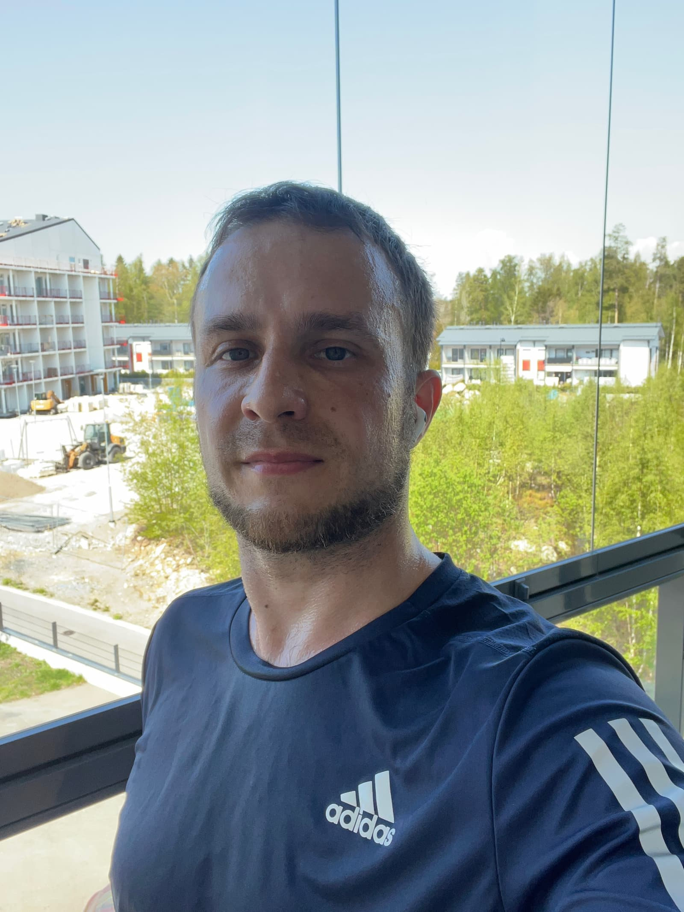

For the past a little over 1 year I've been very much in love with CrossFit. And I'm not planning on changing that - strength, conditioning and gymnastics as nicely coupled together by the CrossFit way of training are still my primary focus and something I enjoy a lot. However, I did recently decide I'd like to give Ironman a shot and complete one before I hit 40 in November 2025.

## 📚 Story and why

**I mean you could always be someone who didn't complete an Ironman challenge, but why not be someone who did complete it?**

All silliness and cockiness aside (although that's very much how I feel about this), I think it's an interesting challenge to strive to accomplish, there's a lot of health benefits to be had, a lot to learn, and frankly I wouldn't be the first one to do it. But I want to try and I want to enjoy my journey!

So here goes nothing!

## 🏋️‍♂️‍ Preparation

Coming soon...

## 🏃‍♂️ Running

### 1️⃣ April & May 2023

These are my first few runs as I started in April 2023.

...

## 🏊‍♂️ Swimming

...

## 🚵‍♂️ Cycling

...

[0]: Linkslist
