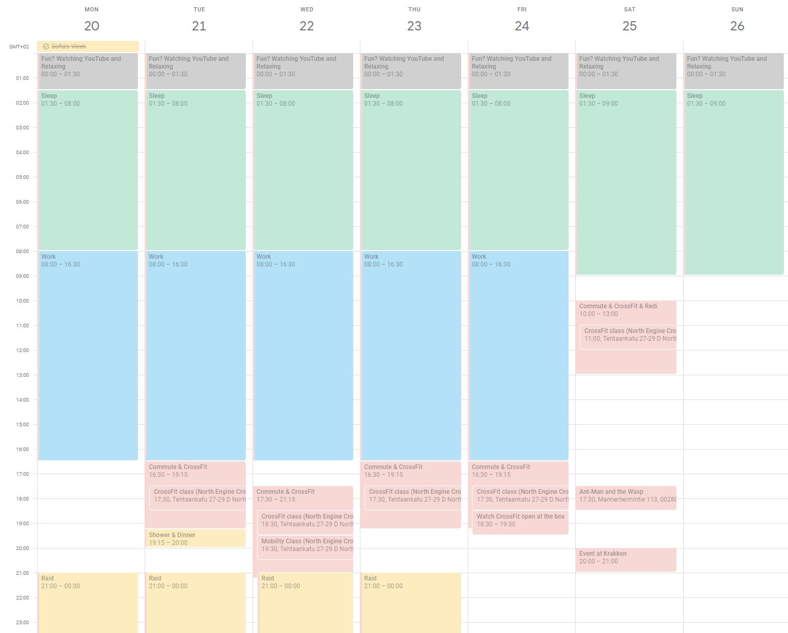

### "The best dad and double down on CrossFit skills"

The obvious reason why I enjoy doing these retrospectives is that many times when you look back, it's a very motivating way of recognizing the progress in something. It feels great. There's another side to it however. Sometimes you look back and you notice how things have changed - you didn't go for the initial plans you had, instead you went for something else, new or old, but either way taking priority and becoming a focus over the planned items. And that's ok too. In the end, life is about the journey, it's about enjoying it and making sure we live everyday as we would like, as much as possible.

TODO: some images?

### ⬜ Major goals:

- 💰 Improve the monthly budget to a neutral or positive state
- 🏘 Move to live closer to son’s preschool and future school
- ⚽ Sign up Anton for football, swimming or other hobby again
- 📚 Become full stack - create 6 new projects
- 🕺 Join a latin / hip hop dance class
- 🗣 Create / join communities - people to hang out with similar interests, language, hobbies, w/e
- 🌵 Embrace discomfort head on
- 🇪🇸 Travel to Spain
- 🇪🇺 Travel to a random EU country (Adventure 1)
- 🚙 Rent an RV (Adventure 2)
- 🛳️ Go on a longer boat cruise (Adventure 3)

After taking a look at the major goals for 2023, set in 2022, let's expand a little bit. Unfortunately monthly budget has not been improved to be on at least neutral state. There's been a number of bigger "home upgrade" type of improvements, and the trips to Germany, Spain and Sweden, definitely impacted the budget as well. I can't say that I overspent on something I didn't need, for the most part, spending on some travel and experiences is always worth it. There are certainly some items I could have done without, like some massages here and there, but they were helpful for training recovery. The biggest "win" however, was the apartment move in February 2023, when I started paying 1000e rent instead of 1400e, so that's great.

This also brings us to the 2nd point in the list - moving to live closer to Anton's school. This worked out really well, and coupled with the fact that for the first time in many years we got warm weather from early April, it enabled many of football, basketball and just in general hanging out on the sports premises of the school after school with Anton. Very fun, and very nice! Anton has been also signed up to a hobby where they tried different types of ball games, and also to an ice hockey hobby, so those went well too and he's having fun with them, which is amazing!

Becoming "full stack" and making 6 new projects, it's a nice thought, but there never was time for this. At one point I even recall making this calendar view, where I plotted all the hours I'm doing something, just to give myself clarity, and it becomes immediately obvious that it's very challenging to say the least to "create time" for something bigger like that:

And I know the image is "washed out" and whatever, but anyway, the point is that when you plot in a weekly calendar the time spent sleeping, working, crossfitting (including extra minutes after class to work on skills and commute times), then a few raid nights per week with the boys and finally an hour or so of watching YouTube videos and relaxing before bed, there's really not much left. And that example is on a week Anton is with his mom, things are quite different when he's home with me.
What a long way of finding an excuse for yourself for not doing some of the extra things? Nah, that comes from me - someone who deeply believes that **if you really wanted to do something, you would do it**. Anyway, there was just no way to prioritize and spend time with those potential full stack hobby projects.

As far as joining more communities and people with similar interests, and also perhaps a latin dance class - I still find that interesting, I'd still want to do it, and if I see the right opportunity I might, but honestly, not even as an excuse, **time is a factor**. There are time and logistical constraints to what is possible each week. Who knows in the future though. Cause the thing is, that kind of music does fill my heart in a very special way and makes me feel so good and alive. Why not try learning to dance and be with other like minded people, it might work out someday.

On embracing discomfort head on, the point was to not necessarily always try to make everything super comfortable. Many times, I'd go out of my way to preplan everything to such a degree, so there would be near 0 chance of any (unwanted) surprises. **The problem is, this also gets rid of the nice, pleasant surprises**. So this extends on the idea of being present, in the moment, living, smiling, enjoying, chatting, looking, talking. I've not marked this as green, cause there wasn't some resounding success, and I am still very VERY guilty of planning and preplanning everything to a crazy extent, but I am aware, and I am definitely very consciously working on it. We'll get there.

I did manage to travel to Spain and my 2nd wildcard adventure ended up being a trip to Berlin, actually that happened even before the Spanish trip. I'll expand on those below in their dedicated sections. "Rent an RV" did not happen, but there's a big chance of it happening next year, because one of the things I learnt this year was how much fun was the trip with Anton on the boat cruise to Sweden! He's such a big boy, ready for adventure and we both had so much fun, to this day he keeps saying that was the best day of his life. I'll expand a lot more on that below too, because I have a lot of thoughts about it.

#### ◻️ Minor goals:

- 🇪🇸 Sign up for a Spanish language class
- 🇸🇪 Sign up for a Swedish language class?
- 🇫🇮 Finnish citizenship?
- 📺 Stream once a week on Twitch
- 💵 Diversify income streams (platforms build up, year 2/5)
- 🛋 Cozy and comfy in the new apartment
- 🎶 Create 1 hip hop or or techno / EDM song

The main underlying "excuse" for most of the above not happening, is the same reason I described above - time and I suppose not making them a priority. The thing is, those things are hard to take presedence over something like focusing on my training or spending time with my kid in a present and active manner. They are some decent ideas in there, but yeah, this year was not the year they would happen.

### 2️⃣0️⃣2️⃣3️⃣

#### 🏋️‍♂️ CrossFit! Double down on skills!

This might be one of the biggest topics of 2023 for me. Something happened and from liking and enjoying CrossFit I went full in love with it and beyond. February this year marked the 1 year of CrossFit anniversary for me. I was already plenty fired up from the previous year, some lifting numbers were progressing, some skills were too, but a lot of skills were lacking too.

Then came the CrossFit Open. An yearly event (I had no clue about), that some folks from the gym said I should sign up for, and the idea is simple - you pay 20 bucks, and you do 3 workouts in 3 consequtive weeks, which are plenty challenging, but also not too crazy. Then you get scores and that's getting added to your profile. Of course, the best athletes use that as qualifiers for the CrossFit Quarterfinals, then the CrossFit Semifinals and finally the CrossFit Games.

Due to time constraints there was no way I could do all 3 events sadly, so I missed the first one, but I did do the 2nd of the 3 CrossFit Open workouts, and boy did that excite me! We did it together with Matt, judging for each other. The workout was about doing 5 burpee pull ups (increasing by 5 each round) and then 10 shuttle runs of about 10 meter each give or take. I did well for myself and I was happy with my result, although I'm sure I could do a lot better nowadays 😀 **But that workout sparked up a fire**. I've always been competitive but now knowing about this event, it really got me hungry for more.

Then came the 3rd event and I thought I'd love to do it, even though it would be hard to organize the time for me to do it. **The only thing I was hoping for, was that there wouldn't be any double unders, as I could do no double unders at all**. Then, the event got announced and there were double unders involved 😂. So I couldn't do it, but **that then took the spark I mentioned above and turned it into a fire**. I decided I really need to start working on my skills and that I'd like to compete in some (however small) form at some point.

A couple more things put extra fuel in that fire. Watching Mal O'Brien ABSOLUTELY KILL the 23.3 - the third CrossFit open event, inspired me like nothing else... It was just about that determination and the push she went through the entire thing with. There was a moment around that time when watching her do the wall walks and the strict handstand push ups, insprired me super much and soon I was working hard on improving those, and actually saw a TON of progress in them. There were other examples of inspiring people, many from our gym, and at that time I also started watching older versions of the CrossFit games, so definitely kept an eye on a lot of the famous athletes and getting cues on how they did specific movements and so on.

TODO:
https://www.youtube.com/watch?v=GS7M6s2xXfs&t=549s

The last piece of the puzzle was when I asked Charli, the owner of our gym, if it would be ok to do extra time before or after classes and he said it would be ok. So, my format, ever since about March 2023 till this day, has been **"go for the crossfit class, and whenever possible, spend 30 extra minutes after working on skills"**.

And it all started with extra work on double unders, cause I was so annoyed I couldn't do them. Not even 1 or 2 in a row. I whipped my hands quite a lot, and my legs too, but slowly and steadily I went from nothing to the first 5, that felt insane. Now I'm at a point of doing most times about 13 before tripping, and have done a few times 20+ or even 30. I'm proud of it, but of course it requires a lot more work and I'm here for it.

**In fact, that's the best part about CrossFit - all these skills you can work on and learn, it's so much fun!.**

Then came handstand walk work around April / May and beyond. Every time after class, when I could, I was practicing. And it worked out! Over months and months, I can now say that something, which was unthinkable to me earlier, I can now walk some meters on my hands. That too still needs work, to be even better and faster at it, but the progress has been huge. Actually, those and strict handstand push ups have been one of my biggest strengths. Additionally I learnt how to do the kipping version of HSPUs too, which was something I thought I'd never do, but hey here we are.

Finally, in the summer I started getting some ring muscle ups and that was super exciting! I went from nothing to sometimes doing 4 in a row kipping, and many times 2s and 3s. This is something that also needs more work, but I'm happy I'm able to chug a few on a good day after class, it feels great. Just getting some reps in and working on it!

And the latest, just as of mid November or so - butterfly pull ups. I got a bit afraid of this, thinking it's gonna take quite a while to get used to it, but somehow, something clicked and I already used them for the first time in a workout, which felt amazing! Got a lot of good tips there from Ville, Elisa, Ida, which really helped me a lot!

So while, there's still tons to work on, more strength to be built, a lot more technique and practice, it feels kind of really nice that this year I went from not being able to do so many things, to now having every crossfit skill necessary. I'm still super excited about the work and improving, because make no mistake, I'm far from perfect, there's a lot more to be desired, but it feels good, that I can at least do the movements!

TODO: add videos and pics

...

... North Engine CrossFit's 7th birthday competition event in April and Veera and the grips

TODO: picture

TODO: text

TODO: image grid?

#### 👨‍👦The best father I can be

TODO:

#### 🏃‍♂️Embracing running

Embracing weakness and starting to run, considering Iron Man

#### ☀️ Finnish weather in 2023, a rare long spring + summer

TODO: text

#### 🥈 Tough Viking

TODO: text

#### 🛳️ Cruise trip to Sweden with Anton

TODO:

#### 🍸 On being sober for over a year

TODO:

#### 📈 My success stories of the year

TODO:

#### 🇩🇪 Trip to Berlin, Germany and the CrossFit semifinals 2023

TODO:

#### 🇪🇸 Trip to Spain

TODO:

TODO:

#### 🥑 Health

Gratitude and good, but also challenges with Anton lice, sickness toward the end of the year for both him and I. Eating well, fruit, throwing away less food.

TODO:

#### 💻 Work, professional life

Starting to use VIM at work in March, learning a lot of shortcuts and getting used to it...

Elisa camp hack

Collegues, work challenges, events (Flavor studio)

TODO:

#### 💰 Finances and budget

TODO: moving apartments, budget still iffy, if at least better, no more student loan, payed off, insurances improvement

#### TODO: anything else?

TODO:

### 2️⃣0️⃣2️⃣4️⃣

TODO: comment on next year ahead

Below is the list of major and minor goals for 2023

### ⬜ Major goals:

- TODO:
- TODO:

#### ◻️ Minor goals:

- TODO:
- TODO:

TODO: closing

All in all if there's one word to describe how I feel about this past year, it's the word **FUN**. There are always some ups and downs in life, but overall, I'd like to leave you with this thought:

> **Focus on son, be present, be there, smile and joke, so that if I was to go tomorrow, I'd go being happy of how things have been**

To an amazing 2024!

TODO: picture?

[0]: Linkslist
[1]: #
