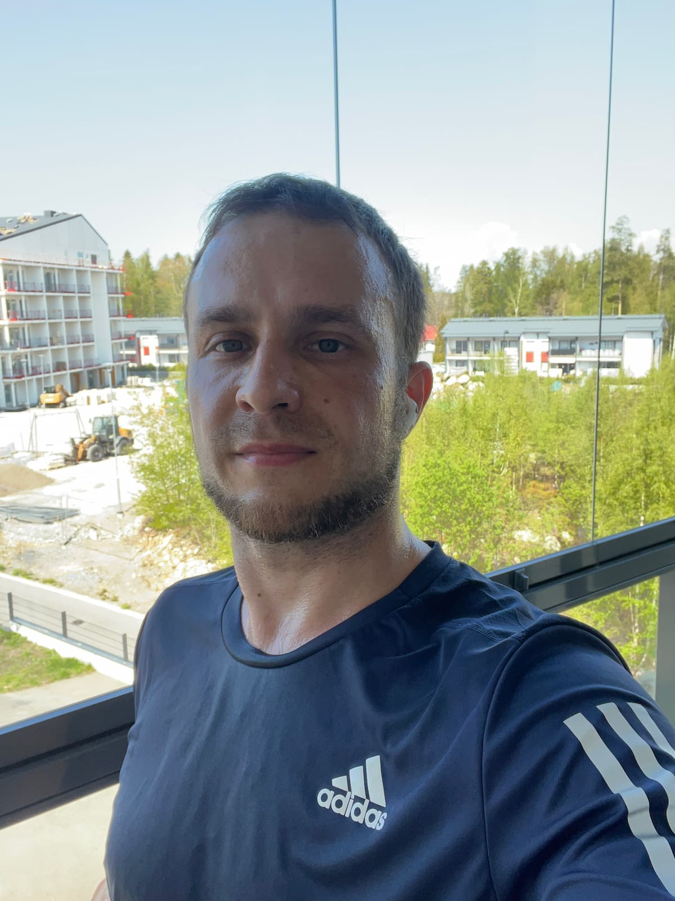

#### Table of contents

- [🖼️ Theme of the year and overview of 2023's goals](#overview)
- [🏋️‍♂️ CrossFit](#crossfit)
- [👨‍👦The best father I can be](#best-father)
- [🏃‍♂️Embracing running](#running)
- [🥈 Helsinki Tough Viking](#tough-viking)
- [☀️ Finnish weather in 2023](#finnish-weather)
- [🍸 On being sober for over a year](#sober)
- [🇩🇪 Trip to Berlin](#berlin)
- [🇪🇸 Trip to Spain](#spain)
- [🛳️ Cruise trip to Sweden with Anton](#cruise-to-sweden)
- [🥑 Health](#health)
- [💻 Work, professional life](#work-life)
- [💰 Finances and budget](#finances)
- [🎞️ Movie review](#movie-review)
- [📈 My success stories of the year](#success-stories)
- [⬜ Goals for 2024](#goals)

### "The best dad I can be and double down on CrossFit skills"

The obvious reason why I enjoy doing these retrospectives is that many times when you look back, it's a very motivating way of recognizing the progress in something. It feels great. There's another side to it, however. Sometimes you look back and you notice how things have changed - you didn't go for the initial plans you had, instead, you went for something else, new or old, but either way, taking priority and becoming a focus over the planned items. And that's ok too. In the end, life is about the journey, it's about enjoying it and making sure we live every day as we would like, as much as possible.

### ⬜ Major goals:

- 💰 Improve the monthly budget to a neutral or positive state
- 🏘 Move to live closer to son’s preschool and future school
- ⚽ Sign up Anton for football, swimming or other hobby again
- 📚 Become full stack - create 6 new projects
- 🕺 Join a Latin / hip hop dance class
- 🗣 Create/join communities - people to hang out with similar interests, language, hobbies, w/e
- 🌵 Embrace discomfort head on
- 🇪🇸 Travel to Spain
- 🇪🇺 Travel to a random EU country (Adventure 1)
- 🚙 Rent an RV (Adventure 2)
- 🛳️ Go on a longer boat cruise (Adventure 3)

After taking a look at the major goals for 2023, set in 2022, let's expand a little bit. Unfortunately, the monthly budget has not been improved to be at least a neutral state. There have been several bigger "home upgrade" types of improvements, and the trips to Germany, Spain, and Sweden, definitely impacted the budget as well. I can't say that I overspent on something I didn't need, for the most part, spending on some travel and experiences is always worth it. There are certainly some items I could have done without, like some massages here and there, but they were helpful for training recovery. The biggest "win" however, was the apartment move in February 2023, when I started paying 1000e rent instead of 1400e, so that's great.

This also brings us to the 2nd point in the list - moving to live closer to Anton's school. This worked out really well and coupled with the fact that for the first time in many years, we got warm weather from early April, it enabled many football, basketball, and just in general hanging out on the sports premises of the school after school with Anton. Very fun, and very nice! Anton has been also signed up to a hobby where they tried different types of ball games, and also to an ice hockey hobby, so those went well too and he's having fun with them, which is amazing!

Becoming "full stack" and making 6 new projects, it's a nice thought, but there never was time for this. At one point I even recall making this calendar view, where I plotted all the hours I'm doing something, just to give myself clarity, and it becomes immediately obvious that it's very challenging, to say the least, to "create time" for something bigger like that:

And I know the image is "washed out" and whatever, but anyway, the point is that when you plot in a weekly calendar the time spent sleeping, working, crossfitting (including extra minutes after class to work on skills and commute times), then a few raid nights per week with the boys and finally an hour or so of watching YouTube videos and relaxing before bed, there's really not much left. And that example is on a week Anton is with his mom, things are quite different when he's home with me.
What a long way to finding an excuse for yourself for not doing some of the extra things! Nah, that comes from me - someone who deeply believes that **if you really wanted to do something, you would do it**. Anyway, there was just no way to prioritize and spend time with those potential full-stack hobby projects.

As far as joining more communities and people with similar interests, and also perhaps a Latin dance class - I still find that interesting, I'd still want to do it, and if I see the right opportunity I might, but honestly, not even as an excuse, **time is a factor**. There are time and logistical constraints to what is possible each week. Who knows in the future though? Cause the thing is, that kind of music does fill my heart in a very special way and makes me feel so good and alive. Why not try learning to dance and be with other like-minded people, it might work out someday.

On embracing discomfort head-on, the point was to not necessarily always try to make everything super comfortable. Many times, I'd go out of my way to preplan everything to such a degree, so there would be nearly 0 chance of any (unwanted) surprises. **The problem is, this also gets rid of the nice, pleasant surprises**. So this extends on the idea of being present, in the moment, living, smiling, enjoying, chatting, looking, talking. I've not marked this as green, cause there wasn't some resounding success, and I am still very VERY guilty of planning and preplanning everything to a crazy extent, but I am aware, and I am definitely very consciously working on it. We'll get there.

I did manage to travel to Spain and my 2nd wildcard adventure ended up being a trip to Berlin, actually that happened even before the Spanish trip. I'll expand on those below in their dedicated sections. "Rent an RV" did not happen, but there's a big chance of it happening next year because one of the things I learnt this year was how much fun was the trip with Anton on the boat cruise to Sweden! He's such a big boy, ready for adventure and we both had so much fun, to this day he keeps saying that was the best day of his life. I'll expand a lot more on that below too, because I have a lot of thoughts about it.

#### ◻️ Minor goals:

- 🇪🇸 Sign up for a Spanish language class
- 🇸🇪 Sign up for a Swedish language class?
- 🇫🇮 Finnish citizenship?
- 📺 Stream once a week on Twitch
- 💵 Diversify income streams (platforms build up, year 2/5)
- 🛋 Cozy and comfy in the new apartment
- 🎶 Create 1 hip hop or or techno / EDM song

The main underlying "excuse" for most of the above not happening, is the same reason I described above - time and I suppose not making them a priority. The thing is, those things are hard to take presedence over something like focusing on my training or spending time with my kid in a present and active manner. They are some decent ideas in there, but yeah, this year was not the year they would happen.

### 2️⃣0️⃣2️⃣3️⃣

#### 🏋️‍♂️ CrossFit! Double down on skills!

This might be one of the biggest topics of 2023 for me. Something happened and from liking and enjoying CrossFit I went full in love with it and beyond. February this year marked the 1 year of CrossFit anniversary for me. I was already plenty fired up from the previous year, some lifting numbers were progressing, and some skills were too, but a lot of skills were lacking too.

Then came the CrossFit Open. An yearly event (I had no clue about), that some folks from the gym said I should sign up for, and the idea is simple - you pay 20 bucks, and you do 3 workouts in 3 consequtive weeks, which are plenty challenging, but also not too crazy. Then you get scores and that's getting added to your profile. Of course, the best athletes use that as qualifiers for the CrossFit Quarterfinals, then the CrossFit Semifinals, and finally the CrossFit Games.

Due to time constraints, there was no way I could do all 3 events sadly, so I missed the first one, but I did do the 2nd of the 3 CrossFit Open workouts, and boy did that excite me! We did it together with Matt, judging for each other. The workout was about doing 5 burpee pull-ups (increasing by 5 each round) and then 10 shuttle runs of about 10 meters each give or take. I did well for myself and I was happy with my result, although I'm sure I could do a lot better nowadays 😀 **But that workout sparked up a fire**. I've always been competitive but now knowing about this event, it really got me hungry for more.

Then came the 3rd event and I thought I'd love to do it, even though it would be hard to organize the time for me to do it. **The only thing I was hoping for, was that there wouldn't be any double unders, as I could do no double unders at all**. Then, the event got announced and there were double unders involved 😂. So I couldn't do it, but **that then took the spark I mentioned above and turned it into a fire**. I decided I really need to start working on my skills and that I'd like to compete in some (however small) form at some point.

A couple more things put extra fuel in that fire. Watching [Mal O'Brien ABSOLUTELY KILL the 23.3 - the third CrossFit open event][1], inspired me like nothing else... It was just about that determination and the push she went through the entire thing with. There was a moment around that time when watching her do the wall walks and the strict handstand push-ups, inspired me super much, and soon I was working hard on improving those, and actually saw a TON of progress in them. There were other examples of inspiring people, many from our gym, and at that time I also started watching older versions of the CrossFit games, so definitely kept an eye on a lot of the famous athletes and got cues on how they did specific movements and so on.

The last piece of the puzzle was when I asked Charli, the owner of our gym, if it would be ok to do extra time before or after classes and he said it would be ok. So, my format, ever since about March 2023 till this day, has been **"go for the CrossFit class, and whenever possible, spend 30 extra minutes after working on skills"**.

And it all started with extra work on double unders, cause I was so annoyed I couldn't do them. Not even 1 or 2 in a row. I whipped my hands quite a lot, and my legs too, but slowly and steadily I went from nothing to the first 5, which felt insane. Now I'm at a point of doing most times about 13 before tripping and have done a few times 20+ or even 30. I'm proud of it, but of course, it requires a lot more work and I'm here for it.

**In fact, that's the best part about CrossFit - all these skills you can work on and learn, it's so much fun!.**

Then came handstand walk work around April / May and beyond. Every time after class, when I could, I was practicing. And it worked out! Over months and months, I can now say that something, that was unthinkable to me earlier, I can now walk some meters on my hands. That too still needs work, to be even better and faster at it, but the progress has been huge. Those and strict handstand push-ups have been some of my biggest strengths. Additionally, I learned how to do the kipping version of HSPUs too, which was something I thought I'd never do, but hey here we are.

<video controls>
  <source src="my-2023-year-in-review-5.webm">
  Your browser does not support webm videos.
</video>

Finally, in the summer I started getting some ring muscle ups and that was super exciting! I went from nothing to sometimes doing 4 in a row kipping, and many times 2s and 3s. This is something that also needs more work, but I'm happy I'm able to chug a few on a good day after class, it feels great. Just getting some reps in and working on it!

<video controls>
  <source src="my-2023-year-in-review-6.webm">
  Your browser does not support webm videos.
</video>

And the latest, just as of mid-November or so - butterfly pull-ups. I got a bit afraid of this, thinking it's gonna take quite a while to get used to it, but somehow, something clicked and I already used them for the first time in a workout, which felt amazing! Got a lot of good tips there from Ville, Elisa, and Ida, which really helped me a lot!

So while, there's still tons to work on, more strength to be built, a lot more technique and practice, it feels kind of really nice that this year I went from not being able to do so many things, to now having every crossfit skill necessary. I'm still super excited about the work and improving, because make no mistake, I'm far from perfect, there's a lot more to be desired, but it feels good, that I can at least do the movements!

I've received a lot of support from coaches in our gym, as well as other members, for all of which I'm very grateful and it has made a real difference. Ranging from Veera recommending me grips that would actually fundamentally change my muscle-up game to so many more various tips about DUs, butterfly pull-ups, ring muscle ups and handstand walks, I'm so happy with that support!

#### 👨‍👦The best father I can be

I can easily say this is the chapter closest to my heart, this year and always. I love being a dad. Sure, sometimes it could be very challenging, but I wouldn't change it for the world. Watching this amazing kid grow up and explore the world, from day one I realized that was a ticket **to be a kid again for me too**. We've done so many, MANY new things together this year, I am really happy about it and most importantly - Anton is too. He's been telling me so many times, now months later, that the Silja line cruise trip to Sweden was his best day ever. Hopefully, we have many more such and even better days coming up in 2024 and beyond.

I think being present and using the time together well is one of the most important things, especially in our case where I went from spending 100% of my time with my kid to 50% of the time for the past couple of years. It's tough and many Sundays are sad when he goes to his mom's place. But it's important for him to have both parents in the picture, even if in such a configuration. For my part, I try my best to spend quality time together being fully present. We've played games, board and computer ones, some really fun co-op games like It Takes Two, Unravel Two, Portal 1 and 2, Minecraft. We did spend a lot of time outside doing some sporty activities, climbing, playing football, playing basketball, took him to ice hockey practice for the past 3 months. We had some very special fun days together like the **bring your dad to school day** when I spent a whole day together with Anton in his school and that was so fun for him and for me 😀. We also had a **bring your kid to work day** at Elisa, so he really enjoyed that as well! We've had some athletic events organized by his school where he ran 40m sprint, that was amazing to watch and I'm so happy I was able to be there in person! We also had of course our Turku and Moomin town midsummer trip, our Silja line cruise trip to Sweden.

And we've also had many various small, little random goof arounds and learning mini projects - from growing avocados from seeds to disassembling and cleaning up and reassembling our computer keyboards, to "computer class" where I teach Anton something small about computers every day for 20 minutes. There are so many fun things, like how we read National Geographic's Little Kid's First Big Book of ... encyclopedias as bedtime stories, and even after re-reading all 16 or so books we have quite a few times at this point, I still couldn't make the case to read some stories or fairy tales for a bit instead 😅. I wonder if Santa's bringing us some new interesting books and child encyclopedias to read this year?

I also bought us two Museum Cards in the summer for 130e for a whole year for both of us and we've been visiting various places like the Natural History Museum and Heurekka.

So all in all, I'm pretty happy with this, and let's see what else is to come in 2024.

<video controls>
  <source src="my-2023-year-in-review-40.webm">
  Your browser does not support webm videos.
</video>

#### 🏃‍♂️Embracing running

During my first year of CrossFit I recognized getting better at running was not my priority. There was a lot to learn in CrossFit, a lot of fun to be had, and running wasn't among the top interesting things. In 2023, a couple of things changed. First, I recognized that I should really get at least a bit more comfortable and better at running. During one of the partner competitions in our gym in November 2022, while running with a friend, I wish I was at least a bit better, to be at least not slowing us down. Additionally, in early 2023, I started thinking about someday potentially training for and doing the Iron Man triathlon challenge.
I started watching a few YouTube channels that provided more specific information on running and Iron Man, the most influential to me being Natasha O'cean 's channel. I learned a lot and got inspired a lot from her channel. Finally, the weather was very favorable in early April, and so, running it was.
Started off slow with a few shorter barely 3k runs, I think my first run was 2k in 16mins with a pace of 8:27 per km, very slow and very "easy". There must have been some walking on that one. The 2nd run was already 2.2km in 13min 44s with a 6:15 pace a week later, then another 2.38km in 14m42s with a 6:11 pace.
My last short run was a 3.17km in 18m12s with a 5:44 pace. Then I moved on to a bit slower, but lengthier runs aiming for 5-6k. I did a 5.94k in 37m30s with 6:19 pace, then:

- 6:09km in 38m55s with 6:23 pace on May 21
- 6.38km in 37m19s with 5:50 pace on June 11
- 5.02km in 27m8s with 5:24 pace on July 29

The good news is that I improved a lot, getting pretty comfy with running 5ks. The bad news is that as you can tell from the dates, the runs got really spread out and there wasn't much running since. Definitely will continue working on and improving next year, **the goal will be to get very comfy running 10k with a pretty decent pace**.

There were a couple more noteworthy mentions when it comes down to running, first during the Murph hero WOD in May, there is 2 x 1 mile run in it, and I was pretty ok this year with that, so I'm happy for that. The other thing worth mentioning was the **Helsinki Tough Viking obstacle course race** I took part in September.

#### 🥈 Helsinki Tough Viking

It was a lot of fun, and a lot of the challenges were easy to overcome when it came down to climbing onto something, ladders or using upper body strength to muscle up onto a platform, carrying logs, metal tanks, etc. There were a couple of "climber" challenges where you had to hold onto very tiny things, those were tricky for me, and of course, the hard 80kg ball-shaped weight was tricky, if it were a sandbag with that weight, I'd have no problem. I was very concerned with the parts of the race that dip you into the cold water and definitely the ice bath dive and go under in the end. I'm very proud of myself for how I dealt with these, it was very doable, it was a bit cold, but definitely doable, and the weather was favorable with the sun shining on a decently warm day for September. The icebath, when I got to it, together with one other girl, It was nice to have that "pseudo company" for support, but basically, I decided not to think about it, so I just immediately sad on the edge, then just plunged in and dove underneath and popped on the other side and jumped out. I just remember not remembering anything from it, as it all just blacked out, it was very cold, but ok, some deep breaths and it was over, and so was the race. My time? Kinda bad - 1 hour 45 minutes. The main reason - calf cramps like no other from the 8th to the 10th km of the race. This also was the reason for my disappointment in not making that 1 very high platform in the end, cause I could just not run at my full speed and reach it. I'm surprised and happy I attempted it at all given the condition I was in. I kind of hoped the cold water would help with the cramps but it did not, very weird, because I thought I should have been ok, I had loaded up on carbs the night before and had enough electrolytes, maybe I should have had more electrolytes DURING the race, I'll prepare for that next time, but I really wanna run this again without getting the cramps, I'm sure I could do at least 1 hour 15 minutes that way. With some luck maybe even sub 1 hour. Anyway, I'm still happy and proud of this!

#### ☀️ Finnish weather in 2023, a rare long spring + summer

I'm really not the biggest fan of Finnish weather. Everyone who knows me knows that. And anyone who tries to convince other people that Finnish weather is nice is high on something. That's not my subjective opinion, that's a fact.
However, this year, for the first time in the at least past 11 years since I've been here, spring really came early and came to stay which is even more important. We are not talking about occasionally warm days, temperatures actually got nice and warm in April and stayed that way, that was a very big deal, because it's so rare, but also coincided with my running efforts, so it played a major role in me being inspired to run, but also having the capability to do so (and no, I don't care you can run in all kinds of weather with the right gear, I'm not there, and I don't care for that).

It would have been nice if summer lasted longer and the autumn would have been extra warm too, which sadly was not the case, but I'm not complaining and I'm very happy. **I need a lot more April to be warm, then October**. That's most important for my sanity while living in Finland, because every year the hardest time for me is the March / April period - a time when all my friends living in warmer places start posting pictures wearing t-shirts in a sunny day with flowers and blossoming trees around them and here everything is still frozen solid, and even having temperatures sub zero and occasionally even -15 to -25 on a March day is not unheard of. It's the sad reality of Finish weather. **Unfortunately for me, at that time of the year after 6 months of cold weather and winter, I'm so worn out that I just can't deal with it anymore!** I'm beyond ready for some nice warm weather!

This is all just to provide context on why the weather being so good from early on this year was so important for me. That and the fact that we had moved apartments to live a lot closer to my son's school, enabled some really awesome fun times! Nearly every day I'd pick him up from preschool at the time we would go to play football in the field right next to his school, or climb and do muscle ups, or do dips, or later on also play some basketball. **Such a nice time and a nice feeling - me, my kid, some sporty activity, nice warm weather, so, so good!**

#### 🍸 On being sober for over a year

Quitting alcohol and admitting to myself I quit was an interesting one. Now, it's hard to attribute this solely to 2023 itself, but let's say the main change manifested here and the recognition of the fact that I had quit. **But why? Well, this had been a long time coming...**

I suppose in a way this had begun already to some degree 7-8 years ago when my kid was born, because I had hardly been "hardcore" drinking since, and going out drinking had been pretty rare. Obviously, the focus was on becoming a dad and I genuinely wanted to be home and spend time with my son, even in some work outings and other occasions. Not drinking was also supported by the fact that I live far from the city, so I have to drive and one thing that I noticed early on, was that despite I used to think you need to drink to have fun during parties, the few times I went to some not drink, if the company was right, it was still a lot of fun, so drinking was not really required.

Another thing that played a role was that I was not necessarily tempted to drink, cause I've had my 20s pretty wildly with many different parties and heavy drinking, so it's not something I was gonna miss out on - I had done it for years, so settling down and calming down was actually a nice change of pace.

So for quite a while, the only "drinking" I was doing was a couple of beers on the weekend. In August 2022, however, I asked myself randomly one day at the shop, hey, what if these beers are just a product of habit, do you really want them? Do you really enjoy, _enjoy_ them? So I ran an experiment that I didn't buy weekly beers, and **much to my surprise, I have not purchased a single beer, wine, or any other type of alcohol from the shop since August 2022**. Kinda funny like that lol.

So with all of that context in mind, and understanding where I was at in the beginning of 2023, what happened then? Well, although I stopped buying alcohol at all, I didn't consider myself as I had "quit drinking". Going out with friends, I'd still have some drink, usually I'd enjoy a nice whisky sour or an old fashioned. But the thing is, something that happened in March 2023 led me to admit to myself that I had actually quit drinking. We had a company-organized hackathon, and we had a great time, I had a really solid team, we chatted and had fun building things, and on the first evening there were some IPA beers. I used to enjoy IPAs in the past. I wondered if I should have one, I decided you know what, let's go for one. I had 2 sips exactly, and I put it away. I just didn't enjoy it and I almost felt weird about it, but it was really time to admit, that I had quit. It sounded weird in my mind, but I tried not to think about it much, just let myself be and see how it goes. But, yep, I had quit drinking, apparently.

To understand additionally why this is so weird and such a big deal to me, you do have to understand that while I was never a super heavy addicted drinker, I did have my party years during which we did drink a lot and enjoyed it too. I enjoyed nice whiskeys too. I also was a passionate smoker and really loved that, but after 11 years of smoking, I quit 8 years ago when my son's mom got pregnant. In the end, I believe in "phases in life" and that's how I've experienced mine. There are different phases and times for everything. And that's ok and provides diversity and it's nice. Don't overthink it 😀.

Finally, I'd lie if I said that learning about alcohol being detrimental to gains from workouts didn't influence my decision as well. I love the progress I've made in CrossFit, I love that sport and all the fun things you can do, I enjoy it a lot, and yeah that's another additional thing to help me quit. The thing is, quitting something or starting to go to the gym or starting any other type of habit - **it has to come from within and with a drive**. No one else can make you do it, no one else can do it for you. You just have to feel like you want to do it like you need to do it and allow yourself to go for it. Yes, external support helps a lot, but the drive must come from within. That's at least how I feel about it.

In the end, I'm happy with this change, I enjoy it a lot, and I'm also not putting any hard restrictions on it, if I wanna have some drinks I will. But honestly, most likely I won't in most cases 😅.

#### 🇩🇪 Trip to Berlin, Germany and the CrossFit semifinals 2023

I'm really happy with my travels this year! I wished to go to a couple of new destinations and I did just that. The Berlin trip specifically was for an event - the European part of the CrossFit semifinals. It was such an actually awesome experience! Anyway, at that point in time (this happened in early June), I had really gotten into CrossFit with my extra practice work on skills and what not, I was watching a lot of the previous years' worth of competitions with many various CrossFit athletes, so it was so nice to see some of them live! Like Laura Horvath, Annie Thorisdottir, Jonne Koski, and a TON of others, I'm not gonna make a whole list, I appreciate every one of them showing up and competing and inspiring us fans!

My day would start every day around 8 or so in the morning with breakfast in the hotel I was staying at, followed by a nice 30-minute walk to the competition venue. It was very chill. The day would start, and it would be exciting to watch the different events, then I would have lunch and go back to watching. **The best, most special part, however, was on 2 of the 4 days I participated in the CrossFit Throwdown and it was absolutely amazing!**

Not only was the throwdown actually pretty cheap to participate in, something like 12e or so, but it gave us a chance to do similar workouts (to some degree) as what had been happening on the competition floor that day! The atmosphere was awesome, the people who participated were fired up and excited, and the coaches were nice! Just so good, so fun!

**On the first throwdown I had to do 3 things I had never done before, like AT ALL**. Talk about taking you out of your comfort zone! The event was something like this:

- 1km echo bike
- ?? meters sled hand over hand rope pull
- 800m assault runner run
- 1km echo bike

And at that point in my CrossFit "career" I had never touched the echo bike, the assault runner, or even the sled rope pulls, to be honest. I was confident with the sled pull, they showed us the technique, and I thought, ok, I'm sure I'll do fine with that one, nice and easy, scale accordingly and do it, no problem. Assault Runner, no idea what to expect, I know it's demanding, but if I pace it, it's gonna be fine, no big deal, and I'm curious to see how it is. But the big question mark and concern for me was the assault runner - mostly I was thinking to myself, how the heck do I not fall off of that thing and make myself a fool, since I have no idea how to do it, what to expect. I remember even telling the coach and asking him if there was like anything special about it, or some strategy I was unaware of, or any tips, as I hadn't done it before. I don't remember his exact answer, or was he telling me to potentially scale with something else, I do not recall. But, the workout started, and I moved through the paces, I think I did very decently on the echo bike both times, I did well on the sled pull I could have had a bit more weight on it, but it is what it is, it was fun anyway. Finally, the run came up, and ... I did fine. The coach did give me some tips on how to lean forward etc., and I was able to do it, it felt a bit weird, given it was the first time I ever did it, especially since getting off of the thing was funky, but I did fine, I ran decently, and most importantly, I did not fall 😅 Good. I finished top 4 of people, so I'm happy I kept a decent pace of the rest, and I'm happy I had fun with it and did some entirely new things, I had never done before. So cool!

The 2nd Throwdown involved teamwork work and I partnered with this nice girl called Laura. We did pretty well overall, she was definitely fitter than me, so I did my best not to slow her down too much.
That event included some amount of:

- Ski erg for 1 partner and rowing for the other partner
- DB snatches with 1 heavier weight and 1 lighter weight (I think it was 22.5kg and 15kg)
- Alternating box jumps on a pretty high box (we were both good at this though, so that was extra nice)

That was a super fun event to do together!
I also ordered a throwdown t-shirt but they never had them there to be picked up and eventually they said they would ship them to participants, but later on, we got refunded and never got those t-shirts. Oh well, what can you do 😀

**I think for me watching the competition live and participating in the throwdowns was the absolute highlight of this 4-5 day trip. Specifically also trying out new things in the throwdowns!**.

<video controls>
  <source src="my-2023-year-in-review-41.webm">
  Your browser does not support webm videos.
</video>

But there were other noteworthy mentions, like visiting a local CrossFit box called CrossFit Werk, which was very nice! Did some bar muscle ups, double unders, and actually my rope snapped lol, some light runs, and something they called "man makers", which was basically like a devil's press plus a thruster all in one. Challenging and a good workout, fun!
We also had a nice evening out with a buddy of mine - Matt, that was a lot of fun with plenty of interesting chatter about all sorts of life topics, very enjoyable!

#### 🇪🇸 Trip to Spain

I enjoyed the trip to Spain, but I had very mixed feelings about it. Because it was during the summer vacation, it was of course on a week I didn't have my son over, and before our vacation together the week after, so although the trip was enjoyable, there were a lot of thoughts in my mind going back to Anton and even thinking to myself he would have loved it there. There seemed to be a very nice entertaining program for kids in the evenings in my hotel, and I couldn't help but wish "What if Anton was here, he would have so much fun". For better or worse, those thoughts were pretty dominant. In the end, I'm "happy" I miss my son so much, which means we have a solid bond and we have a lot of nice fun adventures together. But it felt pretty heavy at times, pretty sad.

Otherwise, the trip was nice and smooth. I met a girl called Judie on the plane and we chatted the whole way, she was cool. I had a taxi pre-booked to my hotel, which was a pretty long trip, so I offered her if she wanted to tag along and we drop her off at the stop where she was to meet her friend, I think it worked out well for her, instead of having to figure out how to get there. At the same time, it was on the way for us, so all good and the taxi driver didn't seem to mind. Many taxi drivers, as it turns out - zip English, like, nada. Oh well.

I enjoyed some Spanish music from the first taxi ride already. Had to shazaam some song, cause it was so good. The vibes were vibing, and the music was great, I love listening to Spanish in general, I really like the language. Probably my second favorite after English. I had to learn to say "grathias" instead of how a Mexican would say gracias for example, which I was more used to because of my time in the southwestern USA.

The hotel was nice all in all, pretty cozy, except for the night with the giant gecko incident 😀 Which was no big deal, but they moved me to another room, cause there was a gecko in mine and they couldn't find/catch and remove it. Haha, no big deal, just a funny one though. The pool at the hotel was awesome, really nice for swimming, long laps around, lounge around in the sun getting tanned. Of course, sunscreen was a thing this time around and it was plenty warm as you can imagine of Spain at the end of July. Amazing, I loved it.

Of course, nothing beats the sea! It was so nice on the beach, I really enjoyed it. The sun, the sand, the seawater, absolutely amazing! Got an umbrella though, cause the sun was defo shining, but it was very pleasant. The funny thing was, what surprised me, was that the current of the sea was so strong in that place in Alicante. You get in, and if you just float, it always drags you down the coast pretty strongly. Interesting, hadn't experienced such a strong current so far from all the other places I had been to. **Another "funny" thing was that I lost my swimming goggles in the sea. Twice!**. Ai, ai, ai. You'd think I'd have learned my lesson after the first time, but yeah, took me by surprise both times. Was just having some fun in the waves, and for a moment put my goggles up on my head - rookie mistake. Wave slammed me, goggles - gone. Same thing the next time a couple of days later, I felt so silly lol, I decided to not buy a third pair for the rest of the trip, as I indeed felt so silly. Not my strongest moment, but a little bit funny in hindsight 😅

I enjoyed a ton of ice creams from the many Eladeria's around town, I enjoyed the nice hot weather, damn, I love hot weather. Swimming, chilling and relaxing. I also dropped into a local CrossFit box, as it started becoming customary now during my travels and I love this new tradition. This time, I went to the CrossFit Playa San Juan, chatted with someone on WhatsApp, went there, and got received very warmly, specifically Ophelia who welcomed me was an absolute legend! What a fun and amazingly friendly person, we clicked from the first few seconds. Another instructor was leading the class in Spanish, and it was so much fun! It was a tough one - 3 x 800m runs outside in the heat of the evening sun around 7 pm and in between 24kg KB American swings and some bear walks. It was a good workout and I'm happy I challenged myself with the Rx weight and it went well, but maaan, am I not used to running in heat nowadays since I live in Finland? It was so different! Reminded me of my childhood spent in the summers on the basketball court in the heat, so in a way, it felt awesome, familiar, and tough at the same time. Either way, very happy I did it and I'm definitely planning on dropping into local CrossFit boxes anywhere I go, it's such a fun thing to do and get a mini glimpse of how the community is at that specific place.

#### 🛳️ Cruise trip to Sweden with Anton

Having done a few trips together at this point, when it came time for our cruise trip to Sweden, I was very curious how that would work out and had heard mixed reviews of that specific boat trip to Sweden. **I was super pleasantly surprised at how it worked out for us and what we made of the trip.** There were a lot of activities for children to do and almost immediately after boarding we started exploring and noticed that there was a scavenger hunt quiz of sorts. The goal was to find specific hidden questions around the ship and to answer them. That kept us busy and exploring for a while. Our cabin was pretty nice, and we had an overview of the street inside the ship and all the different shops.
We went around and got to watch the ship disembark the harbor and start our trip, we had food breaks, all in all, nice and cozy. Played some arcade games among other things, there were a couple of children's centers where you could also play some table tennis, climb and run around, and enter a drawing competition. In the evening there was also some program for kids and Anton became quickly a big fan of Harry the Seal 😀.

After a good night's sleep, we were in Sweden in the morning. Of course, in hindsight, maybe it would have been better to spend more time there, but maybe next time we go for a longer trip. Even as is, Sweden was pretty nice. Somehow in my head, I didn't expect much of it, but the parts we went to actually surprised me positively. The areas around Gamla Stan particularly. We walked a bunch and explored, took pictures, had some food, bought some souvenirs, and fed some pigeons chocolate balls 😅. It was kind of funny to not have a clue what things cost because of their currency and to pay "blindly" with the card. However, most things were actually a bit cheaper than in Finland.

Eventually, we had to go back to the ship and so we did and had another fun night full of activities, good food, and relaxation.

#### 🥑 Health

Health is something very important to me and I suppose to all of us. For the most part, I feel fortunate and am grateful for how things have been this year. No major issues. Also with CrossFit no major injuries, as far as I'm aware. I've had a couple of pretty "interesting" strong muscle spasms/cramps/soreness, whatever you wanna call it, for example at the beginning of the year, after benching some 70kg and I think 80kg? felt fine while doing it but my back and chest were so soar, it was pretty crazy, like it hurt when I was breathing, was not fun at the time, but luckily passed quickly. Another couple of times with some lower back strain due to poor form on deadlift, one time on 58kg power snatch complex, and some on squat cleans. But for the most part, I'm very happy I can't complain about any major injuries.

For the most part, things have been fine, we've been eating well and healthy with Anton, and frequently enjoying apples during our weeks which I'm very proud of, because a few years ago we used to buy fruit, keep them for a few days and then unfortunately throw them in the trash. So eating fruit consistently is a big win.

We've had to deal with the lice situation from Anton's school and have both our hairs fixed with the solution, although I think neither of us had them, but just in case, when they had the outbreak in school.

Then in October Anton was a bit sick, we had to go check it out at the doctor, and it did turn out to be streptococcus, so antibiotics for 10 days was not the most fun experience, but we made it work and that was soon over. I also got sick a bit this time around, which again, for the most part, is pretty rare for me nowadays which I'm very thankful for.

#### 💻 Work, professional life

Working has been going well, this being my 2nd year at Elisa, a lot of things have happened this year. Many projects were tackled, worked with many people from many different teams, and all in all I'm pretty happy to be working at Elisa. There are a lot of things that "click well", one good example is the culture of always learning and wanting to improve ways of working. That's a big topic and it resonates with me a lot.

One of the most interesting things was the **Elisa Camp Hack** in March, where we teamed up with a few people and had a 2-day hackathon exploring various topics and coming up with solutions, leading up to presenting the solution and at the end it even made it to end customers. I'm very proud of that one, as I had a lot to do with the architecture of the solution and the actual implementation. It was a pleasure to work on it with our team and we had a fun time working together and chatting about the project among other things. I'm definitely looking forward to having more, similar events in our company in the future.

One "fun little thing" I did was in March I started using and learning VIM keybindings in my VS Code editor. Instead of always wanting to learn and never learning, I decided I'd just learn it. It's been many months of learning and using those and it's been pretty fun, actually quite powerful what you can do with VIM keybindings once you get used to them. This also ended up as one of those things where **when you put a little bit of effort every day, the end result amazes you a few months down the road.**

We've had new team members join the team which is always great, and some unfortunately leave. I also went to a couple of HelsinkiJS events, it's nice to see those reboot, unfortunately, quite a few ended up on weeks I could not attend, but the ones I was able to - I went to and enjoyed a lot being again in my favorite community, listening and syncing with other folks from other companies. It's always a good time.

#### 💰 Finances and budget

I've been using my budget tracking app since the beginning of the year. I loved writing this app quickly, and it's actually been working very well. It's simple and allows me to quickly add expenses and quickly see at a glance how things are looking for each separate month.

I would definitely like my finances to be in a better state, but it could be worse and I'm not complaining. For not holding back on things I need or want to get, I've been going on a negative budget per month for quite some time now.

One thing that helped things a bit positively was the change of apartments in February. By moving to my current place rent went down by €440 give or take, which is pretty huge. Of course, I ended up driving a lot more, but in the end, it still made sense and this had been mostly a big quality of life improvement that led to so many positive changes in time spent with my son, specifically playing outside after school.

I did decide to ramp up the student loan payments and finished that one off finally in September, so that's nice, as the interest rate for whatever reason changed from a negligible 1% or less to actually quite a few more percent.

All in all, I can't say finances excite me, I want things to be well, so I keep an eye on things, but my priority in life is to smile and enjoy the days, not to focus on these numbers.

#### 🎞️ Movie review

A couple of years ago I revived a tradition I had with my dad when I was very little - he took me very frequently to the movies and it was amazing! I still remember we had this one piece of paper where we were writing the name of every movie we went to. Over a few years that piece of paper was filled up to the top with the names of all sorts of movies, it was so nice! So starting with Dune in October 2021 I've been visiting the cinema every so often and I really enjoy that! Here's my list of movies for 2023 and also as a fun mini-game I started rating the movies. It's a simple scale from 1-10.

| Movie title                                              | My rating |
| -------------------------------------------------------- | --------- |
| A man called Otto                                        | 7/10      |
| Ant-man and the wasp: quantumania                        | 6/10      |
| John Wick 4                                              | 10/10     |
| Dungeons and Dragons                                     | 10/10     |
| Super Mario (with Anton)                                 | 7/10      |
| Guardians of the Galaxy Vol 3                            | 9/10      |
| Fast X                                                   | 2/10      |
| The little mermaid                                       | 7/10      |
| The Flash                                                | 7/10      |
| Indiana jones and the dial of destiny                    | 3/10      |
| Mission: Impossible - Dead Reckoning Part One            | 10/10     |
| Elemental (with Anton)                                   | 8/10      |
| Oppenheimer                                              | 8/10      |
| Teenage Mutant Ninja Turtles (with Anton)                | 7/10      |
| Gran Turismo                                             | 7/10      |
| Expendables 4                                            | 4/10      |
| The creator                                              | 3/10      |
| Killers of the Flower Moon                               | 9/10      |
| The Marvels                                              | 6/10      |
| The Hunger Games: The ballad of the songbirds and snakes | 8/10      |
| Napoleon                                                 | 6/10      |
| Wonka (with Anton)                                       | 8/10      |

I should mention I'm a sucker for a good story and I've mentioned in various places before I do want to write a book and tell an amazing story someday as well, and have made some steps towards that dream, but more on this some other time.

As far as the above-rated movies go, even if most times I'm mostly optimistic and very forgiving when it comes down to crafting good movies, some of the very poorly rated ones really abused how many cliches they can fit in and delivered a very predictable and mediocre story at best. On the other hand, though, most movies were fairly decent and there were some outstanding ones too! From the 3 movies I gave a 10/10 rating, I'd have to pick Mission Impossible as my favorite movie this year, as it was really good, and despite that, you might expect a lot of cliches in it as well, it was done very tastefully and delivered a great story. John Wick 4 in comparison, although I'm a big Keanu fan, was also an amazing movie, but delivered exactly what you would expect it to with tons of action scenes. Nothing wrong with that approach, but I'd have loved a couple more story arcs intertwined making it even more interesting. Still, a great movie nonetheless.

And while talking about good stories, two games to be highlighted for this year that I played and enjoyed the story of immensely: The Mass Effect trilogy - while it is an older game, I haven't played it so far, and absolutely loved playing thru the 3 games. Awesome story! Cyberpunk: Phantom Liberty was the perfect excuse to go back to the Cyberpunk universe again and play through the whole game plus the expansion pack. I went for a very different playthrough this time and it was once again a very enjoyable and immersive experience and a great story.

#### 📈 My success stories of the year

So in conclusion, what are my main success stories of this year? Enjoying life as much as possible and spending it and connecting with people you love and enjoy being around. A huge portion of that time spending goes to my son Anton! Loved all of our adventures together this year!

Moving to the new apartment and closer to his school gave us the freedom to be a bit more relaxed and shift focus on spending more time outside on the playing fields nearby.

I really fell in love with CrossFit this year! I learned so many new skills and improved a lot! I always have an awesome time at the gym, I love the community and the people who train there, going through the workouts together is very motivating and inspirational. So many things excite and impress me from how I went from not being able to string 2 double under together and then managing 15s, to doing 8 unbroken bar muscle ups in workouts in multiple rounds, to doing some decent handstand walking, to doing 3-4 ring muscle ups. I love that hobby and I hope and plan to carry on going and having fun with it!

The trips I went on this year worked out well for the most part and were fun experiences. Looking forward to more of that in the future. I'm proud I signed up for and finished the Helsinki Tough Viking event, I wanna do it again and faster without cramps, I'm proud I started long distance running training and wanna do more and am hopeful I can complete an Ironman in the near future.

I'm really happy with all the cool human beings I met this year!

### 2️⃣0️⃣2️⃣4️⃣

Ok, so going into 2024 then, what's next? Honestly, the more time I do these, and perhaps I've changed a bit in my perception of life and the world in the past few years, but the less I care about the specific goal lists, and the more I care about the good times, doing what you enjoy and having fun with it all. That being said, still, nice to set some goals, because it's always fun and motivating to look back and see what you thought was the most important stuff. With some things that have come along my way and gotten on my list of "potentially wanna do this" I sometimes can't help but wonder if it's really something I want or if it's just some form of FOMO (fear of missing out). For example, since the beginning of the year, I've low-key decided I wanted to complete an Ironman triathlon by the time I'm 40. But is it something I really want, or did I just get hyped up cause I saw some videos about it on YouTube? I don't know, I think I really want it, and quite frankly, **I could always be someone who hasn't done an Ironman, but why not be someone who has done an Ironman instead?**

### ⬜ Major goals:

- 🏊‍♂️ Train for Ironman 2025
- 🏋️‍♂️ CrossFit: 10 unbroken RMU, more Olympic weightlifting focus, HS walk fast and easy
- 🏅 CrossFit Open: All 3 events
- 🏃‍♂️ Running: 10ks, Half Marathons
- 💪 CrossFit: participate in at least one competition event in Finland or abroad
- 🪜 Obstacle course racing: Tough Viking or otherwise, participate in at least one event
- 🗣️ Connect with people: dedicate time to friends old and new
- 🛳️ Longer trip 1 with Anton
- 🚙 Longer trip 2 with Anton
- 📝 Resume writing my book - Born in Space
- 🧘‍♂️ Practice meditation for 1 month
- 🇨🇾 Cyprus solo trip
- 🇧🇬 Bulgaria solo trip

#### ◻️ Minor goals:

- 🍽️ Learn more about nutrition, track macros, and see where I'm at
- 🏫 20 year highschool reunion
- 🎥 Creative skill teaching with Anton: 3D modeling, video editing, game making
- 🏀 Play basketball with Anton at the local school
- 🖼️ Go to more museums with Anton
- 🎮 Participate in Ludum Dare game jam and make a small game with Anton
- 😄 Smile and have fun

One theme there wasn't really a dedicated chapter on above is people and relationships. And although I like being as transparent as I possibly can be in these posts, it feels a bit awkward to write about other people. To name them one by one and risk missing someone out. I will only say, that without these people many of the other things would hold no meaning. I love being a part of every community I'm a part of and I'm really grateful to be able to share stories, chat and laugh with those people. All of you! Thank you, I appreciate you a lot!

All in all, if there's one word to describe how I feel about this past year, it's the word **FUN**. There are always some ups and downs in life, but overall, I'd like to finish this with this thought:

> **Focus on myself, focus on my son, be present, be there really in the moment, smile and joke, so that if I was to go tomorrow, I'd go being happy of how things have been.**

Enjoy this beautiful adventure called life and remember to be kind to yourself! To an amazing 2024!

[0]: Linkslist
[1]: https://www.youtube.com/watch?v=GS7M6s2xXfs
