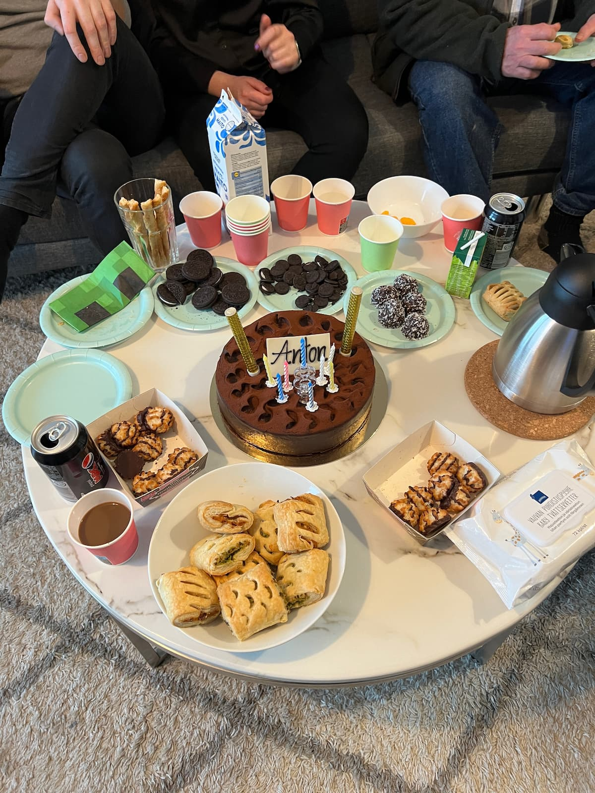
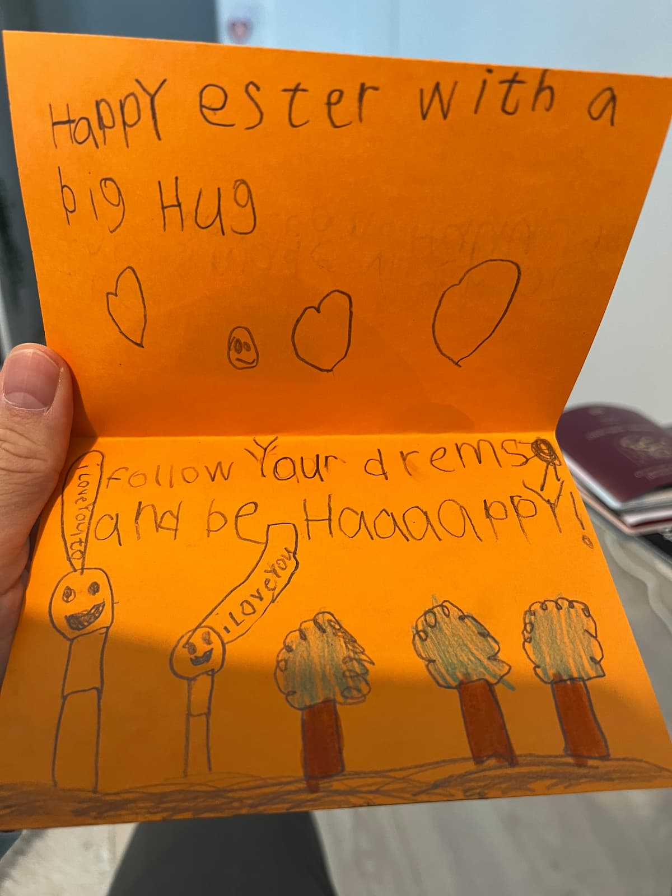
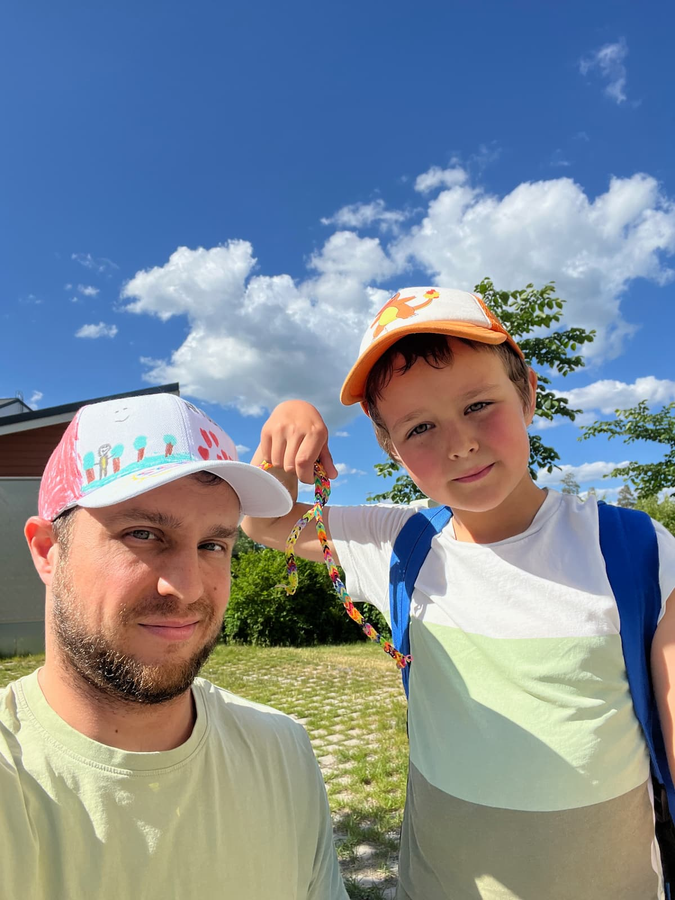

#### Table of contents

- [🖼️ Theme of the year and overview of the goals for 2024](#overview)
- [👨‍👦 Being a dad](#being-a-dad)
- [🏋️‍♂️ CrossFit progress](#crossfit)
- [🏃‍♂️ Helsinki Midnight Run](#midnight-run)
- [🍸 Sobreity continues](#sober)
- [🇪🇪 A couple of days in Tallinn](#tallinn)
- [🇧🇬 Trip to Bulgaria with Anton](#bulgaria)
- [🇨🇾 Trip to Cyprus for my sister's wedding](#cyprus)
- [🇪🇸 Trip to Tenerife](#tenerife)

- [🎞️ Movie review](#movie-review)
- [🥰 The moments that filled my soul](#filled-my-soul)
- [⬜ Goals for 2025](#goals)

### "💙 A heart and soul filling adventure called life!"

The older I get and the more I keep writing these posts each year, the more I put emphasize on happiness, fun, smiling, "filling your soul" with experiences. I'm pretty sure, years ago the first few of those posts had a heavy focus on skills. What skills were improved this past year? Now it's more about what is the most memorable thing that happened to you this past year. Which person made an impression on you? Did you make an impression on someone? How did you spend time with your son? Did you have fun?

The past few years have genuinely been getting better and better, and I remember clearly thinking to myself in the beginning of this year:

> "I sure hope 2024 will be amazing, and there are already a few things to look forward to, but there's no way in hell it could be better than 2023. 2023 was pretty freaking awesome!"

Well, I'm happy to report 2024 knocked it out of the park and it was indeed an absolutely amazing year and I'm so grateful for it! Hard to imagine, and I hope 2025 follows the same trend.

TODO: write a bit more

TODO: pic from screenshot of snatch lifting vid

And since we keep setting these goals, let's take a look at what I thought made sense to be pursued in the end of 2023.

### ⬜ Major goals:

- 🏊‍♂️ Train for Ironman 2025
- 🏋️‍♂️ CrossFit: 10 unbroken RMU, more Olympic weightlifting focus, HS walk fast and easy
- 🅠CrossFit Open: All 3 events
- 🏃‍♂️ Running: 10ks, Half Marathons
- 💪 CrossFit: participate in at least one competition event in Finland or abroad
- 🪜 Obstacle course racing: Tough Viking or otherwise, participate in at least one event
- 🗣️ Connect with people: dedicate time to friends old and new
- 🛳️ Longer trip 1 with Anton
- 🚙 Longer trip 2 with Anton
- 📠Resume writing my book - Born in Space
- 🧘‍♂️ Practice meditation for 1 month
- 🇨🇾 Cyprus solo trip
- 🇧🇬 Bulgaria solo trip

Some words on the topics. Train for Ironman, wow. I'm still into it, I'd still want to do it. "But why does it have to be before you're 40?" I remember Emmi asking me at the gym. What a really good question. I guess it doesn't, and honestly, it really doesn't. I'd still rather be **someone who completed an Ironman as opposed to someone who never tried to**. But we'll cross that bridge when we get there. I've marked it with yellow because I have worked on my swimming and my running this year. Some of those CrossFit goals were very arbitrary already when I put them on that list, but the reason why I've marked this item with green is because for RMU I've wanted to and I have increased the volume. There's still ways to go, but I'm comfortably jumping up and doing 3-4 unbroken RMU for a few rounds, and that's great! I absolutely put effort into olympic weightlifting and snatches really became one of my most favorite things to train, and HSW also has see a lot of effort put into it, been fun as hell!

I also managed to do all 3 CrossFit Open 2024 events, which I'm very happy about. The only thing that sucked was that my double unders really tanked my score on the 2nd workout and my total score as a result also. I still need to find a way to improve those! As far as running goes, I'm very happy I challenged myself with my first official run - the Helsinki Midnight run 10k. That was so much fun and such a vibe, happy I did it! More on that below. I did not participate in any CrossFit competitions yet, I'm not super sad I didn't, the right thing just didn't present itself, but I sure as heck want to do it, and I'll keep on being on the look out for a suitable opportunity. I did participate in a CrossFit training camp abroad, so that's maybe kind of counting for something, and it was amazing, so the full details - below. Ther was also no time and/or opportunity for obstacle course racing this year as well. Maybe in the future.

Connecting with people - this is such a big topic, I'll expand on it below but I'm happy I can consider it successful for this year, it was definitely one of the top 3 most important and soul filling things for me! We did 1 amazing, long and super fun trip with Anton that had many aspects to it, one of which was reconnecting with our roots. Great success! I did somewhat reboot writing my book - pleasantly surprised how much I had written (14 chapters about), and how the world building has been coming together. I'd love to continue with that. Even if it's at a slow pace. Meditation - nope. I'd still love to do it, it just never happens, but I'm sure it's gonna be one of those things - when its time comes, I'll do it. And Cyprus and Bulgaria trips both happened, not sure why I'd want them to be solo trips necessarily, they were both family trips - one with Anton and the other visiting my mom, dad and sister. It was great!

#### ◻️ Minor goals:

- 🍽️ Learn more about nutrition, track macros, and see where I'm at
- 🫠20 year highschool reunion
- 🥠Creative skill teaching with Anton: 3D modeling, video editing, game making
- 🀠Play basketball with Anton at the local school
- 🖼️ Go to more museums with Anton
- 🮠Participate in Ludum Dare game jam and make a small game with Anton
- 😄 Smile and have fun

I don't know why these "minor" goals are minor, they are every bit as important as the major ones, I'll probably change the format to only 1 list for next year. The only red item is the 20 year reunion and while yes, the FOMO was rocking me heavily and I would have loved to catch up with the highschool plebs, it wasn't meant to be, I found no suitable flights and quite frankly I chose and prefered to go to Bulgaria with my son a month later than when the reunion would have been.
I haven't still gotten into tracking macros, and frankly I might never get into that, but I have been paying attention and listening to my body and what it needs, supplementing and trying to fuel properly before more straneus workouts.

The playing basketball with Anton, going to museums and creative skills stuff makes me so, so happy and so, so proud of him! We've had so many small moments where we learn about touch typing on the keyboard, how to make games, he's been designing his own in Roblox, me helping out only every so often. He's also gotten much into video editing, we've been using CapCut for that on both his PC and his phone. I love it, that he finds and utilizes these creative outlets. Reminds me a lot of me as a kid writing fan fiction, making maps for games and what not. We did visit a bunch of museums which was fun, we did also "mini participate" in Ludum Dare in April - we made a small Unity game about zombies attacking a tower and the tower shooting at them, kind of like a tower defense type of game. We also did some Unity game making tutorials where we followed steps and learnt about programming among other things. So all in all very satisfied with the accomplished goals for this year!

### 2️⃣0️⃣2️⃣4️⃣

#### 👨‍👦 Being a dad

I feel so blessed and grateful for getting to experience what being a dad is. For many reasons, trying to be present and there for my kid when he needs me is super important for me. I remember and cherish so many memories with my dad, and in some ways I do wish he spent more time playing with me when I was little. We did play a lot of board games, he even created our own version of monopoly which turned out really cool. I also remember when he played StarCraft with me (I must have been 15 ish at the time). It was nice to spend some time with my dad this summer in Cyprus, for the first time in quite some time, perhaps 6 or so years.

I'm not sure where to even begin here; there's just quite a few things to cover. But let's break it down into a few main subtopics.

TODO:'

- shifting from some friends to others
- fortnite, making roblox games and updates, recording youtube videos
- reading books together
- what is the feeling of being a dad

##### The creativity angle...

##### A trip home...

##### CrossFit together

#### 🏋️‍♂️ CrossFit progress

TODO: add pics and video

The CrossFit progression this year has been pretty decent I'm sure, and at least it's felt like it. I don't necessarily have the numbers behind everything, but at least going forward, we'll have a comparision of the current state vs the previous year. The first few things that come to my mind are that for the first time ever I started supplementing creatine this year, although a pretty small amount really - 2.5g-3g per day, where the recommended dose is 5g. I can't say how much of the newly gained strength is accredited to it, but I'm sure it's helped a bit.

**One thing I've really wanted to do this year is to completely not use any non 22.5kg dumbells in workouts, and I'm happy I was able to achieve that.** For some movements that change has been easier, for others harder, perhaps the hardest thing still being dual DB thrusters, those are difficult to do for me with that weight, but doable in sets of 4 or so.

The CrossFit open has been important to me, I wanted to do all 3 events and I managed to do so. I'm happy with my performance in event 1 which was with a lot of DB snatches and burpees, I'm not happy with my performance in event 2 because my double unders were terrible, and I was tripping up even more than I do on average, it was trully bad and actually tanked my total score quite a lot. In event 3 I'm happy I was able to do the very heavy thrusters with 63kg, pretty proud of myself I was able to push through that and do some bar muscle ups. If BMUs were before the thrusters, I'd do even better but it is what it is.

Murph has been also very important to me and this year I did it for the first time with a 9kg vest. Finished with a score of `49:40` with the vest, vs the score from 2023 `44:10` without a vest. Very happy with that result. It was very challenging with the vest but I'm happy I was able to push through and finish it! Running with the vest was tricky, had to hold it for the sides which helped, push ups were so hard, pull ups - pretty easy, squats got a tiny bit heavy too.

My training schedule has been on average something along the lines of 6 days on week A and then 3 days on week B. Varying a bit here and there, but mostly something like that. And I kept doing some extra stuff at the gym after classes. I like that. Sure, it's not the most structured well of training, but it's fun for me and I'd like to keep the fun and not optimize the crap out of this hobby, burn out and quit. I'd rather keep showing up. This year one of my biggest focuses was the snatch. A bit less so the clean & jerk, ring muscle ups continue to be something I practice and I can comfily do sets of 3-5 for a few rounds, which I'm happy with, but of course, would love to get to 10 unbroken someday. Snatch has been my biggest love this year. **Super strongly influenced and inspired from watching our very own Bulgarian boys Karlos Nasar and Bozhidar Andreev win a number of international competitions, culminating with gold medal for Nasar at the olympics and a bronze for Andreev**. Super proud of them, and indeed super inspired watching their movement as well as many others on TikTok and Instagram distilling and following every part of the movement. I think I've really come a long way this year, but there's still a ton more to work on.

One thing that "dawned on me" around the middle of the year and I started thinking about a lot was what I call "champion mentality" or "athlete mentality". I noticed a couple of times I could push through the discomfort even further and do more. A couple of times I didn't push enough and thought after the workout was finished that I could have pushed more. So it's all about the realisation that **sometimes, no matter how hard it is, you can brace yourself and keep going for a bit longer and sooner rather than later it's all done. That, and "how bad do you want it?"**. That question is fundamental to some of the bigger successes and every time I've been able to do that, I've been very happy after, cause of course it doesn't feel good at the moment, but heck, it feels AWESOME afterwards!

Another big revelation for me was that I used to think that "things will surely get easier someday since I'm training, so in the future it will be easy". That's really not it. It's not gonna get easier. **It's all about how much pain and for how long you can tolerate while doing work.** And I really like that revelation. It completely gets rid of the expectation that there ever will be a workout where it will be "easy". It's ok to be hard, manage it and push through!

I've a number of small wins which I'm very proud of. For example going for 30 unbroken butterfly pull ups during the first Jackie test! Doing 20 unbroken bar muscle ups during the pulling test. Getting up to 72kg snatch. Apparently I've noted 50kg for the snatch towards the beginning of the year. And 75kg for the clean & jerk, and now that's at 95kg. Handstand walk progression keeps getting better which is nice! Very happy with all of those!

The training camp in Tenerife was an entire thing of its own, super amazing to train with legends like Jonne Koski and Emilia Leppänen, but more on that in its own section below as it was trully incredible!

Some stats as of December 2024:

| Movement      | Score                       | Movement | Score |
| ------------- | --------------------------- | -------- | ----- |
| Snatch        | 72kg                        | BMU      | 20    |
| Clean & Jerk  | 95kg                        | RMU      | 5     |
| Clean         | 108kg                       | Murph    | 49:40 |
| Backsquat     | 142kg                       |          |       |
| CrossFit Open | TODO: dig out correct score |          |       |
| Jackie        | 6:37                        |          |       |
| DT            | 8:15 @ 50kg                 |          |       |
| Bac           | 8:15 @ 50kg                 |          |       |

To top it all off, I was awarded the "most improved athlete" in our gym for 2024, something, that means the world to me! I so, so much appreciate this! It's hard to put it in words how much this means to me!

<video controls preload="metadata" autoplay muted playsinline>
  <source src="my-2023-year-in-review-5.webm" type="video/webm">
  <source src="my-2023-year-in-review-5.mp4" type="video/mp4">
  Your browser does not support webm videos.
</video>

#### 🏃‍♂️Helsinki Midnight run

Helsinki Midnight run was my first ever official 10k run and it changed how I look at some Helsinki city streets forever! I remember that evening very clearly and vividly. It was such an amazing experience! Despite it being mid september, the temperature was relatively high and there was no wind, that was absolutely key, because there was however a torrential downpour. Only slightly exaggerated, but all jokes aside, it was proper raining. I have never been more soaked in my entire life, there was quite literally nothing dry on me, yet, thanks to the lack of nasty cold wind and thanks to the relatively warm temperature around 15-19 degrees.

The square was full of people, thousands of, the event was soon about to start, rain was pouring down, yet everyone was hyped up. I remember chatting with my collegue Era, who also signed up and was about to run the event, wishing each other good luck. And soon, we were off to the races. Because of the bottleneck due to the amount on people on the first couple of kilometers I was somewhat forced to start much slower than I normally would, however, I think that was great and it played a huge role in me being able to finish the race the way I wanted, because thanks to that, I was a lot less gassed out by the time I reached the 4th and 5th kilometer. The course was awesome, taking me to a place I like a lot, down to Eira, close to my CrossFit gym, throught parks, past the sea, slowly and steadily moving along with some interesting stalls every 1 kilometer or so. Some checkpoints had a DJ playing music, a couple were aid stations. The vibe was on, people were running and enjoying.

**I became one with the water**. Really lol! Jumping in and out of puddles, water splashing, but it trully and really did not matter, in a weird way it felt so freeing, the only thing that mattered was to just keep running. The pace was nice and pushing, but being able to breathe, good for me for sure. Soon we rolled out past the Silja line boat, then down around Kauppatori and went into Vanha satama and around that island / peninsula. That was somewhat the final stretch. I was able to push and increase the pace the last 2 kilometers too I think, only the last 1km my left knee started to be a bit iffy, so I was hoping it would all be fine until the finish line and thankfully it was! So I finished with a time of `54:08` and was so happy! My secret goal was sub 1 hour, but sub 55min plesantly surprised me even more!

TODO: pic 1 of the strava

TODO: pic 2 of the finish screenshot

TODO: vid 1 of the pre event

TODO: vid 2 of the during and after event, 6s clip

#### 🸠Sobreity continues

I'm not sure what to add to this section, just wanna mention that it carries on, and I like it. I've been to a lot of social events, big and small, with a person or many, or with hundreds, and yeah so far this is ok. The weird social understanding that the only way to have fun is to drink alcohol (as ancient as this may be, predating ancient Roman times etc.), that has to go. I've seen it time and time again that it's absolutely unnecessary, luckily, I'm more and more surrounded by very like-minded people and I absolutely LOVE THIS. It feels awesome! So many ways of having fun in life, you don't need to drink in order to hit the dancefloor and dance, to joke around and have fun chatting or anything else in between.

#### 🇪🇪 A couple of days in Tallinn

The first adventure and a mini trip this year was to Tallinn, Estonia. I hadn't gone there since 2012, funnily enough, even if it's so close and just a 2 hour boat ride away. So super randomly, I did go this year. There was a long weekend opportunity around the 1st of May, so I took it and went to Tallinn for a few days. What was funny about the weather this year, was that all the way till the end of April we had snow, and then in May we went instantly into summer, quite literally there was no spring in between, but hey, I appreciate the warm May for sure. So I got good weather in Tallinn as well. The trip was a lot of fun with visiting 2 of the local CrossFit boxes on different days, some stake dinner out in Town, massages, relaxing, tons of walking around 20k steps per day, enjoying the sun and the athmosphere of old town Tallinn among other things. It was funny to see Elisa and Prisma shops in there as well, and despite being there only 2-3 days, this time I got really kind of immersed in it, as much as possible, despite the short trip. Just being out and about, being present, exploring, walking, talking makes all the difference and gives a whole other angle to travelling.

TODO: picture gallery

#### 🇧🇬 Trip to Bulgaria with Anton

TODO:

#### 🇨🇾 Trip to Cyprus for my sister's wedding

TODO:

#### 🇪🇸 Trip to Tenerife

TODO:

#### 🎞️ Movie review

It's not been the best year to watch nice movies in a cinema theater, so the list is MUCH sorter than last year's

| Movie title                     | My rating |
| ------------------------------- | --------- |
| Agent Argylle                   | 8/10      |
| The beekeeper                   | 7/10      |
| Dune 2                          | 10/10     |
| Kung Fu Panda 4 (with Anton)    | 8/10      |
| Godzilla x Kong: The New Empire | 5/10      |
| Civil War                       | 3/10      |
| The Fall Guy                    | 7/10      |
| Furiousa                        | 8/10      |
| Deadpool & Wolverine            | 10/10     |

Agent Argylle - funny, ok, The beekeeper - classic Stathem movie, Dune 2 - absolutely amazing and epic, exactly what I'd love to see in the cinema, Kung Fu Panda 4 - nice, entertaining. Godzilla x Kong - i wasn't sure what I had just seen, what was that. Civil War sounded very promising as a title, but the delivery was absolutely underwhelming and the ending was terrible lol. The Fall Guy was some take on a rom com, ok-ish. Furiousa was rather ok. Deadpool pleasantly surprised me by a long shot. Very, very funny movie, pretty nice!

I did rewatch some TV series this year, which I hadn't rewatched in a while or in some cases ever. Better Call Saul, Breaking Bad, Game of Thrones, Gotham are some of those.

#### The moments that filled my soul

- An afternoon in the sun
- a 6 hour chat :D
- Some dates?

TODO:

#### Connecting with people

- dates; anette
- anya in the plane
- new people in our gym and pizza, sauna

#### Looking for "My People"

#### Dating lol

### 2️⃣0️⃣2️⃣5️⃣

### ⬜ Goals:

- 📝 Continue slowly writing my book - Born in Space
- 🏊‍♂️ Continue training for Ironman someday
- 🏃‍♂️ Run half marathon
- 🏅 CrossFit Open: All 3 events (with better DUs)
- 🦺 CrossFit Murph: vest again and slightly better time
- 💪 Participate in a CrossFit competition if opportunity presents itself
- 🗣️ Connect with people: dedicate time to friends old and new
- 🛳️ Awesome vacation with Anton (Bulgaria, Greece, else)
- 🏋️‍♀️ Training camp or training vacation?
- 🧘 Do a bit of yoga
- 🧎 Try meditation
- 🏀 Continue Basketball, table tennis, CrossFit, Swimming with Anton
- 🎥 Creative skill teaching with Anton: video editing, game making, AI
- 🥯 Continue some of our baking attempts with Anton
- 😄 Smile and have fun

TODO: write

[0]: Linkslist
[1]: https://www.youtube.com/watch?v=GS7M6s2xXfs

TODO: All photos in D drive

YIR: xfit new people joining from other gym, swim workout, (hang outs in the social section)

TODO: Fix top nav to have the same sections so we can find the content

TODO: proof read
TODO: spell check
