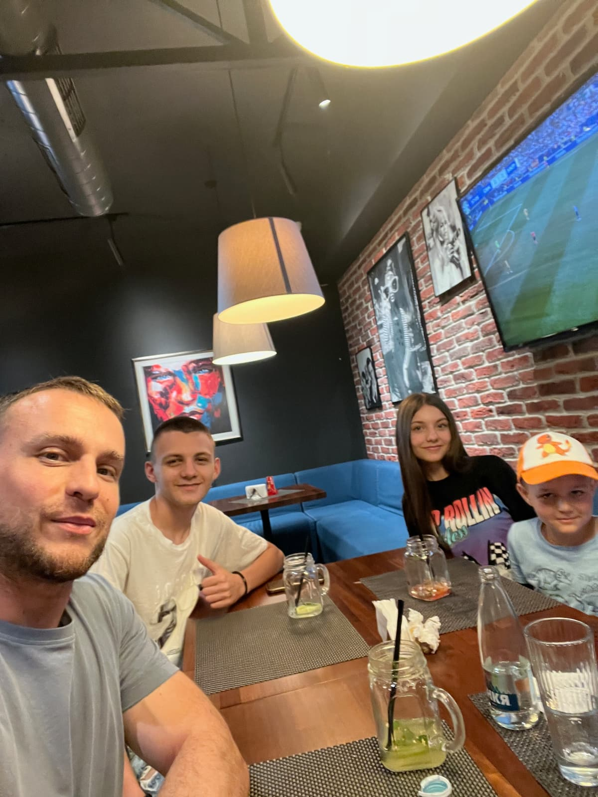
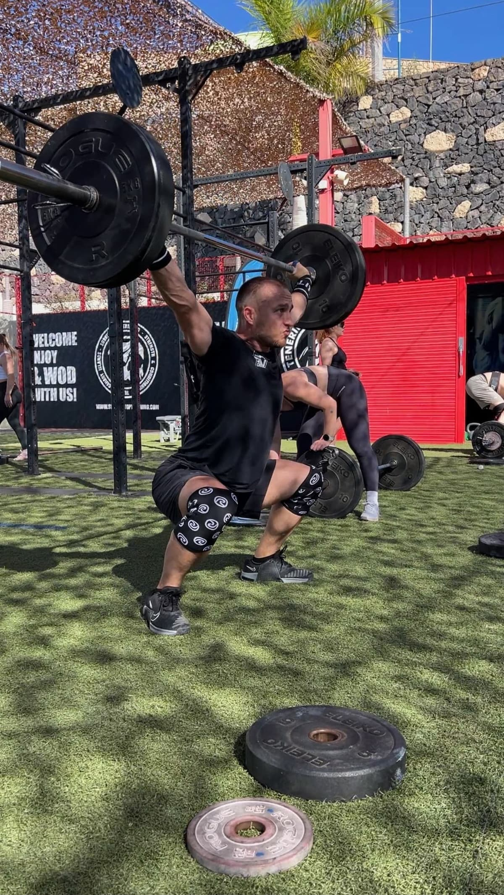
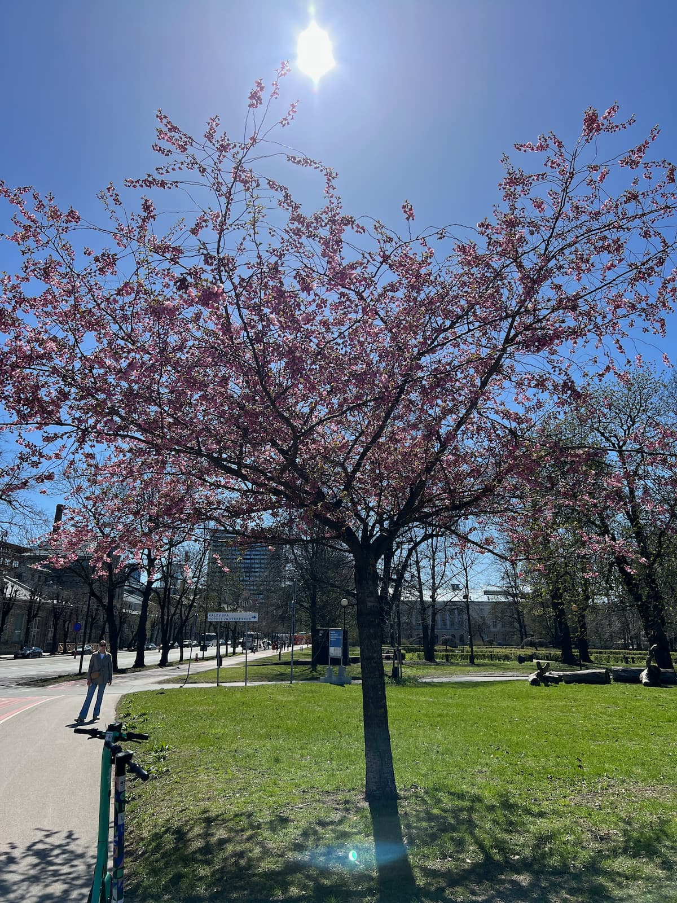
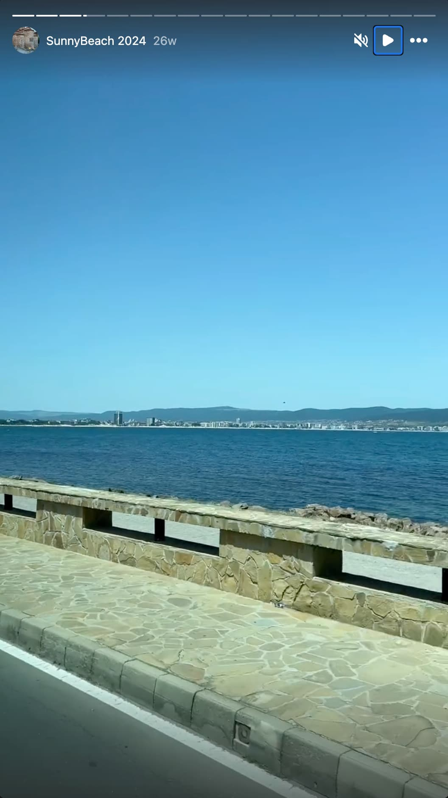
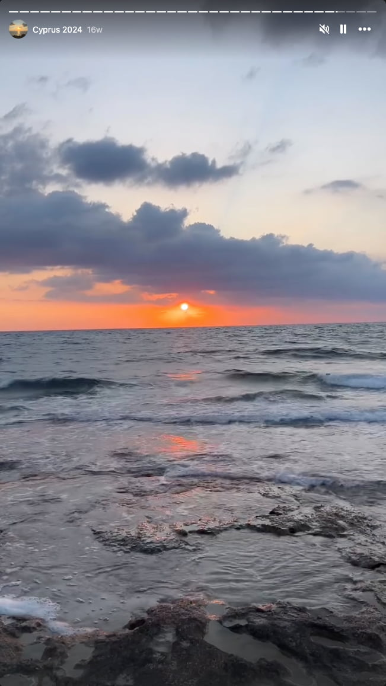

#### Table of contents

- [🖼️ Theme of the year and overview of the goals for 2024](#overview)
- [👨‍👦 Being a dad](#being-a-dad)
- [🏋️‍♂️ CrossFit progress](#crossfit)
- [🏃‍♂️ Helsinki Midnight Run](#midnight-run)
- [🍸 Sobreity continues](#sober)
- [🇪🇪 A couple of days in Tallinn](#tallinn)
- [🇧🇬 Trip to Bulgaria with Anton](#bulgaria)
- [🇨🇾 Trip to Cyprus for my sister's wedding](#cyprus)
- [🇪🇸 Trip to Tenerife](#tenerife)
- [🎞️ Movie review](#movie-review)
- [❓ Other topics](#other-topics)
- [⬜ Goals for 2025](#goals)

### "💙 A heart and soul filling adventure called life!"

The older I get and the more I keep writing these posts each year, the more I emphasize happiness, fun, smiling, and "filling your soul" with experiences. I'm pretty sure, years ago the first few of those posts had a heavy focus on skills. What skills were improved this past year? Now it's more about what is the most memorable thing that happened to you this past year. Which person made an impression on you? Did you make an impression on someone? How did you spend time with your son? Did you have fun?

The past few years have genuinely been getting better and better, and I remember clearly thinking to myself at the beginning of this year:

> **"I sure hope 2024 will be amazing, and there are already a few things to look forward to, but there's no way in hell it could be better than 2023. 2023 was pretty freaking awesome!"**

Well, I'm happy to report that 2024 knocked it out of the park it was indeed an absolutely amazing year and I'm so grateful for it! Hard to imagine, yet, I hope 2025 follows the same trend.

It's funny how our priorities in life phase and change over time. Sometimes things that seemed most important before no longer feel so, and new desires and ideas come up if we are open to them. I like that.

And since we keep setting these goals, let's take a look at what I thought made sense to be pursued at the end of 2023.

### ⬜ Major goals for 2024:

- 🏊‍♂️ Train for Ironman 2025
- 🏋️‍♂️ CrossFit: 10 unbroken RMU, more Olympic weightlifting focus, HS walk fast and easy
- 🏅 CrossFit Open: All 3 events
- 🏃‍♂️ Running: 10ks, Half Marathons
- 💪 CrossFit: participate in at least one competition event in Finland or abroad
- 🪜 Obstacle course racing: Tough Viking or otherwise, participate in at least one event
- 🗣️ Connect with people: dedicate time to friends old and new
- 🛳️ Longer trip 1 with Anton
- 🚙 Longer trip 2 with Anton
- 📝 Resume writing my book - Born in Space
- 🧘‍♂️ Practice meditation for 1 month
- 🇨🇾 Cyprus solo trip
- 🇧🇬 Bulgaria solo trip

Some words on the topics. Train for Ironman, wow. I'm still into it, I'd still want to do it. "But why does it have to be before you're 40?" I remember Emmi asking me at the gym. What a really good question. I guess it doesn't, and honestly, it really doesn't. I'd still rather be **someone who completed an Ironman as opposed to someone who never tried to**. But we'll cross that bridge when we get there. I've marked it with yellow because I have worked on my swimming and my running this year. Some of those CrossFit goals were very arbitrary already when I put them on that list, but the reason why I've marked this item with green is because for RMU I've wanted to and I have increased the volume. There are still ways to go, but I'm comfortably jumping up and doing 3 - 4 unbroken RMU for a few rounds, and that's great! I absolutely put effort into Olympic weightlifting and snatches became one of my most favorite things to train, and HSW also has seen a lot of effort put into it, been fun as hell!

I also managed to do all 3 CrossFit Open 2024 events, which I'm very happy about. The only thing that sucked was that my double unders really tanked my score on the 2nd workout and my total score as a result also. I still need to find a way to improve those! As far as running goes, I'm very happy I challenged myself with my first official run - the Helsinki Midnight Run 10k. That was so much fun and such a vibe, happy I did it! More on that below. I have not participated in any CrossFit competitions yet, I'm not super sad I didn't, the right thing just didn't present itself, but I sure as heck want to do it, and I'll keep on being on the lookout for a suitable opportunity. I did participate in a CrossFit training camp abroad, so that's maybe kind of counting for something, and it was amazing, so the full details - below. There was also no time and/or opportunity for obstacle course racing this year as well. Maybe in the future.

Connecting with people - this is such a big topic, I'll expand on it below but I'm happy I can consider it successful for this year, it was definitely one of the top 3 most important and soul-filling things for me! We did 1 amazing, long, and super fun trip with Anton that had many aspects to it, one of which was reconnecting with our roots. Great success! I did somewhat reboot writing my book - pleasantly surprised by how much I had written (14 chapters about), and how the world-building has been coming together. I'd love to continue with that. Even if it's at a slow pace. Meditation - nope. I'd still love to do it, it just never happens, but I'm sure it's gonna be one of those things - when its time comes, I'll do it. And Cyprus and Bulgaria trips both happened, not sure why I'd want them to be solo trips necessarily, they were both family trips - one with Anton and the other visiting my mom, dad, and sister. It was great!

#### ◻️ Minor goals for 2024:

- 🍽️ Learn more about nutrition, track macros, and see where I'm at
- 🏫 20 year highschool reunion
- 🎥 Creative skill teaching with Anton: 3D modeling, video editing, game making
- 🏀 Play basketball with Anton at the local school
- 🖼️ Go to more museums with Anton
- 🎮 Participate in Ludum Dare game jam and make a small game with Anton
- 😄 Smile and have fun

I don't know why these "minor" goals are minor, they are every bit as important as the major ones, I'll probably change the format to only 1 list for next year. The only red item is the 20-year reunion and while yes, the FOMO was rocking me heavily and I would have loved to catch up with the high school plebs, it wasn't meant to be, I found no suitable flights and quite frankly I chose and preferred to go to Bulgaria with my son a month later than when the reunion would have been.
I haven't still gotten into tracking macros, and to be honest, I might never get into that, but I have been paying attention and listening to my body and what it needs, supplementing, and trying to fuel properly before more strenuous workouts.

Playing basketball with Anton, going to museums, and doing creative skills stuff makes me so, so happy and so, so proud of him! We've had so many small moments where we learn about touch typing on the keyboard, and how to make games, he's been designing his own in Roblox, and me helping out only every so often. He's also gotten much into video editing, we've been using CapCut for that on both his PC and his phone. I love, that he finds and utilizes these creative outlets. Reminds me a lot of me as a kid writing fan fiction, making maps for games, and whatnot. We did visit a bunch of museums which was fun, we did also "mini participate" in Ludum Dare in April - we made a small Unity game about zombies attacking a tower and the tower shooting at them, kind of like a tower defense type of game. We also did some Unity game-making tutorials where we followed steps and learned about programming among other things. So all in all very satisfied with the accomplished goals for this year!

### 2️⃣0️⃣2️⃣4️⃣

#### 👨‍👦 Being a dad

I feel so blessed and grateful for getting to experience what being a dad is. For many reasons, trying to be present and there for my kid when he needs me is super important for me. I remember and cherish so many memories with my dad, and in some ways I do wish he spent more time playing with me when I was little. We did play a lot of board games, he even created our own version of monopoly which turned out really cool. I also remember when he played StarCraft with me (I must have been 15 ish at the time). It was nice to spend some time with my dad this summer in Cyprus, for the first time in quite some time, perhaps 6 or so years.

I'm not sure where to even begin here; there's just quite a few things to cover. And everyday I get to spend with my kid is a gift, and I appreciate it immensely. It sucks to not be able to be there with him every single day, that will always be something that bugs me, but for what it is, I think we're making the best out of the situation we have.

From going to museums, chatting about space, reading books together, playing games together, table tennis, badminton, crossfit together, so many important and cherished moments I could never put into words. It's interesting watching him grow up, asking more and more interesting questions as he moves through the adventure called life.

I try my best to "teach creativity" or at least the desire to explore and create stuff in various forms - for example making games, putting things together, building stuff. We do that a lot in Minecraft, this year we also did that via a few Unity game engine tutorials we followed together and we made a couple of small games, one of which is even live on his site - https://antonyanev.com.

As a dad I'd like to show him so many things about life just to create an environment to explore and choose a path forward for himself. However, if there's one thing, well really 3 things, I'd like to tell my son, these are:

**Travel, read books and create meaningful connections with people**

#### 🏋️‍♂️ CrossFit progress

The CrossFit progression this year has been pretty decent I'm sure, and at least it's felt like it. I don't necessarily have the numbers behind everything, but at least going forward, we'll have a comparision of the current state vs the previous year. The first few things that come to my mind are that for the first time ever I started supplementing creatine this year, although a pretty small amount really - 2.5g-3g per day, where the recommended dose is 5g. I can't say how much of the newly gained strength is accredited to it, but I'm sure it's helped a bit.

**One thing I've really wanted to do this year is to completely not use any non 22.5kg dumbells in workouts, and I'm happy I was able to achieve that.** For some movements that change has been easier, for others harder, perhaps the hardest thing still being dual DB thrusters, those are difficult to do for me with that weight, but doable in sets of 4 or so.

The CrossFit open has been important to me, I wanted to do all 3 events and I managed to do so. I'm happy with my performance in event 1 which was with a lot of DB snatches and burpees, I'm not happy with my performance in event 2 because my double unders were terrible, and I was tripping up even more than I do on average, it was trully bad and actually tanked my total score quite a lot. In event 3 I'm happy I was able to do the very heavy thrusters with 63kg, pretty proud of myself I was able to push through that and do some bar muscle ups. If BMUs were before the thrusters, I'd do even better but it is what it is.

Murph has been also very important to me and this year I did it for the first time with a 9kg vest. Finished with a score of `49:40` with the vest, vs the score from 2023 `44:10` without a vest. Very happy with that result. It was very challenging with the vest but I'm happy I was able to push through and finish it! Running with the vest was tricky, had to hold it for the sides which helped, push ups were so hard, pull ups - pretty easy, squats got a tiny bit heavy too.

My training schedule has been on average something along the lines of 6 days on week A and then 3 days on week B. Varying a bit here and there, but mostly something like that. And I kept doing some extra stuff at the gym after classes. I like that. Sure, it's not the most structured well of training, but it's fun for me and I'd like to keep the fun and not optimize the crap out of this hobby, burn out and quit. I'd rather keep showing up. This year one of my biggest focuses was the snatch. A bit less so the clean & jerk, ring muscle ups continue to be something I practice and I can comfily do sets of 3-5 for a few rounds, which I'm happy with, but of course, would love to get to 10 unbroken someday. Snatch has been my biggest love this year. **Super strongly influenced and inspired from watching our very own Bulgarian boys Karlos Nasar and Bozhidar Andreev win a number of international competitions, culminating with gold medal for Nasar at the olympics and a bronze for Andreev**. Super proud of them, and indeed super inspired watching their movement as well as many others on TikTok and Instagram distilling and following every part of the movement. I think I've really come a long way this year, but there's still a ton more to work on.

One thing that "dawned on me" around the middle of the year and I started thinking about a lot was what I call "champion mentality" or "athlete mentality". I noticed a couple of times I could push through the discomfort even further and do more. A couple of times I didn't push enough and thought after the workout was finished that I could have pushed more. So it's all about the realisation that **sometimes, no matter how hard it is, you can brace yourself and keep going for a bit longer and sooner rather than later it's all done. That, and "how bad do you want it?"**. That question is fundamental to some of the bigger successes and every time I've been able to do that, I've been very happy after, cause of course it doesn't feel good at the moment, but heck, it feels AWESOME afterwards!

Another big revelation for me was that I used to think that "things will surely get easier someday since I'm training, so in the future it will be easy". That's really not it. It's not gonna get easier. **It's all about how much pain and for how long you can tolerate while doing work.** And I really like that revelation. It completely gets rid of the expectation that there ever will be a workout where it will be "easy". It's ok to be hard, manage it and push through!

I've a number of small wins which I'm very proud of. For example going for 30 unbroken butterfly pull ups during the first Jackie test! Doing 20 unbroken bar muscle ups during the pulling test. Getting up to 72kg snatch. Apparently I've noted 50kg for the snatch towards the beginning of the year. And 75kg for the clean & jerk, and now that's at 95kg. Handstand walk progression keeps getting better which is nice! Very happy with all of those!

The training camp in Tenerife was an entire thing of its own, super amazing to train with legends like Jonne Koski and Emilia Leppänen, but more on that in its own section below as it was trully incredible!

Some stats as of December 2024:

| Movement       | Score | Movement      | Score             |
| -------------- | ----- | ------------- | ----------------- |
| Snatch         | 72kg  | BMU           | 20                |
| Clean & Jerk   | 95kg  | RMU           | 5                 |
| Clean          | 108kg | Murph         | 49:40             |
| Back squat     | 142kg | CrossFit Open | ~ 65th percentile |
| Front squat    | 125kg | Jackie        | 6:37              |
| Deadlift       | 155kg | DT            | 8:15 @ 50kg       |
| Shoulder press | 70kg  |               |                   |

To top it all off, I was awarded the "most improved athlete" in our gym for 2024, something, that means the world to me! I so, so much appreciate this! It's hard to put it in words how much this means to me!

And some more training related pics without which any improvement would not be possible. Special credit to the training clothes laundry and grocery lists 😅

   TikTok videos:

#### 🏃‍♂️Helsinki Midnight run

Helsinki Midnight run was my first ever official 10k run and it changed how I look at some Helsinki city streets forever! I remember that evening very clearly and vividly. It was such an amazing experience! Despite it being mid september, the temperature was relatively high and there was no wind, that was absolutely key, because there was however a torrential downpour. Only slightly exaggerated, but all jokes aside, it was proper raining. I have never been more soaked in my entire life, there was quite literally nothing dry on me, yet, thanks to the lack of nasty cold wind and thanks to the relatively warm temperature around 15-19 degrees.

The square was full of people, thousands of, the event was soon about to start, rain was pouring down, yet everyone was hyped up. I remember chatting with my collegue Era, who also signed up and was about to run the event, wishing each other good luck. And soon, we were off to the races. Because of the bottleneck due to the amount on people on the first couple of kilometers I was somewhat forced to start much slower than I normally would, however, I think that was great and it played a huge role in me being able to finish the race the way I wanted, because thanks to that, I was a lot less gassed out by the time I reached the 4th and 5th kilometer. The course was awesome, taking me to a place I like a lot, down to Eira, close to my CrossFit gym, throught parks, past the sea, slowly and steadily moving along with some interesting stalls every 1 kilometer or so. Some checkpoints had a DJ playing music, a couple were aid stations. The vibe was on, people were running and enjoying.

**I became one with the water**. Really lol! Jumping in and out of puddles, water splashing, but it trully and really did not matter, in a weird way it felt so freeing, the only thing that mattered was to just keep running. The pace was nice and pushing, but being able to breathe, good for me for sure. Soon we rolled out past the Silja line boat, then down around Kauppatori and went into Vanha satama and around that island / peninsula. That was somewhat the final stretch. I was able to push and increase the pace the last 2 kilometers too I think, only the last 1km my left knee started to be a bit iffy, so I was hoping it would all be fine until the finish line and thankfully it was! So I finished with a time of `54:08` and was so happy! My secret goal was sub 1 hour, but sub 55min plesantly surprised me even more!

#### 🍸 Sobreity continues

I'm not sure what to add to this section, just wanna mention that it carries on, and I like it. I've been to a lot of social events, big and small, with a person or many, or with hundreds, and yeah so far this is ok. The weird social understanding that the only way to have fun is to drink alcohol (as ancient as this may be, predating ancient Roman times etc.), that has to go. I've seen it time and time again that it's absolutely unnecessary, luckily, I'm more and more surrounded by very like-minded people and I absolutely LOVE THIS. It feels awesome! So many ways of having fun in life, you don't need to drink in order to hit the dancefloor and dance, to joke around and have fun chatting or anything else in between.

#### 🇪🇪 A couple of days in Tallinn

The first adventure and a mini trip this year was to Tallinn, Estonia. I hadn't gone there since 2012, funnily enough, even if it's so close and just a 2 hour boat ride away. So super randomly, I did go this year. There was a long weekend opportunity around the 1st of May, so I took it and went to Tallinn for a few days. What was funny about the weather this year, was that all the way till the end of April we had snow, and then in May we went instantly into summer, quite literally there was no spring in between, but hey, I appreciate the warm May for sure. So I got good weather in Tallinn as well. The trip was a lot of fun with visiting 2 of the local CrossFit boxes on different days, some stake dinner out in Town, massages, relaxing, tons of walking around 20k steps per day, enjoying the sun and the athmosphere of old town Tallinn among other things. It was funny to see Elisa and Prisma shops in there as well, and despite being there only 2-3 days, this time I got really kind of immersed in it, as much as possible, despite the short trip. Just being out and about, being present, exploring, walking, talking makes all the difference and gives a whole other angle to travelling.

#### 🇧🇬 Trip to Bulgaria with Anton

It was soon going to be time for Anton to go on a well deserved vacation from school, and also it would be time for our Bulgarian trip! I was pretty excited about this one, most of all, because the previous year we had done a couple of shorter trips now, and that really validated and confirmed that Anton ws beyond ready for even bigger adventures. That and the fact we were going to visit the homeland, made it extra exciting, so soon the time came and we left. We had a nice trip, Anton made some friends on the plane, chatted with a boy his age, they played some games on their phones and talked in Swedish and English. I had arranged a transport for us from the Sofia airport to our apartment in Plovdiv and it all went pretty smooth, so around 11 something in the night we were home. We were kind of hungry so we even went to get a delicious kebab before hitting the sack. That first night was so hard for both of us to sleep as we weren't used to the heat just yet and the Plovdiv apartment has no AC. The funny thing is that after a couple of days we got used to it and slept just fine. But mid June temperatures in Bulgaria are not to be underestimated, if you've been living in a cold country like Finland for the past 10 years.
Another interesting thing was that there had been aparently an earthquake of 4.3 in Plovdiv a bit before we landed in Sofia.

I'm not gonna go over the entire trip, I have those days written in separate private posts, which I may or may not publish someday, but I wanna mention some of the highlights. Perhaps the biggest and most important was to see little man connect with his homeland. He was instantly used to most things, it's hard to describe in words what exactly, but the basic idea is that this is half his herritage and he should be feeling that and exploring that part too. And so we did. It was amazing to catch up with friends and family, awesome to see Anton hanging out and playing with Damian - the son of a friend of mine, but they played very nicely together and had fun! It was nice to see my cousin's kids and hang out with them a bit, they are so big nowadays, and see Anton chat a bit with them too! The future generation, what a great bunch of kids!

We did so much exploring of Plovdiv, ancient roman amphitheater, ancient roman stadium, old town of Plovdiv, city center, central park, the hills, the kids' train in the youth's hill, natural history museum, the artsy Kapana neighbourhood and just wandering about and taking the city in. **Plovdiv has always had that SPECIAL vibe, that AILYAK, that's impossible to describe but makes you relax and chill like nowhere else.** Just being at peace, exploring the city and taking part in various events around the city center, which seem to happen every day of the week in the summer. I always used to say that I don't miss Bulgaria that much, as much as I miss Plovdiv. It is the most special place for me and it will always be so! In the end, it was nice to hear Anton blurt out: "Dad, can't we live in Plovdiv and just go to Finland every once in a while?" while we were saying goodbye to his "2nd cousins". Of course we can son, why not, who knows. We got a bit emotional saying goodbye to the bear in the Central Park, but it was just a goodbye for now.

We had been reading the Winnie the Pooh books lately and we liked the characters a lot, so the story about how we got Eeyorie was very special to us. We basically played this claw machine and with 2 coins of 1 lev each (2lv = 1euro) we got 3 plushies out of the machine, which was insane. 3 plushies out of 5 tries, and 1 of those was a super cute Eeyorie!

After a week in Plovdiv the trip continued with a week by the sea side at the Black sea coast, specifically in Melia in Sunny Beach. We had a really nice time there too! It was awesome to go to a sea with nice warm water, splash in the waves, swim, relax on the beach, enjoy good food, chill. I think we both really enjoyed that. Going to the beach twice per day, exploring around in the evenings a bit too, including the beautiful Nessebar near by, making friends with our cat friend in the hotel, taking pictures with parrots, riding double deckers, taking pictures, among other things.

The last part of our adventure tooks us to Sofia for a couple of days, which were also pretty enjoyable. We had a nice airbnb right in the center, not too far off the National Palace of Culture, which gave us easy access to some nice parks close by, as well as the Vitosha boulevard where you could just stroll down the pedestrian street and explore the center of Sofia so to speak. Sofia's a big city, obviously, but still, we managed to walk around quite a bit during the two days there, had some nice classic Bulgarian "mekitzi" for breakfast (deep fried pastry with some topings), took a lot of pictures and saw some of the key points, including the St Alexander Nevski Cathedral.

Finally, at the airport we had an interesting situation where we found the perfect Pooh plushie too!

All in all, two weeks of adventure and fun exploring our other homeland 💙!

   Instagram stories from the trip (Plovdiv, Sunny Beach, Sofia):

#### 🇨🇾 Trip to Cyprus for my sister's wedding

The Cyprus trip and how it worked out, I'm very happy with. On one hand, it was planned very much ahead of time - I had promised my sister I'd go there for her wedding, already in January. On the otherhand, because of hassles with dates and uncertainty, I still didn't even have tickets a few weeks before that. Luckily, I was able to get a flight at a decent date so I was there a day before the wedding, then I stayed in total for a week to catch up and see my family.

Landing in Larnaca is always interesting, mainly because it reminds me of the time I lived there, 3 summers in total: 2010, 2011, 2012. I'm not gonna go on a tangent to talk about that time, it had its challenges and ups and downs. But whatever the case, it was an important part of my life and if we consider consequences of actions, perhaps, one of the, if not THE most important time of my life as it would turn out, as that's how back then I met Anton's mom. Anywho, my mom came to pick me up from the airport, which was really nice to see her then, we had a bit of food, relaxed, chatted, and the adventure began. Quickly got a bus for Limassol where soon after we transfered to another bus all the way to Paphos, essentially traversing the entire island east to west within the span of a few hours.

I got soon to see my sister and my dad too and the poodle Erika. Fun times. The weather was great, just how I like it, nice and hot, absolutely love that!

The following day we had the wedding and everything went fine, without major issues. There was some minor hassle around the church ceremony, but luckily everything fell nicely into place and went smoothly. The wedding entourage was a colorful bunch, speaking 4 languages, quite a mixed bag and hell of fun 😅. There were people speaking Bulgarian, Greek, English and French. Really quite the funny mix and we had fun anyway!

The rest of the trip was hanging out with my family, going to the beach to make the most of it - very pleasant to swim in that water, the Mediterranean is nice and warm in the end of August, and very clear so with a pair of swimming goggles, very pleasant to dive and explore a bit too. I did some really nice long-ish freestyle swims and got some tan, gotta love it. A part of me wished I brought Anton with me, but his school had started so that wouldn't have worked out. All in all, in the end it worked out really well, main goal was accomplished of attending the wedding, and as a bonus getting some sun and swimming was a nice touch too.

   Instagram stories from the trip:

#### 🇪🇸 Trip to Tenerife

The Tenerife training camp with Jonne Koski was one of the most amazing things that's happened to me in quite a while. The main reason why was the complete mix of how everything worked out. But first, a sentence on how we got there. It's actually a relatively short story - in March a collegue of mine at work told me about the existence of these "training holidays" and it sounded to me like such a smart and cool idea - you go somewhere on vacation, but in addition to getting the sun, sea and nice food, you also get to focus on training in decent facilities and have fun with like-minded people. I checked a couple of such trips online, but hadn't decided on anything, although there were a couple in May I was eyeing. **And then came the post from either Jonne Koski or Turkutuomiopaivat in Instagram**. I think I booked it instantly when I saw it. Not only was it exactly the same concept as what I had now been searching for, but on top of it all you got to do it alongside CrossFit Games athlete Jonne Koski! Holy moly! I was super excited, so despite the event being all the way in November and therefor meaning I had to wait for 6+ months, I signed up regardless, it sounded like a perfect fit. **And the best part about it is that now, in hindsight, yes, it was a perfect fit and beyond!** This event made me so happy on so many levels!

The trip there was nice, I ended up chatting for nearly the entire flight with this nice Ukranian lady. It's not often you meet people that match you in vibe and energy, so that was really nice actually - we legit talked for almost the full 6 hours. The funny thing is, the whole thing started because we bumped into each other in an R kioski at the airport before boarding, so then when she came to sit next to me, we started chatting. Very friendly and nice person.

The weather in Tenerife was awesome! I had expected it to be warmer, abviously, but I had no idea it would actually be literal summer with temperatures from 22 to 26 and so on. Unbelievable! I had been previously in warm places in October and November, like Cyprus, like Nevada, but well, it's been a while first of all, and second of all, this felt so weird coming from the contrast of Finland into it, and then also going back to Finland after it. Literally my brain felt a bit confused for sure. As if seasons really swapped and what not.

Another element to the trip was of course the people in the camp! Everyone was super nice and friendly, very like-minded, really genuinely super nice people, it's hard for me to describe. It felt like we were there cause we wanted to be there and nowhere else at that point in time. It was amazing. We also got to hang out together quite a bunch, since not only did we train twice per day, but also eating breakfast, lunch and dinner together, playing table tennis, taking saunas. A lovely bunch of folks!

And of course, a super important element was the training itself! I had been very curious if I'd be able to do it - train twice per day. Super happy to report that not only did it work out well, I got 2 new PRs (deadlift and clean), many new awesome tips on lifting, handstand walks and pull ups. So the results were there, the fun was there and the body wasn't too tired either, which I suppose makes sense when you only eat, sleep, train, repeat and have no other responsibilities. It felt absolutely amazing to be honest! The training was very diverse too. Not only did we do our regular CrossFit stuff - snatch, cleans, DUs, rowing, ski erg, assault bike, BMUs, t2b, burpeees, deadlifts, etc., but also we had swimming training, crossfit workout with swimming, running, uphill sprints, and tried even the Flume swimming machine to test and observe swimming technique.

We even went on a hike on the one day off and saw a boomerang banana peel among other things 😂. All in all, insane vibe is probably how I could sum it up as short as possible. **Absolutely insane vibe**! All of our CrossFit athletes were super cool, focused and putting in the work, but also helping each other and giving valuable tips, and of course Jonne Koski and Emilia Leppänen were absolute legends!

   Instagram stories from the trip:

   TikTok video:

#### 🎞️ Movie review

It's not been the best year to watch nice movies in a cinema theater, so the list is MUCH shorter than last year's:

| Movie title                     | My rating |
| ------------------------------- | --------- |
| Agent Argylle                   | 8/10      |
| The beekeeper                   | 7/10      |
| Dune 2                          | 10/10     |
| Kung Fu Panda 4 (with Anton)    | 8/10      |
| Godzilla x Kong: The New Empire | 5/10      |
| Civil War                       | 3/10      |
| The Fall Guy                    | 7/10      |
| Furiousa                        | 8/10      |
| Deadpool & Wolverine            | 10/10     |
| The Wild Robot (with Anton)     | 10/10     |

Agent Argylle - funny, ok, The beekeeper - classic Stathem movie, Dune 2 - absolutely amazing and epic, exactly what I'd love to see in the cinema, Kung Fu Panda 4 - nice, entertaining. Godzilla x Kong - i wasn't sure what I had just seen, what was that. Civil War sounded very promising as a title, but the delivery was absolutely underwhelming and the ending was terrible lol. The Fall Guy was some take on a rom com, ok-ish. Furiousa was rather ok. Deadpool pleasantly surprised me by a long shot. Very, very funny movie, pretty nice! And also The Wild Robot was a really nice movie! We now might buy the books, as apparently there's 3 of them, so that's nice!

I did rewatch some TV series this year, which I hadn't rewatched in a while or in some cases ever. Better Call Saul, Breaking Bad, Game of Thrones, Gotham are some of those.

#### ❓ Other topics

I want to mention the deaths and honor the memory of Iohan Guergiev and Lazar Dukic. The first one is a Bulgarian guy living in Canada and travelling with his bike from Alaska to Argentina. I loved and watched his YouTube videos, I was very sad to find out he had taken his life. We need to always remember to be kind to each other, and help or ask for help when we struggle with challenges in life.
Lazar Dukic was a CrossFit games athlete who sadly passed away during event 1 during the CrossFit Games 2024. This event made me think a lot as well. It's very sad to see a young, awesome and smiley person gone like that. I remember watching that first event live on YouTube, literally stopping the stream to drive with my car to the gym as I had a class, later finding out what had happened. It felt surreal. Disgusting, to be honest. I did not watch any of the rest of the events of the CrossFit Games 2024, and this comes from someone who in the past 3 years watched nearly everything there was to watch about them historically. But this kind of thing is absolutely unaccceptable for events of that caliber, there was to be support, supervision and help for these legendary athletes at all times. RIP amazing people!

**(Online) dating**

I've never really been a guy to chase "dates". They usually came to me / happened naturally, however, when I was last single, I was in my mid 20s and quite frankly times were different too. I'm not a big fan of this online dating thing, it's very fake, superficial and especially if you're looking for something more than a random hook up or someone to chat with for 2 hours, it's really not it. Either way, I have to say, for whatever reason, I was more active with it this year, especially around the mid point of the year, and it did lead to some interesting experiences. I'll leave it at that.

**Connecting with people**

There are quite a few connections this year that trully bring a smile to my face, or like I titled the section in the beginning "fill my soul". I don't know what it is, it's just funny like that how with some people you just click, it feels like you've been friends for 20 years, the smiles and laughter follow soon after. I can think of quite a few such interactions with such people. Absolutely amazing. I'm not gonna list names here, but I will say that if we're hanging out, you mean a lot to me. I'm way past the time of hanging out with people I feel indifferent about. If we've sahred a moment, a joke and a laugh together, or talked for 6 hours straight when we met, or did handstands in the sand, or walked around Helsinki, or ..., - I appreciate you!

### 2️⃣0️⃣2️⃣5️⃣

### ⬜ Goals:

- 📝 Continue slowly writing my book - Born in Space
- 🏊‍♂️ Continue training for Ironman someday
- 🏃‍♂️ Run half marathon
- 🏅 CrossFit Open: All 3 events (with better DUs)
- 🦺 CrossFit Murph: vest again and slightly better time
- 💪 Participate in a CrossFit competition if opportunity presents itself
- 🗣️ Connect with people: dedicate time to friends old and new
- 🛳️ Awesome vacation with Anton (Bulgaria, Greece, else)
- 🏋️‍♀️ Training camp or training vacation?
- 🧘 Do a bit of yoga
- 🧎 Try meditation
- 🏀 Continue Basketball, table tennis, CrossFit, Swimming with Anton
- 🎥 Creative skill teaching with Anton: video editing, game making, AI
- 🥯 Continue some of our baking attempts with Anton
- 😄 Smile and have fun

So, that's the list for next year. Will it transform over time? Most certainly, and that's the beauty of it. One final thought from me is about nostalgia. I used to say in my early 20s **"to experience nostalgia of the past means only one thing - you are not creating good enough memories in the present"**. And it's true, I believe it to this day, in fact, perhaps even more so with being present becoming so MUCH MORE important looking at all the "plugged in" people in the Matrix staring at their phones all the time with headphones on. And this comes from a guy who loves technology, yet it's undeniable the effects that these technologies have had on us socially. This year I have another interesting nostalgia related revelation. It's likely most of us have experienced that sometimes going back to something you did 20 years ago feels good and like something long gone had come back, and when that's the case, it feels great. However, sometimes, when you try to force something you no longer feel it doesn't really work, or try to go back and you get the result that you did not expect. **And that's ok, it's ok to leave somethings in the past**. Not everything can be brought back, even if you had the fondest memories of it back then. It's ok to leave it there in the past and feel no guilt, you don't have to try bring it back now, if it no longer fits your life or who you are. You can still cherish and appreciate it, but leave it in the past where it belongs.

So with that in mind, with the thought of "how bad do you want it", and with the desire to fill my heart and soul with experiences and meaningful connections, I raise a toast to 2025, let's hope it's gonna be a good one, let's smile and have fun and enjoy the wild ride called life! Cheers!

[0]: Linkslist

TODO: proof read & fix skewed images
TODO: spell check
TODO: All photos in D drive (delete when done)
