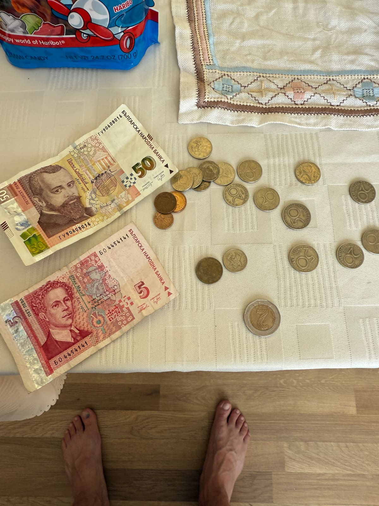

#### Table of contents

- [🖼️ Theme of the year and overview of the goals for 2025](#overview)
- [👨‍👦 Father and son](#father-and-son)
- [🏋️‍♂️ CrossFit journey](#crossfit)
- [🇧🇬 One month in Bulgaria](#bg)
- [❤️ Love, friendships, community](#love-friendships-community)
- [❓ Random topics](#random-topics)
- [⬜ Goals for 2026](#goals)

### Journey > Destination (Community, friends, family. Love)

It's been almost a bit scary writing in these yearly posts how much the current year has been better than the previous one for the past few years. And especially so when the previous year had been so, so good itself. So, I'm "happy" to say in its own weird way to report that won't be the case this year. Not because this year was not great. It was an absolutely amazing year, I'm very happy with it, there were quite a lot of great moments and a bunch of really cool experiences, progress in various ways... Yet this year brought also a lot of challenges, perhaps a bit more so than the past two. Some stress and other less positive vibes were a part of the picture too, perhaps a level slightly above average. Of course, all of this is through my very own, very personal, very subjective prism (attempting to be objective on the look out of the whole past year from the position of the last month of the year is a bit tricky 😅). Let's remember not to take all of this way too seriously; in the end it's all about having fun, having some thoughts laid out, some light and hopefully somewhat entertaining reflection. I should say, much like in all previous cases, I'm of course very grateful to be here, enjoying yet another lap around the sun, all the adventures had and thankful even for the tough times, cause we all know they trully mold us to be who we need to become.

Here's a picture gallery to kick this off and set the mood:

TODO: Pics gallery

TODO: Word on covering the whoel year. Drone review.

These posts started close to 10 years ago now with these simple goal setting lists. I'm not sure this is entirely applicable nowadays. Especially with my mental shift of **"Journey > Destination"**. But, like, fr fr. Six. Seven. (let's mimic the slang of gen Alpha a bit :D). Seriously though, let's look at the list:

### ⬜ Goals for 2025:

- 📝 Continue slowly writing my book - Born in Space
- 🏊‍♂️ Continue training for Ironman someday
- 🏃‍♂️ Run half marathon
- 🏅 CrossFit Open: All 3 events (with better DUs)
- 🦺 CrossFit Murph: vest again and slightly better time
- 💪 Participate in a CrossFit competition if opportunity presents itself
- 🗣️ Connect with people: dedicate time to friends old and new
- 🛳️ Awesome vacation with Anton (Bulgaria, Greece, else)
- 🏋️‍♀️ Training camp or training vacation?
- 🧘 Do a bit of yoga
- 🧎 Try meditation
- 🏀 Continue Basketball, table tennis, CrossFit, Swimming with Anton
- 🎥 Creative skill teaching with Anton: video editing, game making, AI
- 🥯 Continue some of our baking attempts with Anton
- 😄 Smile and have fun

I didn't do much for my book this year; yet, I'll keep that item on the list for next year too. I'm getting closer and closer to getting back to it I think. I've mentioned many times I like the setting and the plot of it, I still believe in it, years after I came up with the original premise for it, and that is a very good sign. I did play around with generating some AI images based on texts from my book to help with visualizing the main ideas of it, in fact, perhaps I should drop a couple below just to give you an idea.

TODO: images from book AI generated

I've not done Ironman training and I might do but it won't be for now a part of a list. If I decide to go for it, I will. I still like swimming, I'm still gonna work a bit on running, biking being the bigger bottleneck, but who knows, I might get into it. For now, it's not a big priority for me 😉 Same for the half marathon thing. It's really 100% a thing of "**why not be a person who's finished one, as opposed to a person who's not**". But sometimes, that's not enough of a reason to go for it. And again, who knows; stranger things have happened before, I might still go for it if the moment is right and I feel it. These posts and lists are not intended to completely plan out my life. In fact, I'd like to leave quite a lot of room for random stuff 😀.

CrossFit Open and Murph both went well, but more on that in the CrossFit section below. I've still not participated in a CrossFit comp, but I think I really want to give it a crack. I'm sure I'll jump into something when the time is right and it feels good to do so.

The social aspects of life is something I'll always keep in mind. I've always enjoyed it in its many forms, I let myself forget about it for a while and put it on the back burner for a few years, something I regret. Never again. Community, friends, family. These social relationships are so much more important than many of us may even realise. It's been nice to catch up and spend time with old friends. It's been lovely to make a lot of new acquaintances and friends too. I don't say it lightly when I say that **I do appreciate everyone I connect with**. Trully. I think we'll expand on this topic in various subtopics below.

We did have an amazing vacation in Bulgaria with Anton. It was twice as long as last year, because in his words "last year we were there for 2 weeks, this year we should go for 4 weeks". Also following his logic, it seems we should be there for 6 weeks next year. Hey, I'd love that, I don't oppose it in any way. Eventually, we are gonna be hardcapped by the length of his summer vacation, which is only 2 months 😅. But jokes aside, we'll take whatever time we can get. The important part is to make the time count. I'll expand on the trip in a lot of detail below, but it was a great time!

No training camps and training vacations this year, but something might be coming up next year. No regrets on not having any such camps this year; the choice was simple when it came down to how to spend vacation days this year in the summer - use up all 4 weeks just for Bulgaria with Anton. That was the choice and it was a good one. As opposed to the 4 trips in 2024. Who knows how things will work out next year.

Yoga, meditaion, nope. The problem with life and time is you just can't have time for all the things. Now, sometimes, it's mind-boggling to me that in the entire year I didn't find time to go to 1 yoga class. Or I didn't sit once outside on the terrace in the sun and try to meditate. It's crazy, it seems so easy to do, yet, it just doesn't happen. I still think those are helpful and important practices, maybe I'll get there someday, and at any rate, they are not the biggest priority, just fun little things to try out. I have no shortage of ideas on what to try however.

Anton's continued his CrossFit classes and it's something he enjoys which warms up my heart. We've also gone to the basketball courts plenty in the summer and when the weather has been nice. Table tennis we also went to a few times. We've only not found time for the swimming part, but we'll see how things go next year.

Learning about AI, making a game in Unity, video editing are things we've worked on. Every once in a while, nothing crazy, but it's nice to see how quickly he picks up new skills and how much he can do alone. He's editting his own videos in CapCut on his computer and I post them for him on his YouTube channel. Fun times 😅.

We had a brief baking attempt to make some buns last year, I remember that, and since then, mainly thanks to my friend and the recipe she shared with me for Bulgarian banitza, we've made banitza at home so many times! I'm absolutely hooked, because i love that pastry with feta cheese. It's sooo goood. And I think I'm pretty good at making it now!

Lastly on the list of goals for 2025 is "smile and have fun". Yes, yes, yes! I like being serious and focused into things, but I definitely like laughing and having fun. There are a couple of places / people who really make this so natural. During the easy and during the hard times. In the end, while we are living on this space rock, hurling around the sun in our solar system, being the tiny, little, specks of sand in the grand scheme of the universe, might as well smile and have fun! It's a lot more important than we may think.

### 2️⃣0️⃣2️⃣5️⃣

#### 👨‍👦 Father and son

Every year is a special adventure with this kid and this year was no exception. We did a lot of different things. And our bread and butter was good food, some workouts, lots of gaming and socializing with friends, travels, basketball, a few movies, a lot of books, and more Bulgarian dishes like banitza, mousakka.

It's been amazing to see Anton's interest for Bulgarian to peak before, during and after the trip to Bulgaria. He's in fact, pretty good at it. He doesn't know a lot of words, but he's learnt to read the alphabet and comfortably and quickly reads whole words, I was very impressed how quickly he'd picked it up. This year has been a bit about coming back to my Bulgarian roots in various ways, this being one of them.

After reading the Winnie the Pooh books quite a few times, this year we finally started something else and interesting too - the Harry Potter series. Years ago we read the first book together with Anton, but the 2nd book didn't fly, he was too young perhaps and lost interest. This time around, he had very genuine interest for the Harry Potter stories, and it's been great so far. Currently at the end of December we are finishing book 4 very, very soon. If you think about it, we started with book 1 at some point in May, so not too shabby.

Watching together the Minecraft movie was a lot of fun. Especially so because we've played the game together so much so we had a very common context. We spent time on the basketball court and walks in sunny days, Anton really enjoyed the "bring your kid to work day at Elisa". Especially because we missed the one in 2024, but he did join the one in 2023. He was super excited about this year's edition and we had a lot of fun again, checking out the world of the grownups, work, AI, our company dragon plushie among other things 😅.

The Bulgarian trip worked out much better than expected to be honest. I'll expand on that a lot more below, but we had the chance to a little bit "wing it", without any pre-planned and pre-booked hotels, destinations. Ok, maybe 1 pre-organized thing - the get together with my friends in Velingrad. But for the most part, we were able to just travel to different places and kind of did things the way we wanted to and felt like. That was very, very nice.

- TODO:

#### 🏋️‍♂️ CrossFit journey

Let's see, before I even check my notes, from the top of my head, what's been the biggest news in my CrossFit journey this year? The first thing that comes to mind is the **first body weight snatch** I did in February <3. This is absolutely huge for me and been one of my biggest goals for the past 2 years. I was beyond stoked to do that 78kg snatch (BW: 76kg at the time). And then an 80kg power snatch 2 months later in April. So, so happy about this!
I did do the CrossFit Open and I think I was semi-pleased with my results, however, it's worth noting I had a strep throat and was on antibiotics for a week, which affected my performance for sure, but I'm still happy I was feeling well enough to show up and do it, and of course, Anton was my number one supporter <3.

Some stats as of December 2025:

TODO: fix and update chart

| Movement       | Score          | Movement                | Score             |
| -------------- | -------------- | ----------------------- | ----------------- |
| Snatch         | 80kg (+4kg 🆕) | BMU unbroken            | 20 (unchanged)   |
| BMU in a single workout | 70 (🆕) |  RMU                     | 5          (unchanged)    |
| Clean & Jerk   | 95kg (unchanged)           |   Clean               |108kg|
| Shoulder press          |   70kg (unchanged)        | Murph                   | 46:40 (🆕 -3min)             |
| Back squat     | 142kg (unchanged)          | CrossFit Open           | ~ 65th percentile |
| Front squat    | 130kg (🆕 +5kg)          | Jackie                  | 6:37 (unchanged)              |
| Deadlift       | 155kg          | DT                      | 8:15 @ 50kg (TODO:)       |

I think it starts to be obvious that of course, now that I'm wrapping up the 4th year of training, things are really starting to plato, which only makes sense, it was bound to happen eventually. That being said, we're far from being the best possible shape, or the best results etc. It's just that the jumps in weights for example are starting to be a bit smaller.
One interesting observation is that for example with snatches, which are still 1 of my most favorite movements and I try to train them as much as possible, I tend to be able to get frequently very close to my PR weight in regular training. For example up to 75kg power snatches, which is just within 5kg of my PR.

TODO: add a couple of vids, either in page or TikTok?
TODO: comments on old grips <3 with a pic

TODO: comments on murph and picture
TODO: comments on CrossFit Open

TODO: "platoing", "journey > destination"
TODO: "the first boredom and back into it"

#### Helsinki Midnight Run

I did the Helsinki Midnight Run for the 2nd time. This year the weather was even better than last year. No pouring rain, still no wind, pretty nice. The major challenge came from the fact that I didn't prepare for that run AT ALL. At least in 2024 I had done a few 7-8k runs 1 10k run. This time - nada. I suppose I thought I'd roll up and just wing it. The worst part, was that while I left ahead of time from home, in order to be there on time, and I was - more than 50 minutes before the start, I wasted 25 minutes driving in circles trying to park. That was terrible. On top of that, after I finally parked I had to queue for the bathrooms for another nearly 20 minutes which basically left me 3 minutes before the start of the run to "warm up" 😅. Despite all of that, the run went somewhat well, I finished in 56:56, which is a bit slower than the 54:08 from the previous year. To be honest, I'm happy with that score, given things were the way they were. I can definitely do better with some training. In fact, the goal was sub 50, but given the situation, yet again, I'm happy with the result. I had to stop and walk a bit this time betweek 8k and 10k, because of my knee starting to hurt and wanting to prevent potential injury.

#### 🇧🇬 One month in Bulgaria

TODO: continue labelling

TODO: screenshots and videos from the folder

The month in Bulgaria was trully magical. On one hand, that's been our longest trip together to date, on the other hand it felt perfect, didn't feel too long at all. In fact, I'll go on to say that because of the length, it felt a bit less like a holiday trip and more of a **coming to the other home trip**. Which is really kind of the case.

We were able to see family - my sister was back in Bulgaria now with her husband (they used to live in Cyprus). We also visited my grandma, Anton's grand grandma. It was so nice to see her again <3.

We were able to spend time with friends and their kid, whom Anton knows from the year before and they got to play together, while we stayed 3 days at this SPA resort in the Bulgarian mountains in Velingrad. Nice food, plenty of pool time, walking in the mountain town, riding the waterwheels, awesome views of the mountains. We did a mini trip to the close by mountain of Rila too and rode some interesting "mini roller coaster" thingies, had great grilled food.

TODO: continue writing

   Instagram stories from the trip (Plovdiv, Sunny Beach, Sofia):

####  ❤️ Love, friendships, community

- TODO:

#### ❓ Random topics

TODO: These could get combined, or separated into their own categories:

- Movie review section?

- "Don't worry about it"
- "I love them both"
- Going back to my Bulgarian roots; My Bulgarian connection
- Journey > Destination
- Georgi's stories (and also social media, posting stuff vs not, to be out there but also that you have to log in every day, social media in general, being presetn etc. )
- God. (comeback)
- The Bulgarian roots (comeback)
- Work stuff and career?
- Sobreity continues?

### 2️⃣0️⃣2️⃣6️⃣

### ⬜ Goals for 2026:

- 🇧🇬 Bulgarian vacation with Anton
- 📝 Continue slowly writing my book - Born in Space
- 🏃‍♂️ Run Helsinki Midnight Run for the 3rd time (with prep)
- 🏃‍♂️ Hyrox
- 🦺 CrossFit Murph
- 🏋️‍♂️ CrossFit Competition
- 🗣️ Community, friends, family
- 🏋️‍♂️ Training vacation
- 🏀 CrossFit, basketball, table tennis with Anton
- 😄 Smile and have fun
-

[0]: Linkslist
