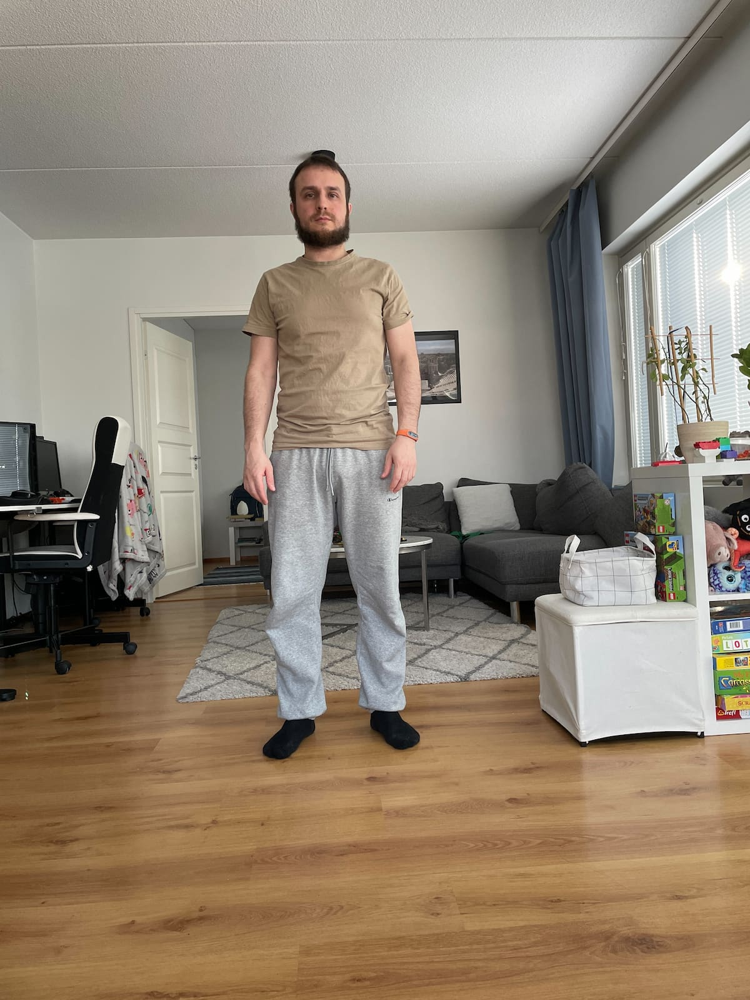
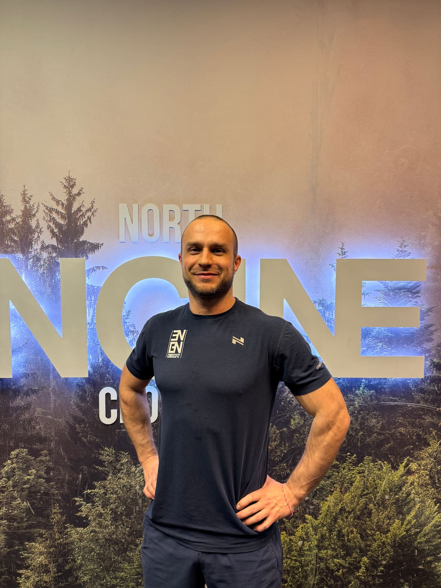
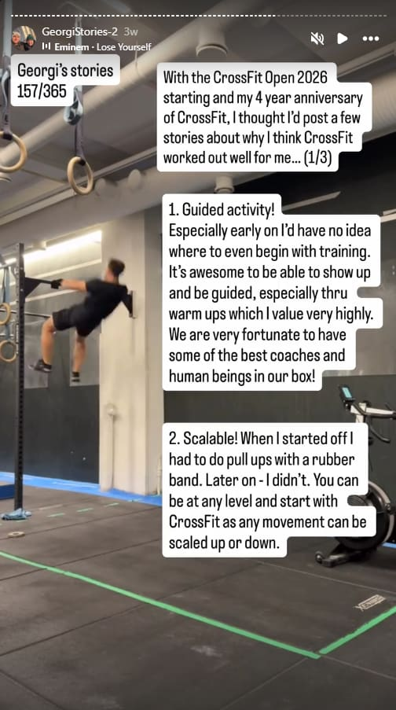
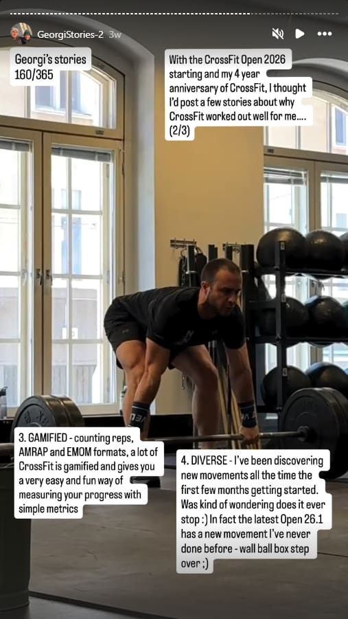
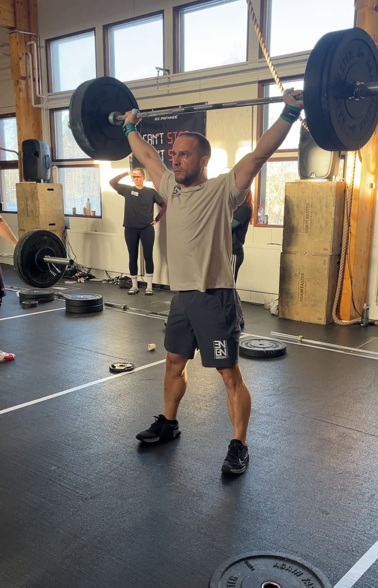
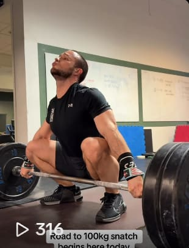
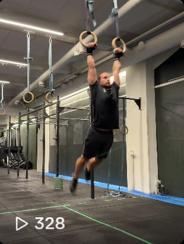
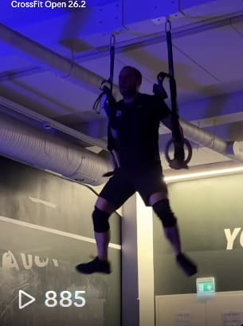
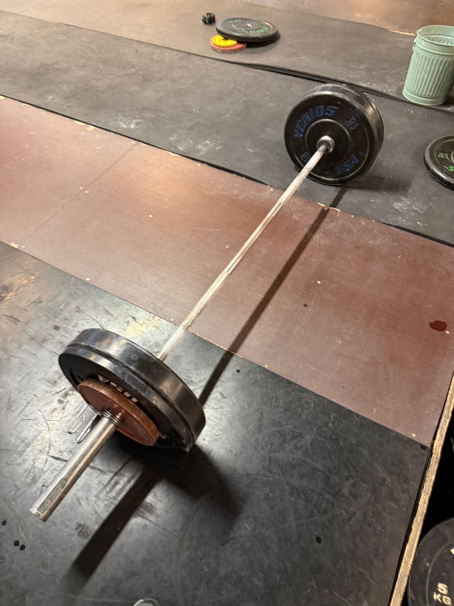

I've wanted to share this for a long time. My goal is to help as many people as possible see the benefits of training and positively impact their lives as it has mine.

### 👋 Who am I and how it started

Left: me at 36 (February 2022), right: me at 40 (February 2026)

My name is Georgi Yanev. I'm originally from Bulgaria, but I've been living in Finland for close to 15 years now. I'm 40 years old as of a few months ago, and I started CrossFit four years ago at the age of 36.

Starting functional training was the **second big life-changing event in my life**. I describe these events as moments when you might not even realize there is another way to live, but if you accidentally stumble upon or otherwise find out that there is another way... You are in for a treat and potentially something truly life-changing. And that's exactly what happened to me. It's never too late to change your entire life, hopefully for the better.

**So, why did CrossFit work out for me?**

[Georgi's stories](https://www.instagram.com/stories/highlights/18325470982173929/)

Depending on what kind of a person you are and how you function, you may need some **internal or external motivation initially** to take that first step. In my case, I had some personal issues to go through and some difficult moments in my life when I was 36. These were mainly around concluding a 10-year relationship with a partner with whom I share a kid (my son was 5 years old at the time).

It was tough. It was difficult navigating this new reality, and I guess to some degree you could say it's almost a classic trope for men after a breakup: get to the gym and start working on yourself. But for me, it very quickly became so much more than that. It provided me with a way of having fun, gaining a new community, and finding new friends. And not to diminish the importance of therapy, but although I did 6 months of therapy, it was training and CrossFit that really helped me get through it all.

### 😅 The humbling beginning

I talked to a friend of mine, and he suggested CrossFit. We had actually been talking about it for a few years because he was doing it at the time, and I always found it interesting, but never tried it myself. If, at that time, I had put myself into a normal gym alone to somehow start lifting weights without even knowing what the hell I was doing, I would have probably found it tedious and boring. I would have quit very quickly.

**I definitely needed structure and guidance. I also needed it to be interesting enough so that I could keep showing up.**

I still remember this incredibly humbling moment the first time I did my on-ramp foundation classes. After a few hours of training over a couple of days, I was exhausted, sore, and cramping up. I was leaving the gym, trying to put my winter boots on, and literally, my calf cramped up so badly that I almost fell sideways right in front of a girl who was watching closely by. It was so funny, but I felt like, okay, this is why I'm here. This is why I need this. It made it abundantly clear that I needed the training.

### 🏋️‍♂️ The structure, the vibe, and the gamification

I just kept showing up. It was a whole vibe. The classes were interesting and guided, which was exactly what I needed. You have 10, 15, or 20 people in the class with an instructor who guides you, especially through the warm-ups. Good warm-ups have been super important for me and made a world of difference. Given my age and the shape of my body at the time, I really needed them, and I wouldn't have known what to do on my own.

I soon came to realize that CrossFit is highly diversified and never boring. Even a few months in, I was still discovering new movements in the workouts that I hadn't seen before. I remember thinking, my God, this is so freaking cool. It played really well with my ADHD (or just the nature of who I am).

Also, the gamification! Counting the reps and following the systems of different workouts (like EMOMs and AMRAPs) works really well with my brain. You follow a specific structure, and things just click.

### 🤸‍♂️ High-skill movements and the "extra 30 minutes"

One of the things that still blows my mind is learning high-skill movements. Things like handstand walks, the Olympic snatch, and ring muscle-ups. It is an incredibly satisfying experience to learn how to do these skills, even if it takes a few months or even a few years to master them. Some of them are still a work in progress for me, even after four years, which is great. There's always something to improve and look forward to.

I remember deciding to obsess over some of these skills. It changed my life when I started doing 30 minutes of additional work after classes. I started practicing out of a strong desire to improve, and I saw a lot of progress in my handstand walks, my ring muscle-ups, and eventually my double unders (even though they are still not my favorite movement in the world!).

A couple of years ago, I decided to obsess over snatches. I did a lot of open gym sessions, just focusing on them. It's such a fun, technical movement, and I've seen tremendous progress. Hitting my first bodyweight snatch last year was easily one of the biggest training accomplishments of my life. It feels amazing to be able to yank your body weight from the floor, put it overhead, and stand it up. The better you get at the technique, the easier it is—making it less about brute force and more about technical precision.

   TikTok videos:

### 📈 Scalability and Community

Another thing that worked super well for me early on is that CrossFit is very scalable. I couldn't do a lot of pull-ups early on, so I had to start with the rubber band, like many other people. It worked out perfectly. I did banded pull-ups for quite some time, then normal pull-ups, and eventually learned variations like kipping and butterfly pull-ups.

I got a lot of help and practice with other gym members, especially after classes. There are quite a few people who have literally changed my life with just a tip here or there, just by being nice and trying to help me make progress on a complicated movement.

I should also say, CrossFit has always been super fun and a huge vibe. During the classes, especially when we have a nice grindy workout, we have the music blasting. Everybody is working and challenging themselves. It's plain fun, and it gives you the opportunity to just play like a kid again. A huge part of that is our community at my CrossFit gym. There are so many nice people there, a lot of friends, and I value those folks quite a lot.

   TikTok videos:

### 🧠 Mindset shift: Training as a reward

All of this leads to a fundamental mindset shift: training at the end of the day becomes a reward, not a punishment.

When you have that mentality, a lot of things change. Instead of thinking, "Oh, I have to go to the gym today," and being unhappy about it, it's the exact opposite. I get through my workday knowing that come 5:30 PM, I'm going to hit my CrossFit class, and I'll be so happy in my element.

### 🥗 Ripple effects: Lifestyle and consistency

Once you reach the point where you're just having fun, you don't even realize how much you're improving over time. The rest is just a matter of consistency.

Keep yourself motivated with discipline, because motivation can come and go. If you're disciplined to keep showing up on good days and bad days, doing something small, and taking time to rest, it leads to positive changes that accumulate over time. In fact, in just a few months, you can see big transitions in your body.

All of this can lead to other fundamental lifestyle changes. It definitely did for me. It might make you feel like you should improve your eating habits, and in my case, it even led me to quit alcohol completely.

Taking the first step into functional training can start a life-changing journey. Recognize you have the power to make this change today, just as I did—this is the main lesson I hope to share.

