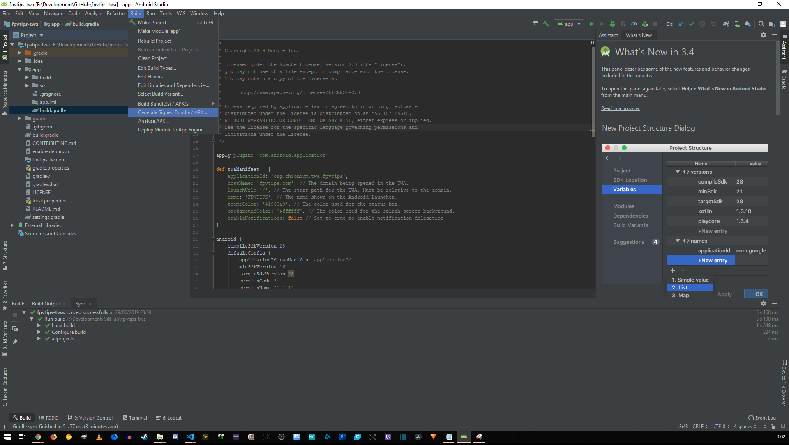
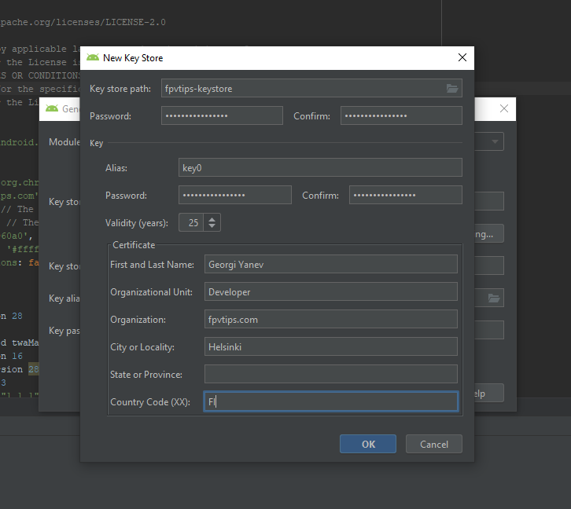

If you are into web development you might have heard the term [Progressive Web App (PWA)][1]. It has been floating around for quite a while now and is definitely no longer considered novelty. In fact, many big publications and sites have implemented the features required to be considered a PWA. This blog post does not aim to make you familiar with PWAs or to sell you on the idea, but I'd like to take a paragraph to at least demystify the core idea of what we are talking about before we get into how you could actually publish such an application on the Google Play store.

> If you are familiar with PWAs or don't care about the 'why', skip straight to [publishing a PWA on Google Play](#publishing-pwa-on-google-play).

> **If you just want to see the end result - [fpvtips in Google Play][26]. Based on the PWA at - [www.fpvtips.com][4]**

### Progressive Web Apps

What are the benefits of having a PWA? Many. Ranging from overall site performance improvement, the ability to serve content while the user is offline, secure content via HTTPS, the capability to install the app on many devices, including [support for desktop installs][2] landing recently.

In a nutshell, a PWA has to have a manifest file and a service worker (and [many other things, here's the full checklist][3]). The manifest file (called `manifest.webmanifest`) describes a number of app details, such as different logo assets, theme color, background color, app name, etc. You can [read more about the manifest file here][5].

And here's how the manifest file looks for my PWA - [www.fpvtips.com][4]

```json
{
  "name": "fpvtips.com",
  "short_name": "FPVtips",
  "start_url": "/",
  "background_color": "#ffffff",
  "theme_color": "#1960a0",
  "display": "minimal-ui",
  "icons": [
    {
      "src": "icons/icon-48x48.png?v=3b3221797eeeddae218baf403c63f18d",
      "sizes": "48x48",
      "type": "image/png"
    },
    {
      "src": "icons/icon-72x72.png?v=3b3221797eeeddae218baf403c63f18d",
      "sizes": "72x72",
      "type": "image/png"
    },
    {
      "src": "icons/icon-96x96.png?v=3b3221797eeeddae218baf403c63f18d",
      "sizes": "96x96",
      "type": "image/png"
    },
    {
      "src": "icons/icon-144x144.png?v=3b3221797eeeddae218baf403c63f18d",
      "sizes": "144x144",
      "type": "image/png"
    },
    {
      "src": "icons/icon-192x192.png?v=3b3221797eeeddae218baf403c63f18d",
      "sizes": "192x192",
      "type": "image/png"
    },
    {
      "src": "icons/icon-256x256.png?v=3b3221797eeeddae218baf403c63f18d",
      "sizes": "256x256",
      "type": "image/png"
    },
    {
      "src": "icons/icon-384x384.png?v=3b3221797eeeddae218baf403c63f18d",
      "sizes": "384x384",
      "type": "image/png"
    },
    {
      "src": "icons/icon-512x512.png?v=3b3221797eeeddae218baf403c63f18d",
      "sizes": "512x512",
      "type": "image/png"
    }
  ]
}
```

Service workers are essentially scripts that allow you to support offline experiences on the web. If a user has no internet connection and they try to access a route on your app, they'd normally hit issues and get no content. What service workers do, is they install themselves on the first visit, and they can on subsequent visits serve content themselves, by intercepting the request, before it gets to the network. I'm oversimplifying and there are a number of strategies you could apply, and in general, at least for me, service workers can get very complicated, very quickly. I guess I'm just a regular developer and not a ninja/rockstar developer 😉. You can [read more about service workers][6] on the Google developers fundamentals site.

Luckily, there is a project that can help you to set up a service worker much easier than writing the whole functionality from scratch yourself. Check out [Workbox][7] if that's the approach you'd like to take.

Even luckier is the fact that a number of modern web frameworks support creating PWAs for you, so you don't have to do much manually. That's really slick!
There are projects in React land such as [Gatsby][9] and [Create React App][8] (to name a couple), that make it trivial to get up and running with a fresh new PWA. If I remember correctly, the Vue CLI tooling also allows you to create a PWA with ease.

Which brings me to my project and wraps up the PWA introduction. I'm running [www.fpvtips.com][4] as a PWA, built with [Gatsby][10]. The source code of my project is open and available at [https://github.com/jumpalottahigh/fpvtips][11].

**I absolutely love building things with Gatsby, because it allows me to use React, GraphQL, deploys performance first built experiences, creates PWAs for breakfast and it's a joy to build things with.** You can read more about why [I love the JAMstack, Gatsby and Netlify here][12].

So, you are following along and you have a basic PWA setup using Gatsby. You ran:

```bash
npx gatsby new my-pwa
```

And then you enabled the offline plugin in `gatsby-config.js` by uncommenting it. Yes, that is really all it takes 💜. Bonus points for running `gatsby build` and dragging and dropping the output folder called `public` to [Netlify][13], effectively getting it up and running live on the internet in literally seconds. Crazy, right? And they say web dev is hard in 2019.

Now onto the good stuff. For a while now, you could package up a site inside a web view and deploy that hybrid app to the Google Play store. However, if the user has no internet connection, you are out of luck. Now, there is a better way to do it, not requiring any web view shenanigans. Enter, [Trusted Web Activity (TWA)][14]. I'm not gonna get into a lot of details, read up on it if you are curious to know more.

Suffice it to say, I stumbled upon this [article by Sven Budak][15] and this [video by Fireship.io][20] that detail how to use a TWA to set up a PWA for publishing to Google Play.

But before we dive into my experience of setting up the approach outlined by Sven in his article (and a number of changes since then that I had to add), do **be aware that there is an even easier way of getting this done by using a service called [pwa2apk][16]**.

### <span id="publishing-pwa-on-google-play" class="offset-top-nav">Let's ship a PWA to Google Play</span>

1. First, go grab a copy of [Android Studio][17] and install it on your computer alongside any packages it wants to download.

2. Go [pay Google \$25 for the right to be called a Google Android Developer][18] :).

3. Clone this repository - [https://github.com/GoogleChromeLabs/svgomg-twa][19]. This is the real star of the show. This boilerplate is fully setup so we don't have to do anything except for changing a few strings.

4. Open that project in Android Studio, find the file `app/src/build.gradle` and edit the following bits based on your project:

```
def twaManifest = [
    applicationId: 'com.fpvtips',
    hostName: 'fpvtips.com', // The domain being opened in the TWA.
    launchUrl: '/', // The start path for the TWA. Must be relative to the domain.
    name: 'FPVTIPS', // The name shown on the Android Launcher.
    themeColor: '#1960a0', // The color used for the status bar.
    backgroundColor: '#ffffff', // The color used for the splash screen background.
    enableNotifications: false // Set to true to enable notification delegation
]
```


5. Create a signed build apk.



The first time you will have to create a new key store.


Fill in all the details and remember the password for later, we will need it in a second.



Run this in a terminal:

```bash
keytool -list -v -keystore PATH_TO_YOUR_KEYSTORE -alias KEYSTORE_ALIAS -storepass YOUR_PASSWORD -keypass YOUR_PASSWORD
```

For me, a number of things went wrong at this point. If you get a message that `keytool is not recognized`, you might have to add Java to your path, or if you are lazy (like me), just envoke keytool from the bin directory of your Java installation, or alternatively, just change directory to the /bin/ directory under your Java installation and run it from there.

This is how I ran my command (I have only redacted my password away, but you get the idea):

```bash
cd C:/Program\ Files/Java/jre1.8.0_211/bin/
 ./keytool -list -v -keystore D:/Program\ Files/Android/Android\ Studio/fpvtips-keystore -alias key0 -storepass MY_PASSWORD -keypass MY_PASSWORD
```

If all goes well you will get a `SHA256` which you need to copy for the next step. Beware of treacherous spaces in front of the string when you copy it.


6. Go to [Google Digital Asset Links][21] and use their Statement List Generator and Tester tool. Fill in the information. Paste in the `SHA256`, and hit `Generate Statement`. Copy the output JSON.


7. Create a file at the root of your site under a directory called `.well-known`, with a filename `assetlinks.json`. Paste the JSON from the previous step into that file. Publish this file so that it is live. In the case of Gatsby, you would create the directory and the file under a directory called `static`. This gets copied over to the root of the site in production.


8. Build a signed apk again and locate the file under `/app/release/app-release.apk` or something similar.

9. Create a new app in [Google Play by going to the console][22].


10. Upload your APK file by going to `App releases` and dragging and dropping the APK in the drop zone.


11. Fill in all required information and wait a bit for a review.

It is from that App releases tab where you will eventually be able to release a test version or a production version of your app. I went straight for production. Whatever the case, you have to fill in a bunch of information, that actually takes less time than you would imagine at first, but it is still a bit cumbersome.

A good indicator is the gray check mark icons that become green as soon as you have finished a section.


If you have completed everything, in some cases, you might have to wait a few minutes (for me it was under an hour) for a review, before your app is made available in the Google Play store.


If you need to generate a lot of images quickly (you kind of need to), you can lean on this amazing tool - [Android Asset Studio][23].
If you want to resolve the warning you get in the Google Play Console about asset optimization, make a new build but select App Bundle instead of an APK. That will create an optimized package.

That's all :) Congrats! You shipped a PWA to the Google Play store! Big up! If you'd like to connect, follow me on [Twitter][24] or [Github][25].

[0]: Linkslist
[1]: https://codelabs.developers.google.com/codelabs/your-first-pwapp/#0
[2]: https://developers.google.com/web/progressive-web-apps/desktop
[3]: https://developers.google.com/web/progressive-web-apps/checklist
[4]: https://www.fpvtips.com
[5]: https://developer.mozilla.org/en-US/docs/Web/Manifest
[6]: https://developers.google.com/web/fundamentals/primers/service-workers/
[7]: https://developers.google.com/web/tools/workbox/
[8]: https://facebook.github.io/create-react-app/docs/making-a-progressive-web-app
[9]: https://www.gatsbyjs.org/docs/progressive-web-app/
[10]: https://www.gatsbyjs.org/
[11]: https://github.com/jumpalottahigh/fpvtips
[12]: /learning/jamstack-with-gatsby-and-netlify/
[13]: https://www.netlify.com/
[14]: https://developers.google.com/web/updates/2019/02/using-twa
[15]: https://medium.com/@svenbudak/this-twa-stuff-rocks-finally-i-got-my-pwa-on-google-play-store-b92fe8dae31f
[16]: https://pwa2apk.com/
[17]: https://developer.android.com/studio/
[18]: https://play.google.com/apps/publish/signup/
[19]: https://github.com/GoogleChromeLabs/svgomg-twa
[20]: https://fireship.io/lessons/pwa-to-play-store/
[21]: https://developers.google.com/digital-asset-links/tools/generator
[22]: https://play.google.com/apps/publish/
[23]: https://romannurik.github.io/AndroidAssetStudio/index.html
[24]: https://twitter.com/jumpalottahigh
[25]: https://github.com/jumpalottahigh
[26]: https://play.google.com/store/apps/details?id=com.fpvtips&hl=en
