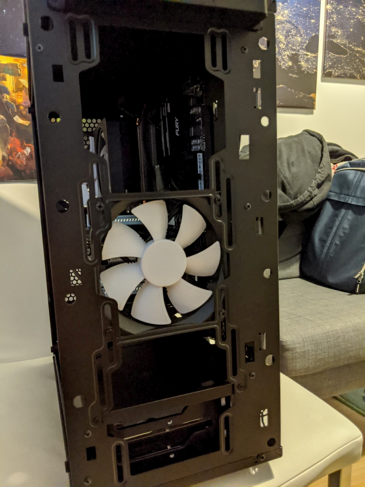

Every 4-5 years I build a new computer. It started 20 years ago (in 1999) with my dad and I ordering our custom build configuration from a computer parts shop in Bulgaria.

Then, in 2006 I specced and ordered a newer PC, 4 years later in 2010 I got another machine - again specced by me, but built by the company I ordered it from.

Finally in 2014, I ordered the parts only and built my own computer, that I'm typing this post on. It's a good machine and it certainly has a few more years in front of it, but for a number of reasons, it's time to build a new computer.

And while my 2014 PC was an Intel based system with an AMD graphics card, now we're switching things around and are going to be building an AMD system, Ryzen 3rd gen based, with a GeForce RTX GPU.

I sourced all the parts from a local, Finnish shop in Helsinki. Black Friday deals helped get a discounted price on some items, but not all.

Because I got a new monitor in the summer - a 1440p, 144 Hz one, I didn't need to spend money on that. I also have a mechanical keyboard, decent Logitech mouse and a Corsair headset that I'll be carrying over to the new PC. So let's have a look what we got in terms of components.

### 🔩 Components

#### CPU

As most of the component decisions depend on what CPU you go with, let's start with that. I've been very happy with the Intel i5 I've been running for the past 6 years. It's been performing well for most of the work and gaming I've been doing with it. I'm also fortunate to say that while money was not a big limiting factor when pulling off this build, I did try to stay cost efficient and had a rough budget of 1700 euroes for the PC itself.

Last summer I started a YouTube channel and video editing and rendering has joined gaming and software development as tasks I'd like the computer to be excelling at.

Coupling that with a nice Black Friday deal on the [Ryzen 7 3800x 8 Core Processor][1] and the choice was made.

This determined the motherboard, as we need to have an AM4 socket for our Ryzen processor. Here the choice was between a B450 board or a 5 series. If an older B450, you might have to update the BIOS in order to support a 3rd gen Ryzen processor. I decided to go the slightly pricier and easier route of grabbing an x570 motherboard - [MPG X570 Gaming Plus Motherboard][2].

The other big wins here are the PCIe Gen 4.0 compatibility and the TWO M.2 SSD slots, which I will need based on my storage design.

For a GPU I decided to go for the [GeForce RTX 2060 Super][3]. It's a good value for money in terms of performance while still not breaking the bank. Ray tracing and 8GB of RAM on it, what's not to like.

To power a GPU and a CPU like those I went with a [CX750M Corsair power supply][4]. This is a solid overkill, but I've had a similar PSU on my previous system and no issues, so might as well.

And as you might have figured out already, based on my motherboard and power supply choices, I'm going for a "regular" ATX case - [Fractal Design Define C][5]. The nice parts here are the cable management section on the back side of the case, the tempered glass side panel (as I'm planning to have some nice RGB fans), dust filters and configurability.

For memory I grabbed 2 x 16GB [Kingston Hyper X Fury DDR4][6]. For storage I got 2 M.2 SSDs(a [250GB Kingston][7] and a [500 GB Samsung][8]) and one [3.5 inch Western Digital hard drive][9].

So, let's build a computer.

#### 🔩 The Build

We'll start with unpacking the motherboard and placing it on its box. If you have an ESD bracelet (antistatic wrist strap or else) consider wearing it for the duration of the build. Otherwise you could try grounding yourself by touching some metal like a heat pipe or a radiator for a second. Ideally you'd like to minimize the risk of shocking any of your new components with static electricity.

The first thing to install is the CPU. Lift up the CPU socket retention arm all the way up. Then, carefully take the CPU out of the box and while holding it by its sides, place it carefully into the AM4 socket on the motherboard, **such that the small triangle notch on the CPU matches the same on the motherboard**. It is crucial to get this right and there is ONLY ONE correct orientation.

The CPU should fit nice and snug and if you're sure you've done it right, proceed by pulling the retention arm all the way back to lock it in place. Good job, you just installed your CPU!

Next, let's add the CPU cooler on top. In my case, mine came with pre-applied thermal paste that looked good. In your case you might have to apply the thermal compound yourself straight on top of the CPU. **Do not do both though!** If the cooler already has thermal paste, just use that. Notice the two metalic brackets on the sides - we are going to use those to hold the fan and lock it in place nice and sturdy. For additional instructions, consult your CPU's or motherboard's manual.

We now have the CPU and the cooler installed. Way to go! The fan cable gets plugged into a slot on the motherboard usually labeled CPU fan, close to the CPU socket. In my case, it was just above it.

Next let's add our RAM sticks...

... and M.2 SSDs. A 250GB one for Windows and applications.

And another 500GB M.2 SSD for games and video editing projects.

Here's how I've setup the RAM sticks and SSDs. Consult your motherboard manual which channels are optimal when inserting the sticks. For me the best set up is as it's shown on the picture below. Installing the M.2 SSDs is as simple as sloting them in and securing them down with a screw on the left side.

So far, so good. Now, let's move this party inside the case.

Open the case and prep it by laying it on its side. I decided to quickly plug in the power supply unit, as it's separate from the motherboard, but going to be required in the initial testing.

Secure the power supply unit with the provided screws and make sure to provide the required cables for the motherboard, CPU and GPU for initial testing.

Now lay the case down flat and install the motherboard I/O shield. Add the 9 standoffs on top of which we're gonna place the motherboard.

By holding the CPU cooler slowly and carefully place the motherboard in place over the 9 standoffs and matching the I/O ports into the I/O shield we attached to the case.

Secure the motherboard to the standoffs with the provided screws.

Plug in the 24 pin motherboard connector from the power supply, as well as the 8 pin CPU connector. You can also install the graphics card in a PCIe slot and plug in another 8 pin into it.

The fan cables go to headers labeled `fan` or `system fan`. The case's USB 3.0 header goes to it's slot (consult your motherboard manual), the power button, hard drive activity and leds go in a very specific way to the headers at the bottom right of the motherboard. Definitely look it up in the manual, it's not very tricky but good to get right!

We are ready for first test! Don't close the side panels or assemble the system more than you need, in case something is wrong and we have to open it up again. Oh, it seems the stock CPU cooler has an RGB fan, neat!

If all works out and the system posts successfully, you can close up all the panels. Install your operating system of choice via an USB drive and enjoy! Do remember to turn on the XMP profile in the bios to enable faster memory speeds.

My build continued a bit further a week later when my [Corsair LL120 RGB fans][10] arrived.

The set includes quite a few cables, controllers and if you are new to this (like I was) can easily throw you for a loop. Luckily there's many YouTube videos you can look up on how exactly to connect the fans and their RGB controllers.

For this setup we first took off the stock fans that come with the case.

In a nutshell, fan power goes to the fan headers on the motherboard, much like any other fan. The RGB headers connect into a controller which you can mount to the inner wall on the back of the case using the provided double sided sticky tape. This works very well and keeps the mess out of sight.

You can power the led and fan controllers with a SATA power connector so make sure you have at least one of those coming out of your PSU. In my case I piggied back off of the only SATA power cable I had for the hard drive.

I decided on 2 fans front and 1 back for a `positive` pressure airflow, where there should be slightly less dust hold up in the case, but the trade of is slightly slower exhaust of hot air. Can always change things around if needs be.

And that was the first PC build we did together with Anton! Yay! 🎉

[0]: Linkslist
[1]: CPU
[2]: MOTHERBOARD
[3]: GeForce-RTX-2060-Super
[4]: CX750M-Corsair-power-supply
[5]: Fractal-Design-Define-C
[6]: Kingston-Hyper-X-Fury-DDR4
[7]: 250GB-Kingston
[8]: 500GB-Samsung
[9]: western-digital-hdd
[10]: Corsair-LL120-RGB-fans
