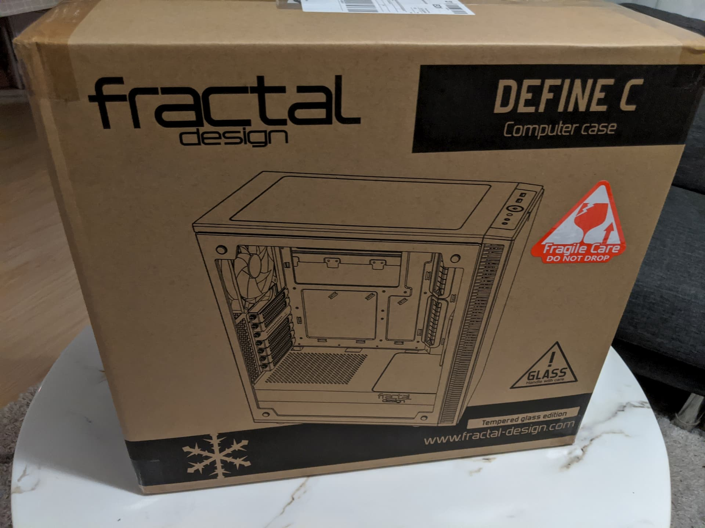

Every 4-5 years I build a new computer. It started 20 years ago (in 1999) with my dad and I ordering our custom build configuration from a computer parts company in Bulgaria.

Then, in 2006 I specced and ordered a newer PC, 4 years later in 2010 I got another machine - again specced by me, but built by the company I ordered it from.

Finally in 2014, I ordered the parts only and built my current computer, that I'm typing this post on. It's a good machine and it certainly has a few more years in front of it, but for a number of reasons, it's time to build a new computer.

[0]: Linkslist
[1]: TODO:
