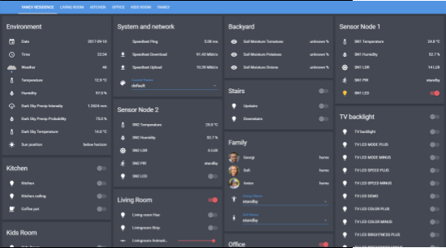
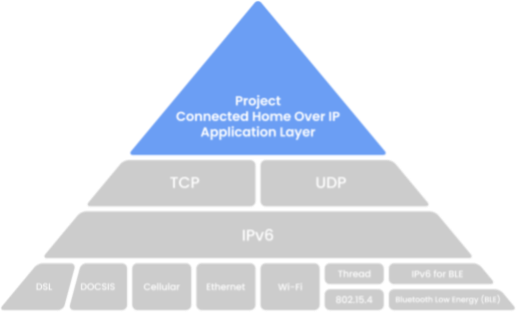

## I. Introduction

The term “Smart Home” has quickly become a lot more mainstream and common over the past decade. There are many devices labeled as “smart” by simply having the capability to connect to your local WiFI network and usually provide some form of a remote control, usually via a mobile app for your phone. On the other hand, you could also have a completely autonomously ran system, where the entire home collects data from sensors, builds machine learning models to analyze and learn about the home’s usage and actively applies adjustments - for example warms up certain rooms before your arrival home, turning off lights when no people are in the room and perhaps handling even more complex scenarios. For the sake of this paper we would also consider the simpler connected devices as a smart home, because in the end, especially when it comes down to cybersecurity in smart homes, more often than not the attack vector would be a connected device.

There are a majority of open source solutions available to manage the devices in a smart home. One such example is Home Assistant\[1]. It’s a piece of pretty versatile software allowing you to setup and connect devices, gather data, monitor sensors and also setup interconnections and automations between devices that would otherwise be not possible to integrate.

Finally, the rise and improvement in capabilities of personal voice activated assistants such as the Google Assistant\[2], Amazon Echo (Alexa)\[3], Apple’s Siri\[4] and their integration into smart speaker devices has also played a significant role in the growth of the smart home sector. The simple voice activation that these devices use allows users to quickly turn on and off lights, and issue other commands in their homes.

## II. What is a Smart Home?

What really is the definition of a smart home? As mentioned in the introduction, as of the early 2020’s this term’s definition can be still pretty loose. For the sake of this paper we will consider a smart home any home with more than a few smart devices. We do this mainly because the focus here is on the cybersecurity side of things, and not so much in debating whether a simple remote interface for a device makes a home smart. In the end, when it comes down to security, any device with some form of connectivity to the internet and out of the home could be a potential weak link and lead to breaches.

In their paper Stanislaw Piasecki, Lachlan Urquhart and Professor DerekMcAuley describe a smart home as “a contemporary application of ubiquitous computing that incorporates intelligence into dwellings management for comfort, healthcare, safety, security, and energy conservation”\[5].

In general, my opinion is that a smart home is any home with any type of sensors or IoT devices that provide functionality and value that the homeowner appreciates. This can be subjective, but just to provide some example, it could be anything from providing advanced statistics about the home’s air quality (CO2, other harmful gases), thermostats, human presence detection via motion detection sensors, functionality and ability to toggle on and off lights and other devices via a smartphone, by asking a voice assistant such as Google Home, Alexa or Siri or by utilizing home automation based on data and event triggers.

Another slightly more complex example would be a smart home automation system such as Home Assistant which can be ran on a Raspberry Pi and is a single place for managing all your smart devices and can provide the capability to do more complex automations such as opening your blinds at sunrise and starting up your coffee machine in the morning based on custom logic and triggers.

## III. Smart Home case study

In 2016 one of my hobbies was to tinker with various embedded devices, which in turn quickly led me to the world of smart home automation. Starting from smart light bulbs (Philips Hue, Ikea Tradfri, Yeelight), smart outlets, custom made sensors (temperature, humidity, motion sensors), Google Home, Alexa, and running the open source software Home Assistant to consolidate it all and create automations between devices.

Figure 1. Home Assistant’s user interface with sensors and switches.

I genuinely enjoyed some of my automations I had set up, some even more so than others, for example, I had a morning coffee automation setup that I ran for literally 1.5 years while I had the smart home setup going. It was great. The sound and the smell of the brewing coffee definitely adds to the morning wake up experience. My smart home configuration is open source and available on GitHub for inspiration and others to learn from \[6].
During the time I ran my smart home setup I had no complaints and there was always room to improve, to add new devices and automations. If anything, there hardly ever was enough time to do it all because new projects and ideas kept popping up. Smart home automation projects can be for the most part still very time consuming, expensive in some cases, and not very straightforward to implement.

## IV. Challenges with IoT devices

Having any smart home being pretty much set up with IoT devices, it’s important to take a look at the current IoT devices market and state. Whether we are talking about a full-fledged smart home, or just a normal everyday home, the fact of the matter is that in most homes some amount of IoT devices are present. With some 7 billion IoT products in 2018 and projected to have up to 21.5 billion products connected to the internet by 2025 \[5], this is a very fast growing market and many devices are coming online every day. While some people find some of these devices useful and others do not, it is a trend, it is a reality and it’s happening as we speak.

As any emerging technology, there have been and still are some challenges with smart devices. One example to point out is with pretty much any Chinese traditional manufacturing company. For example, a company that had manufactured fridges for a long time, might not necessarily have big cybersecurity traditions when it comes down to now producing “smart” fridges that are able to get on your local network and make requests outside of it and now offer potential attackers an easy attack vector to exploit, because of overlooked security.

These issues could be “on purpose” technically speaking, because the company is trying to save on cost and using cheap and lower quality components, or it could be completely unintentional because security is not a priority for them and they do not have the necessary personnel to test the products and verify that they are secure and safe to use and comply with certain standards.
In some cases, this security oversight might simply be due to the lack of experience and simply not being aware of and not considering cybersecurity scenarios. However, whatever the case, it’s a fact that this still happens with many consumer products and companies. Sometimes even bigger companies face similar challenges.

Another challenge with smart devices is the market fragmentation. Of course on one hand having competition is good, because we want companies to compete with each other which drives further innovation and ideally leads to lowering the cost of consumer products. On the other hand, a heavily fragmented smart home device market and lack of communication standards thereof leads to very poor user experience both when setting up the devices and when simply using them on a day to day basis.

Luckily, just a couple of years ago many companies that produce smart home devices formed the Matter project \[7]. Matter, formerly known as Project CHIP, is focused on creating more connections between devices, simplifying development for manufacturers and increasing compatibility for consumers.

Figure 2. Project Matter’s architecture overview

Having solid communication standards that manufacturers could follow goes a long way towards ensuring interoperability as well as improving security of IoT and smart home devices. That is certainly a step in the right direction and is going to alleviate some of the problems with smart home devices. However, as of the time of writing this article, the market is still largely fragmented and many over the counter devices simply lack good user experience, have security issues, or lack options for the user to improve the security of the product themselves.
One final challenge with IoT devices I’d like to mention, is really more of a challenge with some end users. Many everyday consumers don’t necessarily have deep cybersecurity training or even just technical know-how to understand certain aspects of how their new smart device functions, or why a particular functionality might be a security concern. Users often don’t even change the default passwords on their modems, let alone a new security camera they bought to monitor the baby at night. At the same time, lists of default passwords are pretty frequent and easily available on the internet and that makes a bad actor’s job quite a bit easier.

## V. Smart home and IoT device attack vectors

In terms of security, some of the more common issues that we will take a look at in this paper are simply born out of poor security practices by manufacturers or end users. In many cases the security is an overlooked aspect by manufacturers or simply cut down in order to save on cost and keep device prices low. From the end users’ perspective, there’s many times negligence when it comes down to security credentials - ranging from weak or reused passwords, to just leaving the default device password as it comes from the factory without changing it. These dramatically simplify the work a bad actor needs to do in order to gain access to an IoT device.
One way to categorize possible IoT attacks is described in Herman Heriadi and Geraldi Catur Pamuji’s paper “Cyber Security in IoT communication (Internet of Things) on Smart Home” \[8]. In a nutshell, they specify five types of attacks:

1. Physical attacks. Which is basically literally destroying the hardware. For instance an outdoor mounted security camera.

2. Side channel attacks. This is utilizing side information to make conclusions and educated guesses about encrypted parts of the system. For instance this could be time attacks, power analysis attacks, interference analysis attacks, electromagnetic attacks, and environmental attacks.

3. Cryptanalysis attacks. Attacks focused on attempts to crack the encryption, figuring out the encryption key . Some examples include Ciphertext-only attack, a Known-plaintext attack, and a Man-in-the-middle attack.

4. Software attacks. “These are the primary source of security vulnerabilities in the system. The software attack exploits the vulnerability of implementation in the system via its own communication interface. Such attacks include exploiting buffer overflows and using program Trojan horses, worms or viruses to intentionally inject malicious code into the system.”\[8]

5. Network attacks. Wireless communication systems are vulnerable to network attacks due to the broadcast nature of the transmission medium. There could be passive and active attacks. For example monitoring and eavesdropping, traffic analysis, and camouflage are considered passive attacks. While denial of service attacks, subversion nodes, node corruption, node capture could be considered active attacks.

Ransomware among IoT devices is something that has seen growth lately \[9]. Ransomware is a kind of malware with the aim of rendering a victim's computer unusable or inaccessible, and then asking the user to pay a ransom to revert the destructive encryption. Ransomware attack growth rate results show that the number of attacks for Cryptowall and Locky ransomware are notably increasing therefore, these ransomware families are a potential threat to IoT devices. Ransomware attacks can be pretty devastating if the user loses access to their information. As a good practice measure it is recommended to keep back ups of all of your data, and a few copies for redundancy at that. Ideally, you want to always have another copy of your data on site, as well as at least one backup copy off site. Ransomware in the case of a hacked IoT device could also mean not necessarily loss of data or access to data, but it could be a loss of control over a service or the device itself. Being prevented from being able to adjust your thermostat if the weather is too hot or too cold outside is just one example that comes to mind.

Some network attacks or software level exploits against particularly sensitive devices, such as smart home hubs that may in turn contain IP address maps, lists of all the devices on the network, mac addresses and sometimes even authentication tokens, could be quite devastating. Recommended counter actions are to always practice using long strong passwords, ideally random generated, never re-used between other services and devices. Keep all network ports closed that do not need to be open on your main gateway, use two factor authentication whenever possible, be careful what devices you allow access to your internal smart home network, and run regular checks for intruders on the network. There are many guides and open source projects to help secure your network further, as well as prevent tracking by completely blocking access to third party marketing sites. At the very least the use of a Virtual Private Network (VPN) is also highly encouraged and using firewalls and similar devices to further strengthen the network’s security is also a good idea.

## VI. Conclusion

In the end, everything in mind, the fact is that as far as smart homes are concerned, it is still very early days and most of the benefits are yet to be discovered and implemented. I firmly believe the smart home can deliver orders of magnitude of value the more sensors and devices are connected and only after we have real AI or Machine Learning based solutions in place, to the extent where the human has to do hardly any adjustments to the home’s systems.

In a future where a home could be largely sustainably powered by solar, wind, thermal or other renewable energy source, having a smart home making the decisions on when to turn on and off devices, how to optimize their power consumption during different hours and heavy load hours, could be not only immensely beneficial, but also sustainable and economic. This would allow us to only consume energy and water that we actually need and avoid any excess overconsumption.

I’m sure smart homes could be perhaps considered as a controversial topic by some, and perhaps some purists would never even want to set foot in one. But in the end, whatever your personal preference, there’s a lot of value to be had in smart homes (and definitely even more so when it comes to these smart buildings being a part of smart cities too). The environmental impact could be considerable based on the energy savings across millions of households, the time savings and quality of life improvements could be very significant too. The changes could have a significant impact on saving countless hours for every human, when you no longer have to put cognitive effort into thinking what you should set your thermostat to for the night, or go around the house and flip switches off to turn off all the lights before bed, just to name a couple of simple examples. With AI models monitoring and adjusting house systems, you could have fridges that maintain the perfect temperature in different compartments of the fridge, based on the type of food stored there, or even just adjusting how the temperature is maintained based on the amount of items in the fridge.

So objectively speaking there’s a lot of benefits to be had from having a smart home, but cybersecurity is and will always be a concern as long as we are talking about anything connected.
Cybersecurity should never be an afterthought in this day and age and it’s important that all parties take it seriously - from the manufacturers of the devices to the end users taking them into use. I strongly believe that this will improve in time, as security measures and concerns have already improved since the dawn of the Internet to this day. More and more users become more security conscious, as we move all of our lives online we more and more realise how powerful and important our data is, and so we value and secure our connections and devices better. There’s a lot more everyday people nowadays who know what a VPN’s benefits are and actively use password managers to keep their credentials for different sites safely stored.

Cybersecurity in smart homes should and will be an increasingly important topic in the near future, especially as homes become more autonomous and capable. It is important that manufacturers now start doing due diligence and improve security implementations across the board. There have to be dedicated security tests for even the simplest of IoT devices and it should never be overlooked. And taking the time to secure our devices is an important step that will prevent a lot of damages and headaches down the road and would allow smart homes to truly deliver the value they are capable of in the long run.

### References

\[1] Home Assistant [Internet, cited 2021 December] Available from: https://www.home-assistant.io/

\[2] Wikipedia [Internet, cited 2021 December] Available from: https://en.wikipedia.org/wiki/Google_Assistant

\[3] Wikipedia [Internet, cited 2021 December] Available from: https://en.wikipedia.org/wiki/Amazon_Alexa

\[4] Wikipedia [Internet, cited 2021 December] Available from: https://en.wikipedia.org/wiki/Siri

\[5] Stanislaw Piasecki, Lachlan Urquhart, Professor DerekMcAuley. Defence against the dark artefacts: Smart home cybercrimes and cybersecurity standards. Computer Law & Security Review, Volume 42, September 2021, 105542

\[6] GitHub [Internet, cited 2021 December] Available from: https://github.com/jumpalottahigh/YAR-Home-Assistant-Configuration

\[7] Matter [Internet, cited 2021 December] Available from : https://buildwithmatter.com/

\[8] Heriadi, Herman; Geraldi, Catur Pamuji. Cyber Security in IoT communication (Internet of Things) on Smart Home. IOP Conference Series. Materials Science and Engineering; Bristol Vol. 879, Iss. 1, (Jul 2020).

\[9] Asma Zahra; Munam Ali Shah. IoT based ransomware growth rate evaluation and detection using command and control blacklisting Publisher: IEEE
