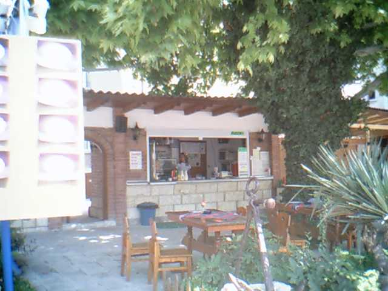
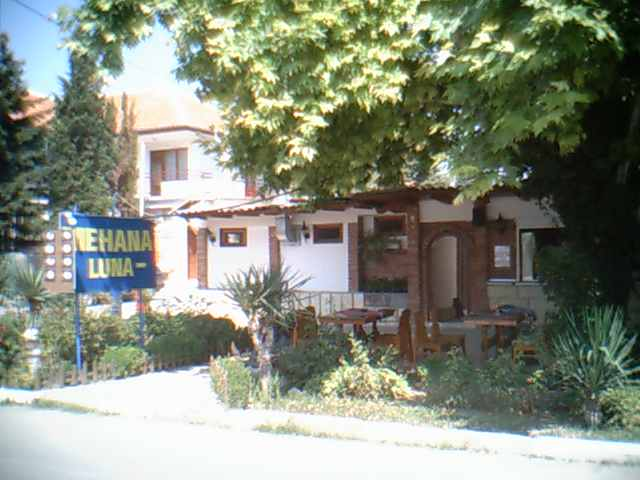
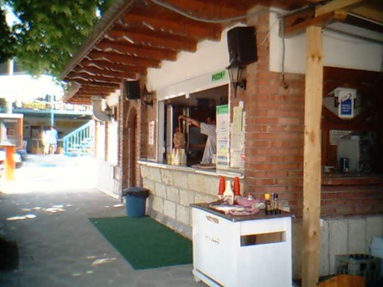

My first ever job was in a restaurant as a waiter. It also didn’t last long - I must have been at the job for a good 20-30 minutes before I got fired.

It wasn’t them, it was my fault, but only because I panicked too much, I took things too serious and to this day I’m still not clear as to how I could pull of something that silly, but nevertheless it is indeed a real story!

\* \* \*

In 2004 I was fresh out of high school, and I had just completed my university exams and was patiently awaiting the results. I had nothing else to do that summer so when my mom reached out to suggest that I get a job at the seaside (where they were currently on vacation with my sister), I just agreed.

I had previously had only 2 jobs. I had done a couple of weeks worth of cleaning people’s cars windshields when I was like 10 years old and had saved some money doing it that summer. I had also worked with my dad at a booth he rented one summer at the central railway station in Plovdiv, Bulgaria. That time I must have been like 15 years old, so it was a bit closer to a real job.

I wasn’t setting myself up for success or a failure, I just thought it would be ok - I would go to the seaside and get some job. What? I had no idea, but I didn’t think it mattered. I didn’t have a lot of money either, in fact, I had no money. I had to borrow 10 bucks from my grandma for a pair of long black trousers, luckily I had my black closed official shoes from prom and I had a belt. I also had a white shirt. I guess I was thinking for a job as a waiter, so good to be prepared and with those items in a duffel bag (and of course some more everyday clothes and other belongings) I took the train from Plovdiv to Burgas one night.

It was nice, relaxing, I was travelling alone, it was calm and quiet in the mid night train. Kind of a pleasure to travel in a way. You could look out the window and marvel at the green open fields, mountains in the distance, hills all around, and in the end, the rising sun around 5 am in the morning.

In Burgas I quickly transferred to a bus for Ravda. It was this village where my mom and my sister were staying and my goal was to go meet them, so we can figure out what job I could get. At the time, my mom had already checked a couple of places so she had already something in mind.

I got off the bus in Ravda and could remember nothing of it. Why you may ask? Well, I had been 3 times to Ravda alone when I was a kid. Once after 3rd grade, then after 4th grade and finally one more time after 5th grade. Those were the so called summer camps that parents could enroll their kids to and then a teacher takes a class of children to the seaside for about 10 days.

Those camps were quite simple really. They roughly went like this: you arrive at the camp and get assigned a room. You have up to 4-5 other roommates, all of same gender of course. You might know someone or you might not, but it also didn’t matter much. Everyday there was a full board setup with breakfast, lunch, afternoon snack and dinner. The teachers were taking us twice to the beach - in the morning and in the afternoon. The whole point was to get tan, to swim, to have fun at the seaside. Sometimes there was a disco right within the camp. We rarely if ever needed to actually leave the camp and go to the center of Ravda. We must have done it only a few times, to buy souvenirs and send home a postcard.

That card was funny, it almost always went something along the lines of how good everything is and that I’m doing ok with the money, I have planned them out and totally not spend them all within the first 3-4 days which it and of itself was an achievement to hold out that long.

That’s how those camps went, and here I was now about 10 years later and I couldn’t make much of it. Eventually it kind of clicked for me that where I was standing was the central square with the post office. Of course it looked a bit different, but I could at least remember as much because this was the place to drop off and send home the post cards I mentioned.

I had only a few minutes to myself to wonder about those things when eventually my mom appeared to great me and took me to the place they were staying. I said hi, apparently they were doing well with my sister. Nice. Now, onto business, because I had come here to get a job after all.

My mom had a couple of clues and the first one was about a restaurant close to their place, like within 200 meters or so. She had even gone ahead and talked to the manager / owner to see me tonight. Ok. Let’s do it.

So that evening, I put on my “working” clothes and went to the place. I met the manager, said hi, she asked some questions, which I no longer remember, I think my brain had started to go blank the moment I entered the place. That would be an issue. The place was fairly big, outdoor garden, plenty of tables, a small building in the back, a bar opening at the front for waiters to pick up the drinks to serve to the tables, a kitchen window in another opening.

After talking for a while with the manager she said, ok, let’s try you out. She wasn’t very happy I had no prior experience and she did mention that they didn’t have time to train new people as it was somewhat already the high season for them and they were packed every night.

The next bit is still so fuzzy for me to this day. I have no idea but I think my brain must have gone completely off. The worst part about it was that it was not an obvious being worried and stressing behaviour, I was fine, I just didn’t make sense with what I did. The first table came, I got it assigned, it was a 3 or a 4 person seating. I even managed to get them their drinks, except, I held the tray with my both hands on the sides. Ouch! Strike one!

The manager was quick to call me over and to tell me that I couldn’t carry the tray like this, I had to carry it with one hand under. Good luck to me, I had to idea how I’d do that, but I could try.

Next I managed to get the order, eventually to even serve the food, all good, no issues. However when the time came for the bill, that was no the case. Their bill was 24 something leva. They gave a 50. I had no money in me, because even though each waiter is their own cashier, and should start off with some change to begin with, I actually had none yet cause it was just a try out right?

So I did go to the manager and she broke it down for me. For whatever silly reason, I thought she would keep the owed money and just gimme the change, so after I went to the people, gave them the change, I had 24 something leva left over in my hand that I couldn’t figure where they came from.

I, the guy that just graduated a maths’ highschool dealing with matrices, integrals and what nots, could figure out the basic math. It just didn’t add up to me, I was afraid I owed the people something more and hadn’t given them enough change back. So, naturally I went to the manager and told her about my issue:

So, I have here some left over money that I can’t make up where it came from, did I not give the people back the correct change or something - I said.
Sit down here with me for a second. - She gasped and said calmly. There was no hostility, maybe just some disappointment as far as I cared to read her in that moment.

She then went on to tell me again how they unfortunately didn’t have time to train new people in the middle of the high season, and for that reason and my lack of experience, it would be better off for me to just go home now.

Of course I was disappointed. I said thanks, I remained as cool as I could be while leaving the restaurant. But thoughts started to flood my brain as soon as I was out of there and walking back to where my mom and my sister were staying. How could I be such a failure, I felt so humiliated and put to my place that I got fired within 30 minutes of my first job, after leaving everything in Plovdiv and coming here all the way to get a job, just to fail so miserably. It was a disaster. My eyes filled with tears. I was walking back with my fancy clothes, no job and tears of self pity in my eyes.

When I told the story to my mom she was supportive and we made the most out of it, she said there still was that other place. I appreciated the support, but how silly I felt for what I did. What was I thinking? Who does that? So weird, I really couldn’t believe I had messed it up so much.

\* \* \*

Eventually, I did go to the other place and applied - it was a kebab joint with a few tables and a kitchen in the back. I did get the job, I had a blast, made some friends.

What’s funnier is that the year after in 2005 I was working as a busser in a restaurant and had none of those brain dead issues. For me it was personal and a matter of justification too. The year after in 2006 I was working in a fine dining restaurant in the states as one of my summer jobs and on my other one I was a waiter in a family diner.

Then, in 2007, 6 months after I had started working in a 4 star hotel in Plovdiv I got promoted to be a shift manager. I was leading huge events (weddings, banquets) with 10s of waiters and complicated serving and ceremonies and loving it.

It just goes to say, that always take things personal and don’t give up when you fail, no matter how silly your fail is. Get up and go at it again. And again!
That’s my story of how a boy whose brain blocked so bad he didn’t make any sense and lost his first restaurant job before making a full hour, was 3 years later a manager in a 4 star hotel and working big and complicated events.
Perseverance pays off. Stay on track and go at it for as long as you can and things will align for you.
