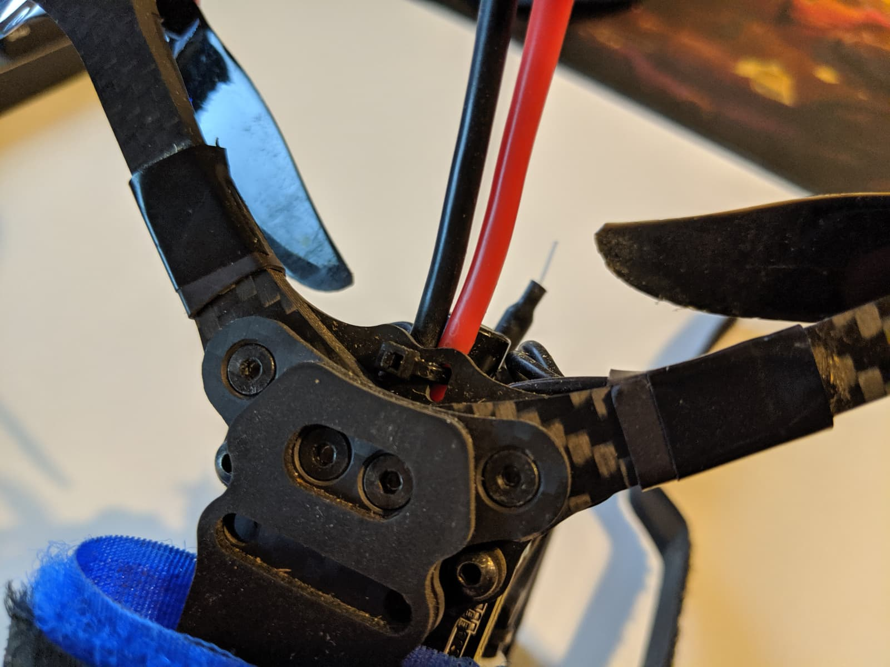
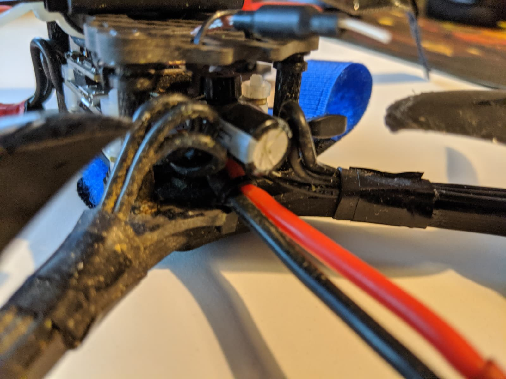

This is a very straight-forward process and could easily be underestimated and skipped. However if you don't skip it might save you from ripping out your battery pads on your flight controller, PDB, or 4-in-1 ESC board.

You want to use some zipties and firmly attach the XT60 power leads to the frame, close to the board. In doing so, you setup an area that would absorb part of any tugging force on the leads, for example during a crash.

