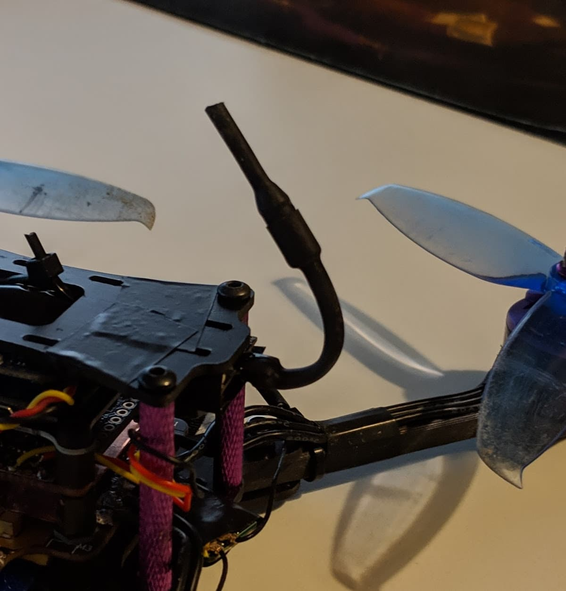

I'd like to share with you one quick and easy way of fixing a U.FL IPEX VTX antenna to stay in any way you want it to. For example, at a 90 degree angle and up and away from the props, which could be a good thing.

To achieve this, grab a small piece of shrink tube, apply some hot glue all around where the antenna connects to the VTX. Then apply a bit of hot glue all along the antenna up until the thicker part. Finally, slide in the heat shrink, shrink it with a lighter or a heat gun and hold it in place until the hot glue cools off.

I learned about this trick <a href="https://youtu.be/wfYZmh5Gsyo?t=169" target="_blank" rel="noopener noreferrer">from this video</a>, and so credit goes, where credit is due!
