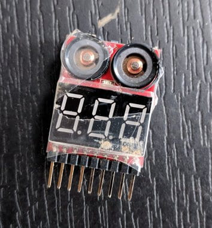

## 5 cheap and easy upgrades worth doing to your quad

If you are new to FPV, the Wizard x220 provides a decent flight experience out of the box. That being said, there are a number of small, cheap and easy to do upgrades that will dramatically improve your overall experience. In this part 1 of the upgrade guide, we're gonna cover:

- [Props](#props)
- [Omni directional antennas for vtx and fpv goggles](#antennas)
- [Low voltage buzzer + lcd](#buzzer)
- [3s and 4s battery charger](#charger)
- [Mounting improvements](#mounting)

<strong>UPDATE: 14 July 2018.</strong> Since the release of this article, I have published a number of other articles with detailed upgrade descriptions, also worth doing. Check the <a href="#related">related articles section</a> at the end of this article.

### Let's get to it!

#### Props: from stock to Cyclones

Even without crashing I've had the stocks props shatter after a throttle punch in a flip. If you upgrade only one thing from this list, do yourself a favor and upgrade the props! The moment I changed to the [5 inch triblade Cyclones][1] I noticed the quad being about ~ 5x more silent and at least 2-3 times more responsive. Not to mention I have now flown ~ 7-8 batteries and still have not snapped even 1 of those propellers. They are very sturdy and absolutely worth it for the price. I have also ordered some [Bullnose][2] props and I will let you know how those are as soon as I get my hands on them.

#### Antennas: leaf clover omni directional bliss

The stock vtx and goggle antennas are not too bad and they will get you started, but this is an upgrade coming at ~ 10-12 bucks that would noticably improve your video feed. I went for the [Aomway leaf clover omni directional antennas][3].

They are quite sturdy and can be bent to a position and would stay in it. Pay attention to what connector you need for your goggles and vtx. I have the [Eachine VR 007][5] goggles so in my case I needed a RP-SMA male connector on both antennas.

A friend of mine just purchased a Wizard x220 himself and we were able to directly compare the video feed of the stock antennas vs the aomways. There is a clear improvement in the signal. Plus whenever you upgrade your headset or vtx, you still get to reuse your antennas in the future.

Whether you keep your stock antennas or get a better one, make sure they are nicely tightened as removing the antenna from your vtx with the quad powered on can potentially fry your vtx. In my case I had no issues with this, however I did have my angle connector on the vtx snap in 2. Very easy fix if you have a soldering iron. If for whatever reason you need to change the vtx, i do recommened not going for the angle socket, but instead get an antenna connector coming straight out the back and tilting the antenna upwards.

#### Voltage buzzer: no soldering required

There are many ways to approach the problem about being aware of your voltage when flying. Pick the option that best fits you, but pick something. You do not want to shorten your batteries life and reduce their capabilities by over discharging them, hence you need to somehow be aware of their state when flying.

You could have that information as OSD, but the Wizard does not come with that feature. You could also solder a buzzer straight to the flight controller, which is a good option and could be extended to also output a lost vehicle signal.

Here we will cover the easy, solderless option that gets you sorted for ~ 1 euro, namely acquiring a [Lipo battery low voltage tester][6] - buzzer + lcd screen that you can connect to the charging lead on your battery.

You strap that in along side your battery and fly. When the voltage gets too low the buzzer will start beeping. That's it. Simple but very effective. You can also see the current voltage for each cell on the mini LCD. Those work for 1S-8S batteries and you should definitely grab a few given how cheap they are. I have seen one shatter during a crash and while the LCD survived, the buzzer was no longer. Grab a few spares while you are learning to fly :) Example and crashed and smashed buzzer below.

#### Battery charger: stay safe

Not much to mention on the battery charger front. I went for this guy - [WLtoys V950][7], it is good for 3S and 4S batteries, although you should never charge 2 at once! It's one of the cheaper options out there that is worth having. Depending on how many batteries you have you might wanna invest into a better charging station - one that would charge more batteries at a time. For now this is good enough for me as I don't have that many batteries yet and this is still a much better charger than the one that comes with the Wizard x220. Hopefully it should reduce the chance of burning down the house. Never leave lipo batteries charge unattended!

#### Velcro straps and zip ties

There are many ways to mount and strap things on your quad. For example, you could take your receiver antennas out the back of the quad and strap them that way with zip ties. In my case, I went for straping them vertically for the 2 stand offs on the back. Just make sure everything is out and away from your propellers' way.

Since at one point I used zip ties to hold my receiver and those would press against the battery, I decided to double sticky tape some soft foam padding to the bottom of the battery to soften hits and scratches. Not sure how much that helps but so far so good and I haven't had the battery fly off the quad just yet. I also added a second strap around the battery for extra safety. Below you can see how thick the soft foam piece is.

And here are the [velcro straps][8] I'm using.

And while at it, I purchased some extra zip ties, screws and [propeller nuts][9], just in case. It would be quite sad to not be able to fly just because you are missing a nut or a screw.

I hope this was somewhat helpful. Don't get discouraged if sometimes it feels like you are doing repair work every time you come home from the field. I promise, it gets better. Also, starting to finally fly FPV in Acro is really awesome. Here is a bonus very low quality DVR footage. Don't let the quality fool you, it looks and feels better when you fly, and at the end of the day this is the lower end of FPV gear that I'm using at the moment, but definitely looking into recording some crisp HD footage soon :)

Happy flying!

  <iframe width="560" height="315" src="https://www.youtube.com/embed/pr6C5gm8jNI?rel=0" frameborder="0" allowfullscreen></iframe>

  <iframe width="560" height="315" src="https://www.youtube.com/embed/70tXXAfs-ks?rel=0" frameborder="0" allowfullscreen></iframe>

[0]: Linkslist
[1]: https://bit.ly/dal-prop
[2]: https://bit.ly/bullnose-props
[3]: https://bit.ly/aomway-antenna
[5]: https://bit.ly/eachine-vr007
[6]: https://bit.ly/battery-voltage-tester
[7]: https://bit.ly/lipo-charger
[8]: https://bit.ly/battery-straps
[9]: https://bit.ly/motor-nut
