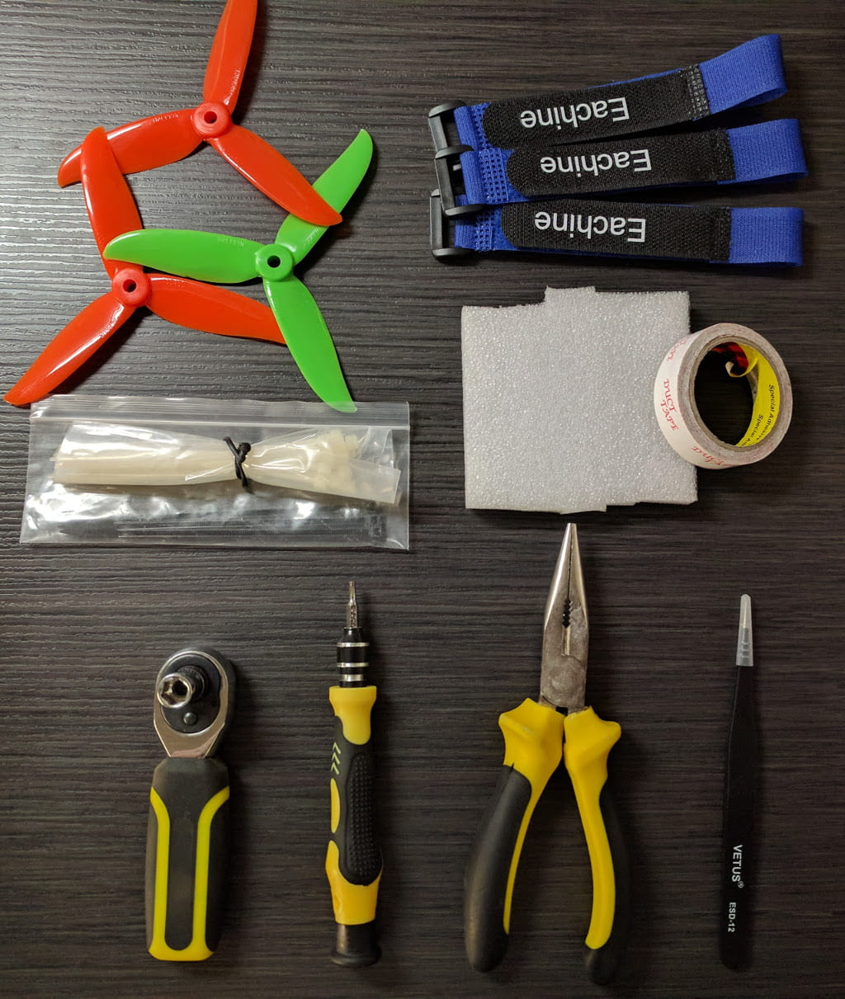

### Backpack and on-the-go repair

Sometimes when you fly you will crash. And sometimes when you crash things will break. It would make for a very unpleasant experience if you break a prop and have to go home cause you can't replace it in the field. Hence, the need for a backpack and some tools.

Now, you already need to carry your quad, radio, FPV goggles and batteries and those items take up some space, so while you are at it, you might as well get just a bit bigger backpack to accomodate for those plus some extra items.

In addition to the above mentioned I already keep in my backpack the battery charger, a USB to micro USB cable (both for charging my FPV goggles battery and if I would need to flash the firmware on the quad), props, zip ties, velcro straps, double sided sticky tape and some semi-hard foam padding. I have come to need those way too often and every time I realise I need something I don't have I add it to the backpack. The list below is meant more as an example rather than an extensive list of the best of the best tools.

As far as tools go, I make sure I have:

* M5 nut wrench (to make quick work of swapping broken props) [option 1][1] [option 2][2] [option 3][3]

* hex head screw driver for the screws [option 1][4]

* pliers for when props break in weird ways and are very hard to remove [option 1][5]

* tweezers to remove things from tight places [option 1][6]

That's the bare minimum that should really make for a pleasant stay while you are out there ripping around!

### Other tools

<strong>Soldering iron</strong>. If you are somewhat serious about getting into the hobby sooner or later it's going to come up to soldering something. Whether you build a custom quad from scratch or just need to fix your broken vtx antenna angle socket, having a soldering iron could be benefitial. Some of the most important things to consider when choosing a soldering iron:

* have at least one fine (small) tip
* be able to set temperature
* on-the-go (using Lipo battery)

Depending on your use case and what you value more, your choice could be different and there are plenty of options out there, but here are a couple worth looking at: [option 1][7] [option 2][8]

If you buy a soldering iron, then you would also need to get your hands on a [flux pen][9], [solder][10] and a [steel wire][11] to clean the tip of your iron.

<strong>Hot glue gun</strong>. There's a lot of choice out there - here is one [option][12] and here is [one with a XT-60 plug][13] so you can use your lipo batteries to power it on the go. Don't forget to pick up hot glue sticks depending on your choice of hot glue gun.

<strong>Hot air gun</strong>. Here is a decent [option][14] for a hot air gun and here's nice assortment of [shrink tubes][15] for it.

<strong>Miscellaneous</strong>. A few more tools are worth having around. [Wire cutters][16] are good for general use to quickly snip plastics and metals and [helping hands][17] could really ... well, help to hold small bits in place for more precise work. And while at it, why not grab a [lipo battery fire protection pack][18].

While this post does not claim to cover it all I hope I was able to cover most beginner use cases and needs. Happy flying!

[0]: Linkslist
[1]: https://goo.gl/SNFPFj
[2]: https://goo.gl/6c8W2T
[3]: https://goo.gl/EsEKmP
[4]: https://goo.gl/R1y1T8
[5]: https://goo.gl/12V1xS
[6]: https://goo.gl/G9ivqt
[7]: https://goo.gl/Q66v5H
[8]: https://goo.gl/puRV4x
[9]: https://goo.gl/N4AxzN
[10]: https://goo.gl/s6nEPU
[11]: https://goo.gl/RXVvp2
[12]: https://goo.gl/h2fP1g
[13]: https://goo.gl/LSLFt4
[14]: https://goo.gl/icqX3w
[15]: https://goo.gl/3KR9fo
[16]: https://goo.gl/tsSU45
[17]: https://goo.gl/3nnP2y
[18]: https://goo.gl/ibiQNX
