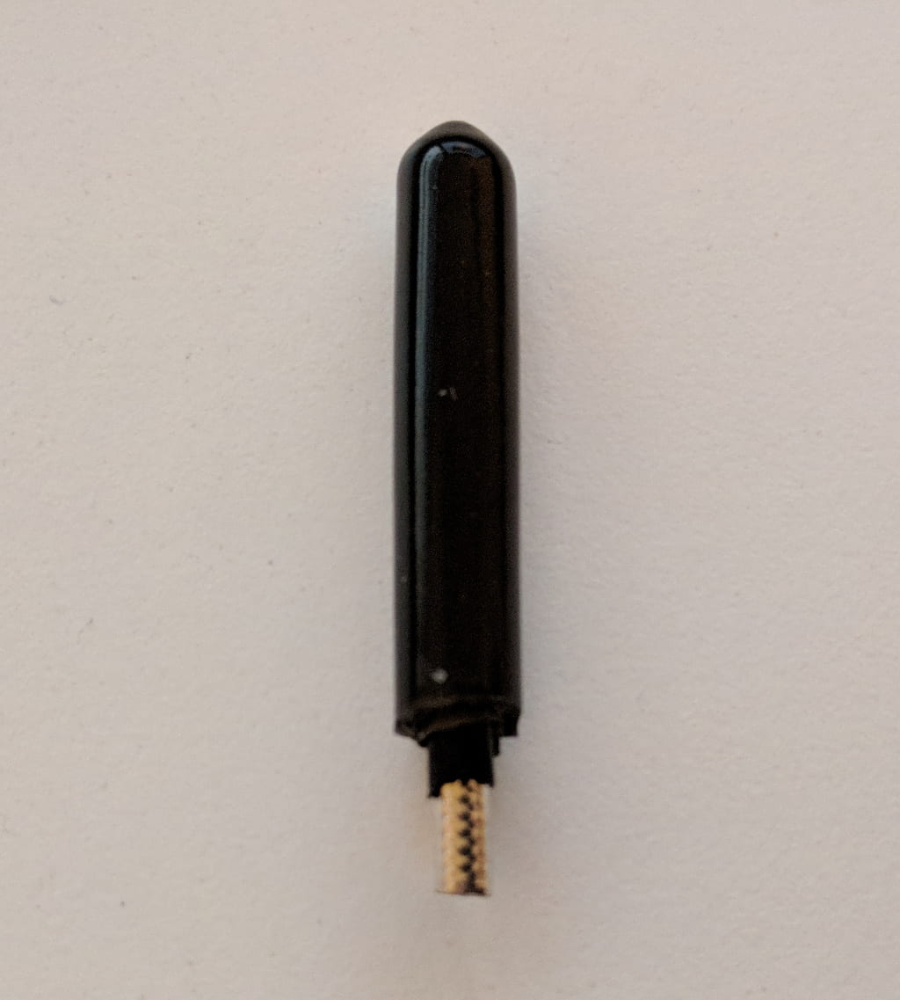
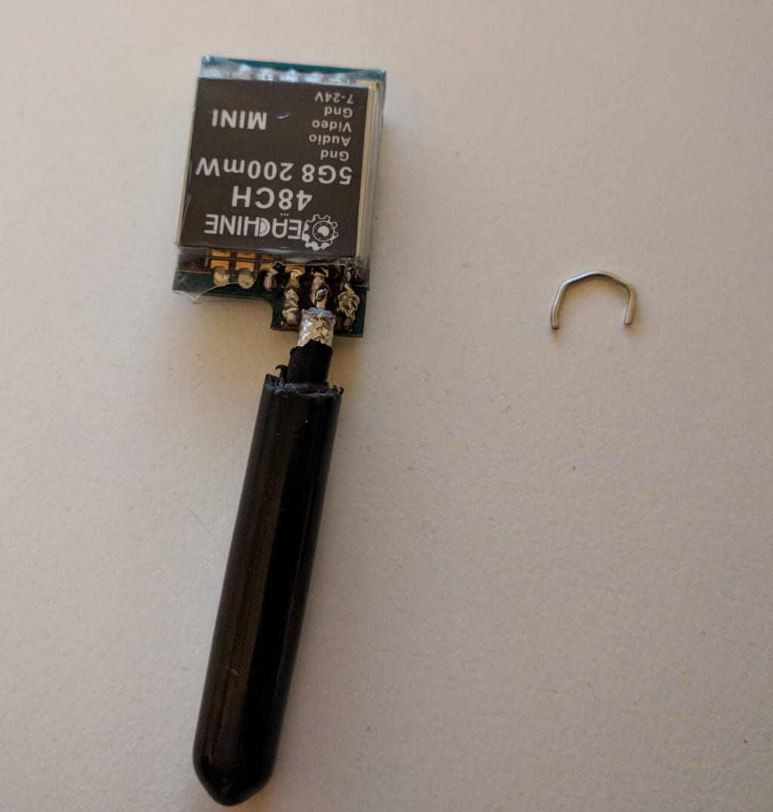
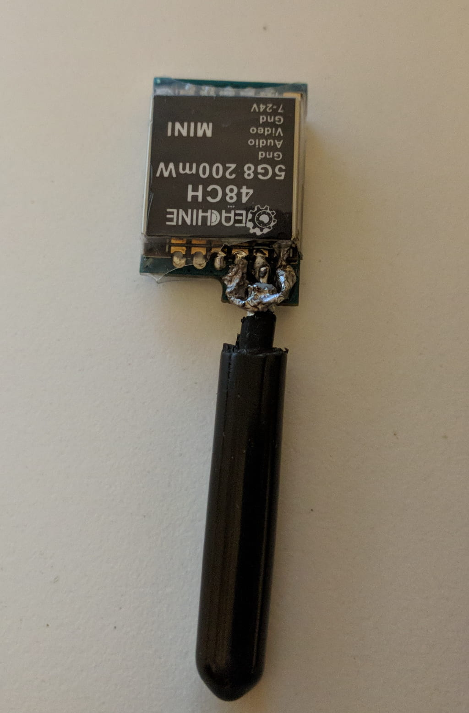
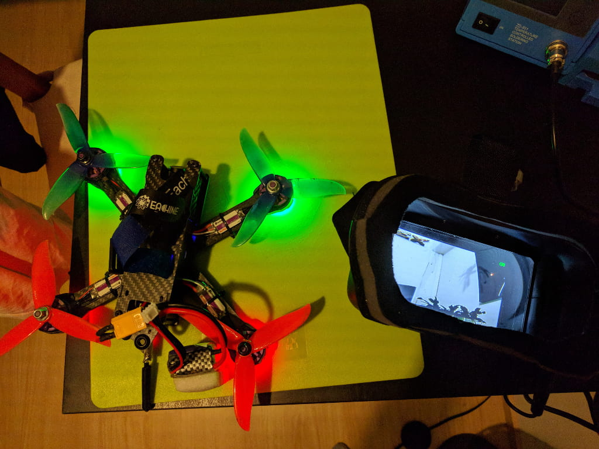
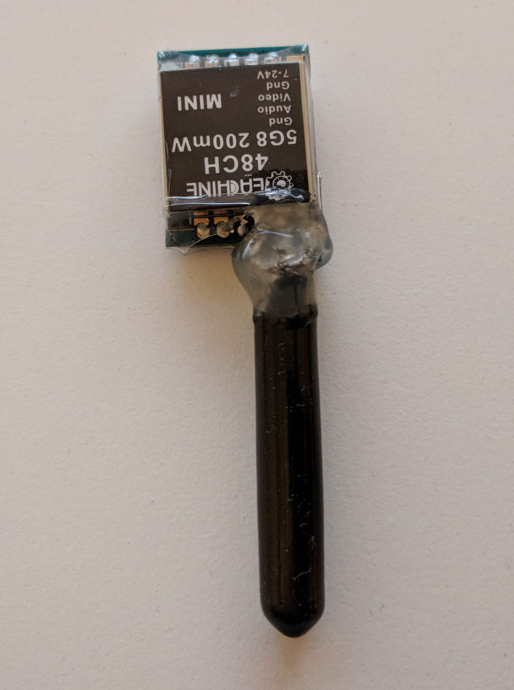

The Wizard x220 comes with this antenna angle socket on its vtx and while you can certainly upgrade the vtx and opt-in for [one that comes straight out of the back][1] and add a forward tilted [Aomway antenna][2], sometimes you might need to go for a quick fix.

If you are lucky and your angle antenna socket snaps in the 'right place', you can get away with just soldering it shut where it snapped. That's gonna do it for some time. However if you are unlucky and you break the pin inside the socket or lose one of the pieces, the only remaining option would be to direct solder an antenna to the vtx (or solder a new antenna socket to your vtx, which we won't cover here as it is rather straight forward).

|                                                    |                                                                    |
| -------------------------------------------------- | ------------------------------------------------------------------ |
|  |  |
| Soldered broken angle bracket                      | Snapped solder joint and a missing pin                             |

First things first, let's carefully strip the antenna coaxial cable. Go for the shortest possible cut past the SMA connector. I think I could have done a bit better job here by ~ 0.5 cm or so.

The antenna is multilayered so we need to remove each layer carefully in a certain way. Always be careful to not go into the next layer unintentionally. Here's how that looks with the first 2 layers stripped:

|                                                         |                                                          |
| ------------------------------------------------------- | -------------------------------------------------------- |
|  |  |
| Layer 1 removed                                         | Layer 2 removed                                          |

Up next you wanna remove the dielectric and expose the inner signal wire as in the image below. That's a good time to pretin that wire to get it ready for soldering.

Let's take a look at the vtx and notice all the solder joints. We got 3 connections on the top and 2 on the bottom. The middle one on the top is where the inner signal wire goes from the antenna. The rest are all grounds and arguably unnecessary to solder to all of them except for structural integrity.

|                                       |                                      |
| ------------------------------------- | ------------------------------------ |
|  |  |
| VTX front                             | VTX back                             |

You can remove the antenna socket by desoldering it or cutting under the solder joints carefully.

When that's done, prepare the solder joints by tinning them. In my case I decided to only solder to the front (top) solder joints. Here's how to position the antenna in the slot. You want to align the middle pin on the VTX with the signal wire from the antenna. Solder that in place. You need to be careful to not short anything, you don't want your ground (the outter metal sheet of the wire) in contact with the signal.

Finally, I made a small bracket from a 20 AWG wire. You could probably use also a bit thicker or thinner wire with just the same success. Heck, you might be even able to get away with no wire, however that would drastically reduce the structural integrity of the joint. Additionally, you can also use 2 wires and solder the second one to the back side of the VTX. Up to you. In my case I just did the front side.

You want to align the bracket so that the ends touch the VTX side (ground) pins while lying on the ground of the antenna. Solder all the touch points in place nice and strong. Flux can help a lot here.

|                                                                 |                                                                 |
| --------------------------------------------------------------- | --------------------------------------------------------------- |
|  |  |
| Antenna ready to solder in position                             | Antenna soldered and ready to rock                              |

Before we go any further, let's cross our fingers and test. WARNING: DO NOT plug in your quad with the props on in-house. It's always good to take the props off when tweaking your set up and testing things.

|                                                              |                                                              |
| ------------------------------------------------------------ | ------------------------------------------------------------ |
|  |  |

Yay! Everything seems to be in order. Awesome, optionally but highly recommended you can drop some hot glue on the connection for extra sturdiness.

In conclusion, there are a number of different ways to do this repair. Were I not about to change the VTX, I would use an [Aomway omni directional antenna][2]. That would in turn reduce even further the stress from impacts, as that antenna is somewhat flexible and bends.

On the other hand, in some ways this fix is better than the stock setup as the vtx antenna will now come out the back and hopefully participate in crashes and direct hits much less frequently. Either way, happy flying!

[0]: Linkslist
[1]: https://bit.ly/eachine-vtx
[2]: https://bit.ly/aomway-antenna
