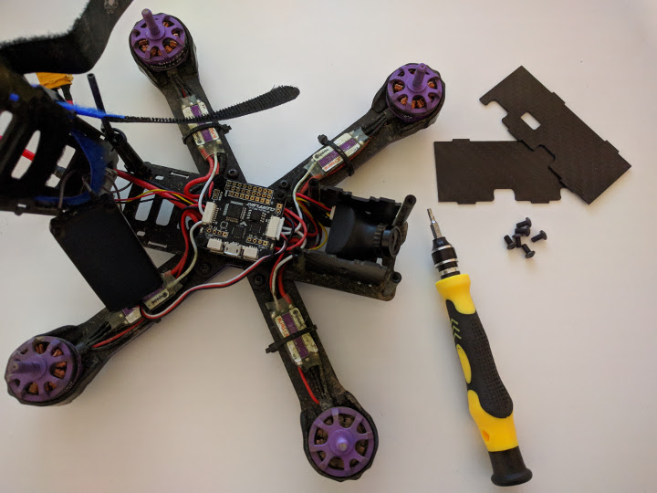
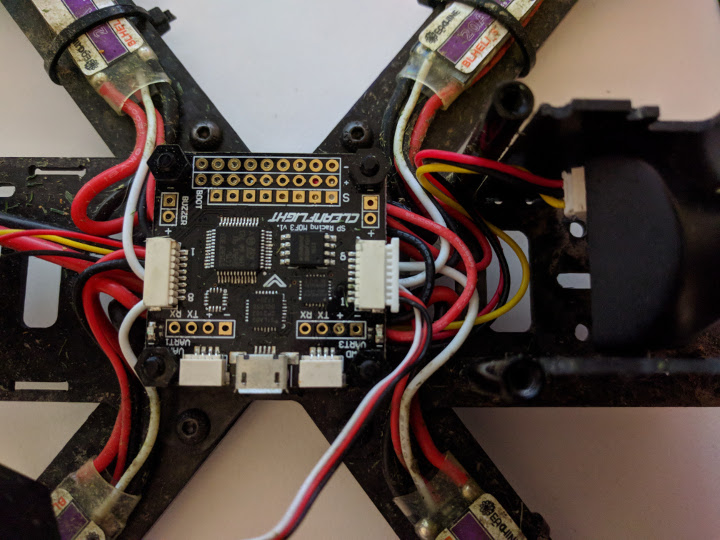
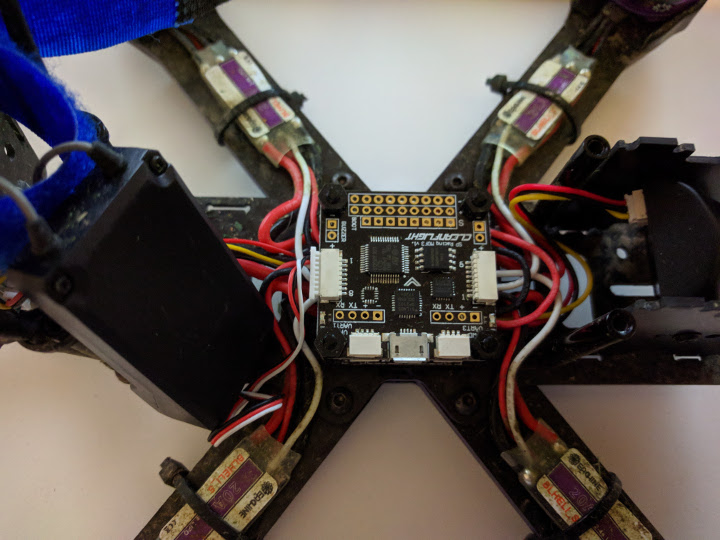
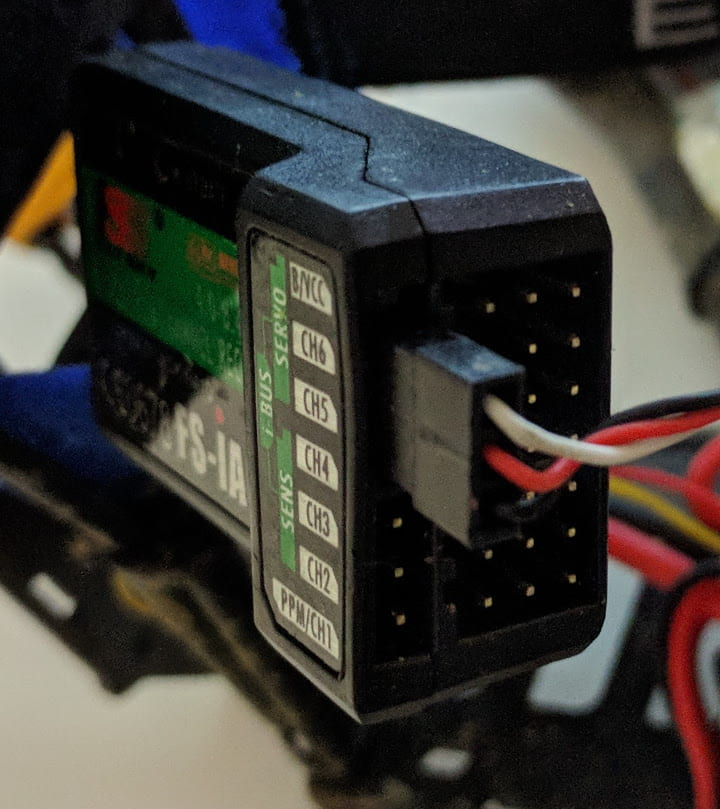
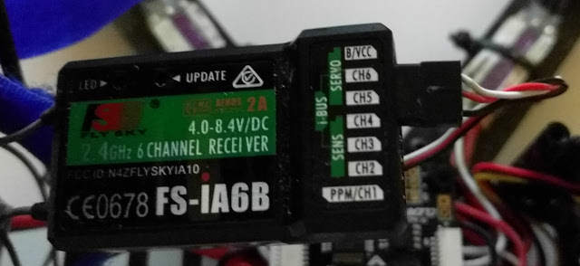
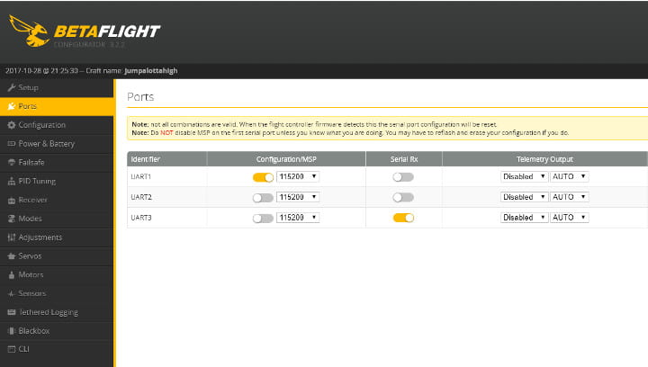
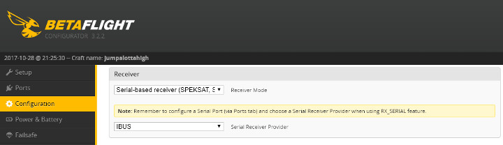
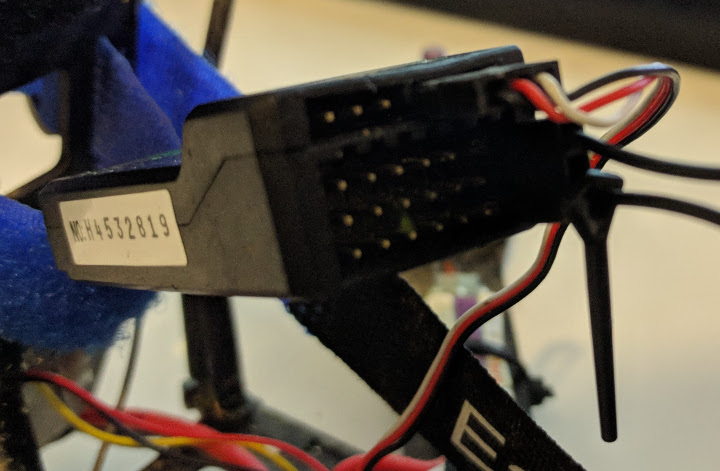
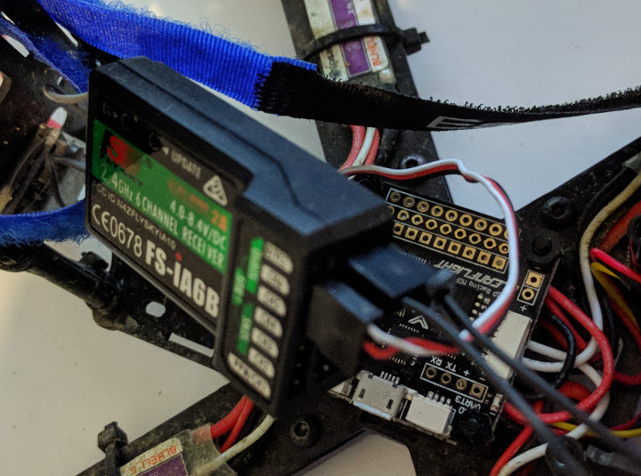

The [Eachine Wizard x220][1] comes with a Flysky receiver plugged in and set to PPM mode. You can easily switch to the much faster iBUS mode following the steps bellow.

First you want to take off the 6 top screws and put the top frame plate on the side.

By default your receiver should be plugged in the camera facing port of the flight controller. You want to carefully take that out and plug it in on the other side of the flight controller (tail side port).

Next you want to unplug the cable from the receiver itself and plug it in as in the image bellow for iBUS. It goes horizontally into the top row, spanning across channels 4, 5 and 6. With black, red and white wire in that corresponding order.

Hardware wise we are done, now let's jump quickly into Betaflight. Take the quad's props off and plug in the USB and the battery.

On the Ports tab, set Serial RX for UART3.

On the Configuration tab scroll down to the receiver settings and select _Serial-based receiver_ and then IBUS from the other dropdown. Save and reboot.

Congrats if all is well, your receiver should now work in iBUS mode.

If for whatever reason you need to bind again the transmitter and the receiver, insert the bind key into the receiver as in the image below (vertically, right hand side, on the B/VCC line).

With your quad's props off (and vtx antenna on!) plug in the battery. With the transmitter off, hold the bind button on it and THEN TURN IT ON. The Flysky radio should bind and you should be set. Happy flying!

[0]: Linkslist
[1]: https://bit.ly/wizardx220
