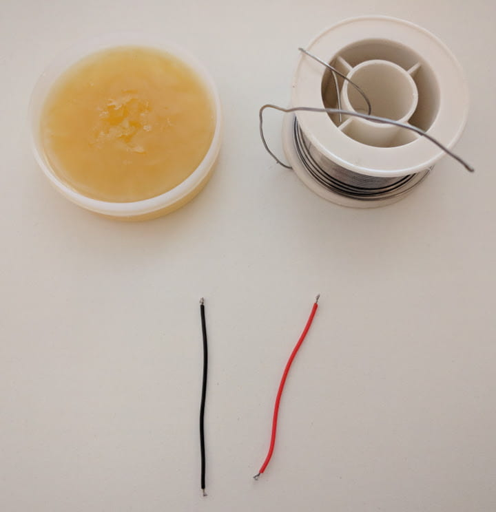

  <strong>Add to the map and share your fpv flying spots</strong> with the community at
  <strong><a href="https://www.fpvtips.com/fpv-map">Fpvtips.com</a></strong>. It takes a second to <strong>add a spot to the map</strong> and you can also <strong>add a link to YouTube video or Instagram photo</strong> from that spot for fame and glory.

Since the Wizard x220 doesn't come with a buzzer already set up, this is many times a very useful and not too hard upgrade to do. Of course, if your main concern is just getting a voltage buzzer for your battery, you can opt-in for one of [those little things][1] and call it a day. However you would be missing out on one very interesting option - the 'lost model' signal.

Even if you are a beginner and trying not to get lost, chances are every once in a while you will still crash, drop or trigger failsafe and if you are in FPV you might have a hard time finding your drone. The solution - adding a buzzer to your quad and setting up your 3 position switch to sound your buzzer on demand. Here's a couple of examples of such buzzers: [direct solder][2] and [solderless][3].

|                                                     |                                                  |
| --------------------------------------------------- | ------------------------------------------------ |
|  |  |
| Direct solder buzzer and 28 AWG silicone wire       | Solderless buzzer                                |

In this mini guide I have decided to go for the option requiring soldering, as it is actually quite simple - you need to run 2 or 4 wires, depending on which setup you go for. Let's get to it.

First things first, take off the props, the top plate, side plates and the m3 nylon nuts from the flight controller.

|                                                       |                                                              |
| ----------------------------------------------------- | ------------------------------------------------------------ |
|  |  |
| Remove the top frame plate                            | Remove the flight controller nuts                            |

Take out your soldering gear, plug in your iron and set it to about 400 C (750 F). I cut 2 5cm (2 inch) pieces of 28 AWG silicone black and red wire. You want to strip both ends on both wires, dip them in flux and then tin them up.

Now locate where the battery leads end up on the PDB. You want to solder your wires on the same joint. There are two things to keep in mind:

- black wire goes to black (ground to ground) and red to red (positive to positive)
- you do not have to reflow the entire solder joint

By far the easiest method is to drop a bit of fresh solder on top of the already existing solder joint. Then bring in your wires, reheat the solder while keeping the wires in place and that's it. Here's how that looks when done, you can do better than that, my solder job here was not very good, but it will still do for now.

Now that you have the vbat wires on the PDB, you can put the flight controller back careful, arranging the wires underneath and applying pressure carefully. You can press a bit, but you don't want to squeeze or pinch any wires.

Guide the vbat wires carefully across and under the flight controller so they come out the other side to get soldered to the flight controller. Same procedure - add flux, tin the flight controller solder holes and solder the wires as shown below. Again, black to negative, red to positive.

The flight controller has now access to the battery voltage. Next up, let's get the buzzer connected. Strip wires, add flux and tin. Same for the buzzer terminals - put flux and tin them up. And same for the buzzer terminals on the flight controller.

All that is left is to solder the wires in place to connect the negative to negative(using the black wire) and positive to positive(using the red wire) on the buzzer with the same terminals on the flight controller.

That's it! You are all set. You should now hear extra beeps from your buzzer on battery plug in, arming the quad, transmitter connection lost (failsafe) or battery voltage low. The only thing I set up extra was to set lost model alarm on my 3 level switch. You can set that up anyway you like, however in my case I have it set like so:

> AUX 1
>
> - state 1: arm off
> - state 2: arm on

> AUX 2
>
> - state 1: acro mode
> - state 2: horizon mode
> - state 3: lost model alarm

I really like this quick and dirty mod, I believe it is a must have and I hope this helps you to set it up too. If you have any questions, hit me up on <a href="https://twitter.com/jumpalottahigh" target="_blank" rel="noopener">twitter</a>. Happy flying!

[0]: Linkslist
[1]: https://bit.ly/battery-voltage-tester
[2]: https://bit.ly/2lrKgak
[3]: https://bit.ly/2tpr8gF
