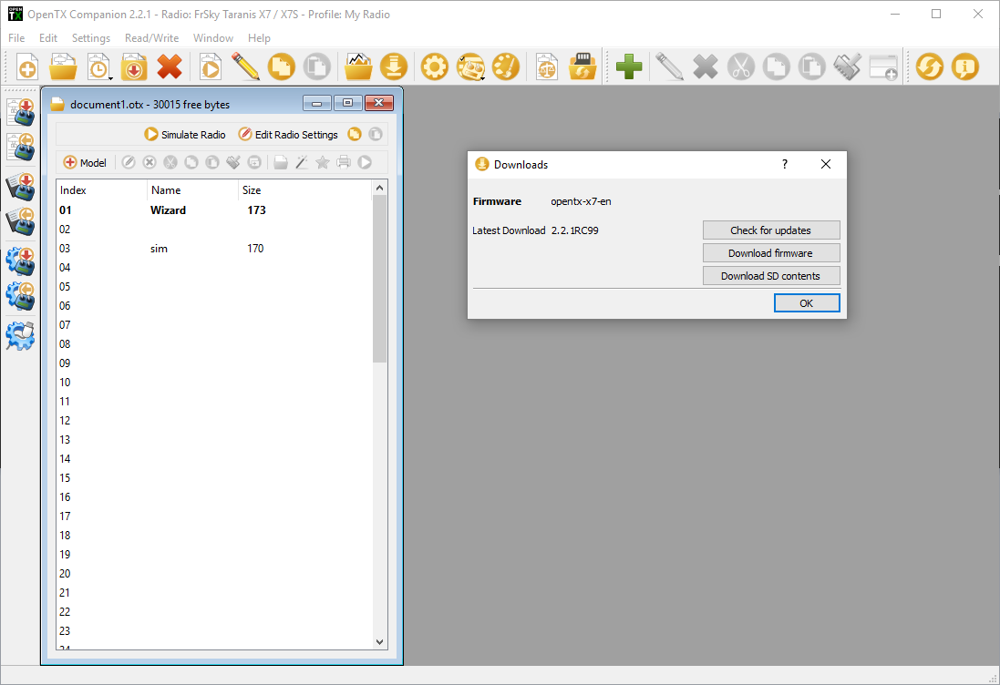
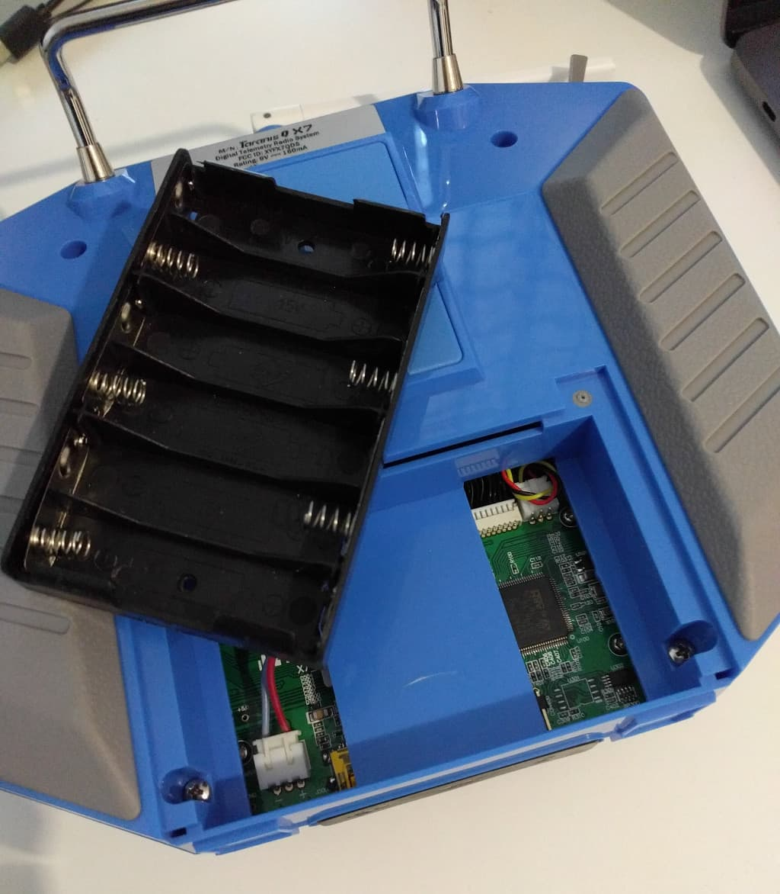

  I released 
  <strong><a href="https://www.fpvtips.com">Fpvtips.com</a></strong> in November 2018. Make sure you check it out for more FPV related goodness!

I recently upgraded to a [Taranis Q X7][7] and after doing the initial setup I decided to sum up some of the main points in a helpful post. Much of the information gathered here was heavily influenced from Project Blue Falcon's [excellent video series on YouTube][8]. I hope this write up helps you breeze through the configuration and gets you flying in no time!

### Update firmware

Go to [Open-TX.org][1] and look for the latest version under the `News` section on the main page. At the time of writing this is [OpenTX 2.2.1][2]. Look for and download the installer corresponding to your OS at the bottom of the page. Install the software. Don't worry about any popups or settings dialogs after you start OpenTX.

To connect your Taranis to your computer you need a **mini usb to usb cable**(not a micro usb!).

To put the Taranis in bootloader mode so we can flash the firmware press and hold the 2 horizontal trimmers towards each other and press the power button while still holding the trimmer buttons.

At this point you can plug in the mini usb cable and connect the Taranis to your computer by plugging in the mini usb cable. Fire up OpenTX on your computer. At this point you may get asked to download software or get sent into the settings menu. Let's deal with the settings first. Find the settings button at the top (the one with the cog wheel) and **select the correct radio type** from the dropdown (in this case FrSky Taranis X7 / X7S).

Next up, let's download the required firmware by clicking the `Download` button in OpenTX and the clicking `Download firmware`.

Save that somewhere you can find it and with your radio plugged in let's flash the firmware. Find the `Write firmware to radio` button on the bottom-left hand side of OpenTX. Click `Load...` and point OpenTX to the firmware `.bin` file you downloaded previously, then click `Write to TX`.

Congrats you now have the latest firmware! Select exit from the bootloader menu on the Taranis and unplug the mini USB cable.

### Setup SD card

To download the SD card contents go to [OpenTX/downloads][3] and click the firmware version you downloaded. Scroll down until you see the SDCard content for x.x.x version download link and click it. Again at the time of writing this is [the current link][4]. Under that download the archive for your radio. Since we are doing this for the **Q X7**, go to the `/opentx-x7/` directory and download the latest zip from there. Unzip that in a directory of your choice.

You can copy the files you unzipped to an SD card through your Taranis or any other method to just copy the files over with any micro sd card reader. You don't need a very big SD card, I'm [using a 16GB card][5], you can use bigger or smaller depending on what you have available.

While we are at it, let's get the [Amber Sound pack][6] which sounds much better than the default sounds. Look for a download link on that page for Amber Sound pack corresponding to your OpenTX version(in my case 2.2). Download that and unpack it to a directory of choice. Look for the `SOUNDS` directory inside and copy that. Go to your SD card and delete the `SOUNDS` directory in the root. Then paste in the one we copied from the Amber Sound pack. You're set with the sounds.

Plug the card back into your Taranis or exit bootloader mode and restart the Taranis, depending on your choice of how to transfer the files to the SD card. You should now hear the new sound pack greet you on boot up.

---

### Bonus: add custom start screen image

This next part is not mandatory but definitely fun. Feel free to skip if you don't want a custom start screen for your radio. Making one is actually not that complicated. Use any image creation software, you can even use Paint. There are 3 restrictions when creating your images: size, colors and filename.

- The **width of the image should be 212px and the height 64 px**
- Save the image as **monochrome BMP** file (black and white)
- The filename should be **AAA.bmp**

Once you have prepared your image, add the path to it in the settings of OpenTX under `Splash Screen`.
Still in the settings menu under SD Structure path select the path to the SD card mounted in the Taranis.

Then to update the splash image we actually need to flash the software so head to that dialog and flash it after selecting `Use profile start screen`. You will also have visual confirmation of which start screen you are uploading.

Aaaand, that's it, enjoy your custom splash screen!

### Bonus II: install a 2s lipo

Get your hands on [one of these 2S batteries][9] (or similar).

Pull out the AA battery tray carefully and disconnect it from the cable.

Connect your 2S battery...

And place it inside.

Go to the radio configuration and make sure you set **Battery range** to **6.8-8.4** and **Battery low** to **6.6V**.
Voila! Enjoy not having to buy any more AA batteries.

[0]: Linkslist
[1]: http://www.open-tx.org
[2]: http://www.open-tx.org/2017/12/16/opentx-2.2.1
[3]: http://www.open-tx.org/downloads
[4]: https://downloads.open-tx.org/2.2/sdcard/
[5]: https://bit.ly/sd-card-16
[6]: http://open-txu.org/v2-2-resources-2/
[7]: https://bit.ly/taranis-qx7
[8]: https://www.youtube.com/watch?v=SJM8G0VCFqM&list=PLiYYhnH4BhI-ot9OQ9djvRaacFHboFqC2
[9]: https://bit.ly/taranis-lipo
