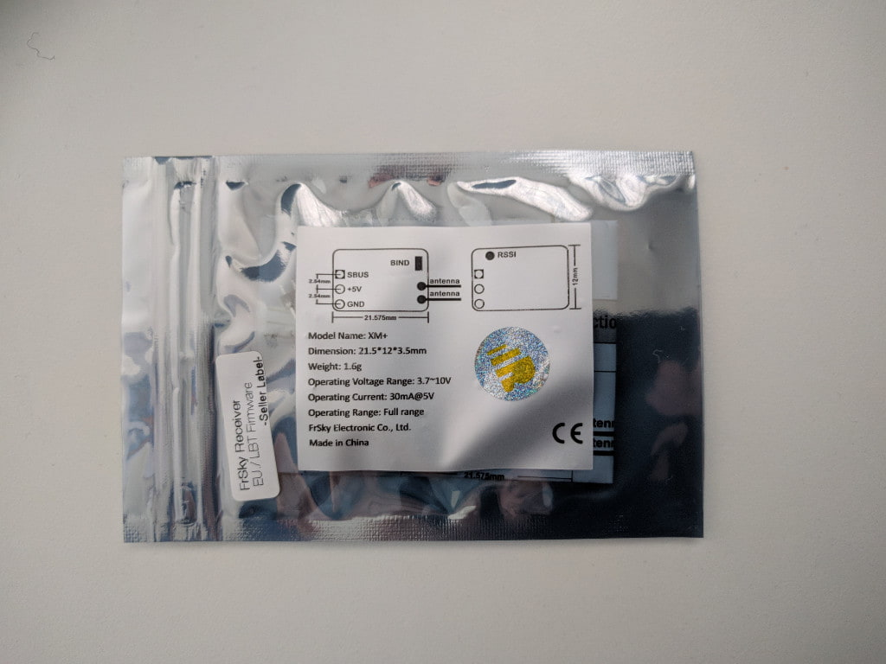
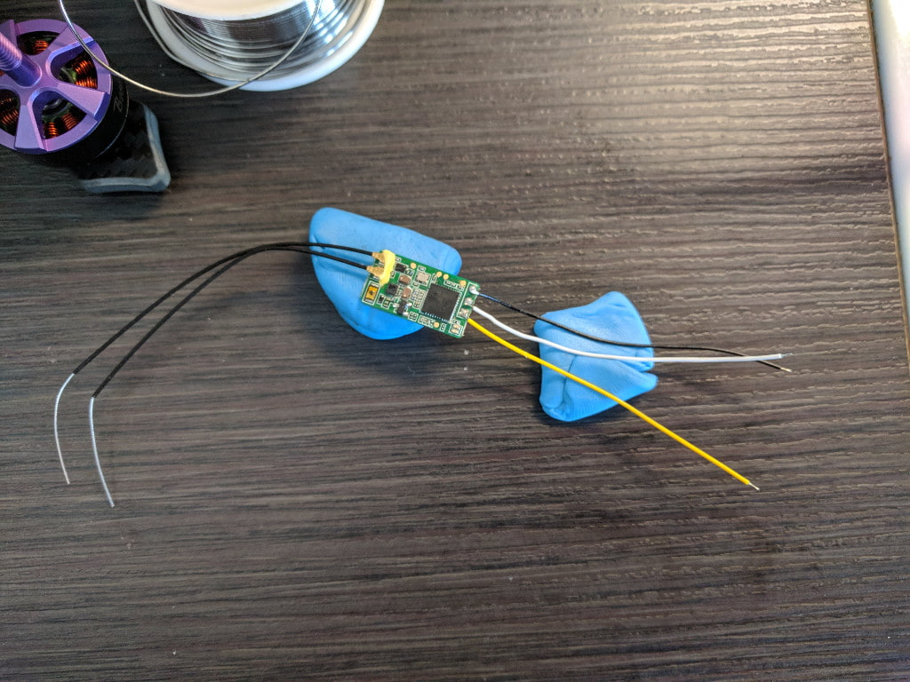

This is a living document and an ongoing project. More pictures and information will come as I progress with the build. This build is heavily inspired by [UAVfutures' 110MPH build][1] with some changes.

### 1. Initial test assembly

As some of the parts arrived I decided to do an initial test assembly of the frame to have a look at components and potential pitfalls and I did indeed find one. The screws that came with the [BrotherHobby Returner motors][2] were too short for the thick 6mm arms of the [Realacc Furious frame][3]. Luckily I had also ordered an assortment of screws and hope to find a fitting match there.

### 2. Mount the motors

It seemed that 10mm was the perfect length screw I needed to get through the frame arm and just enough into the motor. Additionally I used some loctite threadlocker and tightened the screws properly. Here's the frame with the motors mounted.

### 3. Solder the motors to the ESC

This step was rather straight-forward and consists of the following steps (repeated for each motor):

1. Tin up the ESC pads.
2. Cut wires to length, strip silicone and tin the ends.
3. Solder to the ESC.

Caveats and things to look out for:

* Do a quick solder job
* Use well heated iron (I used 400C-450C [750F - 840F] with a 48 watt station)
* Use extra flux if your solder oxidizes too quickly to avoid cold solder joints
* Motor rotation will be adjusted with software.

The solder I used and have seen recommended widely is [63/37 tin lead rosin core 0.8mm 2% flux solder][4].

While at it, I also soldered an XT-60 connector to the battery leads. You do need to be careful for polarity. Here's how the wires should be connected.

### 4. Solder and bind the receiver

Since the next item to arrive was the [Frsky XM+ receiver][5], I worked on that next.

First solder some wires to the receiver as seen on the picture below:

* Black = Ground
* White = 5V
* Yellow = Signal

The other end of those wires go into the flight controller's front right hand solder pads as seen on this picture.

Basically look for SBUS, ground and 5V pads close to each other.
With the receiver soldered the next step is to bind it to the receiver.

* Create a new model in your transmitter
* Press `BND` and the transmitter will start chirping
* While holding the bind button on the receiver, connect the quad to a battery (PROPS OFF!!!)
* In a few seconds the bind is complete
* Exit the bind on the radio and turn it off
* Unplug the battery from the quad
* Turn on the radio and plug in the battery to the quad
* If your receiver's led is solid green, it's all good and your radio is bound

On the radio's Mixers page I mapped channels 5 and 6 to a couple of switches. I will use those later in Betaflight as AUX1 and AUX2 for arming and flight modes/beeper.

### 5. Motor test and setup in BLHELI configurator

With the receiver and radio all set up it's finally time for a motor test to see if everything works correctly (although 2 of the motors' direction still needs to be reversed with software).

Again, can't stress that enough, **never have propellers on when working on your quad and / or the motors**.
In Betaflight I setup up and arming switch and chaned the receiver channel mode to `TAER` to match the mode in the transmitter. At that point the channels were mapped correctly and seemed to work fine.

Then I armed it for the first time and **all but one motor** worked. The front-right motor does not start up at all. As a first test I desoldered and resoldered it back but it still does not start up. To be continued...

Either way, here's how to setup the motor rotation in the [BLHELI configurator][6]. The first picture shows the default setup when I first plugged the quad in. The second picture is the end result.

As you can tell, the only difference was setting motors 2 and 3 to be in reverse direction. That does the trick.

To top it all off, when I was trying to connect a micro USB cable to the flight controller the **micro USB connector fell off the board**...

### 6. Throubleshooting

Building and repairing quads certainly requires a lot of learning and investigation. It's one of the best parts of the hobby and also sometimes one of the most frustrating ones. When seriously stuck, taking a break always helps (works also with programming).

Having concluded that a dead ESC fried one of my motors, I purchased a new motor and requested a refund for the 4-in-1 board. While waiting for those to arrive I decided to also get my hands on a [multimeter][7] and make a [smoke stopped][8].

I can't stress it enough how much I recommend making your own smoke stopper. So much so, I decided to make a super quick guide, so if you are interested (and you should be) go here to read more about [how to make your own smoke stopper][8].

Next up: Wait for new motor and new board to arrive...

[0]: Linkslist
[1]: https://www.youtube.com/watch?v=evVP9_FpNSE
[2]: https://goo.gl/x9B9xp
[3]: https://goo.gl/NwhhDm
[4]: https://goo.gl/y2QSCv
[5]: https://goo.gl/LuqFSk
[6]: https://github.com/blheli-configurator/blheli-configurator/releases
[7]: https://goo.gl/xhRiiz
[8]: /fpv/make-a-smoke-stopper
