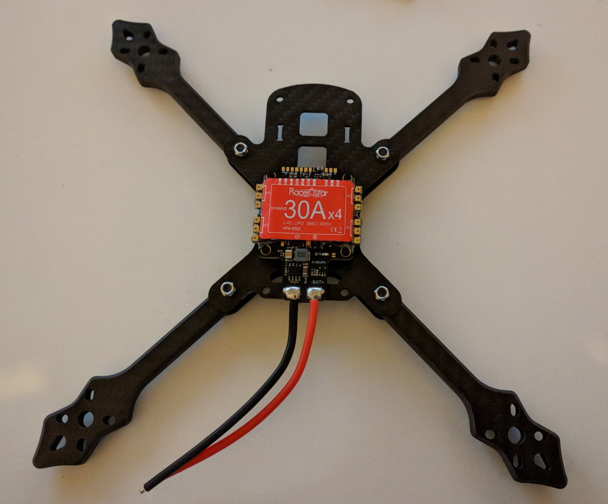

This is a living document and an ongoing project. More pictures and information will come as I progress with the build. This build is heavily inspired by [UAVfutures' 110MPH build][1] with some changes.

### Initial test assembly

As some of the parts arrived I decided to do an initial test assembly of the frame to have a look at components and potential pitfalls and I did indeed find one. The screws that came with the [BrotherHobby Returner motors][2] were too short for the thick 6mm arms of the [Realacc Furious frame][3]. Luckily I had also ordered an assortment of screws and hope to find a fitting match there.

### Mount the motors

It seemed that 10mm was the perfect length screw I needed to get through the frame arm and just enough into the motor. Additionally I used some loctite threadlocker and tightened the screws properly. Here's the frame with the motors mounted.

### Solder the motors to the ESC

This step was rather straight-forward and consists of the following steps (repeated for each motor):

1. Tin up the ESC pads.
2. Cut wires to length, strip silicone and tin the ends.
3. Solder to the ESC.

Caveats and things to look out for:

* Do a quick solder job
* Use well heated iron (I used 400C-450C [750F - 840F] with a 48 watt station)
* Use extra flux if your solder oxidizes too quickly to avoid cold solder joints
* Motor rotation will be adjusted with software.

The solder I used and have seen recommended widely is [63/37 tin lead rosin core 0.8mm 2% flux solder][4].

While at it, I also soldered an XT-60 connector to the battery leads. You do need to be careful for polarity. Here's how the wires should be connected.

Next up: soldering the VTX...

[0]: Linkslist
[1]: https://www.youtube.com/watch?v=evVP9_FpNSE
[2]: https://goo.gl/x9B9xp
[3]: https://goo.gl/NwhhDm
[4]: https://goo.gl/y2QSCv
