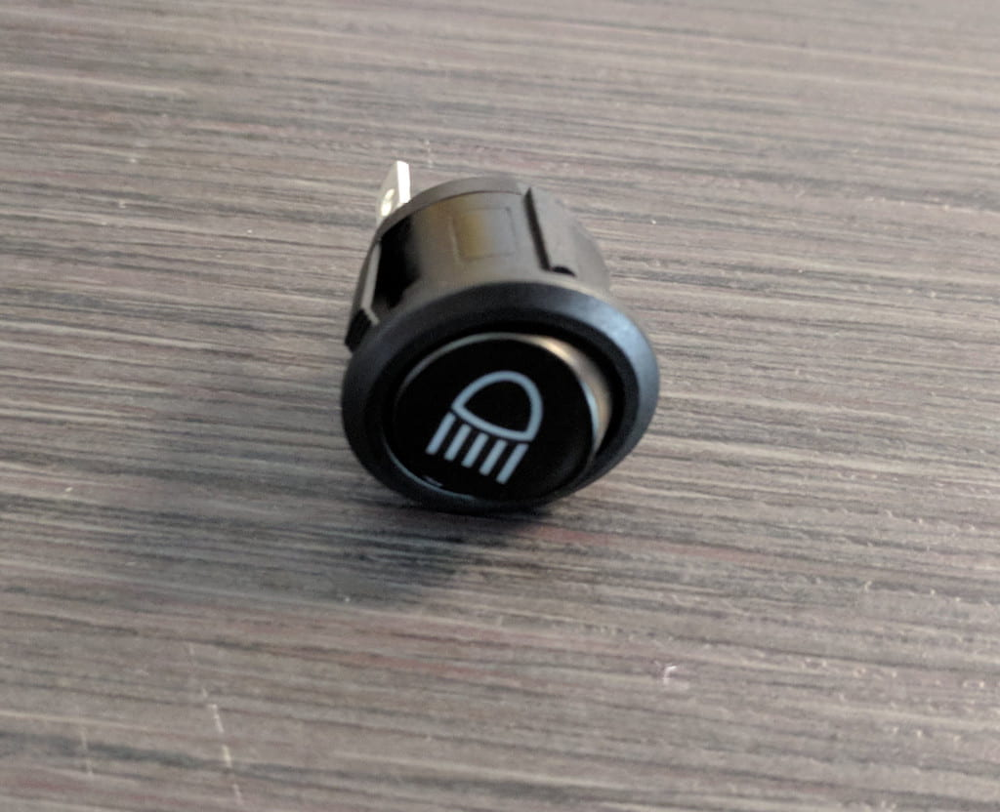
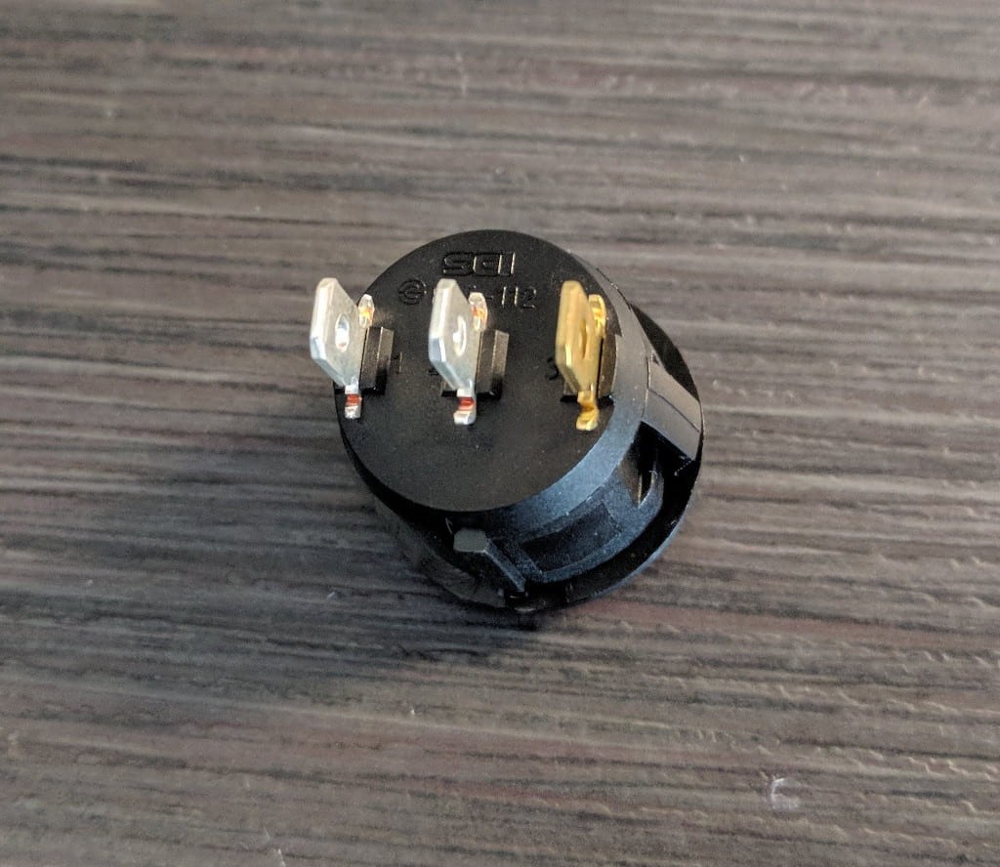

  <strong>ANNOUNCING: ⚠️ <a href="https://www.fpvtips.com">Fpvtips.com</a> ⚠️</strong> 
  Writing this blog for a year and helping so many people in that time, has thought me a lot and has lead me to want to
  <strong>create something more, something new, something for our FPV community 💜</strong>. <strong>Fpvtips.com</strong> is in very early beta and being actively worked on. <a href="https://www.fpvtips.com">Check it out</a>!

A smoke stopper can save your quad many times. In a nutshell what it does is it acts as a load between your battery and your quad. In the case of a short, the light bulb goes on and your board, escs and motors are safe. Nifty!

The build is relatively simple. Here's everything you need:

#### 12V 21 Watt light bulb

#### 1 male and 1 female XT-60 connectors

#### 16 AWG wire (red and black)

#### Switch

|                                             |                                            |
| ------------------------------------------- | ------------------------------------------ |
|  |  |
| Switch front                                | Switch back                                |

### Solder all the things

The switch has 2 silver and 1 gold pad. The first connection is to the outter silver pad. Solder a black wire and lead that to the ground of the bulb (the side of the metal base).

The positive lead goes at the base of the bulb and into the positive end on the female XT-60 connector.

The switch's middle pad (silver) goes into the positive on the male XT-60. Twist together 2 black wires, one longer and one shorter, solder them together and then solder them to the gold pad on the switch as seen below.

Lastly, solder the grounds from the switch gold pad to the grounds on the XT-60 connectors. Voila!

May your smoke stopper save many quads! Happy flying!

[0]: Linkslist
