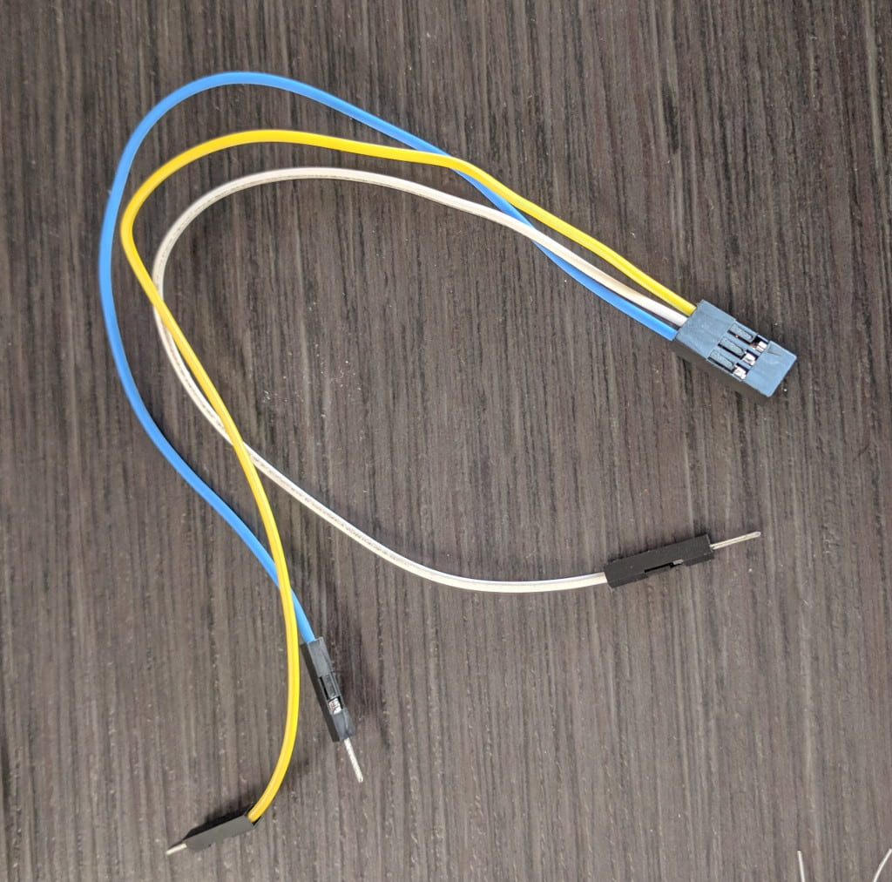
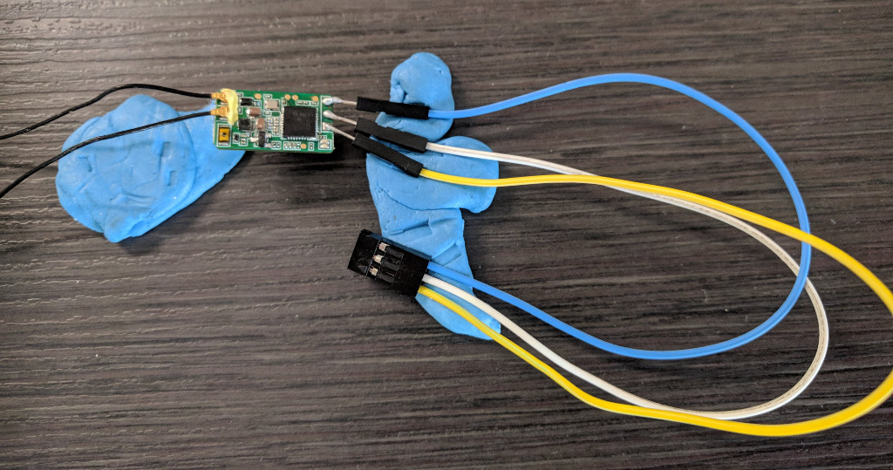
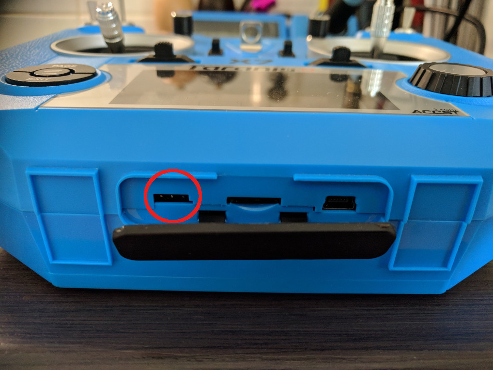
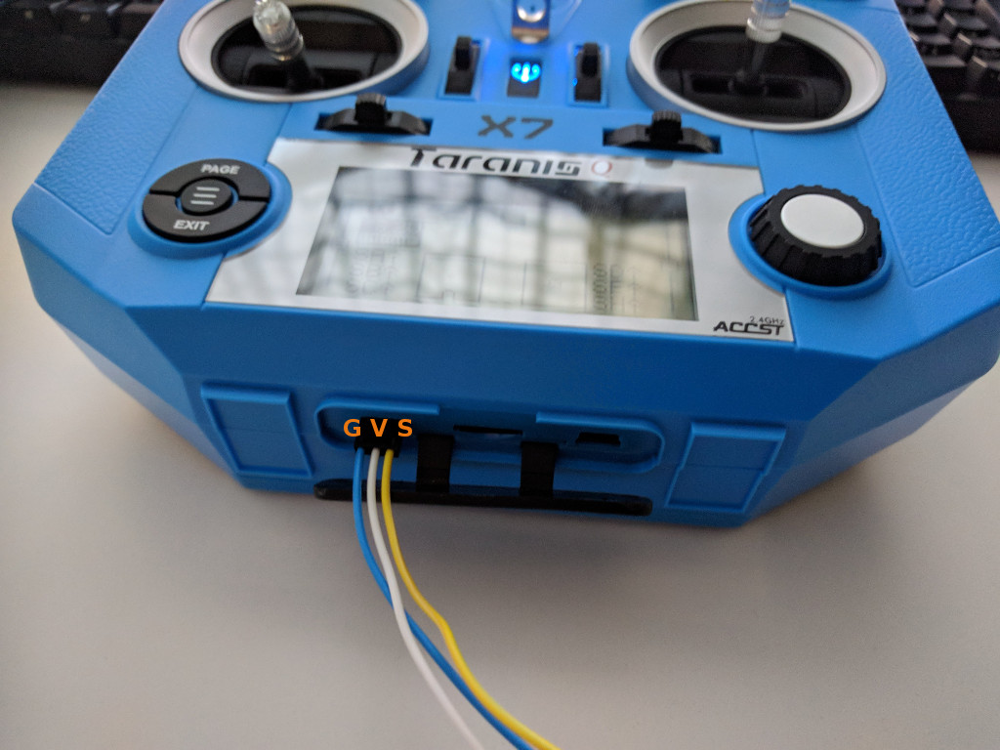
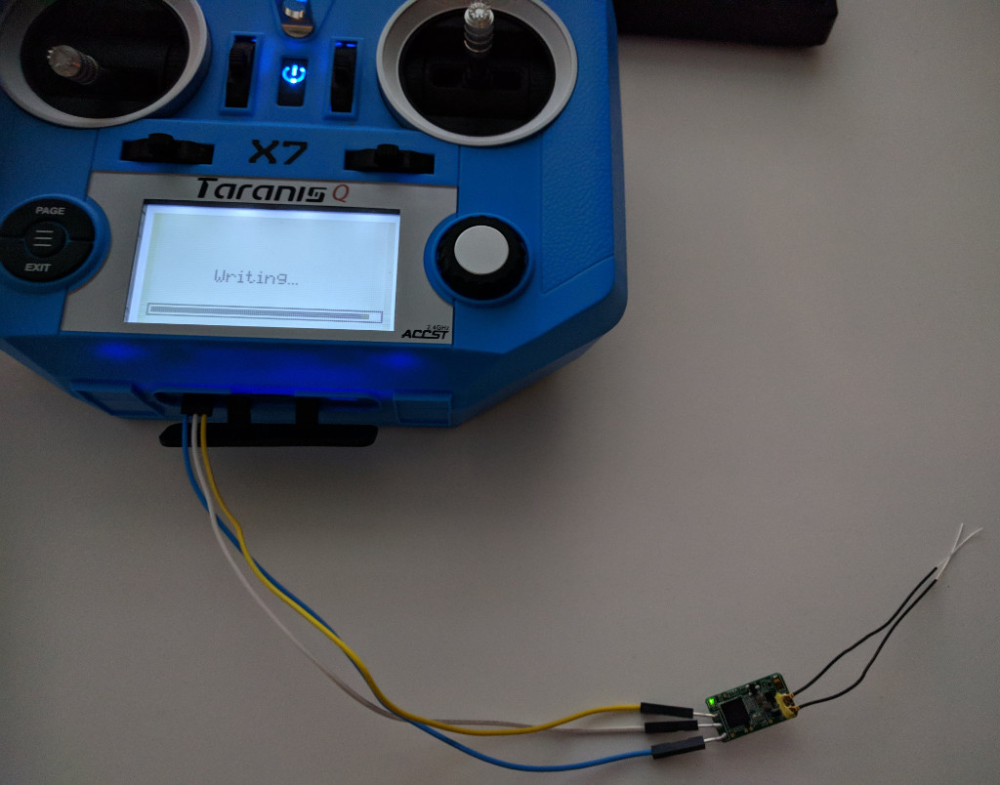
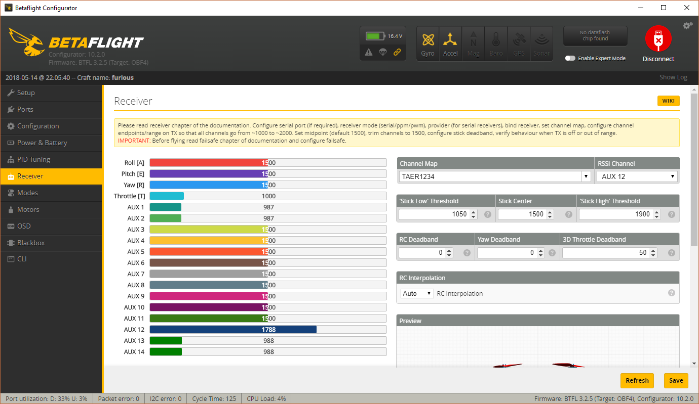
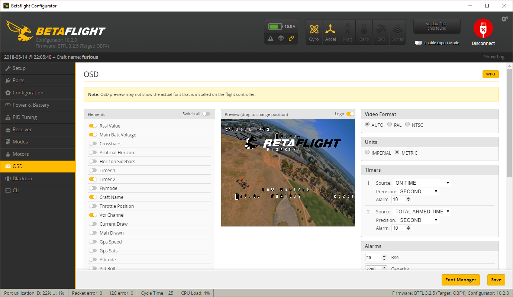
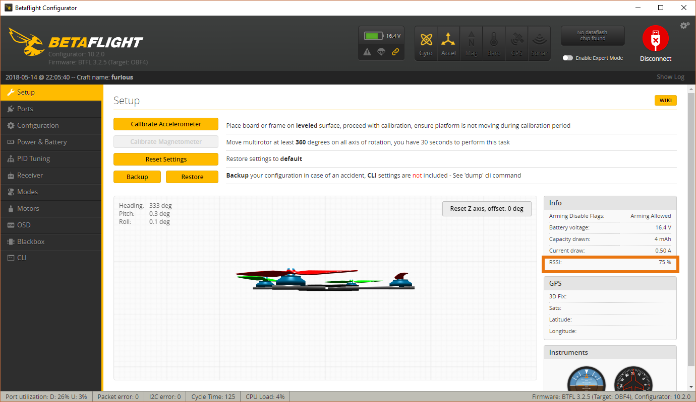

  <strong>ANNOUNCING: ⚠️ <a href="https://www.fpvtips.com">Fpvtips.com</a> ⚠️</strong> 
  Writing this blog for a year and helping so many people in that time, has thought me a lot and has lead me to want to
  <strong>create something more, something new, something for our FPV community 💜</strong>. <strong>Fpvtips.com</strong> is in very early beta and being actively worked on. <a href="https://www.fpvtips.com">Check it out</a>!

Sometimes you might need to flash new firmware on the [XM+ receiver][3]. The two main reasons as to why you may want to do that are usually:

- You have purchased **LBT (EU)** version of the receiver and need to flash the **FCC (US)** firmware (or the other way around)
- You want to **enable RSSI** on channel 16 (requires latest firmware)

If these sound familiar, look no further, let's get this done.

#### ⬇️ Download the firmware

Go to FrSky's site, look for the XM+ receiver, go to the downloads section for it. [Or click here][1]. Expand the firmware tab and download the latest firmware. At the time of this writing this is the firmware version **170313** from 2017-03-28. When you unzip the downloaded file you should get a folder (named XM+ 170313) with 6 files in it. These different versions of the firmware are:

- FCC
- FCC + RSSI on channel 8
- FCC + RSSI on channel 16
- LBT
- LBT + RSSI on channel 8
- LBT + RSSI on channel 16

#### 📋 Copy the firmware to the Taranis Q X7

Copy the whole folder with all 6 files in it to the [Taranis Q X7][4]. You should place the files under the **FIRMWARE** directory on your Taranis SD card. If you haven't set that up, you can [read here how to do it][2].

#### 🔌 Prepare cables and solder the receiver

You can use many different cable types, but a servo cable or a dupont cable will serve just fine. Anything, as long as you have 3 female ends to plug into the Taranis. Here's an example:

Solder the other ends of the cables to the XM+ receiver as seen below. In this case I'm using:

- Blue for Ground
- White for 5V
- Yellow for Signal

#### 📲 Flash the firmware

We are gonna use this port on the bottom of the Taranis to perform the flashing.

> _If for whatever reason this port does not work for you (older radio?), you can also use the port in the module bay on the back of your Taranis. I'm not gonna go over these here, however, there are plenty of guides on how to do that using the back port. You just need to be careful and figure out which wire is for what. Back to our story._

You wanna plug in the cable according to this order of pins:

**G V S** - as seen on the image below. With the front of the radio facing yourself, left to right - ground, 5V and signal pin.

Next, hold the menu button to get to the radio setup screen. Press page onces to get to the SD card content. Scroll to and open the **FIRMWARE** directory, then into the **XM+170313** directory, then select the firmware you want to write (again, pay attention to the FCC vs LBT versions (US vs EU)) and select a version with **RSSI16**. Hold press the radio action button and select **Flash ext. device**.

If you see "Writing" and a progess bar, you are in the game. Your receiver should also start blinking in alternating red and green. Wait patiently for the flashing to complete. If successful, congrats, your receiver is flashed! If you don't care for RSSI, you are done!

#### 🛠️ Set up RSSI on channel 16

With this new firmware in place the XM plus receiver outputs RSSI telemetry by default on channel 16. In order to utilize this, in Betaflight, go to the **Receiver** tab and set for **RSSI Channel - AUX 12** (= channel 16, since the first 4 channels are for roll, pitch, yaw and throttle). Click save.

Go to the **OSD** tab and make sure RSSI value is on so you can see it when you fly.

Lastly, go to the **Setup** tab and verify that you see a value for RSSI. The value should react to interference and you moving your radio away from the receiver.

#### 🎉 Enjoy, I hope this helped you and happy flying!

[0]: Linkslist
[1]: https://www.frsky-rc.com/xm-plus-mini-sbus-non-telemetry-full-range/
[2]: /fpv/setup-taranis-qx7
[3]: https://bit.ly/xm-plus
[4]: https://bit.ly/taranis-qx7
