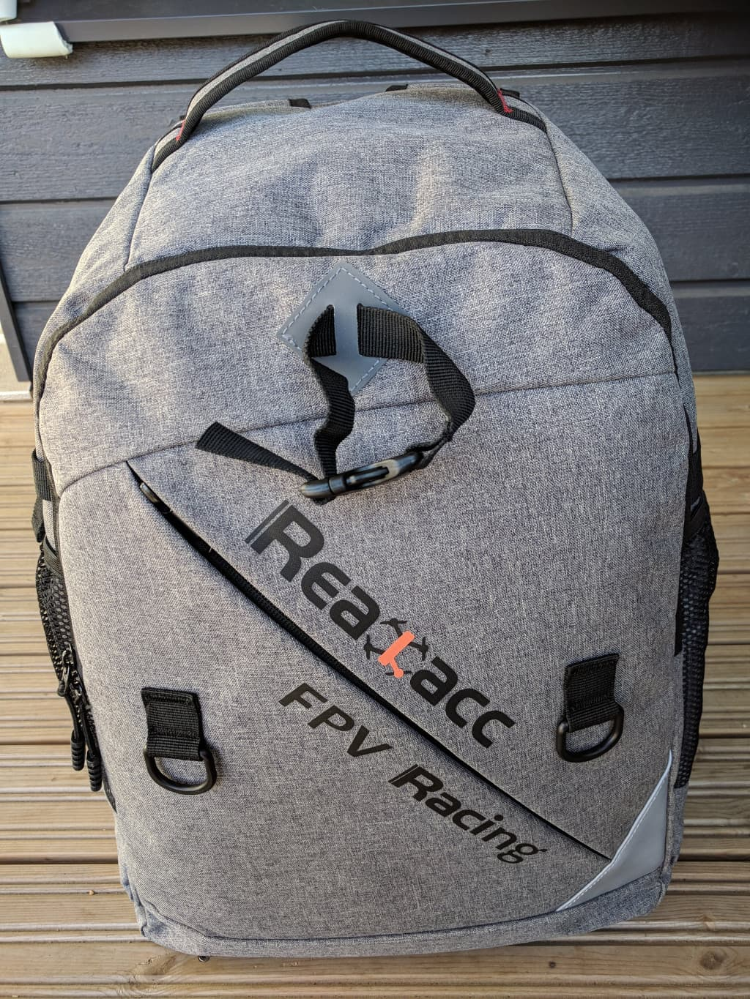

  I released 
  <strong><a href="https://www.fpvtips.com">Fpvtips.com</a></strong> in November 2018. Make sure you check it out for more FPV related goodness!

A couple of weeks ago I switched to the new [Realacc backpack][1] and now the time has come to drop a few words on it.
Spoiler: It's pretty awesome!

The backpack looks pretty slick and comes with a rainproof cover. There are many pockets and the inside compartments are completely configurable. It comes with 1 drone strap in the middle and 2 extra hooks to the sides where you could attach 2 more quads if needs be with a doggie strap.

There are plenty of different ways to arrange the compartments inside because as mentioned they are completely configurable. Here's how my setup looks.

Additionally in the front pocket there is a tool holder sheet, and here is how I have populated mine:

Overall very happy with the backpack. It's surprisingly spacious, I'm not using even 80% of the space. For $50 it's a good investment for your drone gear. Recommmend 10/10! And no, this is not a paid review, just my own experience with a pretty good product. You can [grab it here][1].

[0]: Linkslist
[1]: https://bit.ly/realacc-backpack
