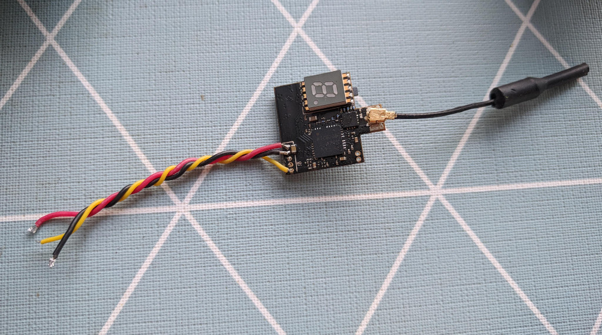
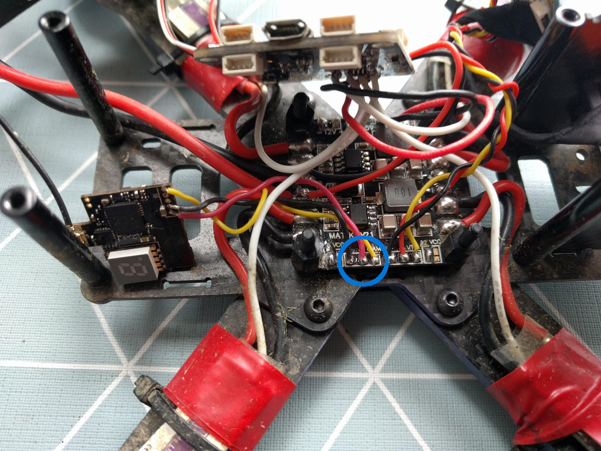

The stock VTX on the [Wizard x220][1] is sometimes not the best option to keep around for the long run. From the SMA connector breaking off the board, to frying the vtx if plugged in with no antenna attached, it's a component that makes for a good candidate to be upgraded.

On the other hand, the [Eachine VTX03][2] is a sweet little component, coming in at a bit less than $10. It's an over performer, has a small U.FL / IPEX connector and antenna, which would cover just as much area as if you were using a clover leaf antenna for example, but takes less space.

This upgrade is fairly straightforward to carry out. First, remove all wires from the vtx except for the ones as seen on the picture above, where:

- **black = ground**
- **red = 5V**
- **yellow = signal**

Next you need to dismantle your wizard all the way to the PDB (the board below the flight controller board). If you still have your stock VTX, disconnect it and desolder its wires from the PDB.

Next, let's focus on the 3 solder pads in the blue circle as seen on the picture. They should be clearly labeled for `ground`, `5v` and the last one is the `signal` wire. Solder those up, put your Wizard back together and you are good to go. Enjoy and happy flying!

P.S.: If your stock receiver was soldered to a 12V pad, don't get tempted to do the same with this one, as it won't work. This receiver HAS TO BE soldered on a 5V pad. You can also [refer to the manual][3].

[0]: Linkslist
[1]: https://bit.ly/eachine-wizardx220
[2]: https://bit.ly/eachine-vtx-03
[3]: https://www.eachine.com/Eachine-VTX03-Super-Mini-5_8G-72CH-0-or-25mW-or-50mw-or-200mW-Switchable-FPV-Transmitter-p-697.html
