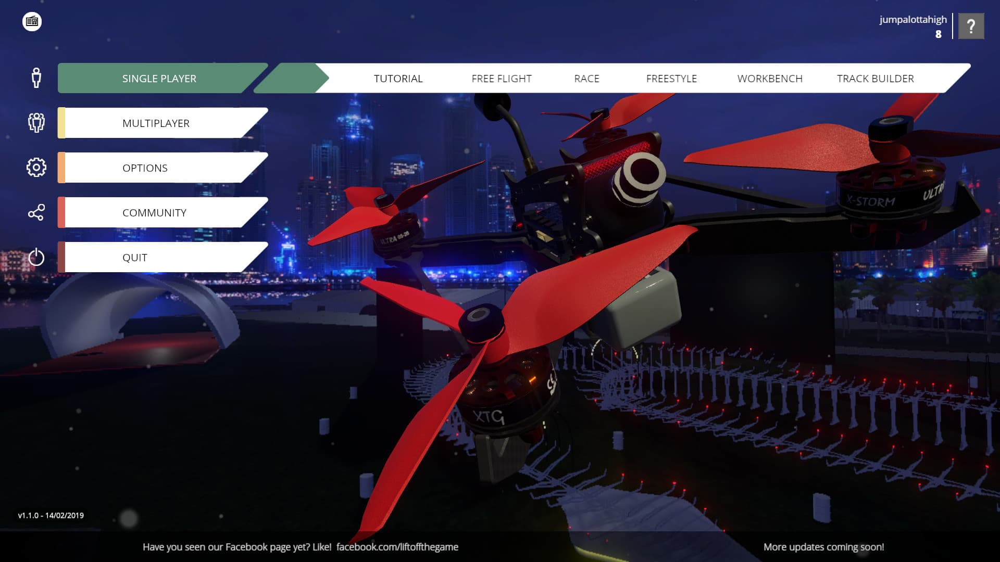
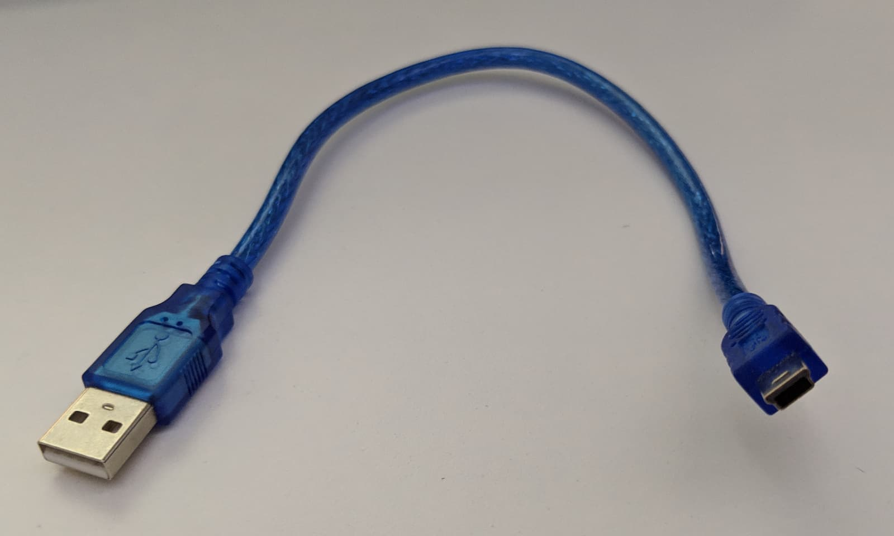
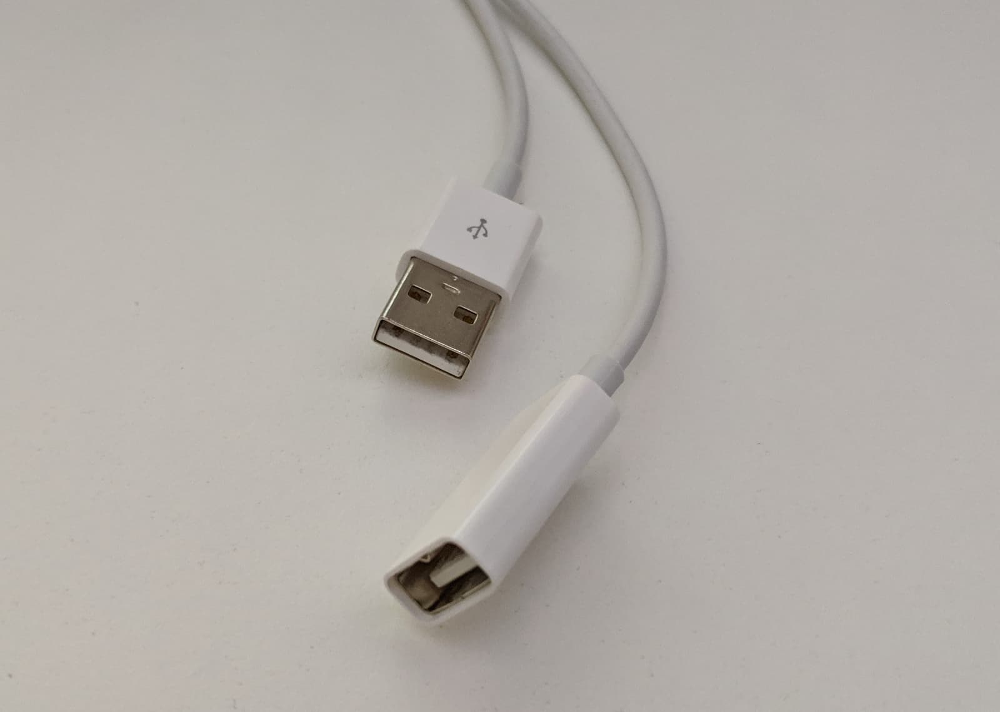
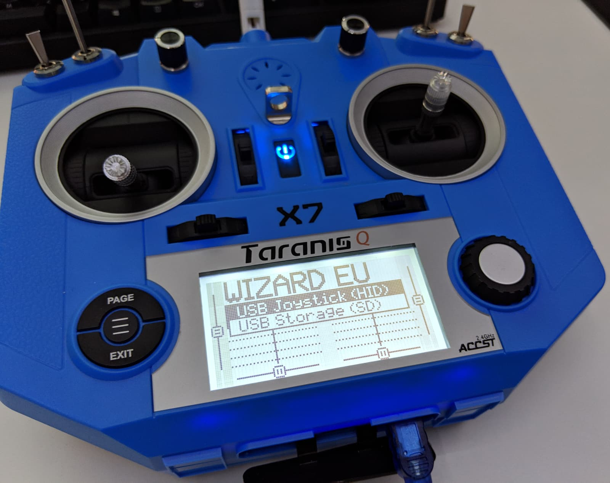
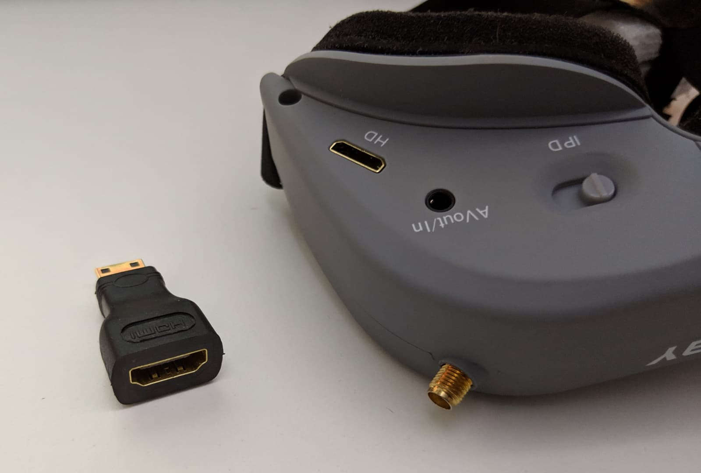
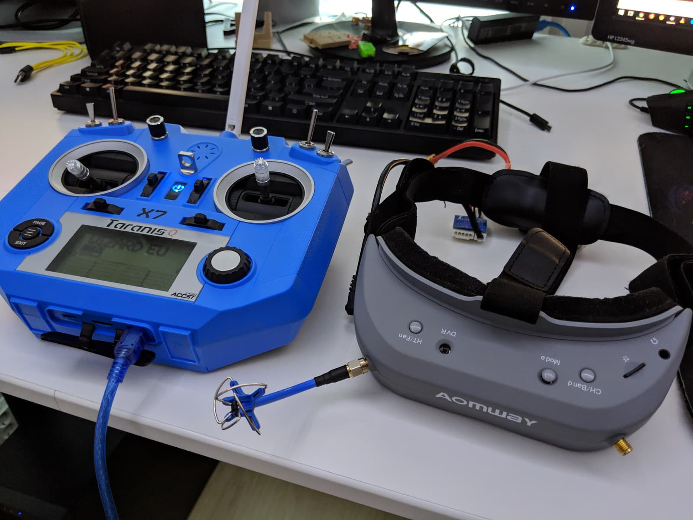
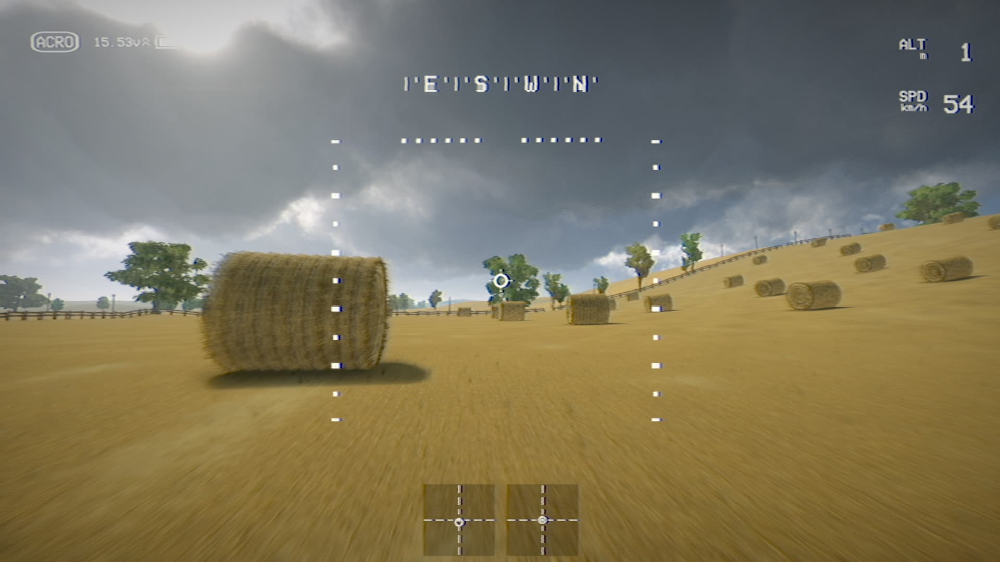

  Add <strong>your FPV spots</strong> on the map over at 
  <strong><a href="https://www.fpvtips.com/fpv-map">fpvtips.com/fpv-map</a></strong>.

Whether you are a seasoned fpv drone pilot or a person just getting started with this hobby, there always is a reason to fly in a quadcopter simulator. At the very least, if you are practicing a new trick or just practicing flying in general, it just might save you many crashes, money, and frustration while walking to get your quad after your 10th crash for the day.

This is where FPV quad/drone simulators come in. By far the biggest benefit of using the simulator is probably getting more stick time and creating stick memory. Additionally, if where you are is winter and you can't fly for a few months (which sucks, I can relate), simulators are a great way to still somewhat enjoy the hobby!

Simulators have gone a long way in the past few years and there are some really good options out there. And cheap at that too. The ones I have tried are:

<ul>
  <li>
    <a href="https://www.liftoff-game.com" target="_blank" rel="noopener noreferrer">Liftoff</a>
  </li>
  <li>
    <a href="https://www.velocidrone.com" target="_blank" rel="noopener noreferrer">Velocidrone</a>
  </li>
  <li>
    <a href="https://fpv-freerider.itch.io" target="_blank" rel="noopener noreferrer">FPV Freerider</a>
  </li>
  <li>
    <a href="https://thedroneracingleague.com/simulator/get-started/" target="_blank" rel="noopener noreferrer">DRL simulator</a>
  </li>
</ul>

You can't go wrong no matter whichever one you pick to use, but my personal favorite is Liftoff (and no, this is not a sponsored post). Although it does come at a price of €20 and is purchasable through Stream, it is really awesome, the flying is quite realistic, you can fly solo or compete with other players, which makes it all the more fun. Bonus points for having a [Joshua Bardwell][1] house level.

As far as Velocidrone is concerned it seems like it's the simulator that [Mr.Steele][2] uses, and [his video][3] provides some highlights on how to get started so definitely check it out if you are into Velocidrone.

## ⚙ Setting up your gear

### 📡 Transmitter

I'm using a [Taranis QX 7][4] transmitter and to set it up all you need to do is to connect it to your computer via a [Mini USB B to USB cable][5].

Do note that depending on how far your computer is you might need a bit longer cable. I have this setup where I am using a USB extender cable to get the desired length. It's a USB female to USB male cable that acts as an extension for the much shorter Mini USB B cable.

In the case of the Taranis, the only thing you have to do when you plug it in is to select **"USB Joystick (HID)"** from the prompt that pops up when you plug the cable in. Then you are off to the races. Literally :)

If you don't see this exact popup screen it could be that you are running an older version of OpenTX and if so, read this article where I cover [how to upgrade the firmware on the Taranis QX 7][6].

Additionally, you can go into the settings for your sim profile (or create one if you haven't yet) and also disable the internal RF as it's not required when you use the radio as a joystick in simulations. That's going to extend the transmitter's battery life as well. See image below and how Internal RF Mode is set to OFF.

I have also previously set up a [FlySky FS i6][7] radio and the setup is largely the same. Especially if you get [the correct cable][8]. In my case I bought the wrong cable - the one for data transfer, not for training - and I had to do some shenanigans with creating my own trainer cable out of a headphone cable with a 3.5mm plug, and using the [SmartPropoPlus][9] software to get it to work.

### 🕶️ FPV goggles

Connecting your FPV goggles and getting the video output from the simulator through your goggles goes a long way towards immersion and the complete fpv simulator setup. Note, this is not required, you could perfectly well just fly by watching your monitor, but it does feel so much more like the real thing when you have your goggles on.

I am using the [Aomway Commander][10] goggles. To connect them, use the mini HDMI output port at the bottom part of the goggles. I use a [mini HDMI to HDMI converter][11] and a regular HDMI cable to my PC.

### Go fly!

Enjoy your simulator set up and practice those inverted yaw spins, trippy spins and what-nots! Happy flying!

[0]: Linkslist
[1]: https://www.youtube.com/channel/UCX3eufnI7A2I7IkKHZn8KSQ
[2]: https://www.youtube.com/user/MrSteeledavis
[3]: https://www.youtube.com/watch?v=dOwW6PFZU3Y
[4]: https://bit.ly/taranis-qx7
[5]: https://bit.ly/mini-usb
[6]: /fpv/setup-taranis-qx7
[7]: https://bit.ly/flysky-fs-i6
[8]: https://bit.ly/flysky-trainer-cable
[9]: https://github.com/shauleiz/SmartPropoPlus
[10]: https://bit.ly/aomway-commander
[11]: https://bit.ly/mini-hdmi-to-hdmi
