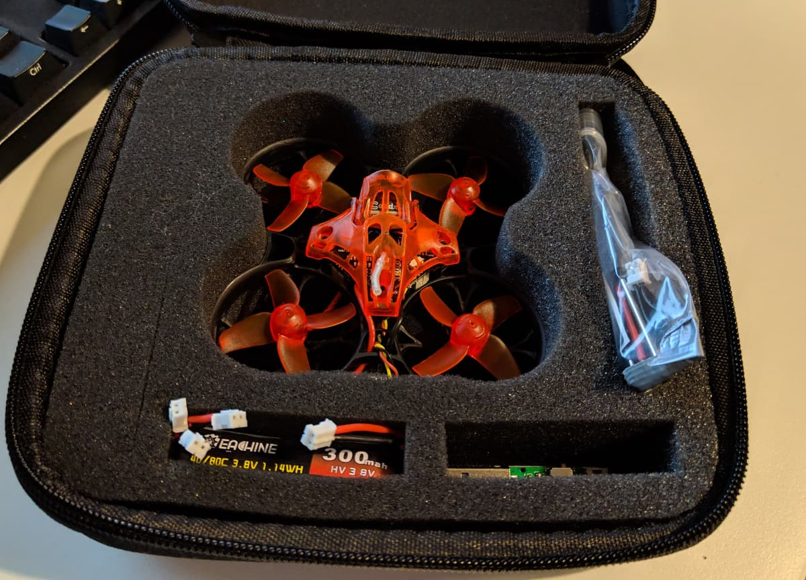

This is a sponsored review. Be that as it may, I still stand by every word and this is my objective and honest review of the drone. I'd never point anyone in the wrong direction for money.

I was very excited when the [Eachine Trashcan][1] finally arrived, and not only because it's winter in the nortern hemisphere and micro drone flying happens more often. There has been a lot of hype about the Trashcan and rightfully so. Overall, in the micro drone (a tad bigger than a Tiny whoop type of drone) world interesting things have happened over the past year.

I bough a [Snapper7][2] in August 2018 and that was an awesome little fellow. But more importantly it started a race. A few months later, the [Mobula7][3] came out and it was immediatelly crowned the best. Moreover, it could also sport 2S batteries and that was a game changer!

> **Then, a few months ago the [Trashcan][1] came out and knocked it out of the park.**

This is a micro quad that you could snatch up for as little as \$95. And you would get an amazing experience and a drone with crazy performance. But what makes it so good?

TODO: Include footage here

So let's have a look what's in the box.

#### 📦 Unboxing experience

The Trashcan arrives in a nice protective hard case. Pretty neat. Very useful to keep the quad safe.

The case inside has soft foam with a slot for the drone, space for batteries, a small charger and a bag with tools and spare parts.

Here are all the items out of the case.

And a couple of close-up shots of the [Trashcan][1]

Bonus points for the "backplate" decoration! 🎉 Yay! It's a trashcan 🎉 It trully gives the little guy so much spirit.

As you can tell, the quad comes with a small USB charger that can charge 1 battery at a time. If you still haven't definitely consider grabbing one of those boards TODO: link, in order to parallel charge multiple batteries at the same time, as well as to charge your smaller batteries off of a bigger battery, for example a 4S, on the go.

The Trashcan comes with 4 batteries, which is plenty to get you started, but you might find yourself outgrowing them soon and needing more, in which case, [grab yourself some more batteries][todo:battery-link].

Whats in the spare parts bag and TODO: picture of it

#### ⚙ Parts

TODO: picture of OSD

- Flight controller
- Camera
- Motors
- Receiver
- VTX

TODO: write parts review

#### 🛠 Eachine Trashcan Betaflight configuration

TODO: write the betaflight config

#### 🚁 Flyig outdoors

#### 🚁 Flyig indoors

- 1S
- 2S

Throttle limit configuration

[0]: Linkslist
[1]: TODO:
[2]: TODO:
[3]: TODO:
