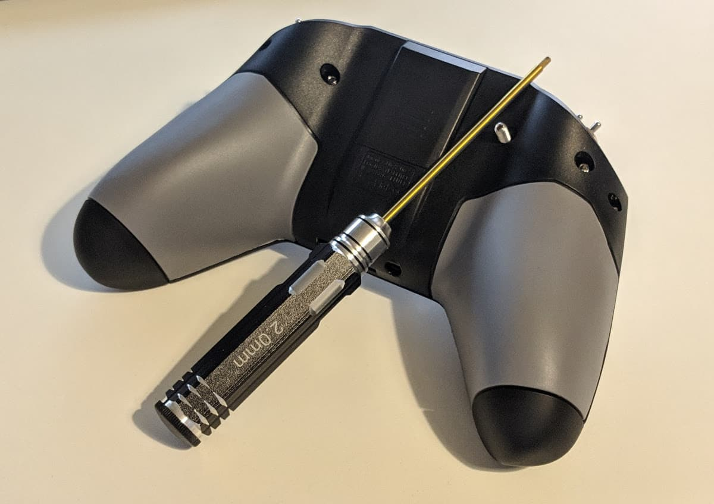
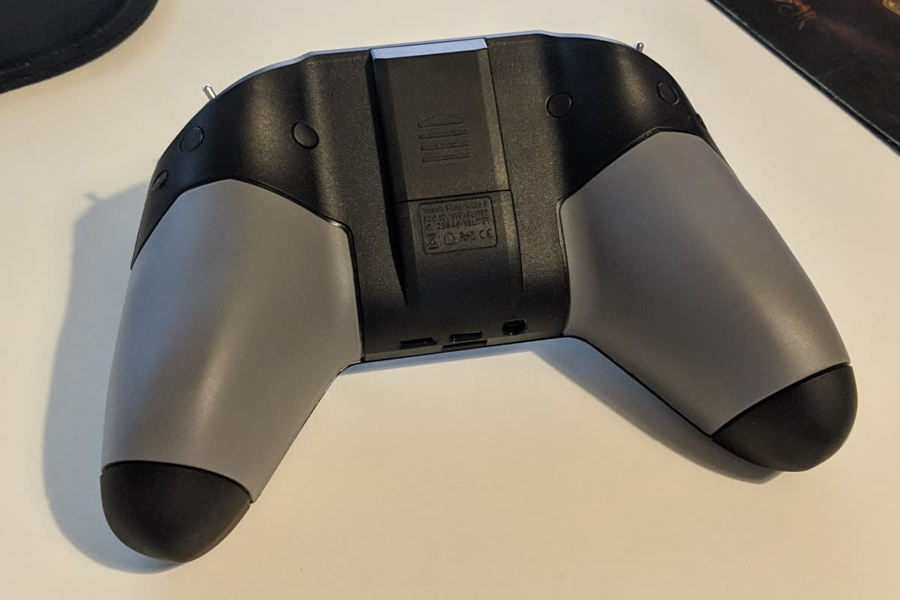

This is a sponsored review. Be that as it may, I still stand by every word and this is my objective and honest review of the drone. I'd never write a misleading article or point anyone in the wrong direction.

I recently got the [Taranis X-Lite][] and was excited to try it out. I have watched the reviews, had a rough idea of what to expect, but really wanted to experience the radio for myself and see how it would work for me.

I'll quickly summarize some of the most interesting points about the X-Lite.

1. **Different form factor** than most other transmitters (Xbox controller like shape in this case). I'm not a big gamer or very big on using controllers (PC master race), but even I can appreciate the comfort of this shape.

2. **Radio for thumbers!** I am one, so I thought I might like it for that. Pinchers, probably much less so as the sticks are rather short. I've heard it's not the best radio if you are a pincher. I find it very comfortable as a thumber though, but more on that later.

3. **Same range without any pointy antennas.** Yes, this is actually a full range radio and functions as such without attaching any external antennas. Makes packing it away easier, more convenient and faster.

4. The finish is rubbery, feels **high quality and comfortable** and definitely not slippery.

5. All of the regular **OpenTX goodness**.

We will go over those and many other points in detail. So, let's get to it.

### Table of content

- [Unboxing](#unboxing)
- [Set up](#set-up)
- [Bind your first model](#bind)
- [Update OpenTX](#update)
- [Setup sdcard](#sdcard)
- [Additional configuration](#configuration)
- [Conclusion](#conclusion)

### 📦 Unboxing and layout overview

When unboxing the [Taranis X-Lite][] you will immediately notice that it comes in a hard shell case. That's pretty neat! Makes for easy carry-around, easy packing in a backpack.

Inside the radio comes well protected with a thick foam cover over the top and around the gimbal sticks.

You also get some FrSky stickers, a manual, some rubber plugs in a package and gimbal protectors for your new radio. Nice touch!

And here's how the radio looks out of the case. Clean, minimalistic, high-quality look. **Decent gimbals, a plus sign shaped joypad, 2 menu buttons, a 4 directional menu mini joystick**. Power button at the top.

If you look at the top part, you will notice the radio comes with **4 switches**. Shorter 2 position switches and a bit longer 3 position switches. In the middle is the connector for an **external antenna**. You don't need such an antenna to use the full range of your radio as it's doing just fine without adding one.

Looking from the bottom side, you will notice a **micro USB** port (not mini, like on the [Taranis Q X7][]), **micro SD card** slot, **3.5mm headphone** jack for audio and **SmartPort** (S.Port).

You also get this small plastic bag with rubber plugs to cover the screw holes on the back, as well as I extra screw so you can adjust the radio's throttle gimbal based on your preference. I use MODE 2 and will show an example of how to set that up.

### ⚙ Initial set up

The single most important thing to do in order to be able to set up for flying is to use the provided screw to reduce the spring tension on one of the sticks (the one you want to use for throttle channel). As I mentioned, I fly MODE 2 and that means that my left gimbal stick is what controls my throttle channel when moved up and down.

For this to be set up correctly, I inserted the provided screw as seen on the image below and screwed it in. You need a [hex head driver][] to get this done. In my case, I also had to adjust the screw next to it. So do so until you feel the throttle stick is moving up and down and staying in position as you want it. **Be careful not to over tighten the screws in**, because doing so will eat into the plastic and might break your radio.

Finally, when you are pleased with the setup, put all the rubber plugs in place, based on their size and into the screw holes to nicely cover them up.

**But where do the batteries go?**

For that, we need to unscrew the battery caps at the end of the handles. Here is the point where everyone comments on Taranis' decision to use [18500][] batteries to power the radio. Those are definitely less common than the more popular [18650][] and I've heard in some case the [18500][] that the X-Lite uses could be a bit trickier to acquire. That was not the case for me, I was able to find them fairly easy on Banggood.

In addition, I [grabbed this battery charger][], as it strikes a sweet spot for me of quality and price. Not the cheapest, but not the garbagest. I'm very happy with it, it works really well and is quite robust in terms of the different batteries and ways of charging them that it supports. I highly recommend it. It even supports [18650][] batteries as well, should I ever decide to go that way.

And I could. Some people go for it by buying these [deeper battery caps][] which then gives you enough space to slot in a 18650 battery. Pretty neat and possibly a bit more flight time between charges. I haven't done this mod yet, but I did make sure to get a battery charger that supports me doing so in the future if I so desire.

### TODO: name this section or where to put this information:

power it on and navigate the menu. !picture with buttons explained?!

### 🔗 Bind your first model

- bind the model
- test it
- pictures of a bound model in Betaflight, receiver tab / maybe video snippet?

### 🔝 Update OpenTX

- X-Lite comes with x.x.x version, let's update to .... version

### 💾 Set up the SD card

The SD card is quite useful for keeping internal transmitter firmware (in case you need to switch between FCC and LBT on the go), as well as the sound files for alerts, telemetry readout and switch activation.

[link to SD card][]

### 🛠 Additional configuration

- screenshots of different screens
- trim the channel endpoints
- the setup sounds to play on switch activation

### 🏁 Conclusion

- would I recommend it?

[0]: Linkslist
[1]: TODO
