

This is a sponsored review. Be that as it may, I still stand by every word and this is my objective and honest review of the drone. I'd never write a misleading article or point anyone in the wrong direction.

I recently got the [Taranis X-Lite][] and was excited to try it out. I have watched the reviews, had a rough idea of what to expect, but really wanted to experience the radio for myself and see how it would work for me.

I'll quickly summarize some of the most interesting points about the X-Lite.

1. **Different form factor** than most other transmitters (Xbox controller like shape in this case). I'm not a big gamer or very big on using controllers (PC master race), but even I can appreciate the comfort of this shape.

2. **Radio for thumbers!** I am one, so I thought I might like it for that. Pinchers, probably much less so as the sticks are rather short. I've heard it's not the best radio if you are a pincher. I find it very comfortable as a thumber though, but more on that later.

3. **Same range without any pointy antennas.** Yes, this is actually a full range radio and functions as such without attaching any external antennas. Makes packing it away easier, more convenient and faster.

4. The finish is rubbery, feels **high quality and comfortable** and definitely not slippery.

5. All of the regular **OpenTX goodness**.

We will go over those and many other points in detail. So, let's get to it.

### Table of content

- [Unboxing](#unboxing)
- [Set up](#set-up)
- [Bind your first model](#bind)
- [Update OpenTX](#update)
- [Setup sdcard](#sdcard)
- [Additional configuration](#configuration)
- [Conclusion](#conclusion)

### 📦 Unboxing and layout overview

When unboxing the [Taranis X-Lite][] you will immediately notice that it comes in a hard shell case. That's pretty neat! Makes for easy carry-around, easy packing in a backpack.

Inside the radio comes well protected with a thick foam cover over the top and around the gimbal sticks.

You also get some FrSky stickers, a manual, some rubber plugs in a package and gimbal protectors for your new radio. Nice touch!

And here's how the radio looks out of the case. Clean, minimalistic, high-quality look. **Decent gimbals, a plus sign shaped joypad, 2 menu buttons, a 4 directional menu mini joystick**. Power button at the top.

If you look at the top part, you will notice the radio comes with **4 switches**. Shorter 2 position switches and a bit longer 3 position switches. In the middle is the connector for an **external antenna**. You don't need such an antenna to use the full range of your radio as it's doing just fine without adding one.

Looking from the bottom side, you will notice a **micro USB** port (not mini, like on the [Taranis Q X7][]), **micro SD card** slot, **3.5mm headphone** jack for audio and **SmartPort** (S.Port).

You also get this small plastic bag with rubber plugs to cover the screw holes on the back, as well as I extra screw so you can adjust the radio's throttle gimbal based on your preference. I use MODE 2 and will show an example of how to set that up.

### ⚙ Initial set up

The single most important thing to do in order to be able to set up for flying is to use the provided screw to reduce the spring tension on one of the sticks (the one you want to use for throttle channel). As I mentioned, I fly MODE 2 and that means that my left gimbal stick is what controls my throttle channel when moved up and down.

For this to be set up correctly, I inserted the provided screw as seen on the image below and screwed it in. You need a [hex head driver][] to get this done. In my case, I also had to adjust the screw next to it. So do so until you feel the throttle stick is moving up and down and staying in position as you want it. **Be careful not to over tighten the screws in**, because doing so will eat into the plastic and might break your radio.

Finally, when you are pleased with the setup, put all the rubber plugs in place, based on their size and into the screw holes to nicely cover them up.

**But where do the batteries go?**

For that, we need to unscrew the battery caps at the end of the handles. Here is the point where everyone comments on Taranis' decision to use [18500][] batteries to power the radio. Those are definitely less common than the more popular [18650][] and I've heard in some case the [18500][] that the X-Lite uses could be a bit trickier to acquire. That was not the case for me, I was able to find them fairly easy on Banggood.

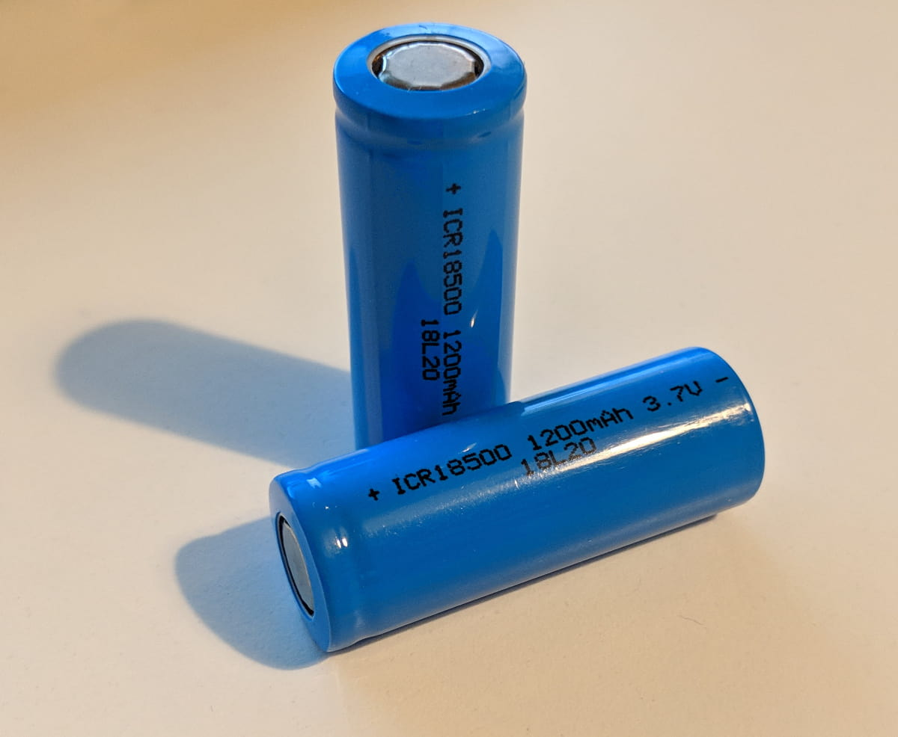

In addition, I [grabbed this battery charger][], as it strikes a sweet spot for me of quality and price. Not the cheapest, but not the garbagest. I'm very happy with it, it works really well and is quite robust in terms of the different batteries and ways of charging them that it supports. I highly recommend it. It even supports [18650][] batteries as well, should I ever decide to go that way.

And I could. Some people go for it by buying these [deeper battery caps][] which then gives you enough space to slot in a 18650 battery. Pretty neat and possibly a bit more flight time between charges. I haven't done this mod yet, but I did make sure to get a battery charger that supports me doing so in the future if I so desire.

### 🧭 Navigate the menus

So, with the throttle stick fixed and the batteries inserted, let's power on the radio and see how can we navigate the menus.
In a nutshell, the mini joystick does all the navigation, except for cancelling out of screens, which is handled by the button below the joystick.

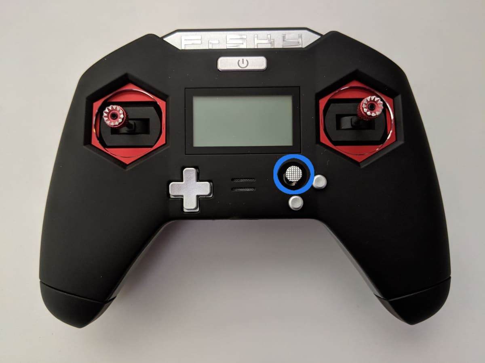

The two arguably most important screens for you when doing anything with the X-Lite are reachable by **pressing and holding for a second the joystick to the left or to the right**.

#### 1. Model setup screens - press and hold the joystick to the right

`MODELSEL (Screen 1/12)`

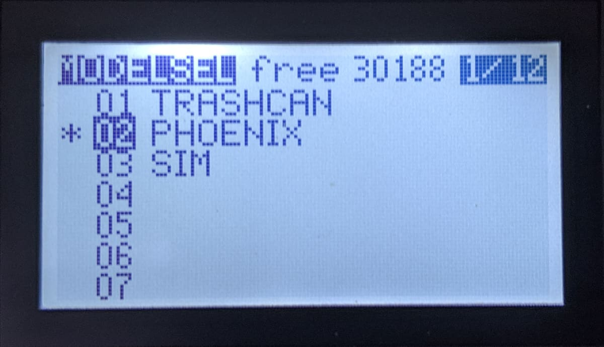

> You arrive at the model select screen, as the first of twelve screens. Here you can select an existing model or create a new one. By clicking the joystick to the right or left you can navigate those 12 screens.

`SETUP (Screen 2/12)`

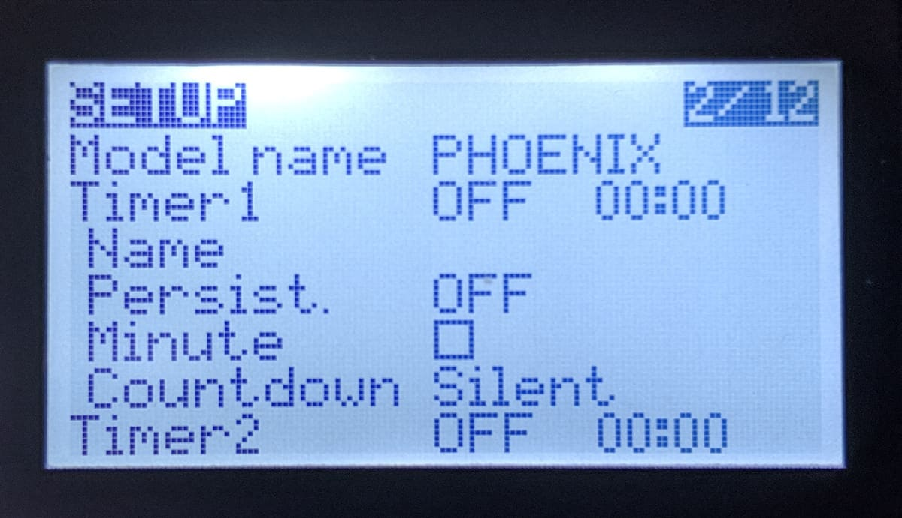

> Model name, **binding**, external RF, Antenna, Failsafe, Timers

`MIXER (Screen 5/12)`

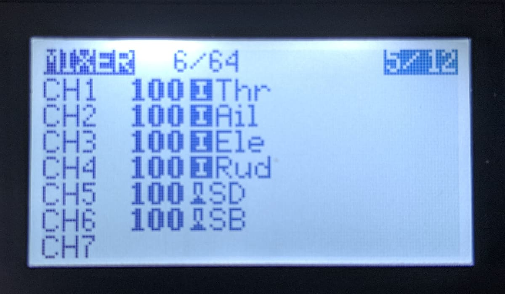

> Map switches to additional channels. For example, SD to CH5 for arming and SB to CH6 for flight modes.

`OUTPUTS (Screen 6/12)`

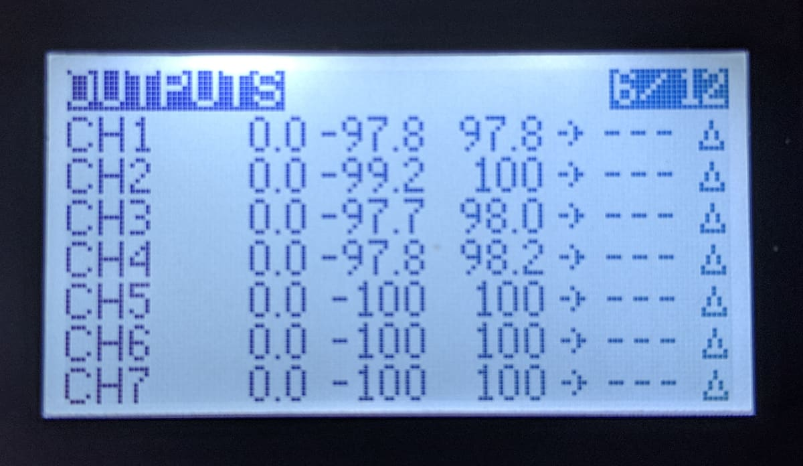

> Useful to trim channel outputs so that your stick endpoints can correspond to the min and max values in Betaflight. A common thing is that pulling the throttle for example all the way down would show as a value of 988 in Betaflight and we want that to ideally be at a 1000. To do that, tweak the values by entering the edit menu via the joystick center press and tweak the Min and Max values for that channel. See the example image below. Do that for all your stick channels.

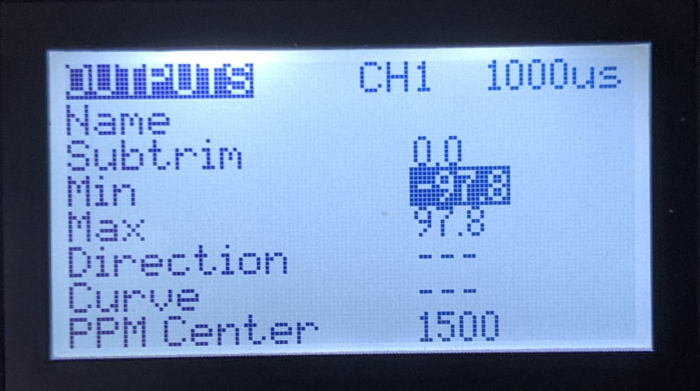

`LOGICAL SWITCHES (Screen 8/12)`

> This could be useful for a number of things that are outside the scope of this article, but just remember that this exists.

`SPECIAL FUNCTIONS (Screen 9/12)`

> This section is useful to set up custom functions on switch pressing and more. However, anything you put here will be tied to the currently selected model. I prefer setting some configuration on a global level where it is shared between any model.

`CUSTOM SCRIPTS (Screen 10/12)`

> Also very useful but outside of the scope of this article. Allows execution of custom LUA scripts.

#### 2. Radio setup screens - press and hold the joystick to the left

`RADIO SETUP (Screen 1/9)`

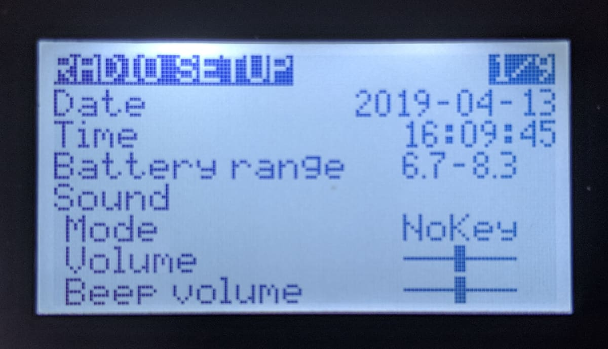

> Configure date, time, battery range (so the UI will have a correct representation of how much battery you have left), sound mode, volume, contrast, alarms for battery low, display settings, units, channel order and others.

`SD-HC CARD (Screen 2/9)`

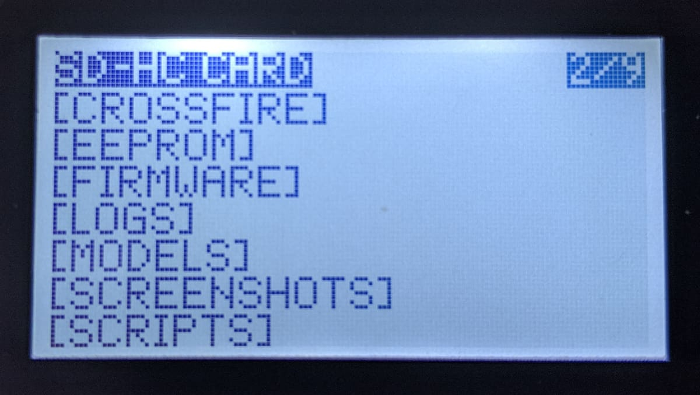

> If you have installed an SD card you will see it here. This allows access to some important directories and functionality. For example, if you want to flash the internal module between an FCC(US) and LBT(EU) firmware, you would do so here, by going into the `[FIRMWARE]` directory (provided you downloaded and put some firmware there). You could then press the joystick down and select from the menu what you would like to flash.

> Additionally, if you would like to use the Taranis X-Lite to [flash an XM+ or other FrSky receiver][link-to-article], you would also select the correct firmware from this screen.

`GLOBAL FUNCTIONS (Screen 3/9)`

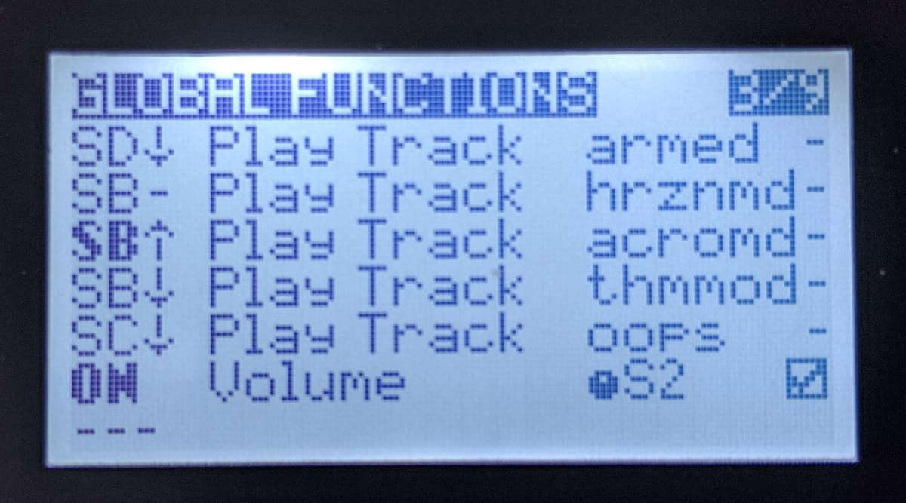

> This screen is the same as the special functions screen mentioned above, but whatever you set up here will be shared across models. That's awesome and I love it. For example, here I have set up my audio cues, such as on flipping the arm switch, changing flight mode. I definitely recommend the Amber sound pack as it is much nicer to hear, than the more generic robotic counter part that comes with the default SD card files, but we will get to that in a bit.

> Besides for playing sounds on switch activation, one other piece of useful functionallity I have set up here is making my S2 source (back right dial button) to act as a volume dial. That's quite useful. You could set up a whole lot more in here. Sky's the limit, or rather, OpenTX is 😉.

> And yes, I do have a dedicated 'Oops' switch 😅.

`VERSION (Screen 5/9)`

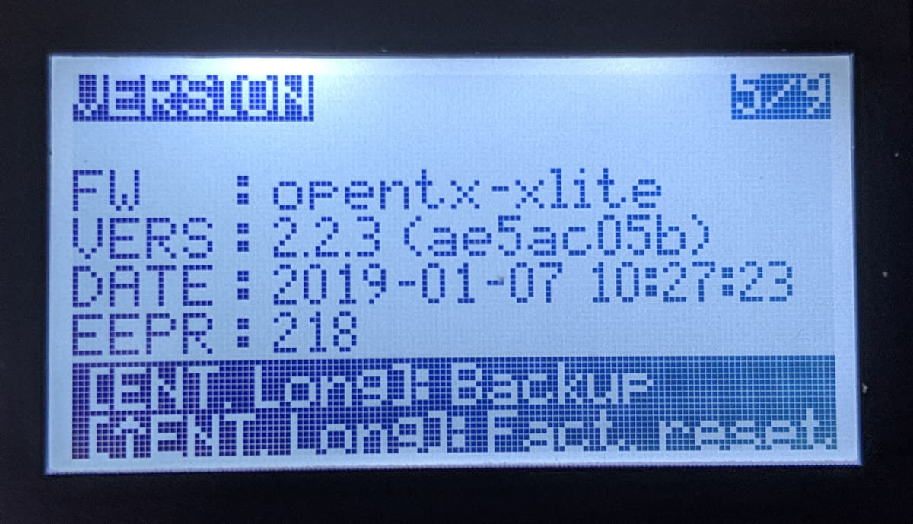

> Check your OpenTX version.

`CALIBRATION (Screen 9/9)`

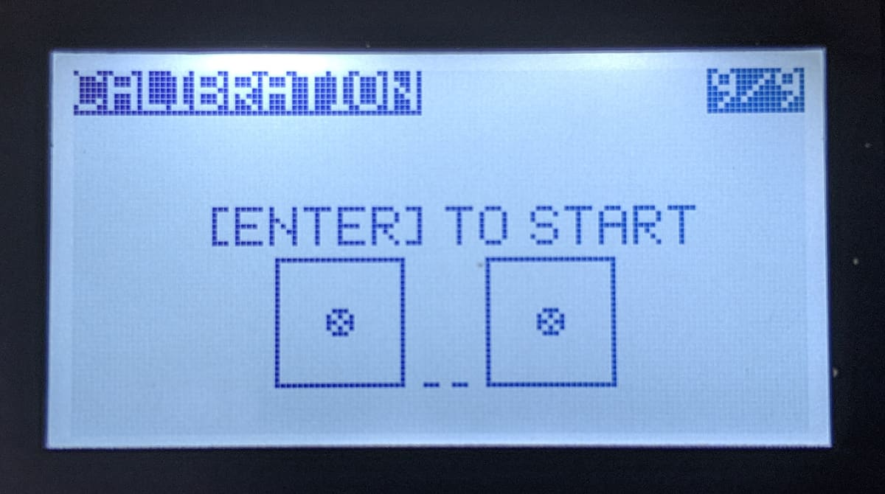

> Calibrate the sticks.

### 🔗 Bind your first model

To bind the Taranis X-Lite to a receiver, go to the setup screen of a model you have selected or created. Scroll all the way down and select the `[BND]` function.

![image of the model setup menu at the bind function][]

The radio will start chirping. Then plug in a battery to your model while holding the receiver's bind button pressed. **If doing this to a 5 inch quad indoors, make sure to remove the props before connecting a battery**. That's all. Some quads like the [Eachine Trashcan][] for example can be bound straight from the Betaflight CLI by putting it in bind mode. I'm mostly using [FrSky XM+ receivers][] and this does require holding the bind button on the receiver when plugging in the battery. Overall quite straight forward.

If you have issues binding, it could be that you have mismatching receiver or transmitter firmware. In which case, you might have to [read about how to flash the XM+][].

You can use Betaflight to test if the binding was successful and to verify that your channels are set up as required (for example your throttle stick corresponds to the correct channel in Betaflight). When you move the sticks on the radio, you should see the output (colorful bars) change values.

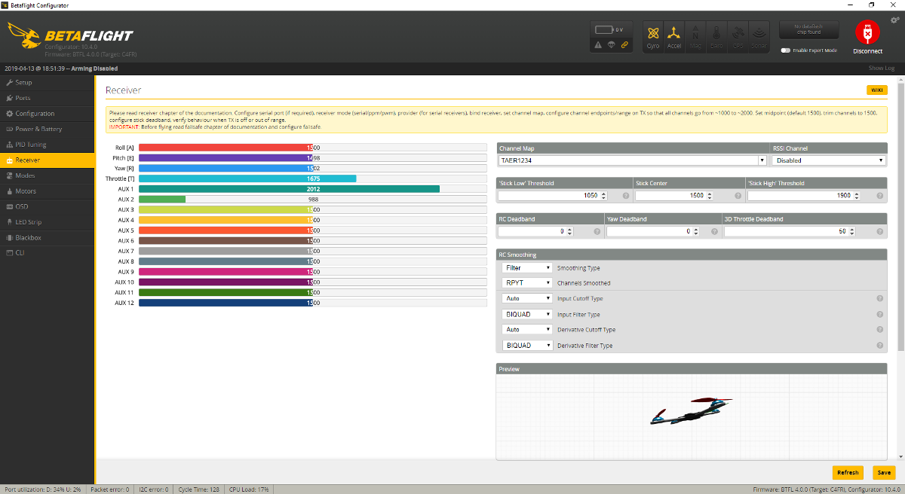

And if you have already setup switches in the `MIXER` screen in your radio to correspond to Channel 5 and Channel 6, you can set up your arming switch and a flight modes switch in the `Modes` tab in Betaflight. AUX1 = Channel 5 and AUX2 = Channel 6.

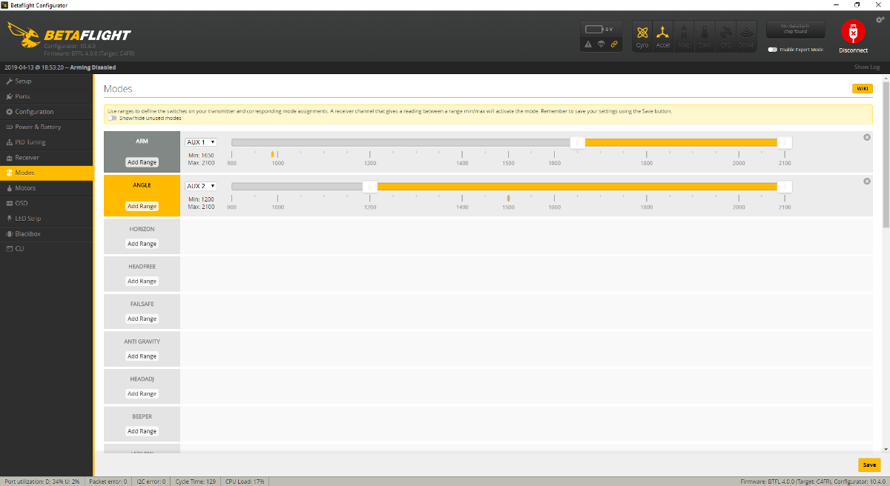

### 🔝 Update OpenTX

The Taranis X-Lite comes with OpenTX version 2.2.2 installed. In comparison, the current latest version of OpenTX at the time of writing is 2.2.3. You can [read the release notes][https://www.open-tx.org/2019/01/06/opentx-2.2.3] and see if you care to do the update. The process is quick and straightforward.

### 💾 Set up the SD card

The SD card is quite useful for keeping internal transmitter firmware (in case you need to switch between FCC and LBT on the go), as well as the sound files for alerts, telemetry readout and switch activation.

[link to SD card][]

### 🏁 Conclusion

- would I recommend it?

[0]: Linkslist
[1]: TODO
