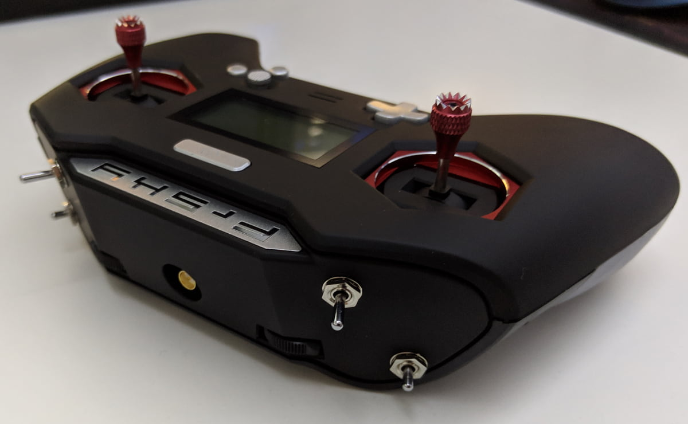
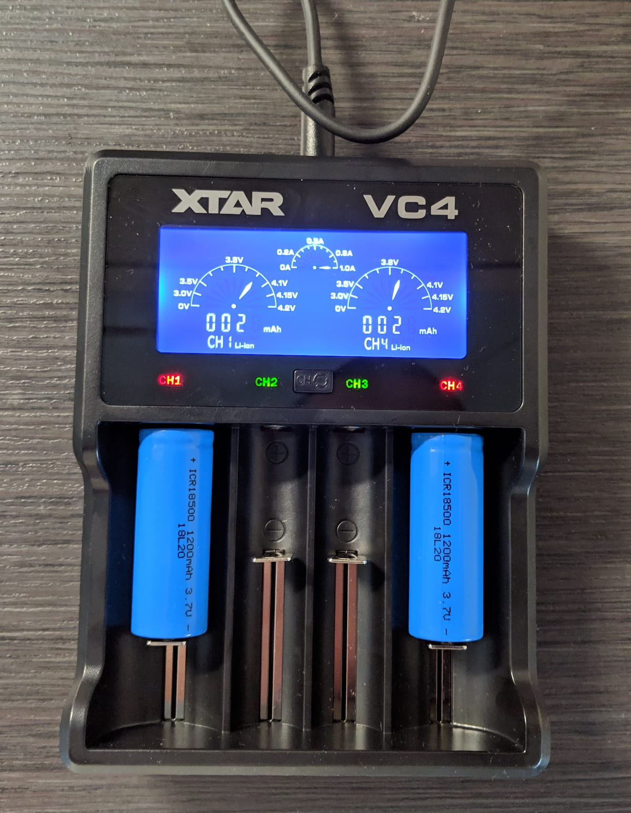

Overview:

- awesome, same range, no antenna, different form factor, for thumbers,
  rubber finish, switches,

### Table of content

- [Unboxing](#unboxing)
- [Set up](#set-up)
- [Bind your first model](#bind)
- [Update OpenTX](#update)
- [Setup sdcard](#sdcard)
- [Additional configuration](#configuration)
- [Conclusion](#conclusion)

### 📦 Unboxing experience

- what's in the box: case, rubber plugs, screw for throttle,...

### ⚙ Initial set up

- Screw in to stiffen throttle on left hand side for MODE 2 setup.

- add rubber plugs

- What batteries. Links, charger links. 18650 and 18500. Charger for both, so you can be flexible. Link to new battery caps on Banggood.

- power it on and navigate the menu. picture with buttons explained?

### 🔗 Bind your first model

- bind the model
- test it
- pictures of bound model in Betaflight, receiver tab / maybe video snippet?

### 🔠Update OpenTX

- X-Lite comes with x.x.x version, let's update to .... version

### 💾 Set up the SD card

The SD card is quite useful for keeping internal transmitter firmware (in case you need to switch between FCC and LBT on the go), as well as the sound files for alerts, telemetry read out and switch activation.

[link to SD card][]

### 🛠 Additional configuration

- screenshots of different screens
- trim the channel end points
- setup sounds to play on switch activation

### 🏁 Conclusion

- would I recommend it?

[0]: Linkslist
[1]: TODO
