

This is a sponsored review. Be that as it may, I still stand by every word and this is my objective and honest review of the drone. I'd never write a misleading article or point anyone in the wrong direction.

I recently got the [Taranis X-Lite][1] and was excited to try it out. I have watched the reviews, had a rough idea of what to expect, but really wanted to experience the radio for myself and see how it would work for me.

I'll quickly summarize some of the most interesting points about the X-Lite.

1. **Different form factor** than most other transmitters (Xbox controller like shape in this case). I'm not a big gamer or very big on using controllers (PC master race), but even I can appreciate the comfort of this shape.

2. **Radio for thumbers!** I am one, so I thought I might like it for that. Pinchers, probably much less so as the sticks are rather short. I've heard it's not the best radio if you are a pincher. I find it very comfortable as a thumber though, but more on that later.

3. **Same range without any pointy antennas.** Yes, this is actually a full range radio and functions as such without attaching any external antennas. Makes packing it away easier, more convenient and faster.

4. The finish is rubbery, feels **high quality and comfortable** and definitely not slippery.

5. All of the regular **OpenTX goodness**.

We will go over those and many other points in detail. So, let's get to it.

### Table of content

- [Unboxing](#unboxing)
- [Set up](#set-up)
- [Navigate the menus](#menus)
- [Bind your first model](#bind)
- [Update OpenTX](#update)
- [Setup SD card](#sdcard)
- [Conclusion](#conclusion)

### 📦 Unboxing and layout overview

When unboxing the [Taranis X-Lite][1] you will immediately notice that it comes in a hard shell case. That's pretty neat! Makes for easy carry-around, easy packing in a backpack.

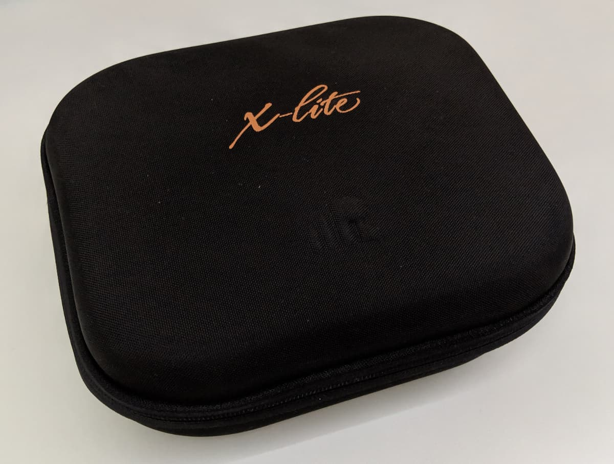

Inside the radio comes well protected with a thick foam cover over the top and around the gimbal sticks.

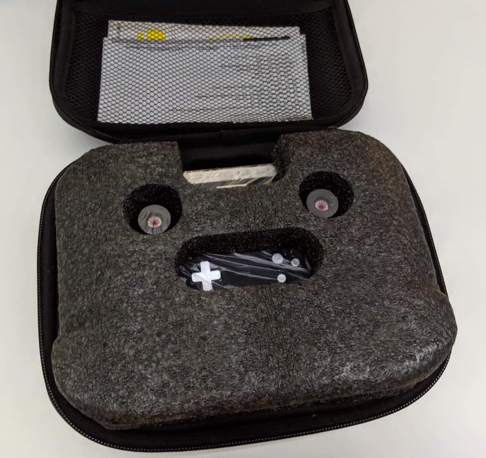

You also get some FrSky stickers, a manual, some rubber plugs in a package and gimbal protectors for your new radio. Nice touch!

And here's how the radio looks out of the case. Clean, minimalistic, high-quality look. **Decent gimbals, a plus sign shaped joypad, 2 menu buttons, a 4 directional menu mini joystick**. Power button at the top.

If you look at the top part, you will notice the radio comes with **4 switches**. Shorter 2 position switches and a bit longer 3 position switches. In the middle is the connector for an **external antenna**. You don't need such an antenna to use the full range of your radio as it's doing just fine without adding one.

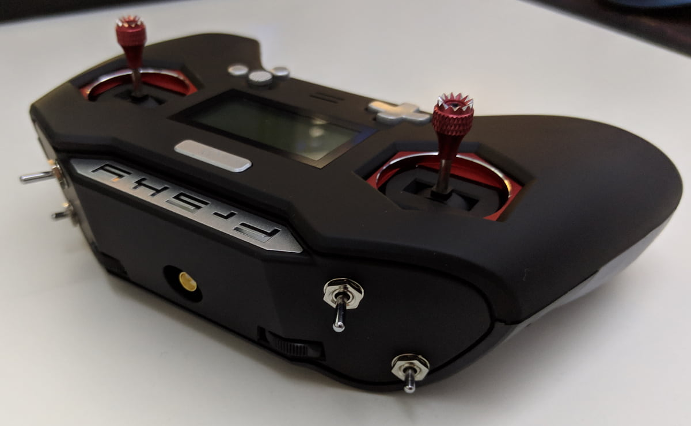

Looking from the bottom side, you will notice a **micro USB** port (not mini, like on the [Taranis Q X7][3]), **micro SD card** slot, **3.5mm headphone** jack for audio and **SmartPort** (S.Port).

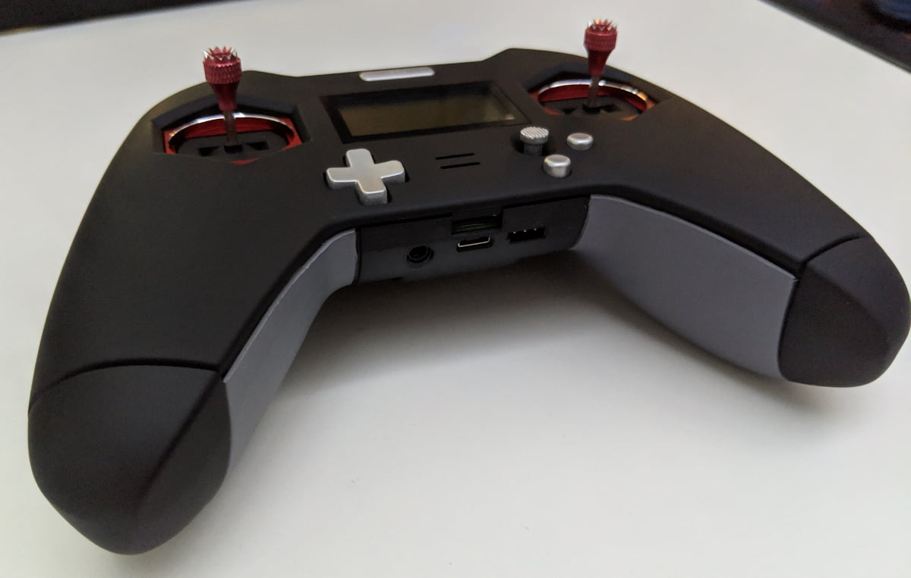

You also get this small plastic bag with rubber plugs to cover the screw holes on the back, as well as I extra screw so you can adjust the radio's throttle gimbal based on your preference. I use MODE 2 and will show an example of how to set that up.

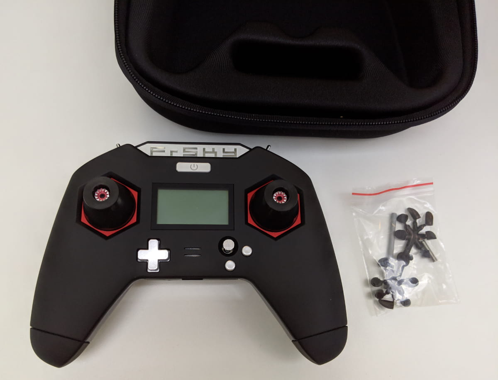

### ⚙ Initial set up

The single most important thing to do in order to be able to set up for flying is to use the provided screw to reduce the spring tension on one of the sticks (the one you want to use for throttle channel). As I mentioned, I fly MODE 2 and that means that my left gimbal stick is what controls my throttle channel when moved up and down.

For this to be set up correctly, I inserted the provided screw as seen on the image below and screwed it in. You need a [hex head driver][4] to get this done. In my case, I also had to adjust the screw next to it. So do so until you feel the throttle stick is moving up and down and staying in position as you want it. **Be careful not to over tighten the screws in**, because doing so will eat into the plastic and might break your radio.

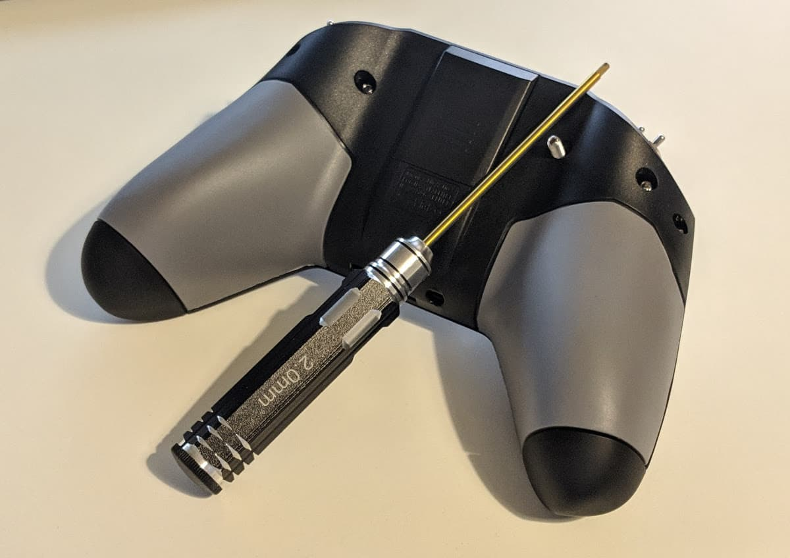

Finally, when you are pleased with the setup, put all the rubber plugs in place, based on their size and into the screw holes to nicely cover them up.

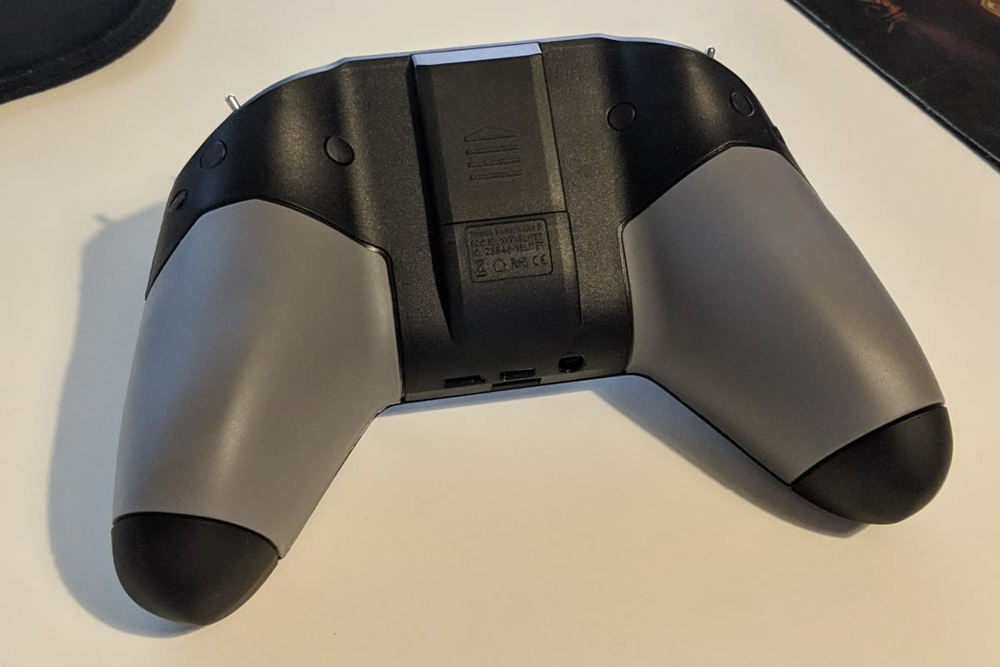

**But where do the batteries go?**

For that, we need to unscrew the battery caps at the end of the handles. Here is the point where everyone comments on Taranis' decision to use [18500][6] batteries to power the radio. Those are definitely less common than the more popular [18650][7] and I've heard in some case the [18500][6] that the X-Lite uses could be a bit trickier to acquire. That was not the case for me, I was able to find them fairly easy on Banggood.

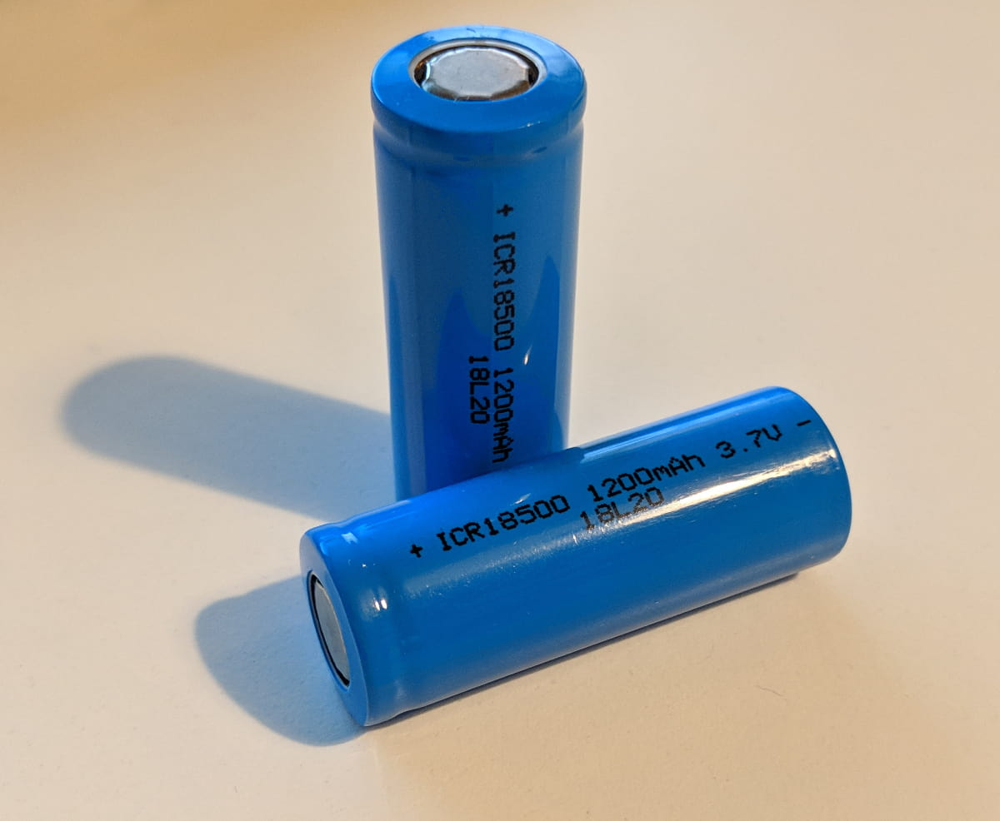

In addition, I [grabbed this battery charger][5], as it strikes a sweet spot for me of quality and price. Not the cheapest, but not the garbagest. I'm very happy with it, it works really well and is quite robust in terms of the different batteries and ways of charging them that it supports. I highly recommend it. It even supports [18650][7] batteries as well, should I ever decide to go that way.

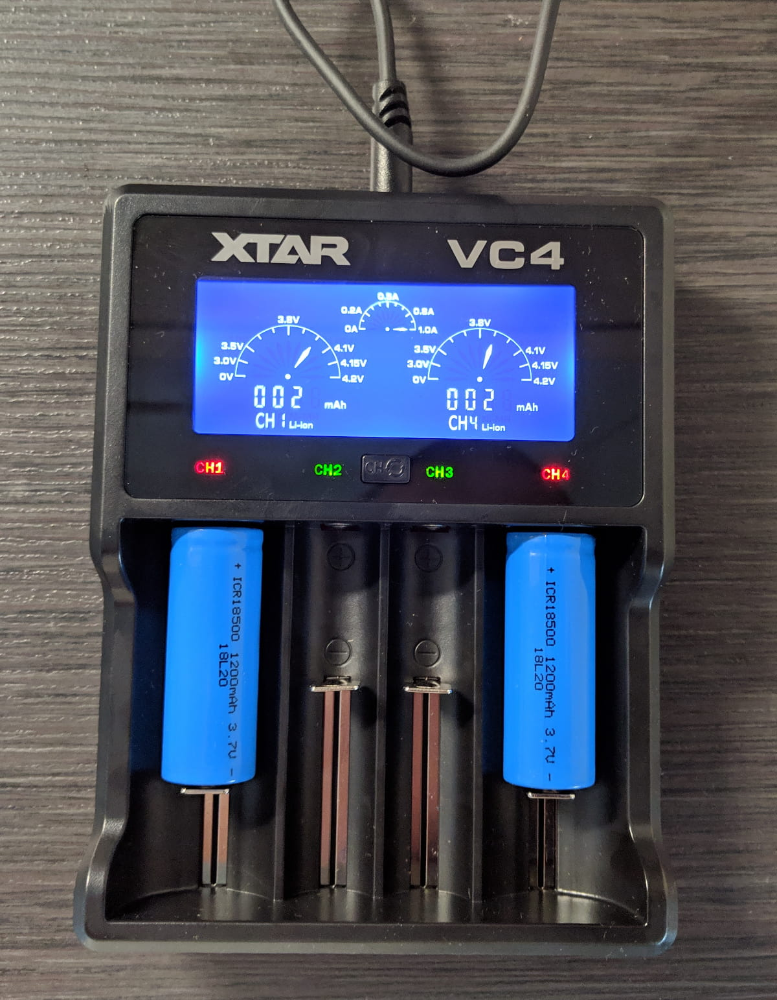

And I could. Some people go for it by buying these [deeper battery caps][8] which then gives you enough space to slot in a 18650 battery. Pretty neat and possibly a bit more flight time between charges. I haven't done this mod yet, but I did make sure to get a battery charger that supports me doing so in the future if I so desire.

### 🧭 Navigate the menus

So, with the throttle stick fixed and the batteries inserted, let's power on the radio and see how can we navigate the menus.
In a nutshell, the mini joystick does all the navigation, except for canceling out of screens, which is handled by the button below the joystick.

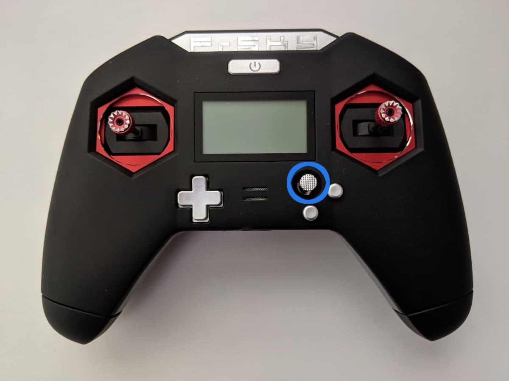

The two arguably most important screens for you when doing anything with the X-Lite are reachable by **pressing and holding for a second the joystick to the left or to the right**.

#### 1. Model setup screens - press and hold the joystick to the right

`MODELSEL (Screen 1/12)`

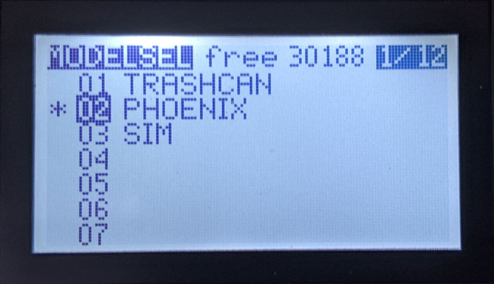

> You arrive at the model select screen, as the first of twelve screens. Here you can select an existing model or create a new one. By clicking the joystick to the right or left you can navigate those 12 screens.

`SETUP (Screen 2/12)`

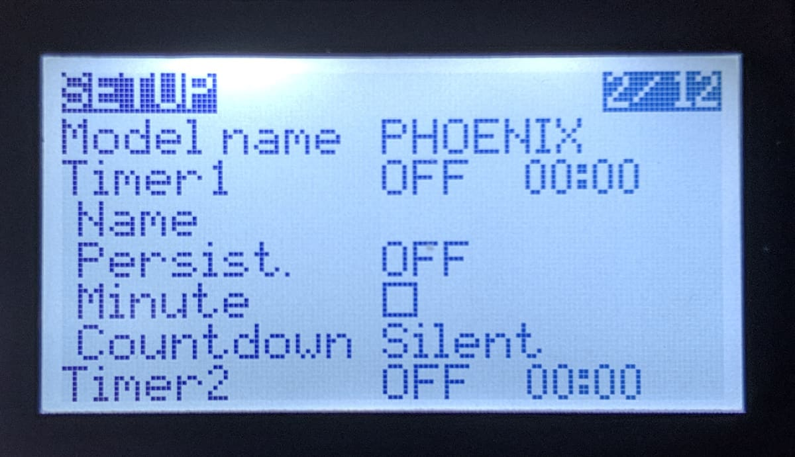

> Model name, **binding**, external RF, Antenna, Failsafe, Timers

`MIXER (Screen 5/12)`

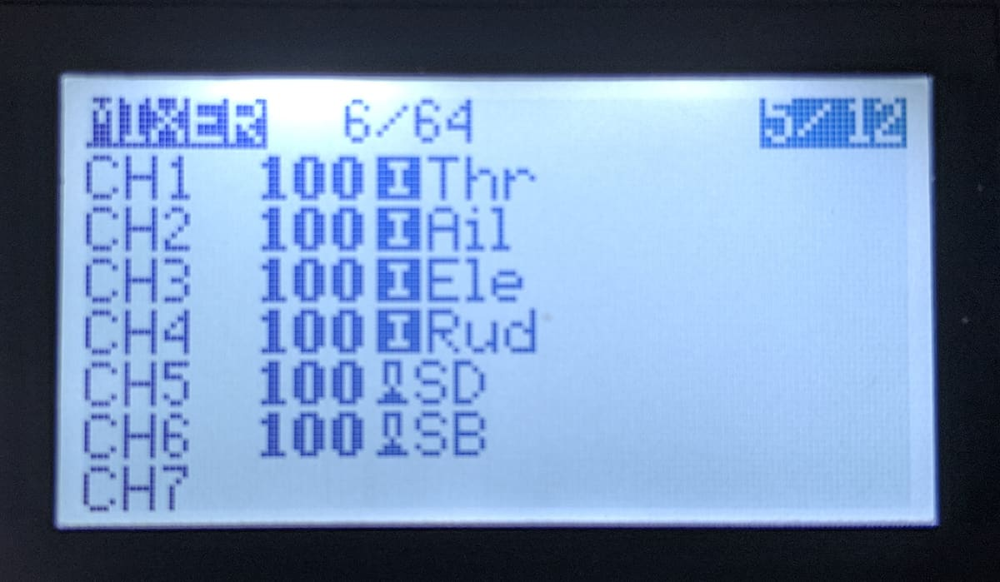

> Map switches to additional channels. For example, SD to CH5 for arming and SB to CH6 for flight modes.

`OUTPUTS (Screen 6/12)`

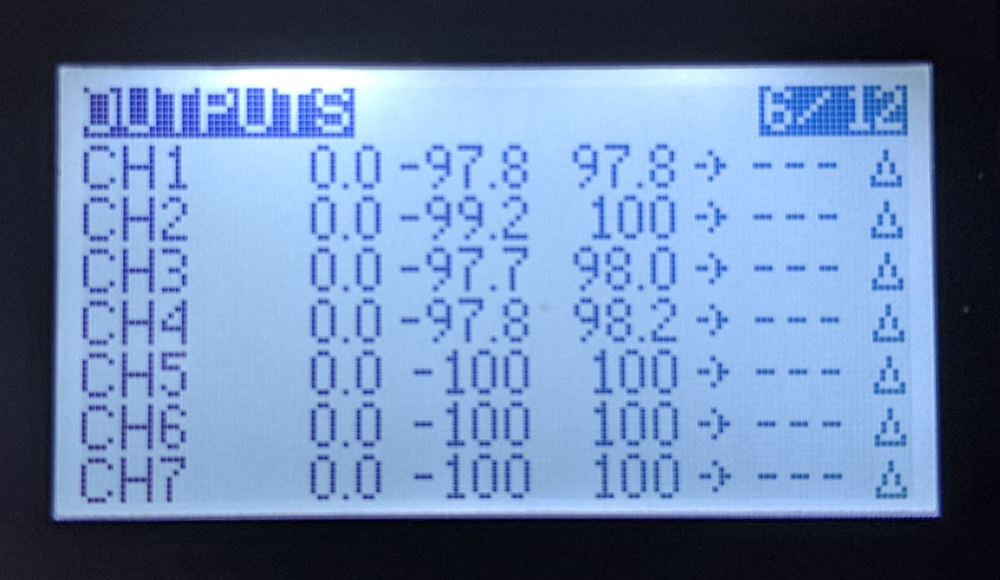

> Useful to trim channel outputs so that your stick endpoints can correspond to the min and max values in Betaflight. A common thing is that pulling the throttle, for example, all the way down would show as a value of 988 in Betaflight and we want that to ideally be at 1000. To do that, tweak the values by entering the edit menu via the joystick center press and tweak the Min and Max values for that channel. See the example image below. Do that for all your stick channels.

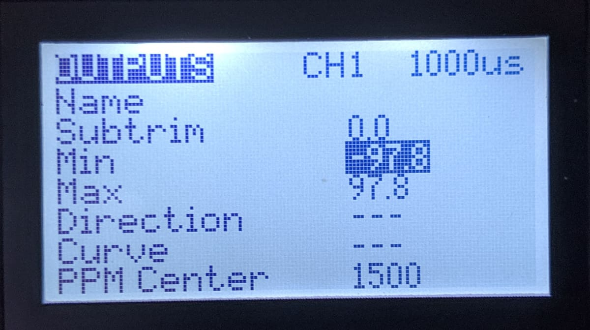

`LOGICAL SWITCHES (Screen 8/12)`

> This could be useful for a number of things that are outside the scope of this article, but just remember that this exists.

`SPECIAL FUNCTIONS (Screen 9/12)`

> This section is useful to set up custom functions on switch pressing and more. However, anything you put here will be tied to the currently selected model. I prefer setting some configuration on a global level where it is shared between any model.

`CUSTOM SCRIPTS (Screen 10/12)`

> Also very useful but outside of the scope of this article. Allows execution of custom LUA scripts.

#### 2. Radio setup screens - press and hold the joystick to the left

`RADIO SETUP (Screen 1/9)`

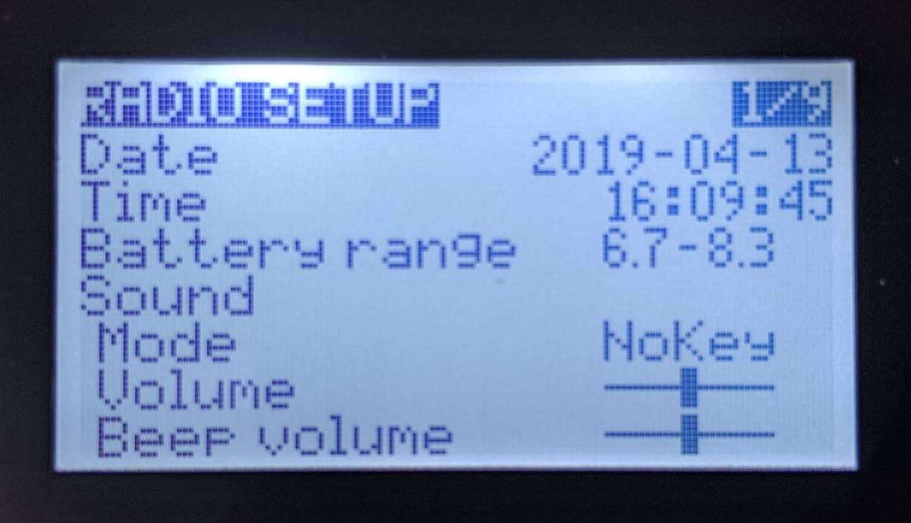

> Configure date, time, battery range (so the UI will have a correct representation of how much battery you have left), sound mode, volume, contrast, alarms for battery low, display settings, units, channel order, and others.

`SD-HC CARD (Screen 2/9)`

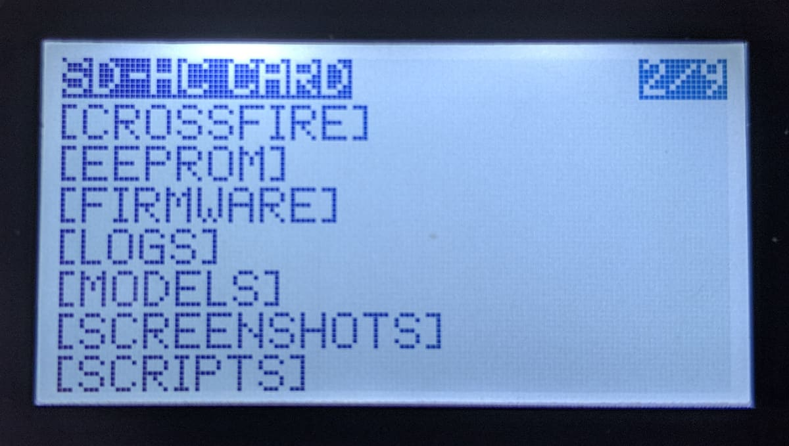

> If you have installed an SD card you will see it here. This allows access to some important directories and functionality. For example, if you want to flash the internal module between an FCC(US) and LBT(EU) firmware, you would do so here, by going into the `[FIRMWARE]` directory (provided you downloaded and put some firmware there). You could then press the joystick down and select from the menu what you would like to flash.

> Additionally, if you would like to use the Taranis X-Lite to [flash an XM+ or another FrSky receiver][9], you would also select the correct firmware from this screen.

`GLOBAL FUNCTIONS (Screen 3/9)`

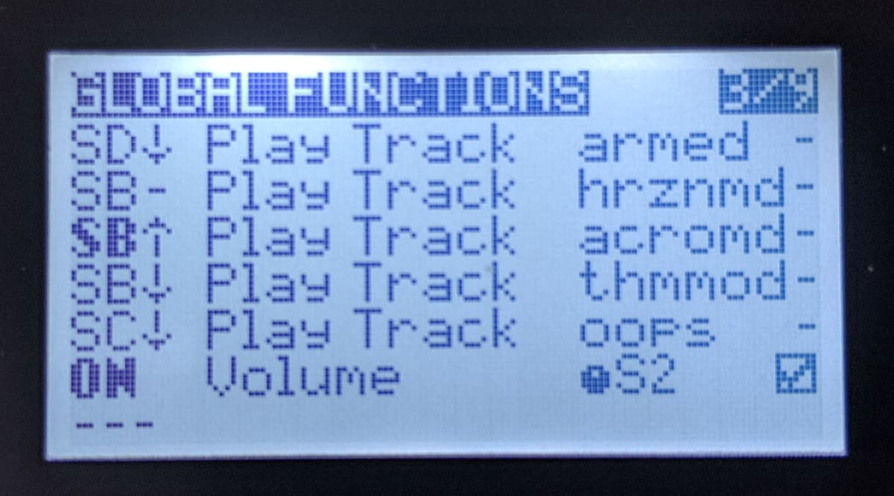

> This screen is the same as the special functions screen mentioned above, but whatever you set up here will be shared across models. That's awesome and I love it. For example, here I have set up my audio cues, such as on flipping the arm switch, changing flight mode. I definitely recommend the Amber sound pack as it is much nicer to hear than the more generic robotic counterpart that comes with the default SD card files, but we will get to that in a bit.

> Besides for playing sounds on switch activation, one other piece of useful functionality I have set up here is making my S2 source (back right dial button) to act as a volume dial. That's quite useful. You could set up a whole lot more in here. Sky's the limit, or rather, OpenTX is 😉.

> And yes, I do have a dedicated 'Oops' switch 😅.

`VERSION (Screen 5/9)`

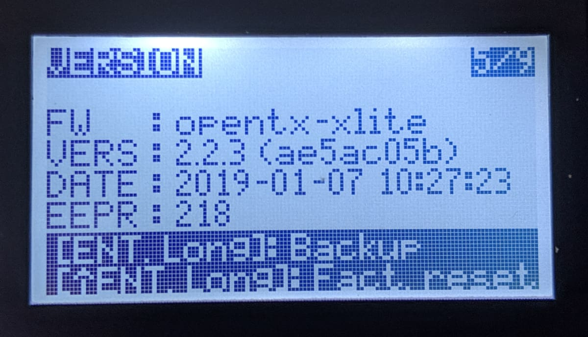

> Check your OpenTX version.

`CALIBRATION (Screen 9/9)`

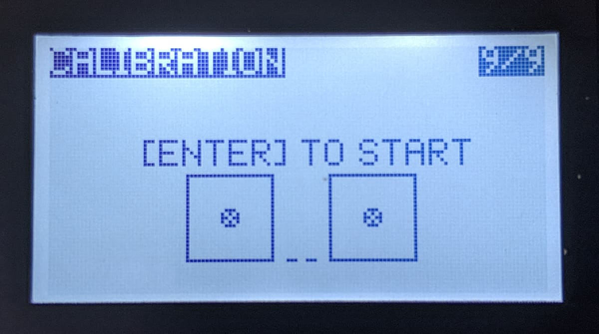

> Calibrate the sticks.

### 🔗 Bind your first model

To bind the Taranis X-Lite to a receiver, go to the setup screen of a model you have selected or created. Scroll all the way down and select the `[BND]` function.

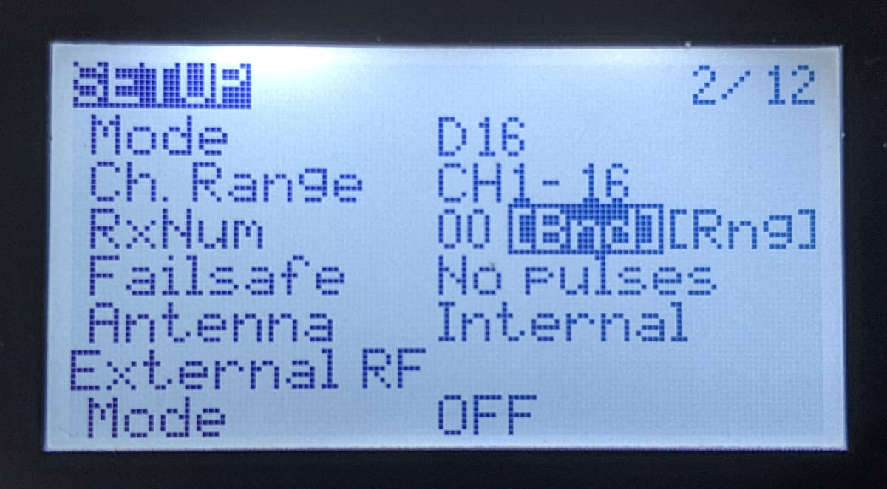

The radio will start chirping. Then plug in a battery to your model while holding the receiver's bind button pressed. **If doing this to a 5-inch quad indoors, make sure to remove the props before connecting a battery**. That's all. Some quads like the [Eachine Trashcan][10] for example can be bound straight from the Betaflight CLI by putting it in bind mode. I'm mostly using [FrSky XM+ receivers][11] and this does require holding the bind button on the receiver when plugging in the battery. Overall quite straight forward.

If you have issues binding, it could be that you have mismatching receiver or transmitter firmware. In which case, you might have to [read about how to flash the XM+][9].

You can use Betaflight to test if the binding was successful and to verify that your channels are set up as required (for example your throttle stick corresponds to the correct channel in Betaflight). When you move the sticks on the radio, you should see the output (colorful bars) change values.

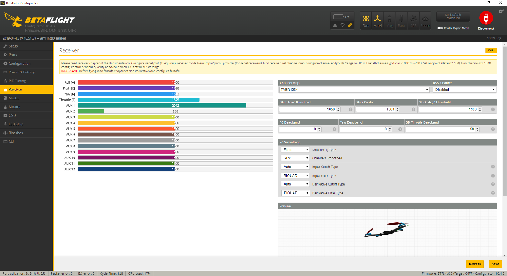

And if you have already set up switches in the `MIXER` screen in your radio to correspond to Channel 5 and Channel 6, you can set up your arming switch and a flight modes switch in the `Modes` tab in Betaflight. AUX1 = Channel 5 and AUX2 = Channel 6.

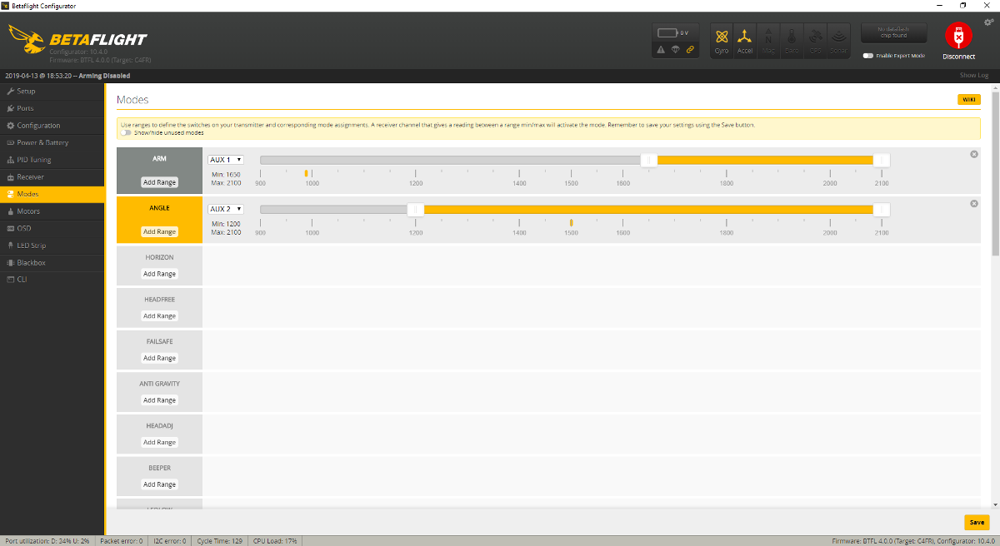

### 🔝 Update OpenTX

The Taranis X-Lite comes with OpenTX version 2.2.2 installed. In comparison, the current latest version of OpenTX at the time of writing is 2.2.3. You can [read the release notes][12] and see if you care to do the update. The process is quick and straightforward.

#### 1. Download and install OpenTX Companion

You can [grab it here][12]. Scroll to the bottom of the page and pick the installer for your operating system. Install it and run it when ready.

#### 2. Configure settings and download firmware

Open the settings via the cogwheel icon and **select the correct radio (Taranis X-Lite)** from the list of radios.

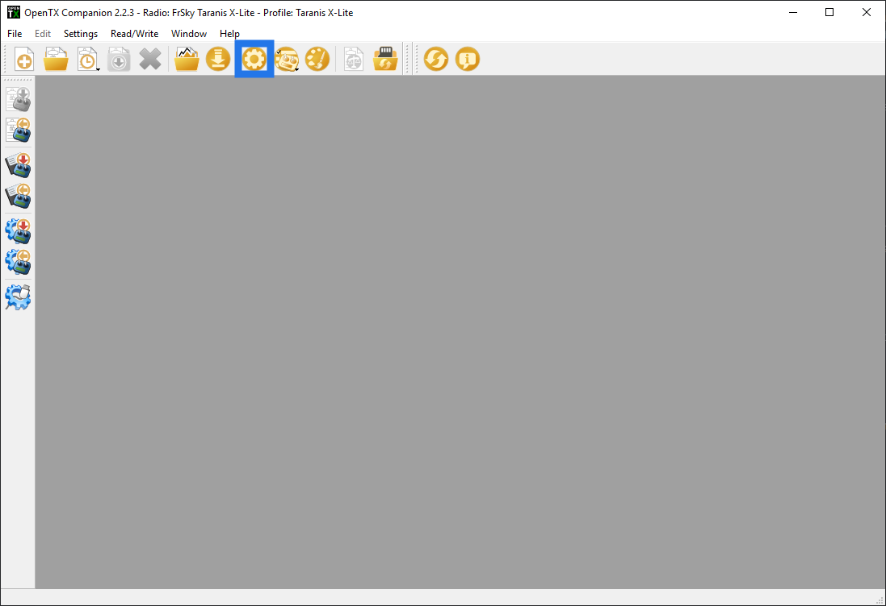

You can also play with the rest of the settings, for most cases the defaults are totally fine and if you have no idea what you are doing, it's ok to leave everything to default settings. Here are my settings:

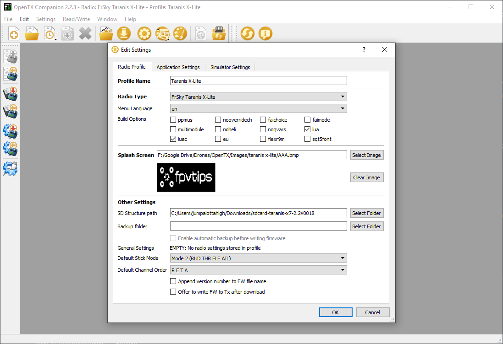

Click OK when done and head on over to the download icon (arrow pointing down, to the left of the settings icon). In the downloads dialog use the buttons to download the latest firmware (2.2.3) if you didn't get asked already by OpenTX.

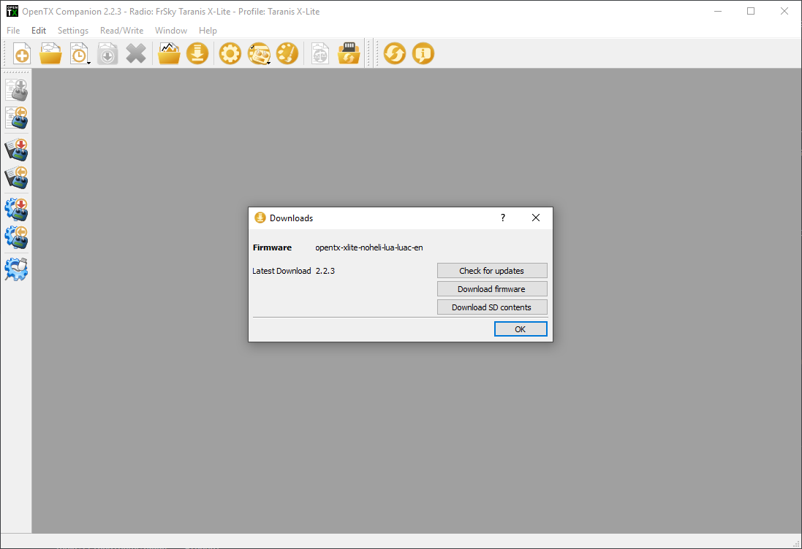

#### 3. Start the radio in bootloader mode

Finally, armed with the correct settings and the firmware downloaded we can now put the radio in bootloader mode and plug it in. To do that, **press and hold the middle of the gamepad looking plus button** and while keeping it pressed turn the radio on. You should see the bootloader screen light up.

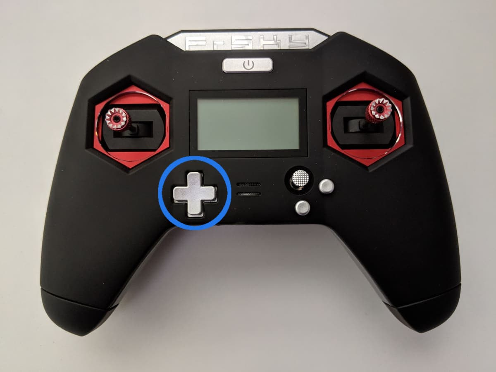

Now you can connect the radio via USB to your computer, any data micro USB to USB cable will do.

If you have any existing models already set up, it's a good idea to back them up now. To do that, click the `Read Models and Settings from Radio` button. You can export/save those somewhere so you have a backup.

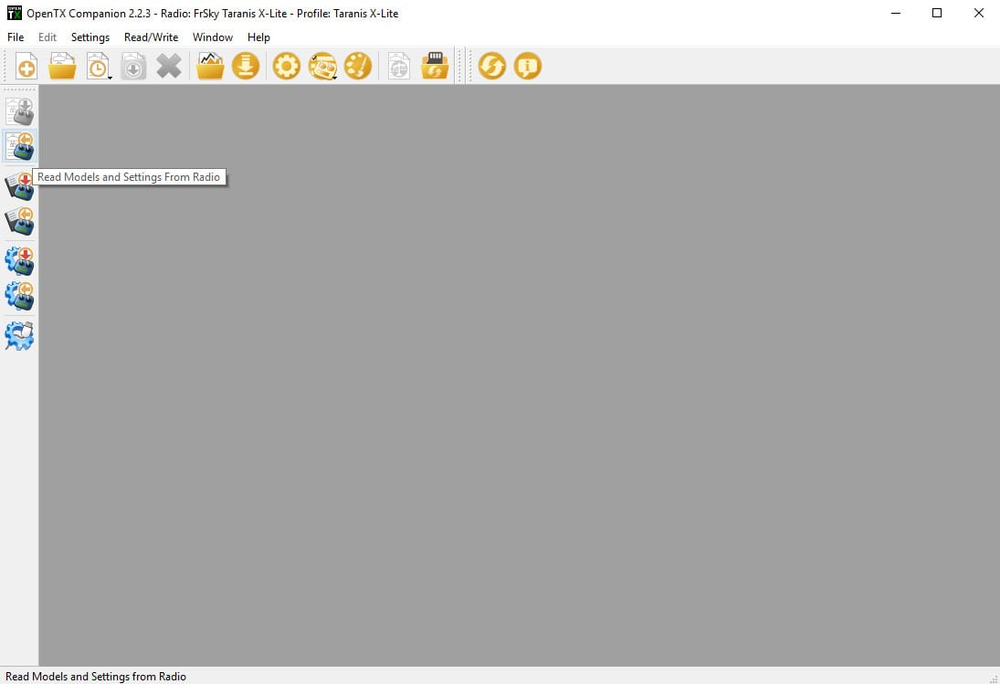

#### 4. Flash the firmware

Finally, click `Write Firmware to Radio` and in a few seconds you will have your Taranis X-Lite upgraded to the latest firmware.

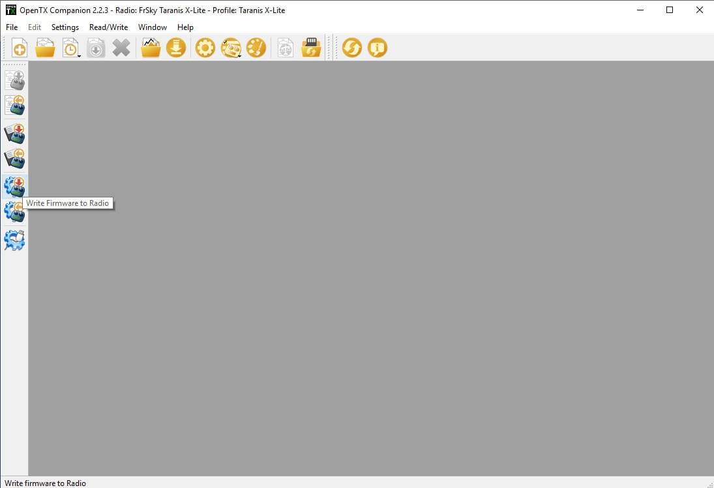

When done, unplug the radio from the computer and switch it off and on.

If you need more specific help, I've written about the process [in more detail here][13].

### 💾 Set up the SD card

The SD card is quite useful for keeping internal transmitter firmware (in case you need to switch between FCC and LBT on the go), as well as the sound files for alerts, telemetry readout and switch activation.

#### 1. Download SD card contents

First, [grab the latest SD card contents][14]. Unzip that, format an SD card clean (any size will do, if you don't have one, [grab a card here][15]) and copy over the files. It doesn't matter if you use the Taranis and mount the card via it, or just do the process manually using a card reader. Both achieve the same result, just get the files on there.

#### 2. Grab Amber sound pack

It's worth grabbing the [Amber sound pack][16] as the sound files from that sound much nicer than the ones that come with the original card contents. In the SD card delete the `SOUNDS` folder and upload the `SOUNDS` folder from the Amber pack. Done. Easy!

#### 3. Download receiver and internal module firmware

Another thing worth doing is having some receiver and internal module firmware right on the SD card. Having receiver firmware allows you to [flash receivers with your Taranis][9] via the port on the bottom of the radio. Get the firmware for your receiver from [FrSky's site][17].

I use a lot of [XM Plus receivers][11] and here is the [firmware for those][18].

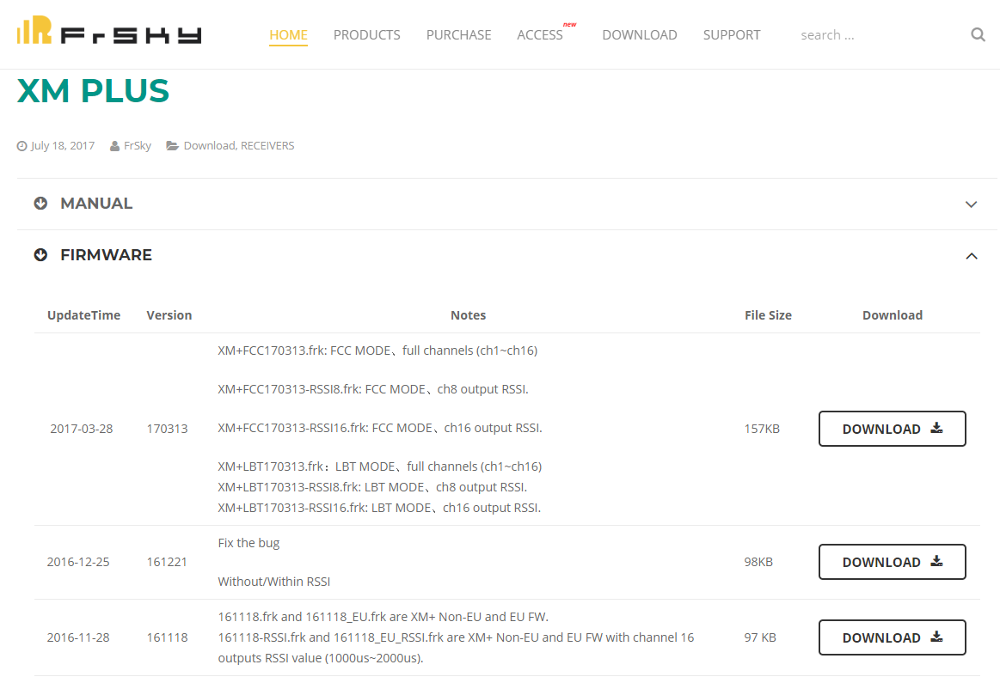

And here is the [firmware for the internal module][19] of the Taranis X-Lite. A cool thing you could do is that you can flash the internal module on the go between EU and US firmware if you need to do that (I know I've had to do that and it was so cool to do in just a minute without the need of a computer).

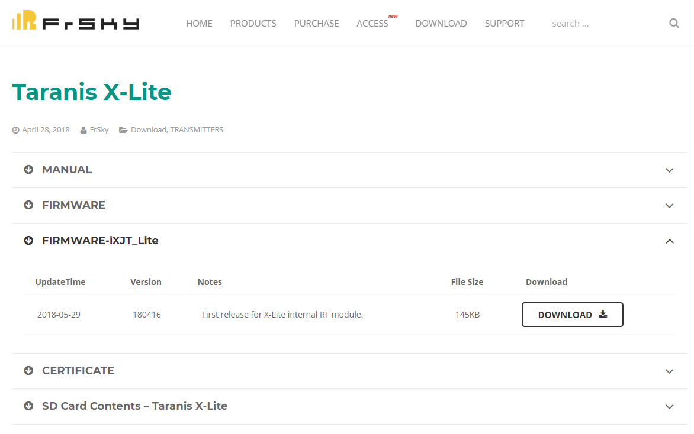

To get those files setup on the SD card, after unzipping the downloads, copy over the files (including their parent folders) inside the `FIRMWARE` folder on the SD card.

### 🏁 Conclusion

In conclusion, would I recommend this radio? **YES!** That's the short answer. I think it's a great deal. The radio is **full featured**, much similar to the Taranis Q X7, and comes in at [a very decent price][1]. There is maybe one reason that would go against you picking this radio up and going for another one - if you are a **pincher**(a pilot that flies by pinching the sticks between their index finger and thumb). Higher sticks and other form factors might be better in that case. However for me, and any other **thumber**(a pilot that flies by placing their thumbs on top of the sticks), **I've been having a blast**. The X-Lite took close to no time for me to get used to it, maybe like half a battery or so. I've pretty much swapped my Taranis Q X7 for the X-Lite since I got it and I'm not sure I'm going back, I honestly don't have many reasons to.

**Same range without an external antenna** you have to care about when putting away, smaller and convenient for travelers while making no compromise on the build quality or gimbals. The literally only thing I wish was different would be the lower switches on the back to be longer. But even that is probably something you can get used to.

The radio also seems better suited for children which is a huge plus in my book. And an interesting thing to note is that the slick design draws in less techy and less nerdy people a bit more. **And ultimately, we just want to welcome more people to our hobby so we can fly and have fun together!**

Happy flying!

#### Where to get it?

###### Taranis X-Lite - [Amazon][2] [Banggood][1]

  <iframe width="560" height="315" src="https://www.youtube.com/embed/PigsOtpozno?rel=0" frameBorder="0" allowFullScreen title="First flight with the Taranis X-Lite"></iframe>

---

[0]: Linkslist
[1]: https://bit.ly/taranis-xlite
[2]: https://amzn.to/2I92UBh
[3]: https://bit.ly/taranis-qx7
[4]: https://bit.ly/drillpro-set
[5]: https://bit.ly/18650-charger
[6]: https://bit.ly/18500-batteries
[7]: https://bit.ly/18650-batteries
[8]: http://bit.ly/x-lite-battery-caps
[9]: /fpv/flash-xm-plus-and-setup-rssi/
[10]: https://bit.ly/eachine-trashcan
[11]: https://bit.ly/xm-plus
[12]: https://www.open-tx.org/2019/01/06/opentx-2.2.3
[13]: /fpv/setup-taranis-qx7/
[14]: https://downloads.open-tx.org/2.2/release/sdcard/opentx-xlite/
[15]: https://bit.ly/sd-card-32
[16]: http://open-txu.org/home/version-2/v2-2-resources-2/
[17]: https://www.frsky-rc.com/download/
[18]: https://www.frsky-rc.com/xm-plus-mini-sbus-non-telemetry-full-range/
[19]: https://www.frsky-rc.com/taranis-x-lite/
