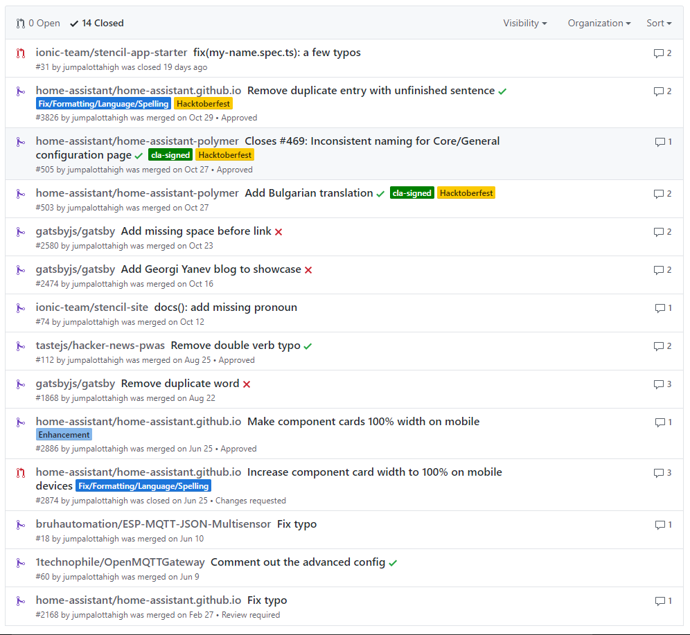
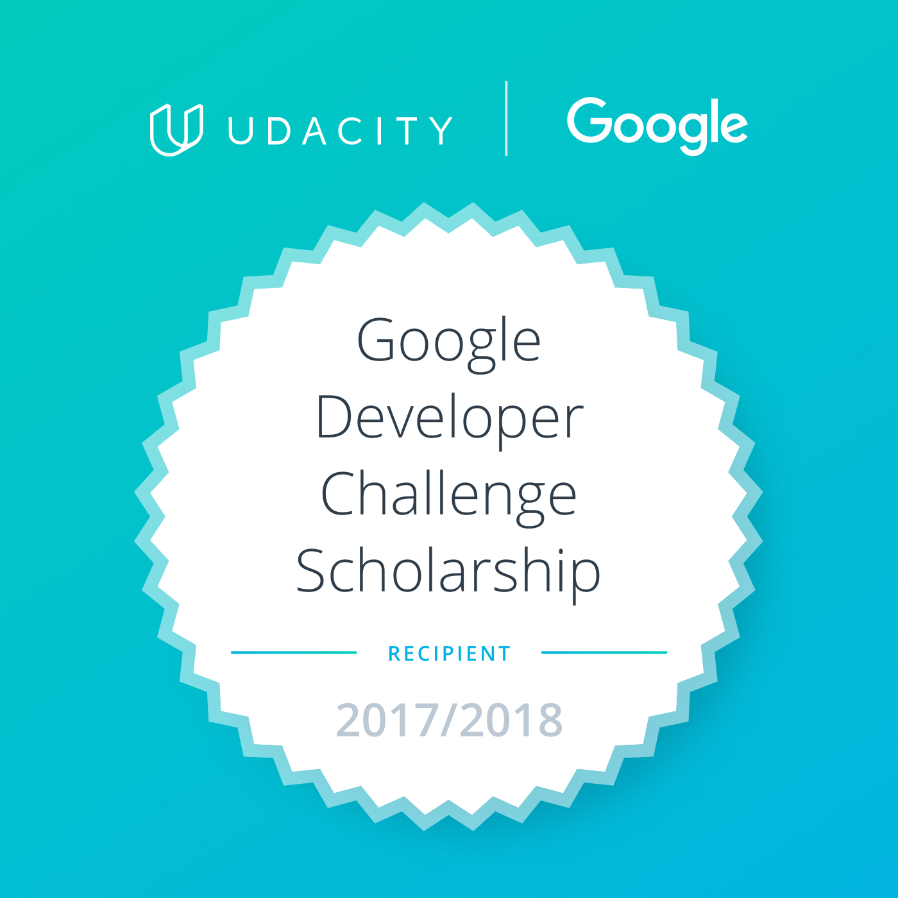

It's that time of the year again. The best time to recap and consider how the year has passed. For one I really like making a goal list each year and then checking against it how I'd done. How I have accomplished certain goals and moved past others that I deem no longer high priority and worthy of the time investment.

I'm sure this is a very personal matter how you like tracking (or not) your progress on yearly goals. [Tweet me][1] what matters to you the most when setting and evaluating your progress and accomplishments.

Here's a quick TL;DR overview if you don't have the time to read the entire post.

**TL;DR**

| 2017                                     | 2018                                                |
| ---------------------------------------- | --------------------------------------------------- |
| - Contributed to open source software    | - Contribute even more to OSS                       |
| - Setup a smart home with Home Assistant | - Continue to phase 2 of Google Developer Challenge |
| - Learnt to fly FPV drones               | - Fly more FPV                                      |
| - Learnt a LOT MORE about Web Dev        | - Learn more and work on interesting projects       |
| ...                                      | ...                                                 |

### Taking a look back at 2017

Here are the main topics I dealt with in 2017 in a rough chronological order but by no means in order of most important to least.

#### 🏠 Smart home automation

###### [Jan 2017 - On going]

This year started for me with a deep dive into smart home automation systems and particularly [Home Assistant][2].

I quickly found myself setting up our smart home with Home Assistant. I had a lot of fun doing a variety of projects. I learnt to solder and play with hardware components and sensors, [arduinos][6], [esp8266][5], [raspberry pi][4] and more.

I learnt about [MQTT][3] and how awesome it is. I redid the house networking setup. Played a lot with [addressable led strips][7] ([ws2812b][8]). I built temperature, humidity, motion sensor nodes, integrated them and added automations in Home Assistant. The config is open source and [available on GitHub][9].

#### 💻 Open source software (OSS)

###### [Feb 2017 - On going]

I've been wanting to contribute to open source software for a long time and finally the right time and project came along.

2017 was the year I did my first few pull requests (PRs) - 14 to be exact. From correcting typos to suggesting mobile layout optimizations and helping add Bulgarian language support in Home Assistant. I absolutely loved to get involved in projects I enjoy using, such as [Home Assistant][2], [Gatsby][10] and [Stencil][11].



Looking forward to be able to contribute even more next year!

#### 🚁 FPV quads

###### [Sep 2017 - On going]

FPV quads came to me out of nowhere (**actually out of a Mr. Steele YouTube video**) and took over SUPER quick. I quickly bought my first prebuilt model, goggles and a radio and learnt A LOT in a very short time.

I love the modularity of the components, I love the open source software and the ability to flash updates, I love the flying experience. Awesome hobby and definitely looking forward to doing much more of it next year. In the meantime I now fly frequently a micro drone inside the house which is also a ton of fun! Absolutely planning on **building my own quad** from scratch for next spring!

#### 📰 Blog

###### [Oct 2017 - On going]

I started this blog! I guess [Gatsby][10] was the right framework I've been waiting for and the time was right. It made it very easy for me to start a [React][12] and [GraphQL][13] based blog with a plethora of plugins. It keeps things simple - you can write articles in markdown and use React for your templates and other components (for example my custom feedback component you can see at the bottom of this article). It's been fun working on the blog and with Gatsby! Also, this blog is open source so if you ever want to see how something was implemented just [check out the source on GitHub][14]. Pull requests are welcome and appreciated! For hosting I use the free tier of Firebase which works like a charm and allows for custom domains. I have setup this deployment script which makes it trivial to publish the blog with one command.

```bash
$ npm run deploy
```

The deploy script simply runs:

```json
"deploy": "gatsby build && firebase deploy"
```

Ideally, I'd soon have a continuous integration system so that I can trigger builds and redeploys on GitHub commits.

#### 🎓 Constant learning

Turns out I really **enjoy learning** new things all the time. I have managed to stay information hungry throughout 2017 and to follow trends and information on web development and software engineering.

I wrote a lot of web application code and I loved it! I **read and thought about code** even more than what I wrote! For me 2017 has been the **year of React** and while I'm not a pro I have an idea of what is going on. Learnt a lot more about Google Analytics and love the insights it provides and how easy it is to use!

In 2017 I think I started to **understand bigger projects quicker**. From being dropped into an unknown codebase to figuring things out and making additions or edits, I feel the time has gone down by a lot for how quickly I grasp the project basics.

Towards the end of the year I also decided to grow my Twitter account by tweeting relevant web dev info and news to like-minded people.

Oh yeah, I applied and was **selected for a Google Developer Challenge Scholarship**. Very happy and excited!



And to top it all off I participated in the [Junction hackathon][15] (for the 3rd year in a row) and had a blast building stuff.

### Looking ahead into 2018

Some of the things I'm looking forward the most to:

#### Majors:

- 😍 **Contribute** to open source software
- 🚁 **Fly** FPV drones; Build my first custom model
- 👨‍🎓️ **Advance** to phase 2 (and beyond) in the Google Developer Challenge
- ✨ **Learn** a ton more and work on interesting projects

##### Minors:

- Publish interesting articles on GY Blog and improve the layout
- Publish relevant content and grow Twitter account
- Record 1 Jumpalottahigh remastered song
- Present and practice conference speaking
- Grow plants more successfully this season
- Work on home automation and DIY electronics projects
- Revamp www.georgi-yanev.com with CSS Grid and as a PWA
- Listen to more Web Dev podcasts
- Stream on Twitch

I strongly doubt that's the complete list and to be fair things always deviate a bit for me, but that's the best part, isn't it?

#### Here's to a great 2018! 🍾🥂

[0]: Linkslist
[1]: https://twitter.com/jumpalottahigh
[2]: https://home-assistant.io
[3]: https://mqtt.org/
[4]: https://bit.ly/2IbRatc
[5]: https://bit.ly/2KdC4s0
[6]: https://bit.ly/2tk3Lpx
[7]: https://twitter.com/jumpalottahigh/status/939207097941725184
[8]: https://bit.ly/2K8DfJr
[9]: https://github.com/jumpalottahigh/YAR-Home-Assistant-Configuration
[10]: https://www.gatsbyjs.org/
[11]: https://stenciljs.com/
[12]: https://reactjs.org/
[13]: http://graphql.org/
[14]: https://github.com/jumpalottahigh/blog.georgi-yanev.com/
[15]: http://certificates.hackjunction.com/Junction17-Certificate_participation.bvCtGbgW.pdf
