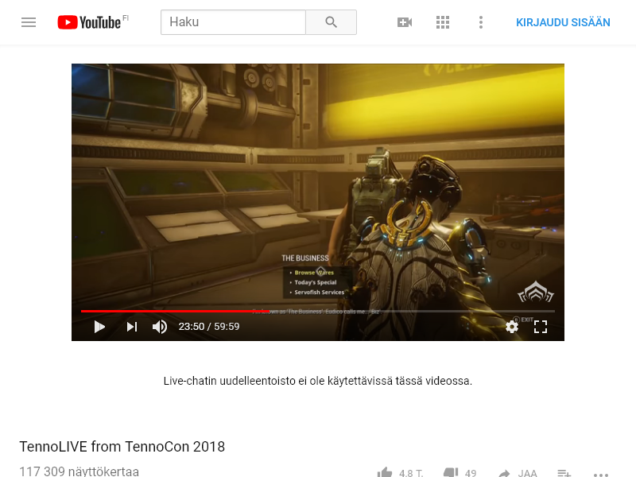
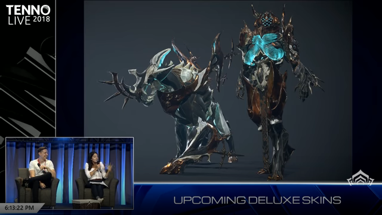

I recently wanted to **extract a screenshot from a YouTube video** of one of my racing drone flights. Sounds easy enough, doesn't it? Turned out much harder than I thought, so I decided to make an app to solve it for me.

### Defining the problem

You see, [YouTube generates up to 4 different sizes of the video thumbnail][8] and does not expose any API for timestamped thumbnails. And so at this point the 'easy' solution to get this done and move on with my life, would have been to download a copy of the video and extract the screenshot with some video editting software.

But that does not scale well and does not support me in the future. I don't want to have to do THAT every time.

### Searching for available solutions

First I had a look at the YouTube API. From having previously written this [video component][2] I knew I could accessed the video thumbnails straight from the API. I hoped there would be a way to get a screenshot at any time of the video in the same fashion. For example by using the time query parameter: `t=23m19s`. But that was not the case.

Then I thought it would be quite possible someone had already solved that problem. I was wrong (unless I missed it in which case feel free to let me know how bad I am at googling at [@jumpalottahigh][1]).

I found a few YouTube thumbnail extractor sites, which didn't really solve the issue.

### Making my own

So finally I started thinking how I could do that and since for a while now I wished I had a good idea for a [Puppeteer][3] project, things just clicked.

I had one last idea to solve this easier. I knew in the chrome dev tools you could press `CMD + SHIFT + P` to get the command palette, type in `screnshot` and select to take a screenshot of a DOM node (entire page was not needed for me and a specific node would be the perfect shot). Unfortunately there was no way (to the extent of my knowledge) to call that programatically. Oh, well, Puppeteer it is then.

> Puppeteer is a Node library which provides a high-level API to control Chrome or Chromium over the DevTools Protocol. [Read more][3].

The initial algorithm was the following:

1.  Go to https://youtube.com/watch?v=${videoID}&t=${time}

> Where `videoID` is what is the unique YouTube video id and `time` is a string that looks like `11m29s` that moves the video player to that point

2.  Reverse engineer a unique identifier for video player

> Using Chrome dev tools, find an id or a class, unique to the page to use to grab a screenshot of that node.

I came across `.html5-video-player` for the video player as the node I wanted to take a screenshot of.

```html
<video tabindex="-1" class="video-stream html5-main-video" controlslist="nodownload" style="width: 640px; height: 360px; left: 0px; top: 0px;" src="blob:https://www.youtube.com/d631f977-4993-41f2-990d-d1374d8918e9"></video>
```

I also noticed that to get a clean screenshot I'd probably have to hide the video player controls. And so I looked for an appropriate identifier for that too. Turns out `.ytp-chrome-bottom` is one.

3.  Write a test with Puppeteer locally to verify hypothesis

So I started playing around with what could be done and after half an hour ended up with something along the lines of:

```JavaScript
const page = await browser.newPage()
await page.goto(urlToScreenshot + '&t=' + req.query.t)
await page.setViewport({ width: 1920, height: 1080 })

const video = await page.$('.html5-video-player')
await page.evaluate(() => {
  // Hide youtube player controls.
  let dom = document.querySelector('.ytp-chrome-bottom')
  dom.style.display = 'none'
})
```

The interesting part here is the `page.evaluate()` function that allows us to actually grab the video controls element and hide it, before taking the screenshot.

The [complete source code][9] is here, in case you are interested.

And here's an example of what could be scraped.

Full YouTube page for the sake of illustration,


and no video player controls DOM node screenshot:


4.  Deploy project

You see, I hadn't previously deployed Node or Puppeteer apps so ideally I wanted to first deploy the project as a lambda / cloud function. I had worked with [Firebase][5] before, but it turns out that the [Firebase images do not support the bundled version of Chromium][10] that comes with Puppeteer and therefor was a no go. [AWS lambdas][6] I had no experience with and felt like too much of an investment in learning at this point in time (want to learn it later, but not a priority right now). [Netlify][4], I didn't know much about their cloud functions either.

Somewhere in the middle of this I also stumbled upon [this gem][11]. I actually ended up using this project as a starting point and just implemented the logic I needed for my use case. So thank you, Tim Leland for this write up 👌

I used that example to deploy to [Heroku][7]. Perfect.

The heroku 'backend' of the project is live at: [https://youtube-timestamp-screenshot.herokuapp.com][https://youtube-timestamp-screenshot.herokuapp.com].
To use it you need to append a youtube URL including a timestamp to the `url` parameter after the app's url.

For example:

`https://youtube-timestamp-screenshot.herokuapp.com/?url=https://www.youtube.com/watch?v=cutWz4Jnh_U&t=13m37s`

Should return to you the screenshot of the video at 13 minutes and 37 seconds in.

Additionally, you can access the service here: [https://youtube-screenshot.netlify.com][12]

This is hosted on Netlify and deployed from the /docs directory in the master branch, on commit.

### Wrap up

How useful is this solution to the problem is somewhat arguable, however, it did solve an issue for me and enables me to get screenshots much faster in the future, so I'd call it a success. I also had fun building it and connecting a bunch of different technologies together.

[0]: Linkslist
[1]: https://twitter.com/jumpalottahigh
[2]: https://github.com/jumpalottahigh/blog.georgi-yanev.com/blob/master/src/components/Video/Video.js
[3]: https://github.com/GoogleChrome/puppeteer
[4]: https://www.netlify.com/
[5]: https://firebase.google.com/
[6]: https://aws.amazon.com/
[7]: https://heroku.com/
[8]: https://developers.google.com/youtube/v3/docs/thumbnails
[9]: https://github.com/jumpalottahigh/youtube-timestamp-screenshot
[10]: https://github.com/GoogleChrome/puppeteer/issues/726
[11]: https://timleland.com/headless-chrome-on-heroku/
[12]: https://youtube-screenshot.netlify.com
