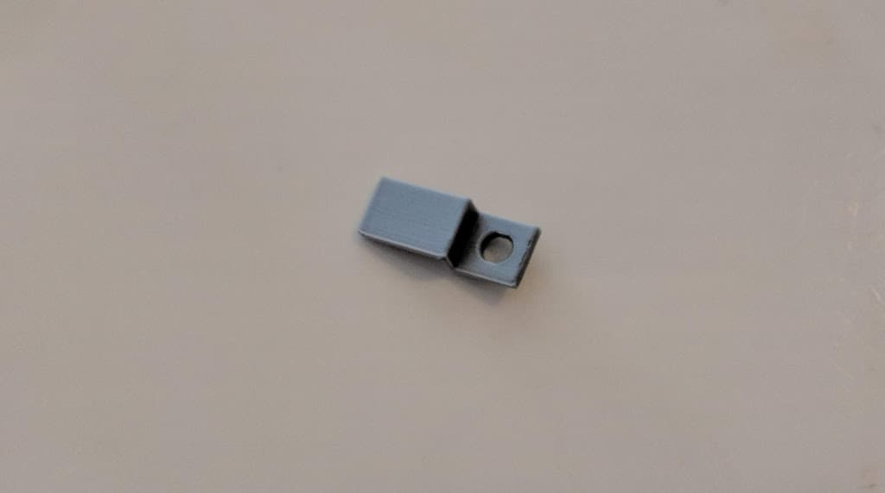
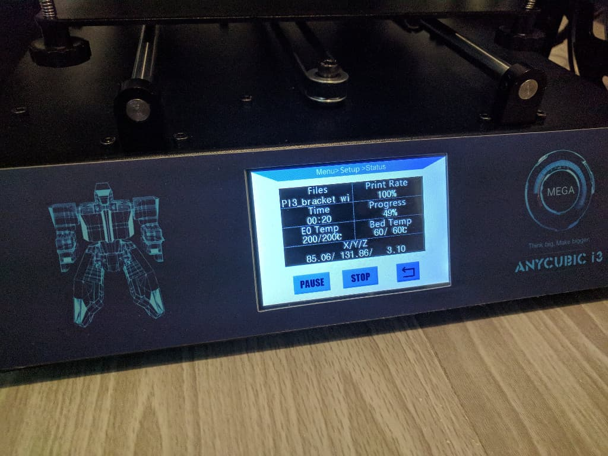
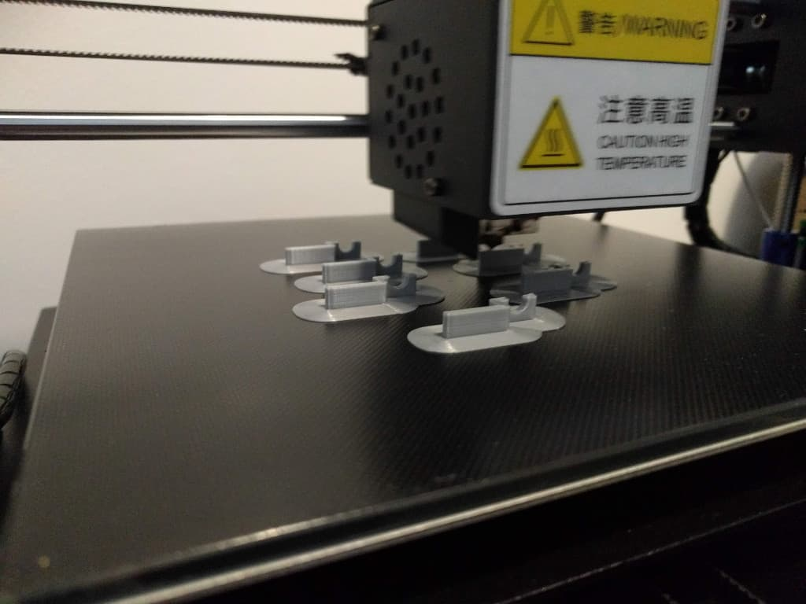
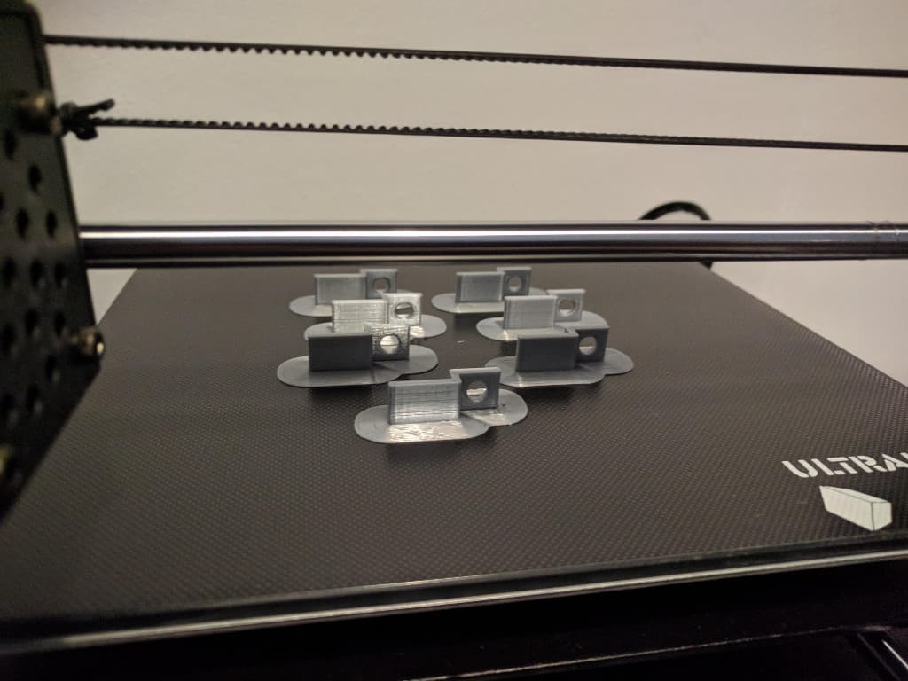

Recently I had a very minor issue, however perfect candidate to be solved using 3D printing. I'm fairly new to 3D printing, only got my printer a couple of weeks ago and I do have some 3D modelling experience (mainly from working on hobby / school game projects, such as [Maze Crawler][1] or [Rollin' Shark][1] from a few years ago). I use the awesome open source software [Blender][2] for my 3D modelling. So obviously, not a guru, but very eager to learn, I dove right in.

### ❓ The problem

So, my son has these IKEA boxes where he keeps his toys. They have gotten so much use over the past few years that are somewhat dangly and loose. A couple of times the bottom plate came out and the box folded in. And that has been more and more of an issue with all 4 boxes.

That bottom plate, that kind of also keeps the whole box together, if it is nicely fastened, is supported on the side edges, and then held in place with 2 of those brackets.

The brackets were always a bit short to begin with, but got the job done so far, until the boxes got too loose. If only we could have just a bit longer bracket. <em>Enter, 3D printing!</em>

### 👨🏼‍🎨️ Prototyping

Being such an awesome candidate for a 3D printed solution, I broke this down quickly. Here's what I imagined I needed to do:

#### 1. Measure the current bracket with a caliper

#### 2. Make a 3D model in Blender and then extend the longer part on the X axis by ~ 33%

#### 3. Export as `.STL` file and open in a slicer program ([Cura][3])

#### 4. Print

The print was quick, about 10 mins, with very good quality.

#### 5. Test the fitting

Honestly, I was actually a bit surprised I got it completely right on the first try, I thought it would take a couple of iterations. The bracket fit perfectly and was definitely holding the bottom panel of the box much better than the stock options.

### 🔩 Manufacturing

So, naturally, I went to Cura and multiplied the item, so I could print 7 more of it.

Only 45 mins to finish the 7 prints.

Half way through

Ready!

One last task remained - to replace the brackets on all boxes.

### 🏁 In conclusion

I am aware I didn't resolve some major world issue, however, the amount of satisfaction you get from being able to solve a problem using 3D printing and software is substantial. Can only image a bright future for this technology and can only bet that soon it will be a part of every home.

[0]: Linkslist
[1]: /eternal-archives/game-dev-videos/
[2]: https://www.blender.org/
[3]: https://ultimaker.com/en/products/ultimaker-cura-software
