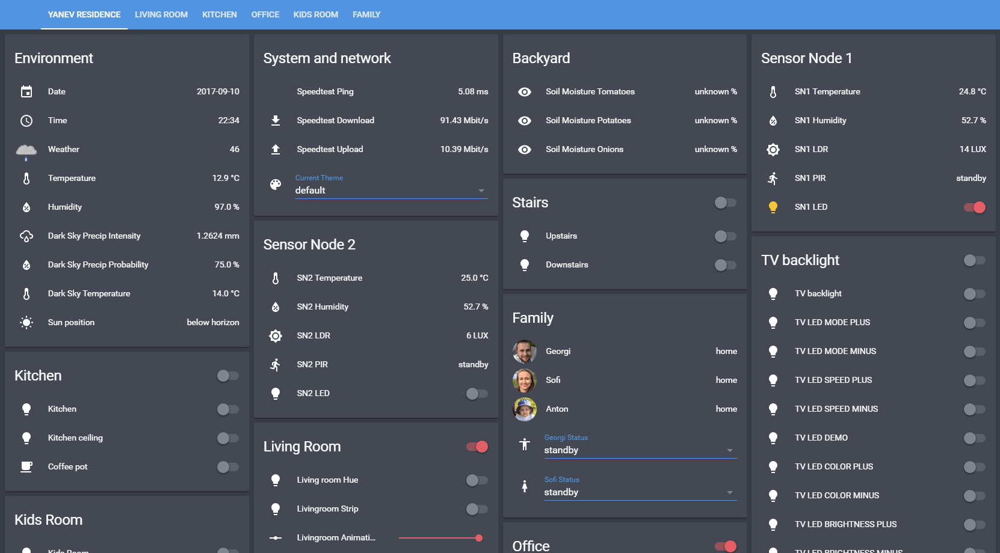

In this blog post I will share my experience and learnings from living in a smart home for a year. Before we get started, however, let's get some things out of the way in the form of a disclaimer list:

- this is not going to be a guide
- this article probably conveys plenty of intentional Home Assistant bias <3
- this was not a full out smart home revamp but rather retro fitting and incrementally implementing components
- I will assume you know at least a bit about the whole smart home automation concept on a general level
- I will cover 3 of my main use cases, because I think those to be more relatable to people considering to join the club



### 💡 Use case 1: lights

I first got interested in smart homes and home automation technologies roughly about 2 years ago (early 2016) and for the duration of the first year, that was it, just interest. Reading articles, exploring software.

#### It all started last Christmas when I got my hands on a [Philips Hue][20] set and I found [Home Assistant][1]

It was love at first sight. While there are other viable open source solutions out there and I have played around with a couple ([OpenHab][18] and [Node-RED][19]), it was [Home Assistant][1] that really got me into smart home automation and it stuck around to this day.

So like most other people who acquire some smart lighting to control my lights at first I just used the Philips Hue app on my phone, my wife used it on hers. We even set it up on the iPads. It was fine to get a sense of what was possible and we kept using it for probably about a month. Right about until I had our first "stable" Home Assistant instance running on the [Raspberry Pi][3]. The thing about smart lights is (and in many cases deal-breakers for people to get into smart home automation) it's quite suboptimal to have to reach for your phone every time you want to only turn on or off the lamp quickly. There are plenty of work arounds for that depending on your patience and how willing you are to adapt and change your habbits.

Back at that time though, we still didn't have voice automation (that came later and helped A LOT). We never really got into getting actual hardware buttons for the walls (although this could work for some people) so we only had one way to make this work without getting angry at it and discarding the whole idea - automations.

#### That's where Home Assistant came in and it really shined

You can setup very robust automations, there are plenty of [docs and examples][4] of how to configure components, awesome [YouTube videos by Ben][5] (kind of played a huge role in getting me started in the first place, so thanks and a shout out for that!). Additionally the community is **awesome** and I absolutely recommend the [podcast][6], joining the [discord channel][7] or checking out [the forum][8] for help and ideas.

Here are a couple of light automations I'm running:

```yaml
# Turn on lights at sunset
- alias: 'Lights on 30 mins before sunset'
  trigger:
    platform: sun
    event: sunset
    offset: '-00:30:00'
  action:
    - service: light.turn_on
      data:
        entity_id:
          - light.office_hue
          - light.living_room_hue
          - light.kitchen
        brightness: 225
        color_temp: 327
        transition: 5
    - service: tts.google_say
      entity_id: media_player.living_room_home
      data:
        message: 'Turning on all lights.'

# Turn off lights at 23:45
- alias: 'Lights off at 23:45 (sun-thu)'
  trigger:
    - platform: time
      at: '23:45'
  condition:
    - condition: time
      weekday:
        - mon
        - tue
        - wed
        - thu
        - sun
  action:
    - service: light.turn_off
      data:
        entity_id:
          - light.office_hue
          - light.living_room_hue
          - light.kitchen
        transition: 5
    - service: homeassistant.turn_off
      entity_id: switch.livingroom_window_lights
    - service: homeassistant.turn_off
      entity_id: switch.livingroom_ball_lights
    - service: homeassistant.turn_off
      entity_id: switch.livingroom_charger
```

This `yaml` code is one of the ways to configure Home Assistant. It is very easy to grasp, it is very similar to JSON in a sense that both operate with the idea of key - value pairs. It is very straight forward to read and configuring an automation usually consists of a `trigger` and an `action` with an optional extra `condition` in between. If you are completely new to the topic, grab yourself the free and open source blazing fast text editor [VS Code][21] and watch the spacing and the validity of your yaml config files.

In the first example I use the `sun` component from Home Assistant to get sunset time data and turn on certain lights half an hour before sunset and announce the event on the Google Home speaker. This is much better in many cases than a hard coded time value that you would then have to change every so often.

The other automation turns off the lights on Sunday through Thursday at 11:45 pm with a 5 second transition. This is probably a good time to mention that I am using at home Philips Hue, [Xiaomi Mi Yeelight][22] and [Ikea Tradfri][23] light bulbs. The best about it all is that it doesn't matter one bit, everything works seemlessly and I don't have to use 3 separate apps on my phone. It all works through Home Assistant.

I am also very pleasantly surpised with both the Xiaomi light bulbs and the Ikea ones. I have used the Xiaomi bulbs since February 2017 and the Ikea ones since March 2017 with absolutely no complains and no fails. It is worth mentioning that the Ikea Tradfri has probably the best implementation securty wise (using Coap) and have been praised rightfully a lot for that. They also use a gateway like the Philips Hue. I think soon enough I would actually be able to ditch one of the gateways as support for controlling both Ikea and Philips bulbs is coming to the Ikea gateway. On the otherhand the Xiaomi light bulbs don't need a gateway, since they connect directly to Wi-Fi.

### 🔌 Use case 2: outlets

As a rule of thumb, it is good to approach your next home automation project with the following questions:

- What problem am I solving?
- How will this automation improve my quality of life?
- Will it save me time?

Anything that you consider a quality of life improvement and a time-saver is probably a good project and worth automating. I enjoy reducing pointless everyday decision making on smaller tasks and prefer to save cognitive resources for where it matters.

One such project saved me from having to make coffee every morning.

Sure, I still need to fill up the coffee maker every night and so I don't save myself all the effort but just getting my coffee ready leaves me one thing less to think about in the morning. Plus the added benefit of waking up to the smell of coffee brewing is pretty nice.

I've had that automation running now for nearly a year and it had failed maybe ~ 1-2 times and that's how I noticed I actually really miss having it. In a nutshell, my coffee maker turns on weekdays at 6:50 and turns off at 7:00. Makes my coffee for about 2 minutes and then keeps it warm until I pour it into my to-go cup and leave the house. The conditions and triggers are set up in Home Assistant and look something like this:

```yaml
# Make coffee at 6:50
- alias: Make morning coffee
  trigger:
    - platform: time
      at: 06:50
  condition:
    - condition: time
      weekday:
        - mon
        - tue
        - wed
        - thu
        - fri
  action:
    - service: switch.turn_on
      entity_id: switch.kitchen_coffee_pot
    - delay: 00:10:00
    - service: switch.turn_off
      entity_id: switch.kitchen_coffee_pot
```

It is quite straight forward and there are plenty of other examples online as well. As far as hardware goes in this case I'm using [433 MHz outlets][9] that are controllable via a remote but easily re-programmable and so I also have some cheap [433 MHz transmitter and receiver][10] connected to an [ESP8266 based NodeMCU][11] board that runs this piece of [awesome gateway software that deals with MQTT-to-433][12] bidirectionally among other things. Sure, that may sound like a mouthful and maybe seem a bit intimidating or too complicate at first, but I promise you, it is much, much simpler than you may think.

At the end of the day there are other ways to implement this project. Go the way that fits your lifestyle. For me it was important to seemlessly retrofit the coffee maker while not messing with mains voltage and that was a resounding success. **Now I can have coffee every day :)**

### 💬 Use case 3: voice control and tying it all together

One of the biggest enablers for the home automation project was [Google Home][15] and the [Amazon Echo][16]. Using the `emulated hue` component you can expose any device and sensor from within Home Assistant to those voice assistant. Then you can control things that would otherwise not have a direct app for Google Home. I don't have a favorite, I use both. For somethings I prefer Alexa with her simple response `OK` after she executes a command. For most other things and non home automation things, music, casting to TV using a [Chromecast][17], informative answers, reminders, timers I use exclusively Google Home.

Using voice control with home assistant scenes is when smart home automation feels very powerful and futuristic. My favorite two are `'Hey Google, time for bed'` that basically shuts down the house and `'Hey, Google it's movie time'` to turn off all but living room lights, set tv backlight to teal and dim the living room.

We have really gotten used to use those for quick control and definitely bonus points go to Google Home for being able to entertain my son by counting to 10, saying the alphabet, singing lullabies and playing animal sounds on cue.

### ✨ Conclusion and results

It is still very much early days for both the systems and the devices. Things will change and evolve with time, so if you are an enthusist that wants to get in it now, you have to bear with some of the issues and be willing to learn and adapt along the way.

My advice:

- go for **small projects that improve your life** to see the real value
- **start simple** and fine tune projects later on
- **give it time** to get used to the various technologies
- many projects are an effort to set up but then **you don't have to touch them for months or years** while getting the benefits

So if I managed to sparkle your interest go get a copy of [Home Assistant][1] set it up and start experimenting. Here is [my configuration repository][13] on GitHub and here's another one with even more examples by [ccostan][14].

In my case I learnt a lot about **smart home automation** in general, about **MQTT** and sensors and fell in love with the **esp8266** chip. I got to fiddle with many different products, software and embedded devices. I did plenty of soldering and had a lot of fun while at it even though I'm just scratching the surface of what's possible. I gained an awesome, **fun hobby** that is not going anywhere and fits perfectly as something fun to do especially during the longer winters in Finland.

Doing this I was also able to contribute (although on a small scale) a few PRs to some of the different Home Assistant projects on GitHub. It is a great way to get started with contributing to open source projects. I'm really looking forward to being able to contribute even more to Home Assistant going forward into 2018.

Lastly I'd like to leave you with a currated list of resources. This is not meant as an extensive list and I am certainly unintentionally missing some of the greatest resources out there, but it should definitely help you out at first.

**Resources list:**

- [Home Assistant - site][1]
- [Great videos by Ben on getting started with Home Assistant][5]
- [Home Assistant Podcast][6]
- [Home Assistant Discord channel][7]
- [Home Assistant Forums][8]
- [Georgi's Home Assistant config repository][13]
- [Ben's Home Assistant config repository][24]
- [CCOSTAN's Home Assistant config repository][14]

Have fun and enjoy automating!

[0]: Linkslist
[1]: https://home-assistant.io
[3]: https://bit.ly/2IbRatc
[4]: https://home-assistant.io/components/
[5]: https://www.youtube.com/channel/UCLecVrux63S6aYiErxdiy4w/videos
[6]: https://hasspodcast.io/feed/podcast
[7]: https://discord.gg/c5DvZ4e
[8]: https://community.home-assistant.io/
[9]: https://bit.ly/2yxJykZ
[10]: https://bit.ly/2MKTH0I
[11]: https://bit.ly/2KdC4s0
[12]: https://github.com/1technophile/OpenMQTTGateway/
[13]: https://github.com/jumpalottahigh/YAR-Home-Assistant-Configuration
[14]: https://github.com/CCOSTAN/Home-AssistantConfig/
[15]: http://bit.ly/2IaDPkF
[16]: https://amzn.to/2x6Dpus
[17]: http://bit.ly/2yvG8z9
[18]: https://www.openhab.org/
[19]: https://nodered.org/
[20]: https://amzn.to/2haOccI
[21]: https://code.visualstudio.com/
[22]: https://bit.ly/2K7lwyy
[23]: http://bit.ly/2towFFd
[24]: https://github.com/bruhautomation/BRUH3-Home-Assistant-Configuration
