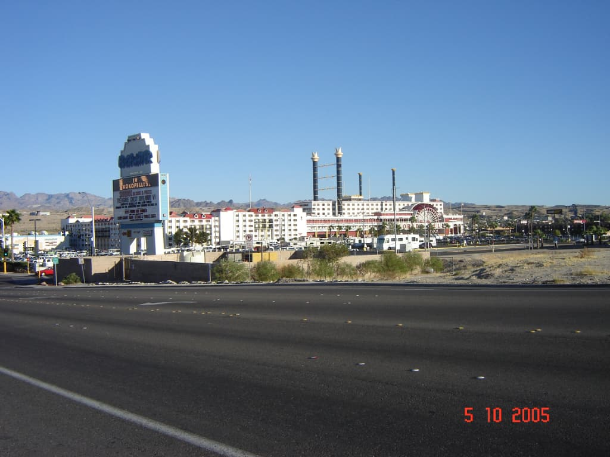
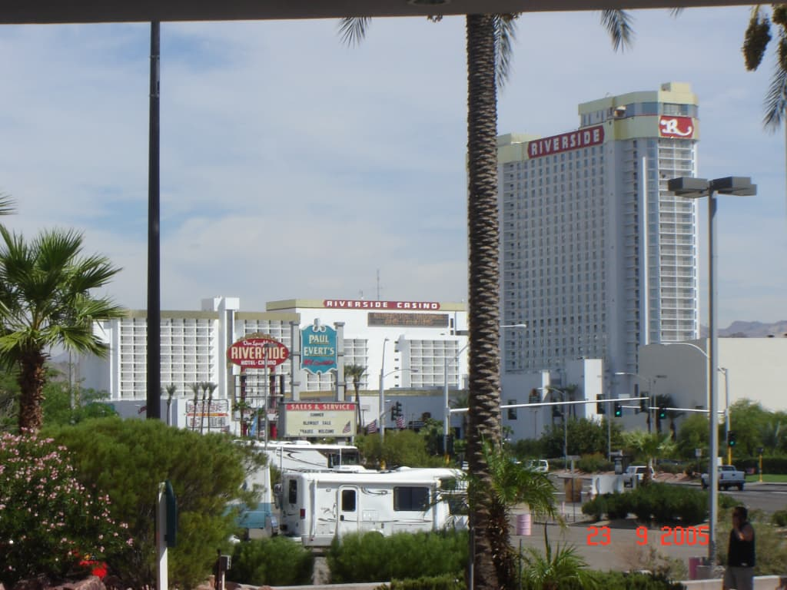
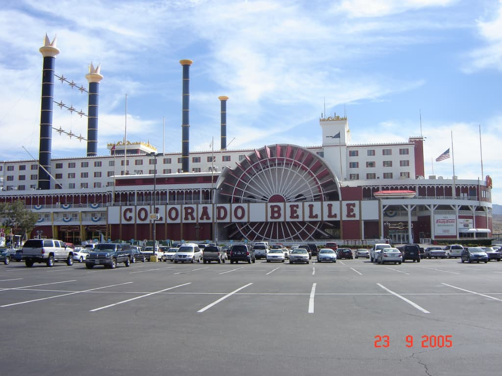
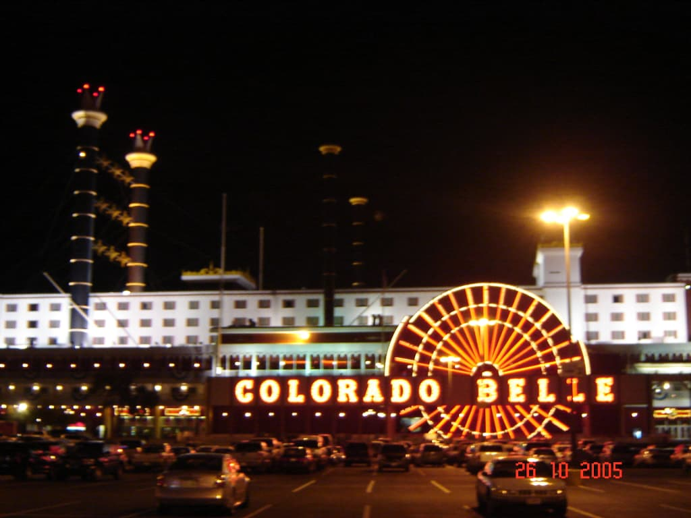
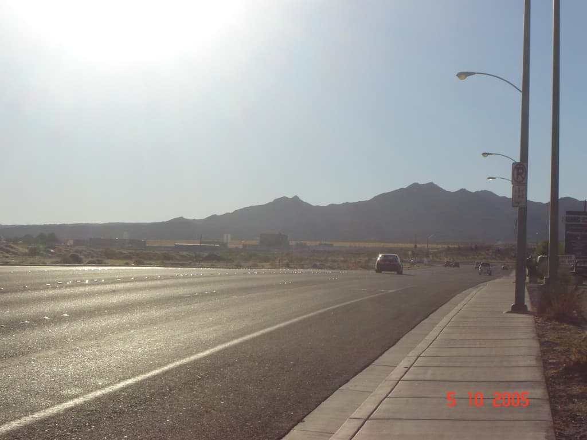

The summer of 2005 was the first time I lived and worked in the USA. It was a student exchange program, that allowed us students from Bulgaria to live, work and travel the states.

It was an amazing experience. One of the biggest of my life, huge eye-opener and very inspirational. In this post I’m not gonna go in detail about the trip itself, but I would like to tell a very short story that thought me something.

You see, such a travel to the states used to cost us students anywhere between $3000 - $4000. This depended on whether you would go to the east or to the west coast, how much pocket money you brought with you and so on. Therefor it was common for many of us to pick up a second job as soon as possible and that meant as soon as we got our social security numbers.

My first job was a position in housekeeping in Don Laughlin’s Riverside Resort Hotel and Casino in Laughlin, Nevada, 150 miles south from Las Vegas. It was kind of hectic, but it was all I had at the time. And although the J-1 visa I was in the states on, did in fact allow for changing jobs, that was not very trivial.

And so finally after about a month after applying for a social security number, it finally arrived and I was able to begin my search for a second job. This eventually took me to the Colorado Belle and more specifically I ended up working in the Paddlewheel family restaurant. It was such a night and day difference and changed everything about my whole experience in the states. I had awesome, nice colleagues, I got to speak a whole lot more English both to customers and to the staff of the Paddlewheel. Instead of making it harder, it made it easier for me, gave me something to look forward to, during my shift as a housekeeper. Instead of feeling like the actual 16 hours that I worked, it felt as if the second job halved my first job’s hours.

Alright, alright, it wasn’t all fun and games, but it was indeed so much better than housekeeping. Even so, there was this one night. You see, I worked as a busser. I had to serve soft drinks to our guests, I had to refill said drinks, get condiments (I learnt that word back then and there :)), as well as clean up the tables and reset them for the next party. Also, bussers’ usually had a few stations per night, meaning I worked for a few different waiters and we were quite busy.

This one night we were so busy. I was running around quite a lot, trying to keep track of all the things I gotta do next and sorting them in my head. So, I need to run to this one table and get their drinks, and so I do - fast-paced, concentrated look on my face.

_- You are not going to hurt us, are you?_ - says the elder gentleman from that table, sitting there with his wife. Luckily he was not very serious and was somewhat joking, but the point stood and it shocked me. It took me out of myself, I felt so silly for a few seconds. I smiled.

_- Of course not!_ - by that point I tried to take a deep breath and smile as much as I could, realizing what he meant. I also tried to imagine how must have I looked. I couldn’t, but I imagined probably not very entertaining.

_- Good, when we saw you coming over here like that, we thought we were in trouble._ - he chuckled. I was a bit embarrassed, but also really got the point and that made me relax. Again I felt a bit silly for being way too serious.

_- I think I got carried away thinking about some orders._ - I apologized somewhat awkwardly, but sincerely. - _I’m sorry about that. Now, what can I get you folks today?_

## \* \* \*

Sure work is serious, and so is life and what not, but they also… aren’t. I was so engulfed and focused that I forgot I was working with people. I forgot I was working with people on vacation, coming over to relax and enjoy life. Sure, it’s not like I have to entertain them and give them the time of their life, but it wouldn’t hurt me to be a bit less serious, take time for a chat, throw a joke here and there and have fun as well while at it.

And so after this incident, I did exactly that. And it was great. Also funnily enough, that did not hurt my working pace a whole lot or reduce my tips, if anything my tips probably got better for all I know. It didn’t matter that much because I truly enjoyed the rest of my stay in the USA that year. I didn’t make a whole lot of money, I think after paying back what I owed for the trip, I was left with the memories, the travels, some stuff I bought and ~ \$600. But I was hooked. So much so, that I went back to the USA the following year. Back to the same state, same city and same restaurant, but that is a story for another time.

[0]: Linkslist
